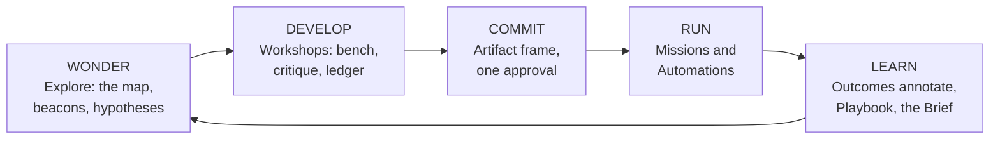

# 01 — Experience Principles: The Why Beneath the Constitution

*Phase 3, document 01. The constitution (`_constitution.md`) states the binding decisions — the
"what." This document states the principles those decisions follow from — the "why." Each
principle is derived from the operating model (`docs/operating-model/operating-model.md`), and
each generates a family of constitutional decisions. When a document author in 02–17 hits a
surface question the constitution does not answer, these principles decide it; when two
principles collide, the precedence rules in the final section decide that. Nothing here
contradicts the constitution; everything here explains it.*

---

## How to read this document

Fourteen principles in five groups, ordered as an argument:

- **A. Purpose** — what the experience is *for* (P1–P2)
- **B. Attention economics** — how it spends the operator's scarcest resource (P3–P5)
- **C. Coherence** — how a hundred kinds of work stay one product (P6–P8)
- **D. Trust** — how delegation stays rational (P9–P12)
- **E. Compounding** — how the system gets better instead of bigger (P13–P14)

Each principle carries four parts: the **statement** (binding, quotable), the **rationale**
(traced to the operating model — decision numbers refer to its §1, tests to its §7), what it
**forbids** (the concrete failure modes it exists to prevent), and one **scenario** (a moment
from the seven canonical scenarios where the principle is visible in use).

### The seven scenarios, as shorthand

These are the scenarios the constitution's examples are drawn from and that document 10 renders
as full journeys. Abbreviations used throughout:

| # | Scenario | The moment it tests |
|---|---|---|
| S1 | **The clothing brand** — launching an apparel line; the brother's artwork; variant tournaments on the apparel bench | creative craft, cross-world grants |
| S2 | **The website client** — Jane's client world: site, follow-ups, money, service health | counterparty work, the commit path |
| S3 | **The agency at scale** — ten website clients, a prospect pipeline, close-won spawning new client worlds | portfolio operation, isolation at scale |
| S4 | **Mom's real estate** — the family business; listings, direct mail; "add another agent based on Mom's setup" | learned setups, repetition |
| S5 | **The inbox automation** — "automate this inbox"; a background capability on a trigger | recurring work, delegation trust |
| S6 | **The consciousness rabbit hole** — "why do bee hives work?"; free curiosity that later gets serious | zero-ceremony wonder, promotion |
| S7 | **The return** — arriving in the morning, or after thirty days away; "the campaign underperformed — why?" | resumption, honesty, the Learn beat |

---

# A. Purpose

## P1 — Mastery Over Automation

**Statement.** Every hour in the product must leave the operator *better at the undertaking* —
sharper judgment, better criteria, deeper understanding — not merely relieved of labor.
Automation is a byproduct of mastery, never a substitute for it. The system is an expert team
you work *with*, and working with experts is how you become one.

**Rationale.** The operating model makes the human structurally unremovable from the learning
loop: Knowledge is "the approved stratum of Memory — lessons that passed the human gate and may
steer behavior" (§2), every mission "ends with a judged outcome that feeds Memory" (§2), and
capabilities carry measurement contracts whose results ride back through that same gate
(Decision 3). A system built to *only* finish work would route outcomes around the operator;
this model routes them *through* the operator, which means the interface's job is to make that
passage instructive. The Workshop's critique verb, editable criteria packs, and the per-world
Playbook (constitution §6, §12) are the direct consequence: the rubric is shown because the
rubric is the lesson.

**Forbids.** Output-only generation with no visible criteria. Scores without the why.
Recommendations that cannot be interrogated. Rubrics the user cannot read or edit. Learning
material bolted on as courseware instead of surfacing in use. Auto-approval offered as a
convenience rather than earned through clean streaks. Any flow where the fastest path teaches
nothing.

**Scenario (S1).** The apparel bench does not just render ten hoodie variants. The tournament
compare scores each against the brand's criteria pack with reasons attached — "flat composition;
the palette reads athletic, brief says heritage." By the third session the operator writes a
tighter constraint than the counsel proposed; it enters the Playbook with her provenance on it.
She is not just shipping a collection. She is becoming a creative director.

## P2 — The Metabolism Is the Shape

**Statement.** The product's macro-shape is the five-beat loop — **Wonder → Develop → Commit →
Run → Learn → back to Wonder** — and every surface exists to lower the cost of one beat or one
arrow between beats. A surface that serves no beat does not ship.

**Rationale.** The operating model's invariant loop ("you speak → it drafts or does the work →
one approval → it really happens → the result feeds the whole system's memory") and its posture
doctrine (Think · Create · Execute · Observe as the four ways of facing a world, Decision 5)
resolve into the constitution's five beats (§1). Crucially the model makes it a *cycle*, not a
pipeline: outcomes annotate artifacts, feed the Playbook, and reopen exploration. The
experience must therefore be organized around beats and arrows — not around features, and not
around a linear "flow" with an exit.

Every arrow has a named, one-gesture crossing: "take this into a workshop" (Wonder→Develop),
the commit rail (Develop→Commit), approval waking the plan (Commit→Run), outcomes annotating
their artifacts (Run→Learn), and "why?" on any outcome (Learn→Wonder). Lowering the cost of
these five crossings is the product's whole job.

**Forbids.** Dead-end surfaces — any result that lands nowhere. "Done" states that feed
nothing. Navigation organized by feature family instead of by beat. Learn as a separate
reports destination rather than annotations riding the artifacts they judge. Any beat that
requires leaving the loop (exporting, copying, re-entering) to reach the next.

**Scenario (S7).** The Brief says the spring campaign underperformed. That sentence is a Learn
beat with a door in it: tapping opens the campaign's outcome-annotated artifacts; "why?" spoken
at the Bar opens an exploration seeded with exactly those rows. The loop closed and reopened in
two gestures — no export, no meeting with yourself.

---

# B. Attention economics

## P3 — Attention Over Inventory

**Statement.** Every surface ranks by what needs the operator *now*, never by how much exists.
Volume is the system's problem to absorb; attention is the operator's resource to spend. A
surface's size tracks need, not count.

**Rationale.** Operating model §5.2: "what appears is driven by *state* (alive, blocked, owed,
waiting, glowing), never by *inventory*. A hundred dormant worlds cost nothing." The Situation
substrate exists precisely so that surfaces can render need instead of enumerating holdings —
and the hundredth-world test (§7.4) makes it binding: the 100th world must make the platform
smarter and no heavier. Home's Field is this principle rendered (constitution §4): at 5 worlds
a handful of orbs, at 100 the same size.

**Forbids.** Card grids of everything. Alphabetical world lists as a default view. Unread-count
badges as manufactured urgency. "You have 47 items" framings. Empty-state guilt ("nothing here
yet — create something!"). Any layout whose area grows linearly with inventory. Burying the one
blocked world under forty healthy ones.

**Scenario (S3).** Ten client worlds, thirty prospects. Home shows two orbs prominently: one
client blocked on an approval, one glowing from a reply. Seven healthy clients compress into a
quiet strip; dormant explorations don't render at all. When the operator *wants* inventory —
the full pipeline — she opens the pipeline Lens, deliberately. Inventory is a view you choose,
never a weather you live in.

## P4 — Ceremony Proportional to Weight

**Statement.** The friction of creating or committing anything is priced by its real-world
weight — money, counterparties, isolation obligations, recurring cost — never by the system's
internal complexity. A rabbit hole costs nothing to start. A client world with money flows asks
once, thoroughly, and never again.

**Rationale.** The intent pipeline's step 5 (operating model §4): "the ceremony is proportional
to the genome's weight: a rabbit hole costs nothing; a client world with money flows and a
counterparty asks once." Curiosity worlds are born lazily and silently (Decision 5) because
territory must always exist for discoveries to land in — asking permission to be curious kills
the "zero decisions to start" property. Counterparty worlds carry isolation contracts (§2,
Counterparty), and a contract deserves a signing moment. The constitution's ceremony ladder
(§11) is this principle quantized.

**Forbids.** Forms before wonder. Naming and configuration wizards for explorations. A uniform
"create" dialog that prices everything identically. Equally: one-click creation of worlds that
carry money, credentials, or counterparty data — under-ceremony is the same pricing error in
the other direction. Intake as a wizard (asks arrive as the Desk's first next moves, §11).

**Scenario (S6).** "Why do bee hives work?" produces zero dialogs — the map simply starts
growing, and a curiosity world has silently materialized beneath it. Three weeks later the
operator says "this could be a product," and for the first time this world asks for ceremony: a
proposal screen showing what will mount and what it costs. Ceremony arrived exactly when weight
did, and not one screen sooner.

## P5 — Zero Decisions to Start

**Statement.** Arrival is never a blank page and never a menu. Every place the operator lands
is pre-dressed with the live state and staged next moves; the first decision offered is a real
decision about the undertaking, never a decision about the software.

**Rationale.** The intent pipeline's step 6 (operating model §4): "the world arrives
pre-dressed: state compiled, next move staged, asks visible — the anticipation doctrine." The
Situation substrate means the system *always already knows* the live state of everything;
making the operator reconstruct that state from raw surfaces is therefore a defect, not a
neutral design choice. The Desk's staged moves and Home's Continue rail (constitution §3–§5)
are this principle rendered. Staged moves are offers with reasons — the operator's judgment
stays the deciding instrument (P1); the system eliminates *orientation* cost, not *decision*
ownership.

**Forbids.** Blank canvases as landings. "What would you like to do today?" menus. Requiring a
posture or configuration choice before work can begin. Landing surfaces that must be read in
full before the thread of work is findable. Resume that costs more than starting fresh.
Staged moves without visible reasons.

**Scenario (S7).** Thirty days away from the clothing world. The Desk stages: "the collection
mission is waiting on your lookbook approval; two variants scored above bar while you were
away; the wholesale question you parked is still open." The operator's first click is an
approval — a judgment about her business — not a tour of surfaces to rediscover where she was.

---

# C. Coherence

## P6 — One Grammar, Many Dressings

**Statement.** Every world shares one skeleton — Face, Desk, Areas, the Bar, postures — and
every workshop shares one anatomy — Bench, Palette, Counsel, Moves, Ledger, commit rail. Kinds
differ by *dressing*: which areas exist, what health means, what stance the counsel takes.
Dressing never rearranges the skeleton; the skeleton never flattens the dressing.

**Rationale.** Decision 1: one container class, kind as data. Operating model §5.1: "a hundred
worlds are operable because they are one class: the same anatomy, the same postures, the same
questions answerable identically for a clothing brand and a client and a rabbit hole." The
genome expresses difference as configuration; if the interface expressed it as different
layouts, the uniformity the model bought would be squandered and every genome would drift
toward a disconnected mini-product (anti-goal, constitution §15). The inverse failure is just
as forbidden: dressing exists because a client world that feels identical to a rabbit hole is
generic-and-empty. Consistency comes from the grammar; life comes from the dressing.

**Forbids.** Genome-specific navigation or layout. A client world whose skeleton differs from
a curiosity world's. Per-kind mini-products with their own conventions. Skinned architectural
jargon leaking through the dressing (the terminology table, constitution §2, is part of the
grammar). Equally: generic sameness — a dressing so thin the world's kind is invisible on
arrival.

**Scenario (S4 × S2).** Mom's real estate and Jane's website client open to the identical
skeleton — Face, Desk, areas, the same Bar. Mom's Face reads health as listings and closings;
Jane's reads service health and money. The operator's muscle memory transfers completely
between them, and yet neither could be mistaken for the other for even a second.

## P7 — Few Places, Many Verbs

**Statement.** Only places can be gone to, and there are exactly two levels of place: Home and
inside a world. Capabilities, work, and substrates are reached by verb or by reference and are
rendered as views and overlays — never as destinations.

**Rationale.** Decision 2 is the operating model's sharpest lesson, bought with the current
system's pathologies: studios-as-destinations, work-as-pages, one substrate fragmented into
three rooms — "seven apps sharing a sidebar." The category rule ("no object is ever two of
these; the interface layer must never promote one category into another") is what makes the
navigable surface small enough to inhabit: you navigate volumes and folders; you never navigate
to "Copying." The experience must make category promotion *impossible by construction* — there
is no slot in the shell where a new destination could be added — not merely discouraged.

**Forbids.** A global feature sidebar (anti-goal §15). Navigation items for capabilities,
missions, or automations. A "Memory page" or any substrate rendered as a room you visit rather
than a lens you look through. New features shipping as new destinations. Any answer to "where
does this feature go?" that is a place instead of a verb, a view, or a beat.

**Scenario (S5).** The inbox automation lives nowhere. There is no Automations app to visit:
the standing order belongs to its world, its heartbeat trace is one tap from every draft it
produces, its pause control rides on its outputs, and "what's running everywhere" is a Lens
over worlds. The operator has used it for months and never once navigated *to* it.

## P8 — Conversation Routes, Hands Craft, Structure Remains

**Statement.** The Bar interprets intent and takes you there; workshops and desks are where
hands do the work; and the durable structure — artifacts, ledgers, maps, playbooks — is the
residue both leave behind. Conversation is the router, direct manipulation is the craft,
structure is the record. No one mode owns the product.

**Rationale.** The operating model's Line substrate is defined as a router, not a chat product:
"the Line is not a thread; it is the router that *lands* you in threads" (§2, Thread). This is
a three-way division of labor the model forces. Conversation is the only interface that scales
to a hundred worlds — routing by meaning, resolve-or-create (§4) — but chat cannot carry craft:
you cannot run a variant tournament, arrange a board, or feel a layout in a transcript. Direct
manipulation carries craft but cannot carry portfolio-scale intent. And neither may carry the
*record*: threads feed Memory by construction, workshop ledgers persist every decision and why,
explorations are their maps — so the record accretes from the work itself instead of being
separately authored. The three-layer use model (speak & approve / drive / inspect, constitution
§14) is this principle stratified.

**Forbids.** Chat as the only path to any essential action. Chat transcripts as the system of
record. Craft tools reachable only through conversation. Feature-tree navigation that makes the
Bar decorative. Mystery routing (the interpretation chip exists so routing is never a guess).
Asking users to file, save, or document what the system watched them make.

**Scenario (S2).** "Draft the follow-up for Jane" — the interpretation chip confirms the route,
and the operator lands in the outreach studio with the draft on the bench. She tightens two
sentences by hand, drags last month's proposal from the Palette to reference its pricing. On
commit, the email carries provenance, joins the version rail, and waits at the approval gate.
One motion, three modes, and a permanent record she never had to write.

---

# D. Trust

## P9 — Every Surface Wears Its Evidence

**Statement.** Any claim the product makes — a health glow, a Brief sentence, a score, a
recommendation, a "3 replies" annotation — is tappable through to the rows that justify it.
Where evidence is absent, the product says so plainly instead of decorating. Honesty is not a
tone; it is a link.

**Rationale.** The operating model preserves the honesty architecture untouched as a proven
organ (§6): evidence-counted claims, holes, refusals, No-Theater. The Situation substrate is
defined as "the compiled, budgeted, *honest* state of everything" — and every surface that
renders the Situation inherits the obligation. §5.2 makes it operational: "every glow must
survive 'which row is that?'" A claim that cannot answer that question is theater, and theater
compounds: one fake glow teaches the operator to distrust every real one. Trust in a system
that acts unattended (P10) is only rational if its reporting is incorruptible.

**Forbids.** Fake urgency. Invented or extrapolated numbers presented as measured ones.
Progress indication not tied to real steps. Seeded or demo data wearing the costume of history.
Optimistic health defaults for worlds with no signal ("no signal yet" is the honest render).
Scores without why. A quiet night dressed up as activity — a quiet night says so.

**Scenario (S7).** The morning Brief reads: "Jane replied — positive. The follow-up automation
paused itself pending your reply draft. Nothing else needed you." Each clause is a door: the
reply opens the actual thread; the pause opens the heartbeat trace showing the self-pause
decision. The night before a quiet weekend, the Brief says it was quiet — and that sentence is
why the operator believes the loud ones.

## P10 — Recurring Work Stays Visible

**Statement.** Anything that acts on the operator's behalf on a schedule remains one tap from
its heartbeat — last ran, next run, what it did, what it sent — everywhere its output appears,
for as long as it runs. Silence is loud: a routine that stops or fails surfaces itself.
Delegation deepens only along a trail of visible, revocable trust.

**Rationale.** The Clock is a global substrate with a singular heartbeat (Decision 7), and
"works while you sleep" is the product's deepest promise — which makes invisible recurring work
its deepest betrayal. The operating model's earned-autonomy design (Decision 3: "autonomy is a
dial on capability × world × action-class") only functions if the operator can always inspect
what the autonomy is doing: clean streaks earn silence *per class*, the ledger records every
auto-approved action, and revocation is instant. The constitution elevates this to a trust
invariant (§8), and this principle explains why: an operator who once discovers a forgotten
automation acting in the dark will never fully delegate again. Trust is expensive to build and
cheap to destroy; visibility is how the balance is kept.

**Forbids.** Set-and-forget automations discoverable only in settings. Failures that fail
silently. Digest-only visibility with no per-output trace. Pause buried behind configuration.
And explicitly: P3 (attention ranking) may never compress a failing, stalled, or dark
automation out of view — trust outranks quiet, always.

**Scenario (S5).** Every reply the inbox automation drafts carries its small heartbeat chip.
When the mailbox connection fails at 3 a.m., the Queue holds the failure by morning and the
Brief leads with it. After five clean weeks, the Queue itself offers the dial — "auto-approve
routine acknowledgments? Instantly revocable" — and every auto-sent message stays in the
ledger the operator can open from any of them.

## P11 — Patterns Travel, Data Doesn't

**Statement.** What was *learned* moves freely across worlds — pricing instincts, cadences that
work, setups that proved out — always wearing its provenance. What *belongs to a counterparty*
never leaves its world except through an explicit, visible, revocable grant. The system is one
brain that honors confidences.

**Rationale.** The operating model deliberately holds two forces in tension: Memory is one
global graph — "the mechanism by which hundreds of worlds make each other smarter" (Decision
7) — while the Counterparty object carries an isolation contract: "their data, their sender
identity, their channels — scoped, never bleeding" (§2). Decision 6's counterparty test makes
isolation the *reason* a world boundary exists at all. The mastery loops resolve the tension
precisely (constitution §12.5): playbook entries promote to reusable patterns through the human
gate, stamped with where they were earned; counterparty facts never promote. One direction
compounds; the other is sealed.

**Forbids.** Cross-world autofill of counterparty facts. Global intelligence quoting client A's
numbers inside client B's world. Silent inheritance of connections or credentials at world
creation (grants are explicit, §11). Provenance-free reuse of anything. Convenience arguments
for leakage ("it's all the operator's data anyway" — it is not; the counterparty's isolation
contract is with the operator, and the product enforces the operator's own promise).

**Scenario (S3 × S1).** The pricing playbook earned across four client engagements informs the
fifth client's proposal, stamped "earned across 4 clients" — but Jane's analytics numbers
appear nowhere outside Jane's world, and no bulk surface renders them beyond her row. Meanwhile
the brother's artwork enters the clothing world only through a grant from the artist world,
listed on both worlds' Faces, revocable from either, provenance chip on every use.

## P12 — Nothing Is Ever Lost

**Statement.** Everything the operator makes, says, or discovers persists by construction —
scoped, versioned, findable by meaning — and nothing they ever made becomes unreachable.
Forgetting is a rendering decision the Situation makes; it is never a storage event. There is
no save button because there is nothing unsaved; there is no delete because there is only
dormancy and archive.

**Rationale.** Memory is the first substrate: "everything remembered, one graph, semantic"
(Decision 7). Threads are defined as "always feeding Memory" (§2); the world lifecycle ends at
"archived — never deleted" (§2); the ghosts doctrine is preserved as a proven organ (§6).
Decision 5 makes the deepest version of the argument: exploration produces *territory*, and
territory must always have somewhere to live — which is why curiosity worlds materialize
lazily rather than asking. The operating model's own verdict: "a research result that lands
only in chat is a defect by definition" (§3). Decay and promotion signals (constitution §7)
replace both the save prompt and the delete prompt: the system renders less, remembers
everything.

**Forbids.** Save buttons in exploration. "Are you sure you want to discard?" — there is
nothing to discard. Research that evaporates into a transcript. Archive implemented as
deletion. Dormancy that breaks findability by meaning. Promotion, split, or merge that sheds
history. Any surface whose closing loses state the operator would have to re-create.

**Scenario (S6).** The bee-hive exploration goes untouched for two months; the world goes
dormant and vanishes from the Field. A year later the operator types "that thing about swarm
consensus" into the Bar — and lands on the exact map node where she left it, parked beacons
intact, holding the guess she named the day she walked away.

---

# E. Compounding

## P13 — Identity Permanent, Kind Layered

**Statement.** A world never converts, exports, or migrates to become something else. It stays
itself and *grows*: genomes layer on, areas mount, edges form, and every discovery stays
exactly where it lives. The experience of growth is the same place gaining rooms — never a
moving day.

**Rationale.** Decision 6, verbatim: "a world's identity is permanent. Its genome is mutable.
Growth is layering, never migration." The promotion-without-loss test (§7.3) is the acceptance
bar: from any curiosity world, reaching "operating business" requires zero copies, zero
exports, zero re-entry of anything the exploration already discovered. The vision's examples
are all trajectories — curiosity → project → company; prospect → client — and a conversion
step anywhere on a trajectory is where history dies and momentum stalls. The constitution
renders this as promotion experienced as "the world growing around the map" (§7); this
principle is why that rendering is the only correct one.

**Forbids.** Convert, export, or copy flows between exploring and building. "Create a project
from this exploration" spawning a second container. Promotion wizards that re-ask what the
exploration already answered. Kind chosen up front ("is this a business or a hobby?" — the
world will tell you when it's ready). Any loss of maps, threads, artifacts, or beacons at
promotion, split, or merge.

**Scenario (S6).** The bee-hive world charters as a product venture. Nothing moves. The same
map — hypotheses, evidence edges, beacons — is still there, now the knowledge core of an
operating world that has grown a build area and its first mission. The operator's year of
wondering was not raw material *for* the venture; it turned out to have been the venture's
first year.

## P14 — The Second Assembly Is a Defect

**Statement.** If the operator ever assembles the same environment, workshop, or workflow twice
by hand, the system has failed. Repetition is the distillation signal: the second time arrives
as a proposal, the third time is a setup with a name. The operator's past work is the system's
configuration.

**Rationale.** The operating model's prime mover: "intent is the only creation verb… the user
never assembles the same workspace twice because the user never assembles a workspace at all"
(§0), hardened into the no-second-assembly test (§7.2): "if a user ever assembles the same
environment twice by hand, a genome failed to exist or failed to be learned. That is a defect,
not a feature request." Genomes are learned from repetition through the knowledge gate (§2,
Genome); capabilities grow built-in → configured → learned → generated (Decision 3); learned
workshops enter the Catalog the same way (constitution §6). Inheritance propagates as
proposals, never silent mutation (§11) — compounding must not cost control. This is the
principle that makes the hundredth world *cheaper* than the tenth, and it is why the product's
ceiling rises with use instead of merely its clutter.

**Forbids.** Template galleries as the primary creation path — the system does the templating,
from the operator's own proven work. Asking the operator to configure what her sibling worlds
already proved. Learned patterns without provenance ("based on your proven client setup ×9" —
the ×9 is load-bearing). Silent mutation of shared layers in derived worlds. Ignoring
repetition: watching the operator hand-build the same thing twice and offering nothing.

**Scenario (S4).** "Add another agent based on Mom's setup." The proposal arrives pre-loaded
with everything Mom's world proved — areas, automations with their cadences, the intake asks
that mattered — and charters in one confirmation. By the fifth agent, the setup has a name in
the catalog, and when Mom's world learns a better booking flow, all five derived worlds receive
it as a proposal: adopt, adapt, or decline. The family business became a genome, and nobody
ever built it twice.

---

# Precedence and use

## When principles collide

Collisions are real and anticipated. The resolution order:

1. **Trust beats economy.** P9–P12 outrank P3–P5. The canonical case: attention ranking (P3)
   may never compress a failing automation out of view (P10) — a quiet surface that hides a
   dark routine is not calm, it is a lie of omission. Likewise, low ceremony (P4) never means
   low honesty (P9): a silently born rabbit hole still records full provenance from its first
   second.
2. **Grammar beats dressing ambition.** P6–P8 outrank any genome's desire to be special. A
   dressing that wants to rearrange the skeleton is a new mini-product trying to be born;
   the answer is no (anti-goal §15). Kind expresses itself in areas, stance, health semantics,
   and terminology skin — the grammar is not negotiable.
3. **Purpose is the final tiebreak.** When trust and economy are both satisfied and a choice
   remains, choose the option that serves mastery (P1) and the metabolism (P2): the design that
   teaches over the design that merely completes; the design that closes a loop over the design
   that ends a flow.

Two worked collisions, for calibration:

- **P5 vs P1** — staged next moves could drift into the system doing the deciding. Resolution:
  staged moves are offers with visible reasons; the operator's judgment is the product's
  output, so anticipation eliminates orientation cost and never decision ownership. A Desk that
  auto-executes its own suggestions has crossed the line P5 shares with P10's autonomy dial:
  autonomy is earned per class in the Queue, never assumed by a landing surface.
- **P3 vs P12** — attention compression and never-losing-anything could seem opposed (where do
  a hundred dormant worlds *go*?). Resolution: they are the same principle at two layers.
  Storage keeps everything (P12); rendering shows what needs you (P3). Dormancy is invisibility
  with perfect recall, reachable by meaning at the Bar — never by hunting a list.

## The principle test for documents 02–17

Every surface, journey, and wireframe downstream of this document should pass this checklist:

1. Which beat(s) of the metabolism does it serve, and which arrow does it cheapen? (P2)
2. Does it render need or inventory? What happens at the hundredth world? (P3)
3. Is its creation and commit friction priced to real-world weight? (P4)
4. What does the operator see in the first second of arrival, and is a decision about the
   software ever required? (P5)
5. Is it expressible in the grammar, dressed by genome — and does the dressing carry the
   world's kind? (P6)
6. Is it a place? If so, it must be Home or inside a world; otherwise it is a view, an
   overlay, or a verb. (P7)
7. Can it be reached by conversation, worked by hand, and does it leave structure behind
   without being separately filed? (P8)
8. Can every claim on it answer "which row is that?" (P9)
9. If recurring work touches it, is the heartbeat one tap away and is pause one gesture? (P10)
10. Can counterparty data leak through it? Can a learned pattern travel through it *with*
    provenance? (P11)
11. What is lost if the operator walks away mid-use? (Correct answer: nothing.) (P12)
12. Does any flow through it copy, export, convert, or re-ask? (P13)
13. What does it learn from its second use? (P14)
14. Does the operator end the session better at the undertaking than they began it? (P1)

A surface that passes all fourteen may still be wrong. A surface that fails one is wrong for a
reason we can name — which is the entire point of having principles.

---

*Cross-references: `_constitution.md` (the binding decisions these principles generate);
`docs/operating-model/operating-model.md` (the object model these principles are derived from);
document 10 (the seven scenarios as full journeys); document 13 (acceptance tests, which
operationalize the principle test above).*
