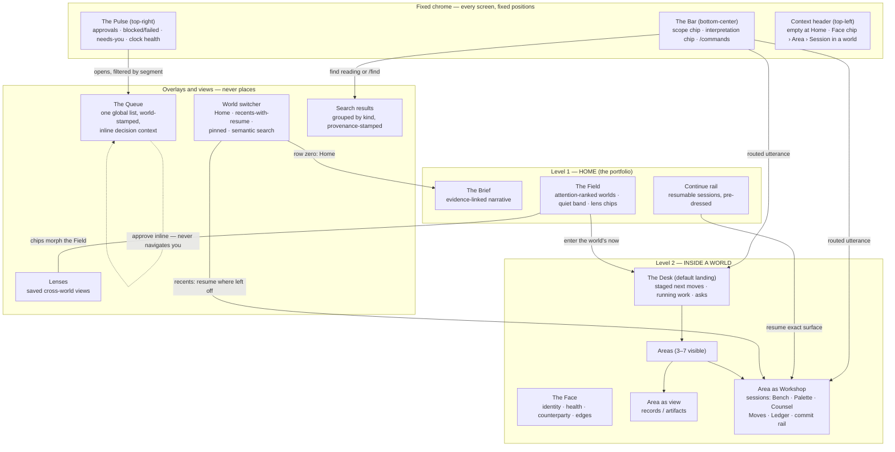

# 02 — The Global Shell

*Phase 3, Experience Architecture. Elaborates constitution §3 (shell geometry), §4 (Home), §8
(the Queue), §13 (context clarity), §14 (progressive complexity). Nothing here contradicts the
constitution; where this document goes further, it is making the constitution buildable. Spec
words (the Line, the Spine, the Situation) appear in prose only — the interface shows the display
names from the constitution's terminology table, and only those.*

---

## 1. The two-level place model

There are exactly **two levels of place**: **Home** and **inside a World**. A place is somewhere
you *are* — it owns the screen, sets the Bar's default scope, and fills the context header.
Everything else in the product is one of three non-places:

- **A view** — a way of rendering things that live in places: a Lens, a search results list, an
  Area opened as records. Views change what you see, never where you are.
- **A surface** — a working environment mounted inside a place: the Desk, a Workshop session, an
  artifact frame, a mission's plan spine. Surfaces are deep, but they are *of* their world.
- **An overlay** — a temporary layer over the current place: the Queue, the world switcher,
  search results, a disambiguation line. Overlays never change place; dismissing one (Esc) puts
  you back exactly where you were, unscrolled, uncommitted state intact.

This is the whole navigational ontology. There is no third level, no global sidebar, no feature
directory. The consequences are deliberate:

1. **"Where am I?" always has a one-breath answer**: "Home" or "in Jane's Client, in the
   Outreach Studio." The context header (§6) states it; the Bar's scope chip (§3.3) agrees with
   it; they can never disagree because both read the same place state.
2. **The hundredth world adds no chrome.** New worlds add rows to the Field, the switcher, and
   Lenses — never navigation items. The shell's fixed elements are the same at 5 worlds and 500.
3. **Work is never a destination.** You do not "go to Missions" or "go to Approvals." Missions
   render on their world's Desk and in the Queue; approvals come to you. Verbs and work reach
   you through the Bar, the Pulse, and the Brief — the three fixed chrome elements.

**Fixed chrome, on every screen, always in the same position:**

| Element | Position | Job |
|---|---|---|
| **The Bar** | bottom-center | one input: intent, search, commands. §3 |
| **The Pulse** | top-right | the honest attention signal; opens the Queue. §4 |
| **Context header** | top-left | where you are; empty at Home. §6 |

Nothing else is global. Every other pixel belongs to the current place.

## 2. Diagram — global shell and context hierarchy

The hierarchy read top-down: chrome is constant; Home and World are the two places it frames;
overlays float above either; Workshops are the deepest surfaces inside a world, and both Continue
and the switcher can land you *directly* on one — depth without navigation.

## 3. The Bar

The Bar is the one persistent input — bottom-center, never moving, on every screen including
inside Workshop sessions and the Queue. It is simultaneously the intent router, the search box,
and the command palette. Three jobs, one input, because splitting them would force the user to
decide *which kind of asking* they are doing before asking.

### 3.1 Input model

- **One line, growing.** Single-line field; `Shift+Enter` adds lines for long instructions. No
  send button on desktop (Enter commits); a send affordance appears on touch.
- **Natural language is the default register.** "follow up with jane", "why did the april
  campaign underperform", "pause the invoice chaser for mom", "10 more like the third one" —
  all legal, all routed.
- **Three explicit registers**, each with a visible mode signature so the Bar never surprises:
  - `/` — deterministic commands (§3.4). No AI interpretation, ever.
  - a noun-like utterance or `/find` — search (§3.5).
  - everything else — routed intent (§3.2, §3.6).
- **The Bar is never a chat log.** Committing an utterance routes it; the conversation, if one
  follows, happens in the surface the utterance landed in (a thread, a Counsel panel, the Desk).
  The Bar clears and stays a bar.

### 3.2 The interpretation chip

While you type, after ~150ms of idle, a chip renders directly above the Bar showing exactly what
Enter will do:

> `→ Jane's Client · draft follow-up email`
> `→ Mom's Real Estate · pause automation "Invoice chase"`
> `→ new Exploration · "why do bee hives work?"` *(silent world birth — ceremony ladder, const. §11)*
> `↗ crossing scopes → Thread & Stone · use artwork from Marco's Murals (grant required)`

Anatomy: **scope glyph + world name · posture dot · verb · object**, plus a cost note when the
action would mint outbound work ("will queue 1 email for approval"). The posture dot is the
destination dial's glyph for the facing the router inferred (03 §5.2) — Think · Create ·
Execute · Observe on hover, the word "posture" never rendered — so the chip previews the full
routing tuple (`world · posture · verb · object`, §12.1), not just the destination. A creation
reading names the world-to-be by its display name from the terminology table (constitution §2):
`→ new Exploration`, `→ new Client · Harbor Dental` — never "new world" or "new curiosity";
creation surfaces elsewhere (09's chips, 12's W5 labels) quote this same vocabulary. The chip is
the routing truth — routing is never a mystery, and never a leap of faith:

- **Tab / Shift+Tab** cycles up to three alternate readings; the chip re-renders per reading.
- **Click the chip** to open a one-row correction strip: change target world, change verb, flip
  the inferred posture.
- A **scope-crossing reading** (utterance targets a different world than the scope chip) renders
  in a distinct crossing treatment (`↗`) — crossing is always visible before it happens
  (constitution §13).
- The chip is *not* a confirmation dialog. High-confidence readings route on Enter with no extra
  step; the chip existed so you could have objected.

### 3.3 The scope chip

Left edge of the Bar, always present: **who the Bar is talking to right now.** At Home it reads
`Home` with a portfolio glyph; inside a world it is that world's Face chip (name + counterparty
stamp when one exists). Rules, binding:

1. **Scope follows place.** Entering a world sets scope to it; returning Home resets to Home.
2. **Per-utterance override is ephemeral.** "ask in mom's world: …" or a routed crossing applies
   to that utterance only; the chip snaps back after commit.
3. **Persistent override is explicit only**: click the chip and pick, or switch place. Nothing
   else — no inference, no drift — ever changes standing scope.
4. **The scope chip is an isolation instrument.** In counterparty worlds it carries the
   counterparty stamp; every AI action the Bar initiates inherits and displays this scope. "What
   do you know here?" asked at the Bar always yields the Counsel's context manifest for the
   scoped world (constitution §13).

### 3.4 Explicit `/commands`

Typing `/` opens the command strip above the Bar: recent commands first, then all commands
invocable in the current scope, filtered as you type. The strip is a palette summoned in place,
never a page you go to, and never a platform-wide capability catalog — doc 05 §2.1 owns this
contract, and the anti-goals forbid capability-visibility "just in case" (constitution §15).
Commands are **deterministic** — no model in the loop, instant, identical every time. They
exist for operators who want mechanical certainty and speed; they are never required.

Core set (the full registry lives with doc 05; the shell contract is the *shape*):
`/go <world|area>` · `/find <query>` · `/queue [filter]` · `/approve` (opens Queue at first
item) · `/new <kind>` · `/note <text>` (to current scope's memory) · `/pause <automation>` ·
`/explore <question>` · `/compare <a> <b>` · `/pin` · `/home`.

Two guarantees: **(a) parity** — every command's effect is reachable by natural language, and
every routed verb has a command form; the two registers are one catalog worn two ways. **(b) no
secret commands, scope-relative** — nothing invocable in the current scope is absent from the
strip, and nothing is invocable anywhere that its own scope's strip cannot show (05 §2.1).

### 3.5 Search and the results view

Search is the Bar wearing its finding face. Trigger: `/find`, or a noun-like utterance whose
best reading is "find" (the chip shows `→ find: "jane invoice march"`). Results open as a
full-height overlay above the Bar:

- **Grouped by kind**, in fixed order: Worlds · Explorations · Artifacts · Conversations ·
  People · Automations · Missions · Playbook lessons · History moments (workshop decisions are
  findable — mastery is searchable, not buried in sessions; "History" is the Ledger's display
  name, per 12 §0.2 — the spec word never appears on screen). **Explorations rows** are
  sessions, beacons, discoveries, and theories — each stamped with its world, opening
  map-forward at the cited node (04 §3.4): "what did I find about queen bees" answers with the
  discovery, not just the world that holds it.
- **Every row is stamped**: world chip, kind glyph, freshness, one provenance line ("committed
  from Outreach Studio session 'April drop'"). No naked results.
- **Scope toggle** top-right of the overlay: *this world / everywhere*, defaulting to the Bar's
  current scope. Counterparty data renders only within rows of its own world — search never
  becomes a leakage channel.
- **Semantic + literal**, blended; found by meaning is the norm ("the bee thing" finds the
  dormant curiosity world).
- **Enter** opens the top result; arrow keys move; `Esc` dismisses back to exactly where you
  were. Opening a world-row offers the same dual entry as the switcher: resume or Desk (§7.2).
  A find that resolves by meaning to a dormant exploration reads as *continue*, not *find* — a
  surface address landing map-forward on the exact node you left (04 §9.2, §7.2 below).

### 3.6 Routing vs asking — the one-line rule

The Bar routes silently when confident and asks **one disambiguating line** when not — never a
picker, never a modal, never a form (inherited verbatim from the phase-1 confidence rule).

- **Ambiguity classes that trigger the line:** which-world ("Jane Alvarez the client, or Jane's
  Bakery the prospect?"), which-object ("the March invoice or the April one?"), and
  which-reading ("draft it, or just remind you?"). The line renders inline above the Bar with at
  most three tappable options plus "neither — let me rephrase."
- **Cost overrides confidence.** Any reading that mints outbound work, spends money, or crosses
  scopes states that on the chip regardless of confidence — but still commits on one Enter. The
  gate for outbound remains the Queue, so the Bar never needs to interrogate you; the approval
  is where the decision context lives.
- **Misroutes are correctable, and they teach.** Every routed action shows a 6-second transient
  ("went to Jane's Client — undo · redirect"); corrections are recorded and sharpen future
  routing. A misroute costs one click, never lost work.

### 3.7 Keyboard model

| Key | Effect |
|---|---|
| any printable key | focuses the Bar (when no other editable has focus) — type anywhere |
| `Cmd/Ctrl+K` | focus the Bar from anywhere, including inside editors |
| `Enter` | commit the interpretation chip |
| `Shift+Enter` | newline |
| `Tab` / `Shift+Tab` | cycle alternate readings |
| `Cmd+Enter` | fire-and-stay: route the action, remain on the current surface |
| `Esc` | one layer at a time: chip → text → overlay → nothing. Esc never ejects you from a world |
| `↑` (empty Bar) | utterance history |
| `Cmd+O` | world switcher (Home is row zero) |
| `Cmd+.` | toggle the Queue |
| in Queue: `j/k` `a` `e` `d` `h` `Enter` `u` | move · approve · edit-then-approve · decline · hold · expand context · undo |
| in switcher/results | type to filter, arrows, Enter |

The entire operate loop — read Brief, work Queue, speak to the Bar, resume from Continue — is
drivable without a pointer. Nothing is *only* keyboard; nothing essential is chat-only
(constitution §14).

## 4. The Pulse and the Queue

### 4.1 The Pulse

A small fixed signal, top-right: the shell's one honest claim on your attention. Four segments,
each a real count from real rows — a segment with nothing shows nothing:

1. **Approvals waiting** (spine queue depth for you).
2. **Blocked / failed** — missions blocked, automations that failed or went quiet.
3. **Needs you** — counterparty replies, intake asks owed, aging holds.
4. **Clock health** — one glyph: the heartbeat's liveness. Green-quiet when ticking; the Pulse
   itself takes an amber ring when the clock is stale. The machine's own liveness is shell-level
   chrome, never a buried settings page — a dead clock silently faking normalcy is the one lie
   the shell is structurally forbidden to tell.

When all four are empty the Pulse is a calm dim dot — presence without demand. No fake urgency,
no red for red's sake: every count must survive "which rows are those?" (tap any segment → the
Queue, pre-filtered to it).

### 4.2 The Queue — one list, whole decisions

The Queue opens as a right-side overlay (from the Pulse, `Cmd+.`, `/queue`, or any Brief
sentence about it). It is **one global list** — approvals, blocked work, failures, needs-you —
because attention must not fragment as worlds multiply. Filters: by world, by class, by state
(waiting / auto-ran / held / failed). Grouping: class, then world. Opening the Queue never
changes your place; working it never navigates you away.

**Item anatomy** — every item carries its whole decision, inline:

1. **Stamp row** — world Face chip (counterparty-stamped when applicable) · class · age · what
   produced it ("Mission: April launch, step 3 of 7" / "Automation: invoice chase, rung 2" /
   "Outreach Studio session 'cold list B'").
2. **The ask, one sentence.** "Send this follow-up to Jane?" "Publish v4 of the landing page?"
   "Adopt this lesson into the Playbook?" "Your client setup improved — adopt the new booking
   flow?"
3. **Inline decision context — preloaded, not linked:**
   - email/SMS: the full draft, recipient, the prior thread's last exchange;
   - publish/deploy: before/after compare, live-target named;
   - money: amount, terms, the relevant running ledger line;
   - mission steps: the plan spine with this step lit, plus an Activity peek (what the worker
     read, did, decided) one tap deep;
   - lesson proposals (knowledge gate): the proposed Playbook entry with its evidence rows;
   - setup adopt-proposals (inheritance, 09 §10): the layer diff, rendered against the
     receiving world's *own* resolved version — a conflicting local override renders as a
     conflict diff, never silently overwritten. The three answers adopt · adapt · decline map
     onto the action rail as Approve · Edit-then-approve · Decline; an adapt edit is recorded
     as that world's local variant, visibly kept;
   - connection grants (09 §4.7's grammar): the grant sentence — connection · direction
     (read/send/spend) · scope, in words — the requesting world or artifact, what work is
     waiting on the grant, and the revocation statement ("revocable from either Face");
   - creative output: the variant(s) with critique scores *and the criteria that produced them*
     — the rubric is visible and tappable, so every approval is also a rep of judgment
     (mastery, constitution §12).
   Approving must never require navigating away; if an item can't carry its decision inline,
   the item is malformed, not the rule.
4. **Action rail** — Approve · Edit-then-approve · Decline (asks one-line why) · Hold (with a
   wake condition: "after the client replies" / "tomorrow 9am"). Edits happen in place, and the
   edit is recorded as a verdict — the system learns your red pen; kept-vs-rewritten feeds the
   drafting loops.

**Batch-by-class.** Each class group header offers *Review as batch*: items stack as cards you
walk with `j/k`+`a`. "Approve all remaining" exists but stages **per-item approvals** confirmed
with a single hold-to-confirm gesture — bulk is a faster hand, never a bypassed gate. Mixed
classes never batch together.

**Earned-autonomy offers live here.** After a clean streak on a (class × world), the class
header grows an offer card: *"12 clean approvals of invoice reminders for Mom's Real Estate —
auto-approve this class? Instantly revocable. Everything it does stays in this list, marked."*
Accepting is itself an approval. Declining silences the offer until the streak doubles.
Auto-approved actions remain first-class Queue citizens under the *Auto-ran* filter — a ledger
view with per-row revoke. Autonomy is the system graduating alongside you: the offer names the
evidence, and revocation is one tap on any row, forever.

**Failure surfacing.** Failures are Queue citizens, never toasts:

- A failed mission step or automation run files a needs-you item carrying the Activity excerpt
  (what it tried, where it broke), a proposed remedy, and actions: Retry · Fix (opens the exact
  surface) · Pause the automation.
- **Silence is loud**: an automation that misses its expected window files a "went quiet" item
  *automatically* — absence of output is itself surfaced (constitution §8's trust invariant).
- Repeated same-class failure escalates within the Queue (pinned to top of its world's group);
  it reaches your phone only via the three push rules (§9).

## 5. Progressive depth of the shell

The three layers of use (constitution §14) map onto shell elements directly: **speak & approve**
= Bar + Brief + Queue (the entire system operable as propose→approve); **drive** = Desks,
Workshops, Lenses reached through the same two places; **inspect** = Activity peeks, Ledger
views, the Auto-ran filter, grants on the Face. The shell never asks which kind of user you are;
depth is always one tap below the surface you're on, and never in the way.

## 6. The context header

Top-left, fixed. **At Home: empty.** Home needs no label — the Brief's greeting line is the
orientation. Inside a world, three segments, never more:

> **[Face chip: Jane's Client · Website + Automations · Jane Alvarez]** › **Outreach** ›
> *session "April follow-ups"*

- The **Face chip** carries name, kind presentation (genome dressing, in display terms), health
  glyph, and the counterparty stamp. It is the isolation signal: in a counterparty world the
  counterparty's name is persistently on screen, and it always matches the Bar's scope chip.
- Segments are links: Face chip → the Desk; area → the area's top; session name → the session
  (when you've drilled into an artifact from within one).
- A small **grants indicator** appears on the chip when cross-world grants are active in this
  world ("1 grant: artwork ← Marco's Murals") — one tap lists them, with revoke (constitution
  §13).
- On entry from elsewhere, the header whispers a one-line *since-you-were-here* ("2 automations
  ran · Jane replied") that fades unless tapped — the world greets you without stopping you.

The header never scrolls away and never exceeds three segments; surfaces deeper than a session
(a variant inside a comparison) are the surface's own business, not the header's.

## 7. World switching

Three ways, all constitutional: the Bar by name or meaning; the switcher overlay; Home itself.

### 7.1 The switcher overlay (`Cmd+O`)

One overlay, three bands, in order:

1. **Row zero: Home.** Always first; Enter from an empty filter goes Home.
2. **Recents with resume** — the last five worlds, each row: Face chip · honest one-line state
   ("2 waiting · mission running") · **where you left off** ("Outreach Studio — session 'April
   drop' · 40 min ago"). Enter resumes that exact surface, pre-dressed.
3. **Pinned** — user-pinned worlds (up to seven), same row anatomy.
4. **Semantic search over everything** — typing filters recents/pinned first, then searches all
   worlds *including dormant* by meaning: "the bee thing" finds it. Dormant rows say so
   honestly ("dormant since May — wake it?").

### 7.2 Two entries, one rule

Every world row (switcher, search, Field) offers **dual entry**:

- **Resume** (default on recents/Continue): land on the exact surface you left — Workshop
  session with Bench and Ledger as they were, thread scrolled to the last exchange, mission open
  at its current step.
- **Desk** (default on Field orbs and cold entries): land on the world's *now* — staged next
  moves, running work, waiting approvals, open asks. Zero decisions to start.

**Curiosity worlds flip the cold default.** A curiosity world's *now* is its map — the map IS
the record (constitution §7) — so for these worlds the dual entry defaults to resume even on
cold finds: "the bee thing" at the Bar or in search, a year later, reads as *continue* and
lands map-forward on the exact node you left (04 §9.2), never on a Desk. A Bar utterance that
resolves by meaning to a dormant exploration is a surface address, not a find. The Desk entry
stays one hover/long-press away, like any other row. (11 §6.3's `/w/:world` Desk default reads
through this same rule.)

The split is deliberate: the Field is how you enter a world's *situation*; Continue and recents
are how you re-enter your *work*. Hover/long-press reveals the other entry on any row.

## 8. Continue and resume

**Resume restores the surface, not the location.** Binding behaviors:

- A **Workshop session** resumes on the Bench exactly as left, Ledger tail visible — returning
  after thirty days lands on the Ledger's story ("you compared 6 variants, committed #3, left a
  beacon on pricing"), never a blank canvas (constitution §6). If a delegated worker continued
  the session meanwhile, the Ledger shows who did what since, first.
- A **thread** resumes at the last exchange with a one-line *since then* note when machinery
  acted in the interim.
- A **mission** resumes on its plan spine at the current step, blockers lit.
- Resume is **pre-dressed**: hover/focus on any Continue or switcher row prefetches, so arrival
  is instant — the anticipation doctrine applied to navigation.
- **Cross-device continuity**: the rail is identical on mobile; deep benches open in their
  review/critique/approve state on a phone rather than pretending to be drivable there.

The **Continue rail** (Home, above the Bar) holds three to five resumable sessions: surface
glyph · intent-name ("April follow-ups") · world stamp · freshness · one line of left-state from
the Ledger tail. Workshop sessions render a small Bench thumbnail. Sessions outrank threads;
Queue-only visits never pollute the rail; items age out of the rail but remain findable forever
by search. Approving from the Queue never moves you, so Continue is rarely needed for
interruptions — it exists for *returns*.

## 9. Notifications philosophy

**Default: nothing interrupts.** The system is built to hold state so you don't have to; a
notification is an admission that something couldn't wait, which must be rare enough to stay
credible.

- **The Brief absorbs.** Everything that happened while you were away belongs in the Brief and
  the Pulse's counts — read on *your* arrival, at *your* pace. A quiet night sends nothing.
- **In-app, while present**: only events that change the meaning of what you're currently doing
  surface immediately, and inline — the counterparty replies in the thread you're drafting
  into; the artifact you're editing gets committed elsewhere. Rendered as a quiet line in the
  surface, never a modal, never a toast queue.
- **Push (leaves the app for your phone) — exactly three classes, each justified:**
  1. **Stale clock.** Every other guarantee — "recurring work never becomes invisible,"
     "silence is loud" — depends on the heartbeat. If the clock stops, the system can no longer
     honestly promise it would have told you about anything else. Liveness failure is therefore
     the one meta-alert: it must out-travel the app.
  2. **Needs-approval aging past its class window.** Batching approvals is the Queue's whole
     point, so approvals must *not* push by default. But some classes decay: a speed-to-lead
     first touch is worth minutes, a booking confirmation expires, an offer window closes. Each
     approval class declares a decay window (most declare none); only a decaying approval that
     ages past its window pushes — because by then, *not deciding is deciding.*
  3. **Counterparty replies.** A human on the other side is waiting, and their time is the one
     clock we don't own. A reply from a client or prospect pushes; internal machinery never
     does.
- Every push deep-links to the exact Queue item or thread with full inline context — a push you
  can act on from the lock screen, not a doorbell. Quiet hours are on by default; class 1
  (stale clock) alone may cross them.
- **Never pushed, ever**: engagement bait, streaks, celebrations, digests-as-push, "you have
  unread items." The Brief is the digest, and it waits.

## 10. Home, in full

Home is the portfolio's live state *rendered* — not a dashboard, not a launcher, not a grid.
Everything on it is generated fresh, ranked by attention, and traceable to rows (constitution
§4). Composition, top to bottom: **the Brief · the Field · Continue · the Bar.**

### 10.1 The Brief

A generated, honest narrative — the same machinery as the morning brief, rendered on every
arrival and re-rendered on material change. It reads as prose stanzas, not widgets:

1. **While you were away** — the automated-activity digest, grouped by world, counted from
   rows: "Overnight: the client hunt added 14 prospects; 3 follow-ups queued for approval;
   Mom's invoice chase sent rung 2 to two late payers."
2. **What changed** — state deltas that matter: health shifts, milestones, outcomes landing on
   artifacts ("the Tuesday subject line drew 3 replies"), and **closed predictions** — when an
   outcome resolves a call made in a workshop, the Brief says so and shows the running hit-rate
   (calibration is portfolio news, not a buried stat — mastery, constitution §12).
3. **Needs you** — the two or three Queue items that matter most, each with *why now* ("the
   speed-to-lead draft ages out in 2 hours"). Not the whole Queue — the Pulse carries the count.
4. **In flight** — one line per running mission: name, step, next wake.
5. **Worth a look** — opportunities, insights, promotion offers ("the bee-hive exploration has
   returned 4 times — make it real?"), and at most one Playbook proposal awaiting the gate.

**Evidence-linking is structural.** Every sentence is generated *from* rows and links *to* them:
tap a claim, see the rows (the heartbeat trace, the thread, the outcome annotation, the Queue
item). A sentence that cannot cite rows cannot be rendered — honesty by construction, not
editorial policy. The Brief's language is the operator's: names, not identifiers; "Jane
replied," not "1 inbound event."

**Quiet nights are short.** "Quiet night. Three automations ran clean; nothing needs you." — one
line, and the Brief cedes the screen to the Field. The Brief never pads, never repeats
yesterday, never scrolls infinitely; past briefs are findable by search, not stacked on Home.

### 10.2 The Field

Worlds as living entities, **ranked by attention, never inventory**. The ranking function, in
words, highest first:

1. **Needs-you** — approval waiting, ask owed, reply waiting on you.
2. **Broken** — failed, blocked, went-quiet.
3. **News** — counterparty acted, outcome landed, milestone reached.
4. **Glowing** — opportunity, insight, promotion offer.
5. **Running-quiet** — healthy with work in flight: compressed.
6. **Dormant** — absent (reachable via "everything" and search).

Ties break by: counterparty-facing before internal, money before not, then age. Every glow must
survive "which row is that?" — a world may not glow from vibes.

**Rendering tiers and the fixed budget.** The attention set renders at most **nine** worlds in
full presence (Face chip, one-line honest state, staged next move on hover). Below them,
running-quiet worlds compress to name-glyph rows; below those, one **quiet band**: "41 worlds
quiet — all clean," expandable in place. The Field's screen budget is constant: at 5 worlds it
is a handful of orbs with room to breathe; at 100 it is the same size, because attention is
scarce even when worlds aren't. No pagination, no grid, no scroll-of-cards — the hundredth
world adds a row to a band and a Lens, never bulk.

**Lens chips.** Across the Field's top: built-in Lenses shipped with genome families ("Clients",
"Prospect pipeline", "Explorations", "Running automations") plus user-saved ones. Tapping a chip
**morphs the Field in place** into that Lens's rendering — pipeline board, roll-up table,
filtered field — same place, different view; the Bar's scope stays Home. Lenses answer *across*;
entering a world answers *within*. Acting from a Lens row (nudge ten prospects) stages per-world
approvals through each world's own gate — a Lens is a view with hands, never a bypass.

### 10.3 The Continue rail

As specified in §8: three to five sessions, intent-named, world-stamped, left-state visible,
one tap from exactly where you were. It sits directly above the Bar so the two most common Home
gestures — *resume* and *speak* — are adjacent.

### 10.4 What Home refuses to be

No static cards. No KPI tiles detached from rows. No folder tree. No "recently created" lists
sorted by timestamp instead of attention. No celebratory zeroes. If a proposed Home element is
not (a) generated fresh from live state, (b) ranked by attention, and (c) traceable to rows, it
does not ship — the rule is the constitution's, and it is testable.

## 11. Mobile posture of the shell

Operate-mode first (constitution §14): Home is Brief + Pulse + Queue + Bar + Continue,
full-fidelity — the Queue approves inline with complete decision context on a phone. The Field
compresses to the lens-chip row plus the attention set as a list. World Desks are read-mostly;
Workshops open in review/critique/approve state (compare two variants: yes; drive the apparel
bench: no). The Bar is voice-friendly; nothing depends on voice. The three push classes are the
only things that light the phone.

## 12. Direct answers to the phase brief

*The phase brief's question lists, answered explicitly. Each answer is the binding shell rule;
sections above carry the detail.*

### 12.1 Overall shell

| Question | Answer |
|---|---|
| How many levels of place exist? | Two: Home and inside-a-World. Everything else is a view, a surface, or an overlay (§1). |
| What is on screen everywhere? | The Bar (bottom-center), the Pulse (top-right), the context header (top-left, empty at Home). Nothing else is global (§1). |
| Is there a sidebar or app switcher? | No. No global sidebar exists; worlds are reached by Bar, switcher, or Home; features are reached by verb, never by menu (§1, anti-goals §15). |
| What is the Bar and what does it accept? | One persistent input accepting natural language, `/commands`, and search; it routes intent as `utterance → world · posture · verb · object`, previewed by the interpretation chip (§3). |
| How does the user know what the Bar will do? | The interpretation chip shows the routing before commit; Tab cycles readings; crossings render distinctly; misroutes have one-click undo/redirect (§3.2, §3.6). |
| When does the Bar ask instead of act? | Only when genuinely ambiguous — one inline disambiguating line, max three options, never a picker or modal. Costly actions state their cost on the chip but still commit in one Enter; the Queue is the gate (§3.6). |
| Is search separate from the Bar? | No. Search is the Bar's finding register (`/find` or noun-like reading); results are a grouped, provenance-stamped overlay (§3.5). |
| Where do approvals live — per world or global? | One global Queue, world-stamped per item, filterable by world and class. Attention never fragments with scale (§4.2). |
| Can I approve without navigating? | Always. Every Queue item carries its full decision context inline — draft, diff, compare, evidence, criteria. An item that can't is malformed (§4.2). |
| How does autonomy grow? | In the Queue: earned-autonomy offers appear on class headers after clean streaks, citing the evidence; instantly revocable; auto-ran actions remain visible ledger rows (§4.2). |
| How do failures reach me? | As Queue citizens with Activity excerpts and remedies; "went quiet" is filed automatically; only the three push classes leave the app (§4.2, §9). |
| How do I switch worlds? | Bar by name/meaning; switcher overlay (Home row, recents-with-resume, pinned, semantic over everything incl. dormant); or via Home's Field (§7). |
| How do I get back to what I was doing? | Continue rail and switcher recents resume the exact surface — Workshop session on its Bench with the Ledger tail, thread at last exchange, mission at current step — pre-dressed (§8). |
| What interrupts me? | While present: only events that change the meaning of the current surface, inline. Push: stale clock, decaying approvals past their window, counterparty replies. Nothing else, ever (§9). |
| How does the shell scale to 100 worlds? | Fixed chrome never grows; the Field's budget is constant (≤9 prominent + quiet band); the Queue stays one list; Lenses absorb breadth; the switcher finds by meaning. The hundredth world adds rows, not weight (§1, §10.2). |
| How is isolation signaled? | Counterparty stamp on the Face chip and the Bar's scope chip (always in agreement); crossing readings render distinctly; grants are listed and revocable from the header; search and Lenses render counterparty data only within its own rows (§3.3, §6). |
| What does the keyboard model cover? | Everything in the operate loop: type-anywhere Bar, `Cmd+O` switcher, `Cmd+.` Queue, `j/k/a/e/d/h` in the Queue, Esc as strict layer-walk that never ejects from a world (§3.7). |

### 12.2 Home and Situation

| Question | Answer |
|---|---|
| What is Home? | The portfolio's live state rendered: the Brief + the Field + Continue + the Bar. Never a dashboard (§10). |
| What do I see first in the morning? | The Brief — a generated narrative: while-you-were-away, what changed, needs-you (with why-now), in-flight, worth-a-look. Every sentence evidence-linked to rows (§10.1). |
| How is the Brief kept honest? | It is generated from rows and can only render sentences that cite them; a claim without rows cannot exist. Quiet nights produce one line and nothing pushes (§10.1). |
| How are worlds ranked? | By attention class: needs-you › broken › news › glowing › running-quiet (compressed) › dormant (absent); ties break counterparty-first, money-first, then age (§10.2). |
| What happens at 100 worlds? | The same screen: ≤9 in full presence, quiet worlds in a one-row expandable band, dormant worlds only in search. The Field's size is constant by construction (§10.2). |
| Where do Lenses live at Home? | As chips atop the Field; tapping morphs the Field in place into the Lens's rendering. Lenses act only through per-world gates (§10.2). |
| Where do opportunities and promotions appear? | In the Brief's "worth a look" stanza and as glow (class 4) on the Field — both traceable to rows; promotion offers are quiet, never nagging (§10.1, §10.2). |
| How does Home treat mastery and workshops? | Continue resumes Workshop sessions first-class (Bench + Ledger); the Brief reports outcome annotations, closed predictions with hit-rate, and Playbook proposals; searchable History moments (the Ledger's decisions, display name per 12 §0.2) make judgment findable (§8, §10.1, §3.5). |
| Is Home ever empty? | A new account's Home is the Bar plus one line: "Say anything — a question, a business, a thing to build — and I'll make it a world." The first utterance creates the first world through the ceremony ladder; Home fills only with real state (§10.4, const. §11). |
| Does Home have settings, folders, or manual layout? | No. Pinning (switcher) and saved Lenses are the only user curation; everything else is generated and ranked. Manual arrangement would rot; attention ranking cannot (§10.4). |

## 13. Acceptance checks for this document

1. **The two-breath test**: from any screen, "where am I?" and "what will the Bar do?" are both
   answerable by glancing at fixed chrome.
2. **The no-navigation approval test**: any Queue item can be decided without leaving the Queue.
3. **The hundredth-world test**: adding a world changes no chrome, adds no nav, grows no screen.
4. **The quiet-night test**: a clean night yields a one-line Brief, a dim Pulse, zero pushes.
5. **The resume test**: any session left mid-thought reopens on its Bench with the Ledger
   telling the story, in one tap from Home.
6. **The leakage test**: no counterparty's data renders outside its world's rows on any global
   surface (Queue, search, Lenses, Brief).
7. **The theater test**: every count, glow, and Brief sentence survives "which rows are those?"

---

*Cross-references: 03 (the world grammar the shell frames), 04 (Explore entry via the Bar),
06 (Queue classes and autonomy dials in depth), 08 (Lenses and multi-world), 09 (the ceremony
ladder the Bar's chip surfaces), 16 (the Workshop sessions Continue resumes), 17 (the mastery
loops the Brief and Queue carry).*
