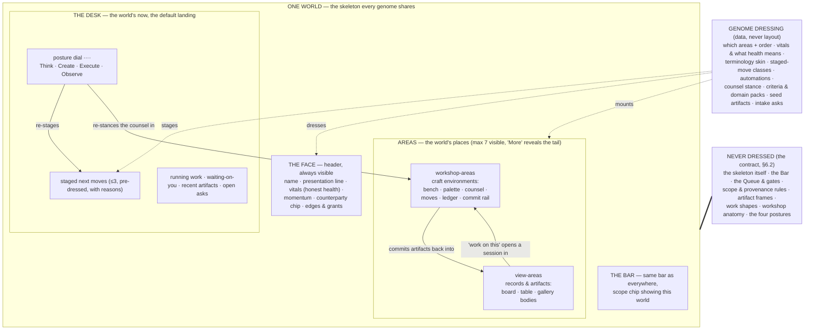

# 03 — World Experience: The Interaction Grammar of a World

*Phase 3, document 03. The constitution (§5) fixes the skeleton every world shares; this document
is the full mechanics of that skeleton — the Face, the Desk, Areas, postures — and the binding
contract by which genomes dress it without breaking it. Grounded in the operating model
(Decisions 1, 2, 5; §2 World/Genome/Area) and the principles (P3, P5, P6, P9, P10). Diagram
assignment: world composition. Documents 04 (Explore), 06 (work), 07 (artifacts), 16 (workshops)
elaborate the objects this grammar arranges; this document owns the arrangement itself.*

---

## 0. What this document fixes, and a reading rule

A World is the only place-noun besides Home. Everything the operator does — craft, approval,
curiosity, delegation — happens *inside* one. So the inside of a world is the product's most
repeated experience, and it must satisfy two demands that pull against each other:

1. **Learnable once.** Ten worlds or a hundred, the operator's hands must already know every one
   of them. Same questions, same places, same gestures (operating model §5.1).
2. **Unmistakably itself.** A client world that feels like a rabbit hole is generic-and-empty —
   the anti-goal the constitution names directly (§15). Kind must be visible in the first second.

The resolution is the constitution's: **consistency via the grammar, variation via dressing.**
This document specifies both halves precisely enough to prototype from, and draws the line
between them as an enforceable contract (§6 below).

**Reading rule.** This document uses spec names — Genome, Capability, posture, view-area. None of
these words appear in the interface. The Face is simply the world's header; the Desk is simply
what the world opens to; areas are known only by their own names ("Listings", "Collection"); the
genome surfaces only as "setup" or "kind" in creation flows. Where a UI label is quoted below, it
is quoted in its skinned form per the constitution's terminology table (§2). "Face" and "Desk"
are internal names for regions of one screen — they carry no on-screen label at all.

---

## 1. The skeleton — five organs, one composition

Every world, at every genome, at every stage of life, is composed of exactly five organs in
fixed positions. Entering a world always lands on the Desk, with the Face above it, the areas
beside it, the Bar below it, and the posture dial on it.

The five organs, and what each answers:

| Organ | The question it answers | Never absent because |
|---|---|---|
| **Face** | "How is it doing, really?" | health with no fixed home becomes theater or goes unwatched |
| **Desk** | "What now?" | arrival without a staged now forces the operator to reconstruct state (violates P5) |
| **Areas** | "Where does this kind of work live?" | undertakings have durable domains; domains need places state can accumulate |
| **Bar** | "How do I say what I want?" | conversation is the router at every scale (P8); scope must always be visible |
| **Postures** | "How am I facing this right now?" | the metabolism has beats; the room must light for the beat you're in |

Everything else inside a world — missions, automations, artifacts, threads, the world-scoped
slice of the Queue — is *content flowing through* these organs, never a sixth organ. A genome
that wants a sixth organ is a mini-product trying to be born, and the answer is no (P6,
precedence rule 2).

---

## 2. The Face — identity and honest vitals

### 2.1 Anatomy

The Face is the world's persistent header, present on the Desk and on every area — it is also
the isolation signal (constitution §13): while it is visible, you know exactly whose context the
AI is acting in. Left to right:

1. **Name and presentation line.** The name the operator uses ("Jane's Bakery", "Mom's Real
   Estate", "why do bee hives work?"). Beneath it, the genome's presentation line — the world's
   kind and standing rendered as a human sentence: "Client · Website + Automations · since March
   · $500/mo". This is the only place the genome routinely *shows*, and it shows as facts, never
   as a template name.
2. **Vitals.** Two to four named health signals (see 2.2). Each renders one of five states and is
   tappable through to the rows that justify it.
3. **Momentum.** A small trend mark: is this world moving, and in which beat? Momentum is
   computed from real activity (sessions, commits, sends, replies, map growth) — never from
   opens or views, which measure attention spent, not progress made.
4. **Counterparty chip.** Present only when the world wraps a real other side: "Jane", "the
   brewery". Tapping it opens the relationship: contacts, consent state, money standing, the
   isolation contract in plain words.
5. **Edges and grants.** Typed connections to other worlds ("serves ← Agency") and every
   cross-world grant in force, in both directions ("artwork → Clothing brand · revocable").
   Grants live on the Face because visibility is the price of crossing an isolation boundary
   (P11).

### 2.2 Health is genome-defined, and every vital is evidence-bound

"Healthy" cannot mean one thing across a client, a brand, an automation, and a rabbit hole — so
the genome defines it. A genome supplies **vitals**: at most four named signals, each with a
plain-language definition, the row-source it is computed from, and thresholds for its states.
Three binding rules:

- **No composite scores.** The Face never shows "Health: 82". A single abstract number hides the
  question it should provoke. Vitals are named things a human would actually ask about.
- **Every vital survives "which row is that?"** (P9). A warn state must open directly onto the
  rows that caused it — the overdue invoice, the stalled heartbeat, the unanswered reply.
- **No signal says so.** A world with no data renders "no signal yet" in that vital's slot —
  never an optimistic default, never gray silence that could be mistaken for calm.

### 2.3 The five render states

Every vital, and the Face as a whole, renders exactly one of:

| State | Meaning | Visual weight |
|---|---|---|
| **glowing** | good news arrived — a reply, a close, an above-bar result | bright, brief, evidence-linked |
| **steady** | on track; nothing needs you | quiet |
| **warn** | something needs you soon — owed, aging, drifting | visible, named, ranked into the Desk |
| **blocked** | work stopped; a gate, failure, or missing input | loud; also surfaces to the Pulse/Queue |
| **no signal** | nothing measured yet | honest gray, says the words |

A world's overall Face state is its worst vital, except that *glowing* may co-render with
*steady* (good news does not wait for perfection). Dormant worlds have a sixth, whole-Face
state: **asleep** — vitals ungraded, face dimmed, momentum showing "last touched". A sleeping
world never warns; if something real happens to it (a reply arrives), it wakes.

### 2.4 Worked examples — what health *means*, per genome

Four vitals specifications here; two more (clothing brand, artist) inside their full dressings
in §7.

**Website client (Jane's Bakery).** Vitals: **Service** (the site is live and every promised
automation's heartbeat is clean — computed from deploy state + heartbeat traces; warn = any
routine missed a beat; blocked = site down or an automation failed), **Money** (invoices paid
vs. outstanding; warn = overdue > 3 days; the chase automation's state rides this vital),
**Owed to Jane** (any reply, deliverable, or approval she is waiting on; warn = older than one
business day), **Momentum** (deliverables against the service calendar). The client genome's
definition of glowing: Jane replied positively, a deliverable shipped, a payment landed.

**Real-estate agent (Mom's Real Estate).** Vitals: **Pipeline** (active listings and pending
closings by stage; warn = a listing stalled at a stage past its typical dwell time — threshold
learned from this world's own history, shown with its evidence), **Speed-to-lead** (median
first-touch time on new inquiries; warn = any inquiry unanswered past the genome's bar; this
vital exists because the domain pack knows response time is the business), **Mailings** (the
farm cadence: last drop, response signals, next drop staged), **Money** (commissions pending,
invoices out).

**Inbox automation.** Vitals: **Heartbeat** (last ran · next run; blocked = missed schedule or
connection failure — and this vital can never be compressed away, in any posture, at any
attention ranking: trust outranks quiet, P10), **Intervention rate** (share of drafts the
operator edited or rejected this week — falling intervention is how earned autonomy is
evidenced), **Latency** (oldest unhandled item). Note what is *absent*: no "volume" vanity
vital on the Face. Volume handled belongs to Observe-posture reporting, not to health.

**Curiosity world (why do bee hives work?).** Vitals: **none.** A curiosity world has no
health because nothing can be owed — no counterparty, no clock work, no money. Its Face shows
momentum (map growth, last touched) and **open beacons** (parked questions with held guesses —
the rabbit-hole doctrine). A curiosity Face never warns and never blocks; the only loud thing
it can do is glow when a discovery lands. This is the no-theater rule protecting wonder:
curiosity must never acquire the anxiety signals of operation until the operator promotes it.

### 2.5 Face rules (binding)

1. At most four vitals; a genome wanting five has misdefined health.
2. Vitals may **evolve with the world's stage** — the brand's "launch runway" vital retires at
   launch and "sell-through" mounts in its place; the change is announced on the Desk, never
   silent.
3. When genome layers stack (curiosity + venture + client), the heaviest layer's vitals win the
   Face by default; displaced vitals remain one tap deep, and the operator may pin any vital.
4. The Face is the same header inside every area — you are never inside a world without knowing
   how it is doing and whose context you are in.

---

## 3. The Desk — the world's now

### 3.1 Anatomy

The Desk is the world-scoped Situation rendered — the default landing of every arrival, whether
by orb, by switcher, or by the Bar. It is a *now*, never an inventory. Top to bottom:

1. **Staged next moves** — at most three, pre-dressed (3.3), each with a visible reason.
2. **Running work** — missions with their plan-spine state, automations with heartbeat chips.
   One line each; expandable in place.
3. **Waiting on you** — the world's slice of the Queue, approvable inline without leaving.
4. **Recent artifacts** — the last few things made, as frames, compare-ready.
5. **Open asks** — intake questions the world still wants answered ("what's the deposit policy?").
   Asks arrive here as ordinary staged items — never as a form, never as a wizard (P4).

The posture dial sits on the Desk (§5). The Bar sits beneath everything, scope chip showing this
world.

### 3.2 The staging order (binding precedence)

Staged moves are ranked by a fixed precedence of classes. Within a class, by impact and age.
The order encodes the principles' precedence directly — trust beats economy beats novelty:

1. **Broken trust.** A failing, stalled, or dark automation; a mission step that errored. These
   outrank everything and can never be compressed out by any posture or ranking (P10).
2. **Judgment owed.** Approvals whose absence blocks running work ("the mission resumes when you
   approve the draft"), then other world-scoped approvals.
3. **The other side moved.** Replies, claims, bookings, payments, inquiries — anything a real
   counterparty did that now waits on the operator.
4. **Mid-flight work.** Workshop sessions and missions the operator left mid-motion. Continuity
   beats novelty: resuming yesterday's bench outranks starting anything new.
5. **The undertaking's forward motion.** The genome's contribution: what a competent operator of
   *this kind* of undertaking would do next — the service calendar's next deliverable, the
   collection's long pole, the farm's next drop. Every genome-staged move carries its reason and
   its evidence ("Tuesday sends performed best — Playbook, 6 data points").
6. **Asks and openings.** Intake questions, detected opportunities, promotion offers.

No class may flood the Desk: at most two of the three slots come from any single class. The full
ranked list is one tap away ("everything waiting"); the Desk shows the top of it, not all of it.

### 3.3 Pre-dressed arrival: zero decisions to start

Every staged move opens in **one gesture into the exact working surface with the material already
loaded**. Not a link to a place where work could begin — the work itself, mid-sentence:

- An approval move opens its full decision context inline: the draft, the diff, the compare, the
  evidence — approve or edit right there (the Queue's inline contract, inherited).
- A drafting move opens a workshop session with the draft on the bench, the relevant palette
  loaded (prior artifacts, playbook cards, the thread it answers), and the counsel already
  grounded in why this move was staged.
- A reply move opens the conversation with the counterparty's message and the proposed response
  staged for judgment.
- A resume move reopens the session's ledger exactly as left — thirty days later, the ledger's
  story, not a blank canvas (constitution §6).

The test: **the operator's first decision is always about the undertaking, never about the
software.** If a staged move ever opens onto a choice of tools, a picker, or an empty surface,
staging has failed. And the boundary holds in the other direction too: staged moves are offers
with reasons — the Desk never executes its own suggestions (P5×P1 resolution; autonomy is earned
per class in the Queue, never assumed by a landing surface).

### 3.4 The three-slot discipline

Three staged moves is a maximum, not a quota. A quiet world stages one, or none — "nothing needs
you; the mailing runs Thursday" is a legitimate and honest Desk. Padding the slots with invented
urgency is theater and is forbidden (P9). The three-slot cap is what keeps the hundredth world's
Desk exactly as readable as the first's: attention is scarce even when worlds aren't (P3).

### 3.5 How postures re-stage the Desk

The dial does not navigate — it re-lights. Changing posture re-ranks classes 4–6, changes what
the secondary strips lead with, and re-stances the counsel. Classes 1–3 (trust, judgment owed,
the other side moved) hold their positions in every posture.

| Posture | The Desk brings forward | The Desk quiets | The counsel's stance |
|---|---|---|---|
| **Think** | open questions, parked beacons, knowledge and playbook cards, "why?" threads on recent outcomes, the world's map | operational detail, metrics | socratic — asks before it answers, surfaces what is *not* known |
| **Create** | mid-flight sessions, benches with variants awaiting critique, fresh palette material (a granted artwork, a new photo set) | analytics, heartbeat detail | generative and critique-ready — proposes, varies, scores against the criteria pack |
| **Execute** | waiting approvals, running plan-spines, blocked steps, send/publish states | speculation, exploration | terse and operational — checklists, gates, exact states |
| **Observe** | outcome-annotated artifacts, heartbeat traces, calibration (predictions vs. results), playbook candidates awaiting the gate | drafts, unstarted moves | analytic and honest — numbers with their rows, "no signal" said plainly |

Worked contrast, same world, same morning (Mom's Real Estate): in **Execute**, the Desk leads
with "postcard print run waiting on you" and the farm mission's spine; flip to **Observe** and
the same Desk leads with "March drop: 412 mailed · 11 valuations · 2 listings — versus your
prediction of 8" with the postcard's outcome annotations; flip to **Think** and it leads with
"you parked: 'is the lake-house segment worth a separate farm?' — the guess you held", the
mailing outcomes now supporting material in the margin. Nothing appeared, nothing vanished;
the room was re-lit.

---

## 4. Areas — the world's places

### 4.1 What qualifies as an Area (the four tests)

An Area is a chartered sub-context: one durable domain of the undertaking, with its own name,
its own accumulating state, and its own answer to "how's this part going?" Candidate structure
becomes an Area only if it passes all four:

1. **The domain test.** It names a lasting facet of the undertaking ("Listings", "Brand",
   "Commissions") — not a task, not a date, not a file type.
2. **The accumulation test.** State worth keeping for months accrues in it: artifacts, sessions,
   decisions, criteria, a slice of the Playbook. If nothing accumulates, it is a verb, not a
   place.
3. **The return test.** The operator comes back to it across the world's whole life. Finite
   things with an end are Missions, however large.
4. **The body test.** It opens coherently as either a view (records) or a workshop (craft). If
   it would need to be *both at once with neither dominant*, it is two areas — or one area
   whose records offer craft entry points (4.3).

Failing any test, the candidate is a Mission (finite), an Artifact (a made thing), a Lens (a way
of looking), or simply a capability reachable by verb at the Bar. Areas never nest: structure
deeper than one level means a linked world is trying to exist (operating model, Area).

### 4.2 What an Area is not — the discriminating table

| It is not a… | Because a … | While an Area |
|---|---|---|
| **page** | page is a fixed layout that presents; it owns no state | accumulates state for the world's lifetime; its body is chosen by its content and can mature |
| **tab** | tab is a flat sibling of equal, permanent rank | is ranked by the genome, earns or loses visibility with use, and can be unformed, revealed, or asleep |
| **folder** | folder contains by location, passively, and knows nothing | is chartered: it knows its purpose, its criteria, what "good" means here; its contents are also findable by meaning, never only by placement |
| **studio** | studio is a craft environment *being driven* — a capability in human drive mode, session-based | is the persistent place a workshop-area opens *into a studio from*; every session ends, the area and its ledger remain |
| **dashboard** | dashboard displays inventory and metrics for glancing | exists to be worked in; its view bodies rank by need, and every number on them is evidence-linked, not decorative |
| **application** | application owns its own navigation, conventions, and chrome | shares the one grammar — same Face above it, same Bar below it, same Queue, same artifact frames; zero new conventions to learn |
| **artifact** | artifact is a made thing with versions and provenance | is where artifacts live; even a deep artifact (a site, an app) opens its builder *from its frame* and never becomes a place in the world's structure |

The historical failure this table guards against is precise: studios-as-destinations, missions-
as-pages, and the builder-as-parallel-universe are exactly the category promotions that produced
"seven apps sharing a sidebar" (operating model, Decision 2). The Area is the only slot in the
world where structure may appear, and these seven impostors are refused at the door.

### 4.3 View-areas and workshop-areas

Every area is exactly one of two bodies at any moment, under one identical header (area name +
the world's Face). The choice is the area's **center of gravity**:

**View-areas** hold records and artifacts: Listings, Invoices, Conversations, Portfolio,
Activity. The body is a record surface — board, table, or gallery — built from the same frame
and lens machinery used everywhere (constitution §9–10), scoped to the world. View-areas rank by
need before recency (the unanswered inquiry above the answered one), and every record row opens
its full object inline. A view-area offers **craft entry points**: "work on this in the studio"
on any record drops into the right workshop with that record loaded in the Palette — the view
never grows editing tools of its own.

**Workshop-areas** are crafts: Brand, Outreach, Collection, Concepts, Theories. The body is the
workshop grammar entire — Bench, Palette, Counsel, Moves, Ledger, commit rail (constitution §6)
— structured around gather → diverge → develop → critique → converge → commit. A workshop-area
also has a **shelf**: its committed artifacts and the cross-session Ledger, visible without
opening a session, so the area reads as a place with history, not a door to a black box.
Workshops are foundational, not add-ons: a workshop-area opens already grounded in the world's
memory, its criteria pack, and its Playbook slice — a generic first response from its counsel is
a defect (§12.6). This is where mastery physically lives inside the world: the criteria are
visible in critique, the Ledger records why, and outcomes ride back onto the shelf's artifacts.

An area can **mature across the boundary** — through a proposal, never silently. The artist's
"Portfolio" begins as a view; when repeated sessions keep arranging and re-sequencing it, the
system proposes charting it as a workshop (curation is a craft). The record of the old body is
preserved; nothing moves (P13, in miniature).

### 4.4 The 3–7 rule and progressive reveal

**No world ever shows more than seven areas.** Operating genomes charter with three to five;
"More" reveals the tail — dormant areas, retired areas, the rarely-touched. A newborn curiosity
world may show exactly one (its map) — the band constrains operating maturity, never birth.

Progressive reveal, precisely:

- **Unformed areas** are the genome's known growth directions, rendered as a single quiet line
  at the end of the area list ("could grow here: Wholesale · Content · Analytics") — one line
  total, not per-area cards, never nagging. Beginning one (by verb at the Bar, or by tapping)
  mounts it through a lightweight proposal.
- **Earned reveal.** Repeated verb-use with no home is the mounting signal: the third mural-
  pricing session with no Pricing area triggers a proposal to charter one (P14 applied at area
  scale — the second assembly is a defect *inside* worlds too).
- **Attention compression.** Untouched areas drift down the list and eventually into "More" —
  never deleted, always findable by meaning (P12/P3 at two layers). An area holding a warn or
  blocked item cannot compress (trust beats quiet).
- **Ordering** is the genome's default, re-weighted by use; the operator can pin. Order changes
  from use are gradual and visible, never a surprise reshuffle on arrival.

### 4.5 Area lifecycle

Chartered (by genome at world birth, by proposal, or by earned reveal) → active → dormant
(compressed, perfect recall) → retired (in "More", read-only body, history intact). An area that
outgrows its world — the pronoun/counterparty/memory/lifecycle tests start passing — **splits**
into a linked world with lineage, exactly as the operating model's evolution table specifies;
nothing is copied, everything is re-scoped with its provenance.

---

## 5. Posture mechanics

### 5.1 The dial

Four dots on the Desk: **Think · Create · Execute · Observe**. The current posture's dot is lit;
hovering or tapping shows the four words. The word "posture" appears nowhere; the dial needs no
title. One tap moves it; the room re-lights (§3.5); the counsel re-stances; nothing else happens
— no navigation, no reload, no modal.

### 5.2 Implicit setting from words

The dial is mostly moved *for* you, from your own words. The Bar's router classifies posture
alongside destination — "why did the campaign underperform?" arrives in Observe tilting into
Think; "draft the follow-up" arrives in Create; "send it" is Execute; "what don't we know about
Jane's market?" is Think with gravity off (the Explore surface, document 04). The interpretation
chip shows the posture it inferred along with the destination, correctable before commit like
every routing decision. A hand-set posture is sticky for the visit — the router stops second-
guessing someone who has chosen their facing, until their words clearly change beat.

### 5.3 What each posture emphasizes

The full re-staging table is §3.5. In one line each: **Think** faces the unknown (questions,
beacons, knowledge); **Create** faces the material (benches, variants, critique); **Execute**
faces the commitments (approvals, plans, sends); **Observe** faces the record (outcomes, traces,
calibration). The four are the metabolism's beats made into a stance — Wonder, Develop,
Commit/Run, Learn — which is why exactly four exist and why no genome may add a fifth.

### 5.4 Why postures never gate

Binding: **every area, verb, artifact, and record is reachable in every posture.** Postures
change emphasis, order, and stance — never availability. Three reasons, each sufficient:

1. **The metabolism is a loop crossed many times an hour.** Approving a draft mid-Think,
   checking a heartbeat mid-Create — these are normal, not exceptions. Gates would turn every
   loop-crossing into a mode switch, and mode switches breed mode errors.
2. **Honesty may never be posture-dependent.** A blocked automation must be loud in Create;
   evidence links must work in Execute. If postures could hide things, class-1 trust items
   would someday be hidden by one (P10 outranks P3 — and would outrank any posture).
3. **The dial must stay cheap.** The operator flicks it freely *because* nothing is at stake but
   lighting. A dial that changed what exists would demand deliberation, and a dial you
   deliberate over stops being used.

### 5.5 Persistence and arrival

Posture is remembered per world; returning lands you facing the way you left. The genome sets
only the *birth* default (client worlds are born in Execute; curiosity worlds in Think; an inbox
automation in Observe). When the situation strongly suggests a different facing on arrival — you
land in Create but three outcomes arrived overnight — the Desk shows a one-line suggestion chip
("results came in — Observe?"), never an automatic flip. Class-1 and class-2 staged items appear
regardless, so nothing urgent ever depends on being in the "right" posture.

---

## 6. The genome dressing contract

The grammar stays learnable only if the boundary between skeleton and dressing is exact. This
section is that boundary, exhaustively. Dressing is **data validated against this contract**; a
dressing that requests anything in 6.2 is rejected at definition time — there is no override,
because every past override is how mini-products were born.

### 6.1 What dressing MAY change (the complete list)

1. **Areas:** which exist at charter, their names, their order, which are visible vs. unformed,
   and each area's body type (view or workshop) and view rendering (board/table/gallery).
2. **Workshops:** which craft each workshop-area opens, its bench archetype (from the nine),
   its Moves set, its **criteria pack**, and its **domain pack** (the concepts, rules, and named
   compliance the counsel is grounded in).
3. **Terminology skin:** the display words per the constitution's table — "Automation" vs.
   "Routine", "Studio" vs. "Workshop", what the world calls itself ("Client", "Business",
   "Exploration") — within the reserved-word rules of 6.2.12.
4. **The Face's vitals:** which two-to-four signals, their names, definitions, row-sources,
   thresholds, and what glowing/warn/blocked *mean* here; the momentum definition; the
   presentation line's facts.
5. **Desk staging:** which class-5 staged-move classes the genome contributes and how it ranks
   forward motion; which lenses the Desk's strips use; what the world's "quiet" message says.
6. **Automations:** which standing orders mount at charter, their cadences, budgets, and
   autonomy defaults (always subject to the universal gates).
7. **The counsel's stance:** service-minded, broker-mentor, creative-director, dispatcher,
   socratic — tone, priorities, what it volunteers, what it protects.
8. **Seeds and asks:** seed artifacts, intake questions and their order of asking.
9. **Birth defaults:** the default posture at charter; the first staged moves of a new world.
10. **Accent, within tokens:** an accent color and per-area iconography drawn from the product's
    design tokens — enough for worlds to be tellable-apart at a glance, never a second visual
    language (no genome fonts, no genome layouts, no genome chrome).
11. **Counterparty presence:** whether the world wraps one, and the isolation contract's terms.
12. **Ceremony weight:** where the world sits on the creation ladder (silent → confirm →
    proposal → isolation review), per constitution §11.

### 6.2 What dressing MUST NOT change (the complete list)

1. **The skeleton:** the five organs, their existence, positions, and containment — no genome
   adds an organ, removes one, or rearranges the composition in §1.
2. **The Bar:** its position, behavior, interpretation chip, scope chip, and reachability of
   every cataloged verb. No genome-private command surface.
3. **The Queue and the gates:** approval semantics, inline decision context, the one global
   queue, earned-autonomy mechanics. No genome-local approval flow, ever.
4. **Scope and isolation rules:** provenance chips, grant mechanics, the context manifest,
   counterparty data boundaries. Dressing configures a world's isolation contract (6.1.11); it
   can never weaken the mechanics that enforce all of them.
5. **Artifact frames:** identity, version rail, provenance trail, publish states, universal
   actions, compare. Bodies vary by kind (that variation belongs to the kind, not the genome).
6. **Work shapes:** the Mission plan-spine and its honest states; the Automation heartbeat trace
   and one-gesture pause; flight recorders on every AI step.
7. **Workshop anatomy:** the six parts, the session model, the shelf, the commit rail, drive-
   mode continuity. Genomes pick benches and criteria; they never restructure the workshop.
8. **The postures:** exactly four, these four, never gating, dial on the Desk. Genomes set the
   birth default only.
9. **Honesty rules:** evidence links on every claim, no-theater, quiet-says-quiet, no composite
   health scores, "no signal" states.
10. **The 3–7 rule** and the progressive-reveal mechanics of 4.4.
11. **Navigation depth:** two levels of place; areas never nest; nothing inside a world becomes
    a destination beyond its areas.
12. **Reserved words:** the skin may never expose architectural vocabulary (Genome, Capability,
    Spine, Situation, Line) nor re-skin the cross-world invariants — "Mission", "Queue",
    "Playbook", "Memory", "Home" mean the same thing in every world the operator owns.

### 6.3 Layering without breakage

Genomes stack (base + learned pattern + local overrides — constitution §11), and the contract
governs the *merged result*: however many layers, the composition must still satisfy 6.2. Merge
rules: areas union (capped by the 3–7 rule — the heaviest layer's areas take the visible slots,
the rest arrive unformed); vitals resolve per 2.5.3; staged-move classes union under the Desk's
class caps; counsel stances do not blend — the heaviest operating layer's stance leads, and the
lighter layers' stances survive as postures of it (a promoted curiosity world's client-stance
counsel still turns socratic in Think). Improvements to shared layers arrive as proposals to
derived worlds, never as silent mutation.

---

## 7. Six dressings of one skeleton

Each example uses the identical spec shape — that identity is itself the argument. Read any one
in isolation, it feels purpose-built; read all six, the skeleton is unmistakable.

### 7.1 Website client — "Jane's Bakery"

- **Presentation:** "Client · Website + Automations · since March · $500/mo" · counterparty chip
  **Jane** · edge "serves ← Agency".
- **Vitals:** Service · Money · Owed to Jane · Momentum (spec in §2.4).
- **Areas (5):** **Site** (view → the deep artifact; opens its builder from the frame) ·
  **Campaigns** (workshop · board bench) · **Automations** (view · heartbeat rows, one-gesture
  pause) · **Conversations** (view) · **Money** (view · invoices, subscription). *More:*
  Reports, Assets. *Unformed:* "could grow here: SMS · Reviews".
- **Desk, a Tuesday:** ① "Jane replied — positive. Your response is drafted; the follow-up
  automation paused itself pending it" *(class 3; opens the thread with the draft staged)*.
  ② "Invoice #12 is 3 days overdue — the chase is drafted, gate waiting" *(class 2)*.
  ③ "Monthly report is assembled from real numbers — review before Friday's send" *(class 5;
  reason: the service calendar)*.
- **Counsel stance:** service-minded — protects the relationship and the operator's margins,
  flags scope creep, money-honest to the cent.
- **Terminology:** "Automations"; the world calls itself a Client; Jane is always "Jane".
- **Automations:** follow-ups, review requests, invoice chase, missed-call text-back.
- **Birth posture:** Execute. **Ceremony:** proposal + connection grants + isolation review.

### 7.2 Real-estate agent — "Mom's Real Estate"

- **Presentation:** "Business · Real estate · since 2019 · 2 agents" · edges to the derived
  agent worlds ("setup adopted ×5").
- **Vitals:** Pipeline · Speed-to-lead · Mailings · Money (spec in §2.4).
- **Areas (6):** **Listings** (view · table+board, fed by the listing feed) · **Leads** (view ·
  board ranked by response-owed) · **Farm** (workshop · timeline/planner bench — the mailing
  craft: postcards, drops, segments) · **Showings** (view · bookings) · **Brand** (workshop ·
  gallery bench) · **Paperwork** (view · templates with visible fill-holes, e-sign states).
  *More:* Market Notes.
- **Desk, a Tuesday:** ① "New valuation request, 14 minutes ago — reply drafted from the farm's
  playbook" *(class 3; speed-to-lead is a vital, so age is shown in minutes)*. ② "Postcard v2
  scored 8.4 against your criteria — approve the print run" *(class 2; the score's why is
  attached)*. ③ "512 Elm's photos arrived — the listing page is staged" *(class 5)*.
- **Counsel stance:** broker-mentor — coaches on pricing and timing with the Playbook's evidence,
  names the compliance rule when one applies (never a vibe).
- **Terminology:** "Routine" for recurring work (the family's word); listings vocabulary
  throughout.
- **Automations:** speed-to-lead first touch, farm drop scheduler, showing reminders.
- **Birth posture:** Execute. **Ceremony:** proposal + connection grants.

### 7.3 Artist / mural business — the brother's world

- **Presentation:** "Business · Murals & commissions" · edge "artwork → Clothing brand ·
  granted, revocable".
- **Vitals:** **Commissions** (each job's stage: inquiry → concept → deposit → wall → final;
  warn = a job stalled past its stage's dwell) · **Inquiries** (unanswered count and age) ·
  **Deposits** (owed vs. received) · **Portfolio momentum** (new finished work entering the
  portfolio).
- **Areas (5):** **Commissions** (view · board by stage) · **Concepts** (workshop ·
  gallery/variants bench — where wall mock-ups diverge, get critiqued against the client's
  space, converge) · **Portfolio** (view · gallery; matures toward a curation workshop per
  4.3) · **Inquiries** (view · each with site photos and space notes attached) · **Money**
  (view). *Unformed:* "could grow here: Prints & products · Site".
- **Desk, a Tuesday:** ① "The brewery picked concept #3 — deposit invoice drafted" *(class 3)*.
  ② "Restaurant inquiry: their wall photos are in; two concept directions staged for you to
  diverge from" *(class 5; opens the Concepts bench with photos in the Palette)*. ③ "School
  mural: final photos owed for the portfolio — that's what closes the job" *(class 5)*.
- **Counsel stance:** gallerist-producer — protects studio time, prices from evidence, describes
  only what is visible in an artwork and never invents a title or a price.
- **Terminology:** "Studio" for every workshop; commissions vocabulary throughout ("the wall",
  "the piece", "the deposit").
- **Automations:** inquiry acknowledgment (drafts only), deposit reminders.
- **Birth posture:** Create. **Ceremony:** one confirm + connection grants.

### 7.4 Clothing brand — the apparel venture (S1)

- **Presentation:** "Brand · Apparel · first collection" · edge "artwork ← Artist world ·
  provenance on every use".
- **Vitals:** **Collection** (pieces committed vs. planned) · **Craft bar** (share of current
  variants scoring above the criteria bar — mastery as a vital) · **Launch runway** (days
  against remaining long-pole work; retires at launch, **Sell-through** mounts in its place,
  per 2.5.2) · **Money** (spend against plan).
- **Areas (5):** **Collection** (workshop · gallery/variants bench — variant sets, tournaments,
  place-on-product) · **Brand** (workshop · document+gallery — voice, palette, criteria) ·
  **Launch** (workshop · timeline/planner bench) · **Store** (view → the site as deep artifact)
  · **Content** (workshop · board bench). *More:* Suppliers, Money.
- **Desk, a Tuesday:** ① "Tournament result: two hoodie variants above bar — converge, or breed
  a third round from #2" *(class 4, resuming yesterday's session at its ledger)*. ② "Your
  brother granted three new pieces — place-on-product is staged" *(class 3, provenance chips
  on)*. ③ "Runway: the lookbook is the long pole — 9 days of slack left" *(class 5, with the
  arithmetic shown)*.
- **Counsel stance:** creative director — critique-forward, holds the brief's line ("palette
  reads athletic; brief says heritage"), pushes divergence before convergence.
- **Terminology:** "Drops" for launches — the events; the missions running them keep the word
  "Mission" (reserved, 6.2.12); "Studio" throughout.
- **Automations:** none at charter; content cadence proposed only after launch.
- **Birth posture:** Create. **Ceremony:** one confirm.

### 7.5 Inbox automation — "Support inbox"

- **Presentation:** "Automation · Support inbox · running since May · last ran 6:40 this
  morning".
- **Vitals:** Heartbeat · Intervention rate · Latency (spec in §2.4).
- **Areas (3):** **Activity** (view · the ledger of every draft and send, each with its
  heartbeat chip and flight recorder) · **Recipes** (workshop · flow bench — the rules it
  follows; this *is* the background capability's workshop, drive mode automated, same six-part
  anatomy) · **Conversations** (view). *More:* Reports.
- **Desk, a Tuesday:** ① "One needs you: a refund request outside policy — draft attached,
  decide" *(class 2)*. ② "Five clean approvals of shipping questions — auto-approve this class?
  Instantly revocable" *(class 6; the earned-autonomy offer, surfaced from the Queue)*.
  ③ Quiet line: "41 handled this week; nothing else needed you." A quiet Desk says so.
- **Counsel stance:** dispatcher — terse, exception-focused, reports in counts with rows behind
  them.
- **Terminology:** the world calls itself an Automation; its recurring work is "the routine".
- **Automations:** the world *is* one, plus a weekly digest into the Brief.
- **Birth posture:** Observe — the honest default for a world you mostly watch. **Ceremony:**
  proposal + connection grant (the mailbox).

### 7.6 Curiosity world — "why do bee hives work?"

- **Presentation:** the question itself is the name; a quiet "Exploration" tag; nothing else —
  no money, no counterparty, no dates.
- **Vitals:** none (§2.4). Momentum + open beacons only. This Face cannot warn.
- **Areas (1 at birth):** **the Map** (view · map/graph — the exploration's living record,
  document 04). Grown by territory, not by charter: **Sources** materializes when readings
  accumulate; **Theories** (workshop · map+table bench — hypotheses, evidence edges,
  predictions) when competing explanations appear; **Experiments** (workshop · sim/lab bench)
  when a hypothesis wants testing. Each mounts silently or by one-line proposal — never a
  setup step.
- **Desk, some evening:** ① "You parked: 'do hives *vote*, or converge?' — your held guess:
  quorum sensing" *(resume at that exact map node)*. ② "Your consensus notes connect to the
  scheduling idea in the Stoke world — worth a look?" *(a memory-surfaced adjacency, patterns
  not data, provenance shown)*. ③ Nothing else. Curiosity Desks are mostly quiet by design.
- **Counsel stance:** socratic — steelmans the competing hypothesis, asks for the prediction
  before offering the answer.
- **Terminology:** no operational vocabulary at all; no "mission", no "queue" language unless
  work actually exists.
- **Automations:** none. The clock does not touch curiosity unless invited.
- **Birth posture:** Think. **Ceremony:** silent and free — the world materialized under the
  first question (constitution §7); if it ever gets serious, it re-genomes in place and these
  same areas remain as its knowledge core (P13).

---

## 8. One skeleton, six readings — why it stays learnable once

The six dressings, side by side, against the grammar's fixed questions:

| | Client (Jane) | Real estate | Artist | Clothing brand | Inbox automation | Curiosity |
|---|---|---|---|---|---|---|
| **"How's it doing?"** (Face) | service · money · owed | pipeline · speed-to-lead | commissions · deposits | collection · craft bar · runway | heartbeat · intervention | momentum · beacons only |
| **"What now?"** (Desk top) | Jane's reply | valuation, 14 min old | brewery picked #3 | tournament above bar | one exception to decide | the parked beacon |
| **First area** | Site | Listings | Commissions | Collection | Activity | the Map |
| **Counsel stance** | service-minded | broker-mentor | gallerist | creative director | dispatcher | socratic |
| **Birth posture** | Execute | Execute | Create | Create | Observe | Think |
| **Recurring work** | Automations | Routines | reminders only | none yet | is one | none |

Six unmistakably different rooms. And yet every column answers the same five questions in the
same five places with the same five gestures:

1. **How is it doing?** — top of the screen, vitals, tap any for its rows.
2. **What needs me?** — top of the Desk, at most three things, each opening pre-dressed.
3. **Where does this kind of work live?** — the areas, never more than seven, view or studio.
4. **How do I say what I want?** — the Bar, bottom, scope chip showing where you are.
5. **How am I facing it?** — the dial; flick it and the room re-lights, nothing gated.

That is the whole learning burden of the platform's entire world layer — learned once, in the
first world, in the first hour. The hundredth world, whatever its genome, adds nothing to it
(the hundredth-world test). Muscle memory transfers completely between Mom's business and Jane's
client and the bee-hive question — and yet none of them could be mistaken for another for even a
second, because dressing carries the kind while the grammar carries the hands (P6).

The failure modes this chapter exists to prevent, restated as its acceptance criteria:

- A genome that needs a layout change to feel right → the dressing contract is too weak or the
  genome is misconceived; the contract (§6) decides, and it decides no.
- A world an operator must re-learn → dressing leaked into the skeleton somewhere; find it.
- Two worlds of different genomes that feel interchangeable → the dressing is too thin; vitals,
  stance, staging, and terminology exist to be *used* (generic-and-empty is the equal and
  opposite anti-goal, §15).
- An area that is secretly a page, tab, folder, studio, dashboard, application, or artifact →
  the table in 4.2 names it; demote it to what it is.

---

*Cross-references: `_constitution.md` §5 (the skeleton this document elaborates), §6 (workshop
anatomy), §11 (creation and inheritance); 01-experience-principles.md (P3, P5, P6, P9, P10);
02-shell.md (what surrounds a world); 04-explore.md (the Map and in-world Explore); 06-work.md
(missions and automations flowing through the Desk); 07-artifacts.md (frames and deep
artifacts); 16-workshop-system.md (the full workshop treatment behind workshop-areas);
13-acceptance-tests.md (the criteria in §8 operationalized).*
