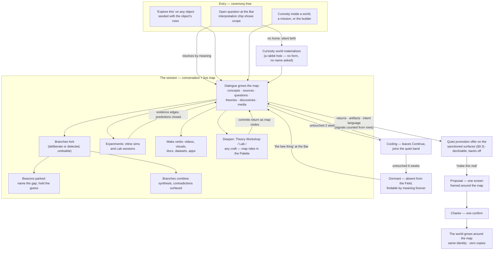
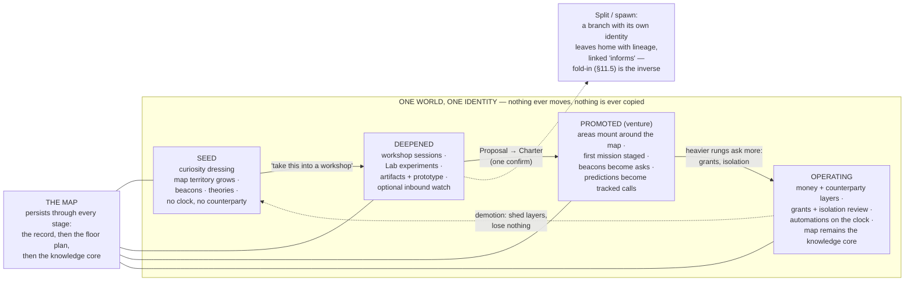

# 04 — Explore and the Rabbit Hole

*Phase 3, Experience Architecture. Elaborates constitution §7 (Explore), §11 (the ceremony
ladder), §12 (mastery), §14 (voice), and the anti-goal "Explore never a disposable chat" (§15).
Grounded in operating model Decisions 5 and 6 (Explore is a posture everywhere; a Rabbit Hole is
a world born lazily; evolution is identity-preserving) and the promotion-without-loss test
(§7.3). Spec words (the Line, the Spine, the Situation, genome, capability) appear in prose
only — the interface shows the display names from the constitution's terminology table, and only
those. A curiosity world presents as an "Exploration"; the posture presents as "Explore"; the
approval surface presents as "the Queue."*

---

## 1. What Explore is, and the promise this document keeps

Explore is not a place and not a product. It is the **Think posture with gravity turned off** —
the same worlds, the same memory, the same Bar, faced with curiosity instead of obligation. Free
curiosity silently materializes a curiosity world (a **rabbit hole**) so discoveries always have
somewhere to live; in-world curiosity lands its discoveries in that world's memory. There is no
Explore app, no Explore tab, no third level of place. The exploration surface is a surface *of
its world*, exactly as a Workshop session is (P7).

The binding anti-goal — **Explore must never feel like disposable chat** — is not a tone
guideline. It is guaranteed by seven mechanisms, each specified in this document and each
testable:

1. **No unscoped conversation exists.** Every exploration belongs to a world from its first
   second — a lazily-born curiosity world, or the world it was opened inside. There is nowhere
   for a discovery to evaporate *to* (§2).
2. **The map is the record, generated as you talk.** The dialogue grows a visible branching map
   in real time; the transcript is subordinate to it. Reopening an exploration lands on the map,
   never on a scrollback (§3).
3. **Parked thoughts are rows.** "Hold that thought" mints a beacon — a named gap with a held
   guess — listed, aging, revisitable. Nothing depends on the operator's memory (§4).
4. **There is no save button because there is nothing unsaved.** Everything — nodes, edges,
   beacons, media, experiments — persists to the world's memory as it is made (§9).
5. **Decay is a rendering decision, never a storage event.** Untouched explorations compress,
   then go dormant; dormant means invisible with perfect recall, findable by meaning forever
   (§9).
6. **Everything made carries provenance to the map.** An artifact, video, app, or workshop
   session born from an exploration links back to the exact nodes that seeded it (§7, §8).
7. **Promotion requires zero re-entry.** "Make this real" grows the world around the map —
   identity-preserving, zero copies, nothing re-asked that the map already answers (§10).

A session you abandon mid-sentence after four minutes costs nothing and loses nothing. A session
you return to nine times across a year is, retroactively and automatically, the first year of a
venture. The mechanisms above are what make both true at once.

## 2. Entry paths

### 2.1 From the Bar — open questions route to Explore

The router detects curiosity: interrogatives without an actionable object ("why do bee hives
work?"), wonder forms ("I keep thinking about…", "what if…"), and comparison musings ("is
stigmergy the same thing as markets?"). The interpretation chip shows the reading before Enter,
as always:

> `→ new curiosity · "why do bee hives work?"` *(silent world birth — the ceremony ladder's
> free rung; no name asked, no form shown)*
> `→ Bee-hive Exploration · continue: swarm consensus` *(resolve-before-create: the question
> touched an existing exploration by meaning)*
> `→ Jane's Client · explore: what don't we know about Jane's market` *(scoped curiosity —
> discoveries will land in Jane's world)*

Rules, binding:

- **Resolve-or-create favors resolve.** A question semantically close to an existing exploration
  (including a dormant one) reads as *continue* first; Tab cycles to *new curiosity*. Waking a
  dormant exploration is one Enter — the map returns exactly as left.
- **Birth is silent and free.** A new-curiosity reading commits with zero dialogs. The world
  exists the moment the first exchange does; its working name is generated from the question
  ("Bee hives") and is renameable anytime, never asked for. Ceremony arrives only with weight
  (§10).
- **Scope is visible before commit.** A question typed while inside Jane's world defaults to
  Jane's scope (the scope chip says so); the chip renders a crossing treatment if the reading
  targets elsewhere. Free curiosity typed inside a world is one Tab away
  (`→ new curiosity · …`) — the operator chooses where the territory grows, and the choice is
  always shown, never inferred silently.

### 2.2 "Explore this" on every object

Every object in the product — artifact frames, mission steps and outcomes, sources, Playbook
lessons, map nodes, Queue items, records rows, Brief sentences — carries **Explore this** among
its universal actions. Behavior:

- The exploration opens **scoped to the object's world**, with the object as its first map
  node: a source node holding a *reference* to the row (never a copy), provenance intact.
- The Brief's Learn-beat doors are this action wearing prose: "the campaign underperformed" +
  "why?" spoken at the Bar opens an exploration seeded with exactly the outcome rows that
  sentence cited (P2, S7). The seeded rows arrive as source nodes already on the map.
- Object-seeded explorations are sessions of the world's Explore surface, listed with the
  world's other explorations — not orphaned one-offs.

### 2.3 Explore inside worlds, missions, and the builder

- **Inside a world:** turning the posture dial to Think (or any curiosity utterance while
  scoped) re-stages the Desk toward questions and knowledge: open explorations with their
  frontier questions, held beacons, the Playbook's most-contested lessons, and "what don't we
  know" staged as an offer with reasons. Opening an exploration session from here is one tap.
- **Inside a mission:** every step and outcome offers Explore this. The exploration links to
  the mission with a typed edge; if it yields a finding that should change the plan, the finding
  arrives at the mission as a **proposal** ("the audit branch found the booking page is the real
  leak — re-aim step 4?") — explorations inform work through the same propose-approve grammar
  as everything else, never by silent mutation.
- **Inside the builder:** a question asked mid-build ("what do the best booking flows do about
  no-shows?") routes to an exploration scoped to the world. Its discoveries land in the world's
  memory and surface back in the builder session's Palette as knowledge cards with provenance.
  The predecessor system's sharpest knowledge-loss defect — build research evaporating into a
  chat pane — is structurally impossible here: the research *is* map territory in the same
  world as the build.

## 3. The dual surface: conversation + live map

### 3.1 Composition

The Explore surface is **conversation-forward with a live map margin**. Left two-thirds: the
thread — the Counsel in its socratic stance (the curiosity dressing's stance: it asks back,
steelmans, names assumptions, offers the next question, and never pads). Right third: **the
map**, growing as the dialogue does. One gesture (or `Tab` on the surface, or "show me the
map") swaps to **map-forward**: the map takes the center, the thread becomes the margin. Both
arrangements are the same session; the Bar stays at bottom-center as everywhere.

On a phone, the two are tabs; a voice walk is conversation-only with the map building silently
(§13). Returning to a desktop renders whatever grew.

### 3.2 Map object types

| Node type | What it is | Born from |
|---|---|---|
| **Concept** | an idea or entity the exploration keeps touching ("waggle dance", "stigmergy") | extracted from dialogue; deduplicated by meaning |
| **Source** | anything read or referenced: page, paper, video, note, or an in-system row (an outcome, a thread, an artifact) | research moves; "explore this" seeds; ingested material |
| **Question** | an open question at the frontier | asked by either party and not yet answered |
| **Beacon** | a *parked* question: the gap named, the current guess held | "hold that thought" (§4.2) |
| **Hypothesis** (displays as **Theory**) | a claim with evidence edges for and against, optionally staking a prediction | proposed by either party; §5 |
| **Discovery** | an answered question or a finding that mattered — what the curiosity world's Face counts as health | marked by the operator, or proposed by the Counsel and confirmed |
| **Experiment** | a simulation or test record: setup, parameters, runs, result | inline sims and Lab sessions (§6) |
| **Generated media** | images, diagrams, videos, datasets, apps made mid-exploration | the make verbs (§7); always also a framed artifact |

Edges: *relates to*, *supports*, *contradicts*, *answers*, *derived from*, and *informs*
(cross-world, provenance-stamped). **Every node and edge cites what made it** — the
conversation turns, the source rows — and opens them on tap. A map element that cannot answer
"where did this come from?" cannot exist; the honesty architecture applies to thought, not just
to numbers.

### 3.3 How the map grows

- **Extraction is continuous and quiet.** After each exchange the Counsel updates the map:
  new concepts, sources, edges. The conversation is never interrupted; a small **map delta
  chip** under the latest exchange says what changed ("+2 concepts · 1 source · new edge:
  stigmergy → markets"). Tapping the chip highlights the delta on the map. The delta chip is
  the interpretation chip's sibling: the mapping is never a mystery, and never a dialog.
- **The operator can map by hand.** "Map that" pins a sentence as a node; drag merges duplicate
  concepts; rename, re-type, and re-edge are direct manipulations on map-forward. Every manual
  edit is recorded as a decision — curating the map is itself judgment, and it feeds Memory.
- **The trail is visible.** The path the session actually walked renders as a subtle spine
  through the nodes, so the map shows both the *territory* (what is known) and the *journey*
  (how you got here). Branches are structural (§4); the frontier — open questions and thin
  edges — gathers visually at the perimeter, which is where the Counsel points next.

### 3.4 The map is the record

Reopening any exploration lands **map-forward on the map's story**, never on a transcript:
where you left, what you hold, what the strongest theory is (§12). The transcript is reachable
*from* nodes — tap a node, read the exchanges that built it — and by search, but it is the
quarry, not the monument. This inverts disposable chat by construction: the conversation is how
territory gets made; the territory is what you keep.

## 4. Branching mechanics

### 4.1 Forking

Any point forks — a node, an exchange, a question. Two ways in:

- **Deliberate:** "branch here — what would an economist say?" or the fork action on any node.
- **Detected:** when the dialogue pivots and sustains the pivot for a couple of exchanges, the
  Counsel forks silently and the delta chip names it ("forked: hive economics"). Undo is one
  tap on the chip. A pivot is never a modal and never a question — the chip is how you object,
  exactly like routing.

A branch is a path on the map with its own conversational context: talking inside a branch
carries that branch's frame. Branches share the map — a concept discovered on one branch is
visible from all (territory is one; journeys are many).

### 4.2 Beacons — "hold that thought"

The rabbit-hole doctrine verbatim: **name the gap, hold the guess.** Saying "hold that thought"
(or tapping the beacon action on any node or exchange) mints a beacon:

- **Anatomy:** the gap, stated as a question ("does swarm consensus need redundancy to be
  stable?"); the held guess, in the operator's words when given, drafted by the Counsel when
  not ("your guess: yes — you suspected redundancy is the price of leaderlessness"); provenance
  (the exchange it parked from); age.
- **The beacon rail** lists every open beacon on the surface's edge, oldest glowing faintest —
  honest age, no fake urgency. Beacons also render on the map at their park point.
- **Resurfacing:** beacons are actively resurfaced in-conversation at three moments and only
  three — on return to the exploration (the re-entry story leads with them, §12); when new
  evidence touches one by meaning (an arriving source, an in-world row, or a gate-promoted
  pattern from another world lands adjacent — the beacon warms and says why); and at branch
  joins (§4.4), where held guesses get checked against what the branches found. Distinct from
  these are the passive standing listings — the beacon rail here, the curiosity world's Face,
  the Desk's Think-posture staging, and the Explorations lens — which show open beacons
  wherever the operator looks but never interject.
- **Resolving:** answering a beacon converts it to a discovery, records whether the held guess
  was right, and — this is mastery, not bookkeeping — feeds the operator's calibration record.
  Beacons teach the discipline every strong researcher has: naming what you don't know and
  committing to a guess before you look.

### 4.3 Revisiting

Tap any node and the conversation re-anchors there — the thread continues *from that context*,
the map lights the active locus. From anywhere in the product, the Bar reaches branches by
meaning: "pick up the pricing branch of the bee thing" resumes it, chip-confirmed. Weeks-old
branches resume exactly like minutes-old ones; there is no staleness penalty, only the re-entry
story (§12).

### 4.4 Combining branches

Select two branches (or say "bring the economics and biology branches together"). The
**combine** move drafts a synthesis node: where the branches agree, where they contradict, and
what each explains that the other cannot. Agreements strengthen or mint theories; contradictions
become questions or beacons — a contradiction is never silently smoothed. The join is recorded
on the map as structure: the two journeys visibly meet, and the synthesis carries edges to
everything it drew on. Held guesses from either branch are checked at the join and scored
honestly.

## 5. Competing theories and comparison

Hypotheses (displayed **Theories**) are first-class map objects, and they are where the
exploration's rigor lives:

- **A theory is a claim with evidence edges.** Each edge is directional (*supports* /
  *contradicts*), cites its source or experiment, and carries a one-line *why*. The theory card
  shows the honest tally — "4 supporting · 1 contradicting · 2 untested assumptions" — and
  every count opens its rows. **No invented confidence numbers, ever**: the only score is the
  tally, and the reasoning is prose you can read.
- **Assumptions are explicit.** The Counsel decomposes a theory into its load-bearing
  assumptions; untested assumptions render as open questions attached to the theory. "What
  would have to be true?" is a standing move, not a special request.
- **Comparison is the universal compare, applied to thought.** Select two or more theories →
  side-by-side: claims aligned, evidence rows matched by the question they answer, contested
  evidence highlighted, and — the move that turns comparison into progress — **the
  discriminating test**: the Counsel proposes what observation or experiment would tell the
  theories apart, staged one tap from the Lab (§6).
- **Critique is a verb here too.** "Critique this theory" scores it against the research
  craft's criteria pack — evidence quality, assumption honesty, steelman-before-dismissal,
  falsifiability — with the why shown and the criteria editable (constitution §12.2). The
  operator is not just accumulating answers; they are learning to think in public, against a
  visible rubric.
- **Predictions stake calibration.** A theory may stake a prediction ("if stigmergy explains
  it, leaderless sims still converge"). Predictions are captured, closed by outcomes or
  experiments, and the operator's running hit-rate is shown honestly wherever calibration
  matters (constitution §12.4). Wrong confidently is the most instructive row in the system.

## 6. Experiments and simulations — the Lab connection

- **Quick sims are inline.** "Simulate 200 bees with rule X" runs a small simulation in the
  conversation; the result renders in-thread *and* lands as an experiment node — setup,
  parameters, runs, result — with evidence edges to the theories it touches. A quick sim is
  never a throwaway: rerunning it later starts from its recorded parameters.
- **Serious experimentation deepens into the Sim Workshop** (displays as **the Lab**; the
  sim/lab bench archetype): "take this into the lab" opens a session with the full workshop
  grammar — the Bench is the simulation canvas; Moves are vary, sweep, compare, score; the
  Ledger records every run and why; the commit rail commits results as artifacts. The
  exploration's relevant map context rides along in the Palette (§8).
- **The simulation honesty rule (binding):** a sim result is evidence about the *model*, not
  the world. Sim-derived evidence edges are labeled *supports (in simulation)* and render
  distinctly on the map; a theory supported only in simulation says so on its card. The Counsel
  states model assumptions when citing sim evidence. No fabricated certainty — the No-Theater
  doctrine extended to epistemology.
- **Experiments close beacons and predictions.** A lab session that resolves a discriminating
  test writes the outcome back: the losing theory's card shows the contradicting run; the
  staked predictions close; the calibration record updates. The Wonder→Develop→Learn arc runs
  entirely inside Explore when the undertaking is understanding itself.

## 7. Generating artifacts from exploration

The make verbs are available on any node, branch, or the whole map — exploration is a full
citizen with every capability of the platform reachable from the Think posture:

- **"Make an explainer video of this branch"** → a video artifact, storyboarded from the
  branch's nodes, provenance to each.
- **"Render the map as a visual"** → a poster/diagram artifact of the territory, styled, ready
  to share (sharing routes outbound through the Queue, as everything does).
- **"Write this up"** → a document artifact — field guide, memo, thesis — drafted from the map
  with citations to sources and honest markers on thin spots ("the economics branch is one
  source deep here").
- **"Build a hive-scheduling prototype"** → a deep artifact: the builder opens as its Workshop,
  its brief *derived from the branch* — problem, findings, constraints, open questions —
  compiled automatically, never re-typed. The built app is an artifact of the same world, and
  its build sessions see the map in their Palette.
- **Datasets, tables, comparisons** committed from theory-comparison views land as artifacts
  the same way.

Everything made gets the universal artifact frame — identity, versions, provenance, publish
state — appears in the world's artifacts, *and* lands on the map as a generated-media node
edged to what seeded it. The map thereby stays the one true index of the exploration: what was
thought, what was found, and what was made, in one territory.

**Metered spend in a costs-nothing world (binding).** "Costs nothing to start" is a ceremony
rule, not a claim that sims and renders are free. Any metered move in a curiosity world — an
inline sim (§6), a video, a build — states its cost on the move itself before running, exactly
as hand-off briefs already do. Spend accumulates visibly: as a line in the session Ledger's
story ("$14 on sims this session") and as a running total on the world's momentum row. The
first metered move in a curiosity world surfaces a one-time stated cap ("explorations pause
metered work at a stated ceiling unless you raise it"). This is a cap on the work, not a warn
semantic on the Face: the curiosity Face still cannot warn — a paused sim renders as an offer
to continue, never as a health problem.

## 8. Deepening into workshops

When a direction needs development rather than another exchange, **"take this into a workshop"**
is the crossing (Wonder→Develop, one gesture):

- **The Theory Workshop** (map+table bench): theories as rows — claim, assumptions, evidence
  for/against, predictions, status — with the map as the graph view of the same material.
  This is where a sprawling exploration gets disciplined: assumption audits, evidence triage,
  prediction staking, tournament comparison of theories. Sessions are named by intent
  ("stigmergy vs central control"), resumable, Ledgered.
- **The Lab** (sim bench, §6) for experimentation.
- **Any craft workshop.** An exploration that has found a product wants the Design Studio; one
  that has found a market wants the Outreach Studio. "Take the naming question into the Brand
  Studio" works today, pre-promotion — workshops are not gated behind operating status.

**Map context rides along in the Palette — binding.** A workshop session opened from an
exploration arrives with the branch's material as Palette cards: concepts, sources with
provenance, open beacons as question cards, relevant Playbook lessons, and the theories at
stake. The anti-generic invariant applies with full force: if the map holds relevant context
and the session opens generic, that is a defect. The Counsel's first duty is to know the
territory.

**And the flow returns.** Workshop commits appear on the map as nodes; Ledger decisions become
memory events the exploration can cite; the session and the exploration cross-link in both
Continue rails. Deepening is a hallway between rooms of one house, not a door to another
building.

## 9. Auto-persistence, decay, and promotion signals

### 9.1 Where things land

| Entry | Territory lands in |
|---|---|
| Free curiosity at the Bar | the lazily-born curiosity world (silent, free) |
| Curiosity while scoped to a world | that world's memory, as an Explore session of it |
| "Explore this" on an object | the object's world, seeded with the object as a source node |
| Mid-mission / mid-build questions | the mission's/builder's world, cross-linked to the work |

No save button exists anywhere in Explore. Closing mid-thought costs nothing (P12): the map,
beacons, theories, media, and thread are already rows.

### 9.2 Decay — rendering, never storage

Passing curiosity and persistent work are distinguished by **behavior, not interrogation** —
the system never asks "do you want to keep this?":

- **Active:** recently touched; present in Continue; the world renders on the Field per the
  attention ranking (curiosity worlds mostly live in the quiet band — they rarely *need* you).
- **Cooling** (default: two weeks untouched): compressed out of Continue; the world joins the
  quiet band's tail. Nothing else changes.
- **Dormant** (default: six weeks untouched): absent from the Field entirely; findable by
  meaning forever ("the bee thing" at the Bar, a year later, lands on the exact node you left).
  Dormancy timing is part of the curiosity dressing and tunable per world; the defaults are the
  contract. **These tier names (active · cooling · dormant) and these defaults (two weeks;
  six weeks) are canonical here**: sibling documents cite this section rather than restating
  the numbers, and any acceptance test that exercises decay must idle safely past the six-week
  dormancy default.
- **Never deleted.** There is no delete; there is dormancy and, on explicit request, archive —
  which changes rendering and nothing else (the ghosts doctrine).

### 9.3 Promotion signals — noticing without asking

The system watches for **persistent work wearing curiosity's clothes**. Signals, each counted
from real rows: return visits (three or more distinct sessions), artifact creation, workshop
deepening, beacon resolution streaks, intent language in the thread ("this could be a
business", "people would pay for this"), and requests for operating weight — outbound work,
money, or any recurring work beyond the inbound-only watch (below) — which *require*
promotion, since the curiosity dressing runs no recurring work beyond a watch and touches no
counterparty.

When signals accumulate, the offer is quiet and evidence-linked, and renders only on the
sanctioned surfaces: the Brief's "worth a look" stanza ("the bee-hive exploration has returned
4 times and built a prototype — make it real?"), a soft chip on the exploration's own surface,
a class-6 staged move on the exploration's Desk (03 §3.2), and the exploration's row in the
Explorations lens (08 §3.3). All four render the same offer, linked to the same rows. The
invariants are what bind: never a modal, never mid-thought, never twice after a decline — a
declined offer backs off on every surface at once until the signal threshold doubles, the same
grammar as earned-autonomy offers. Explorations are allowed to
stay explorations forever; the offer exists so that becoming real is one utterance, not so
that wondering acquires a sales funnel.

One deliberate exception to "curiosity runs nothing": an exploration may mount a **watch** — an
inbound-only automation ("keep an eye on new research about this") — through the standard
one-confirm automation path, heartbeat trace and all. Its arrivals accumulate as unread source
nodes at the map's frontier and reach the Brief only when substantial. A watch is the first
weight a rabbit hole can carry, and it is visible like all recurring work; it does not require
promotion because it sends nothing and spends nothing beyond its stated cost.

## 10. "Make this real" — the promotion experience, beat by beat

Promotion is an **identity-preserving re-dressing**, experienced as the world growing around
the map. Never an export, never a copy, never a new empty thing. The beats:

**Beat 1 — the utterance.** "Make this real" / "let's build this" / "turn this into a
business" — or accepting the quiet offer. The interpretation chip renders it as growth, not
creation: `→ Bee-hive Exploration · grow into: venture`.

**Beat 2 — the Proposal, one screen, framed around the map.** The map renders as the
centerpiece — *this is what you've built; here is what will grow around it*:

- **Name and presentation** — suggested from the map's center of gravity ("Hive Scheduling"),
  editable inline.
- **What mounts** — the areas the heavier setup brings, each annotated with the branch it grows
  from: "Prototype — from the 'hive-inspired scheduling' branch"; "Positioning — from the
  economics branch." The map's territory visibly *becomes* the floor plan.
- **What it will ask** — intake questions derived from the beacons and open questions that
  block operating ("who is this for?" appears only if the map doesn't already answer it —
  nothing the exploration answered is ever re-asked; that is the promotion-without-loss test
  applied to questions).
- **What it wants to run** — automations, each with cadence and cost (none by default for a
  venture; the watch, if mounted, carries over unchanged).
- **What it inherits** — patterns from sibling worlds with provenance ("positioning checklist,
  earned across 3 launches"), and **connections it needs as explicit scoped grants** — never
  silently inherited.
- **The first mission**, staged — compiled from the strongest branch, provenance chips on
  every input.

Everything on the Proposal is editable inline: remove an area, change a cadence, decline an
inheritance. Ceremony is proportional to weight: venture → this one screen and one confirm;
adding money flows or a counterparty later re-opens the Proposal at that heavier rung with
connection grants and isolation review.

**Beat 3 — Charter.** One confirmation. No wizard follows; the intake asks arrive later as the
Desk's first staged moves.

**Beat 4 — the world grows around the map.** No navigation, no new tab, no progress spinner
pretending to move files. The same place re-dresses in one continuous motion: the Face gains
its venture presentation and health semantics (open questions + discoveries give way to
momentum and commitments); areas fade in *around* the map; the map settles into its permanent
place as the world's **knowledge core** — the graph view every future workshop session draws
on. The context header, the scope chip, the world's name in every old thread: unchanged. It
was always one world.

**Beat 5 — the territory takes up its new jobs.** Beacons that block operating become the
Desk's first asks. Theories with staked predictions become tracked calls in the Playbook's
calibration view. Sources and discoveries become the Palette's first knowledge cards in every
new workshop session. The prototype built during exploration is already the build area's
current artifact, version history intact. The first mission sits on the Desk, its brief citing
the map. **Zero copies, zero exports, zero re-entry** — every node still opens its original
excerpts, because nothing moved.

**Beat 6 — the morning after.** The Brief: "Bee-hive grew into a venture yesterday. Its first
mission is staged; it will ask you two questions when you're ready." The Field re-ranks the
world out of the quiet band. The year of wondering was not raw material for the venture — it
turns out to have been the venture's first year.

**Demotion exists and is symmetric.** A venture that returns to pure curiosity can shed its
operating layers with one confirm: areas dismount from rendering, recurring work stops, and
nothing — no artifact, no mission record, no map node — is lost. Identity is permanent in both
directions; dressing is what changes.

## 11. Explore-in-world scoping

- **The session map is the world's knowledge graph filtered to the session.** One toggle widens
  to the whole world's graph with the session's territory lit — exploration inside an operating
  world literally shows you thinking inside what the world already knows.
- **Discoveries land in that world's memory**, tagged to the session; lessons worth steering
  behavior propose themselves to the world's Playbook through the human gate, like every
  lesson.
- **Isolation holds.** Exploring inside Jane's world retrieves Jane's rows, the operator's own
  material, and cross-world *patterns* with provenance chips — never another counterparty's
  data. "What do you know here?" yields the Counsel's honest context manifest, scoped. The
  scope chip and the counterparty stamp are on screen the whole time.
- **Outgrowing the host world.** When an in-world exploration starts passing the world tests —
  it has its own pronoun, accumulates its own memory, could live or die independently — the
  system proposes a **split**: the branch leaves home as a spawned curiosity world with
  lineage, linked *informs* back to the origin. The subgraph re-scopes to the new world;
  evidence that belongs to the origin's counterparty stays home, represented in the new world
  by provenance stubs that open only via a grant. Patterns travel; data doesn't — even when a
  thought moves out.

## 11.5 Attaching an exploration to an existing world — "fold in"

The split has an inverse. A free rabbit hole sometimes turns out to belong to a world that
already operates — the coffee-cart exploration should be powering the Cart Kit that is already
selling. The gesture is **fold in**, and it is the split of §11 walked backwards:

- **The utterance and the chip.** "Fold this into the Cart Kit" / "this belongs to the agency"
  at the Bar, from either world. Territory is changing worlds, so the interpretation chip
  renders the crossing treatment: `→ Cart Kit · fold in: Bee-hive exploration`. As with every
  crossing, the reading is correctable before commit; nothing moves silently. (The
  system-proposed sibling — merge on duplicate signals — remains 09 §12's machinery; fold-in
  is the operator's own gesture and needs no duplicate signal to exist.)
- **The proposal, scoped to what moves.** One screen previews exactly which subgraph
  re-scopes: the map territory, beacons, theories, experiments, media, and thread that will
  join the target world's knowledge graph — each listed, nothing implied. Editable inline:
  hold a branch back and it stays behind as its own exploration, *informs*-linked to what
  left.
- **Isolation runs in reverse.** The split rules apply mirrored: when the target holds a
  counterparty, the fold is previewed under that counterparty's isolation rules, and evidence
  that may not enter the target's scope stays where it is, represented in the target by
  provenance stubs that open only via a grant. Patterns travel; data doesn't — in this
  direction too.
- **Ceremony is priced by the target's rung.** Folding into another curiosity world is one
  confirm. Folding into a venture is the proposal above plus one confirm. Folding into a world
  carrying money flows or a counterparty re-opens the target's Proposal at that heavier rung —
  isolation review included — because the territory is about to live inside those stakes.
- **Continuity is total.** The exploration's sessions keep their Continue entries, now
  resuming inside the target world; the map settles into the target's knowledge graph with the
  folded territory lit (§11's toggle, seen from the other side); node identities, provenance,
  beacon ages, and the terminology skin the operator sees are unchanged except for the world
  stamp. Zero copies, zero exports, zero re-entry — the promotion-without-loss test applies to
  attachment verbatim (§16.9).
- **The lighter alternative.** When the exploration should inform the world without joining
  it, decline the fold and mint an **informs** edge instead (the same cross-world,
  provenance-stamped edge type from §3.2): the exploration stays its own world, and its map
  rides into the target's workshop sessions as Palette cards with provenance. Fold-in is for
  territory that has found its home; informs is for territory that has found an audience.

## 12. Returning after weeks

Resume paths are the standard ones — Continue, the switcher's recents, or the Bar by meaning —
and landing is always **map-forward on the re-entry story**, the exploration's equivalent of
the Ledger's story:

> *"You were three branches deep. You hold two beacons — the older one for six weeks: 'does
> swarm consensus need redundancy?' — your guess was yes. Stigmergy is your strongest theory:
> four sources supporting, one contradiction you hadn't resolved. You doubted the economics
> branch and said so."*

Every clause is a door to its rows. Below the story, exactly two more things when they are
real:

- **What touched this while you were away** — cross-world adjacency, restricted to promoted
  patterns: only lessons that have already passed the human gate and the scrub preview may
  surface here, as pattern cards with full provenance ("pattern: value-anchored pricing — from
  your agency pricing work, promoted in May, gate-approved — sits adjacent to your 'swarm
  pricing' theory"). An un-promoted lesson in another world's Playbook never reaches this
  surface, however semantically close: cross-world intelligence is exactly the set of promoted
  patterns and nothing else. Rendered only when a real row justifies it; silence otherwise.
- **What the watch brought in** (if one is mounted): unread source nodes at the frontier,
  counted honestly.

Nothing else ran — curiosity runs no clock beyond an explicitly mounted watch, so there is no
fictional "progress" to perform. One tap on a beacon resumes the dialogue at its park point,
guess restated: "Still your guess?" The cost of returning after six weeks is one tap and one
breath — never re-reading a transcript, never reconstructing where you were.

## 13. Voice and the passive walk

An **explore-walk** is an exploration session conducted by voice — the thread is the session;
everything else falls out of auto-persistence, exactly as the constitution requires (nothing
new is architected for voice, and nothing depends on it):

- The map builds silently during the walk; extraction runs as always.
- **"Hold that thought" works verbatim** — the beacon is minted from the spoken gap and guess.
- Scope is confirmed aloud only when crossing ("in Jane's world?"); free curiosity walks need
  no confirmation at all — the ceremony ladder's free rung is free in every register.
- On return to a screen, the payoff renders: the walk in Continue, and map-forward opening
  with the walk's delta — "while you walked: 9 concepts, 2 theories, 1 beacon." The walk was
  never a memo to self; it was territory-making at walking pace.

Mobile explore is conversation-forward with the map as a tab; theory comparison and beacon
review work well on a phone; heavy map gardening is desktop work, per the mobile posture rules.

## 14. Diagram — the explore / rabbit-hole lifecycle

## 15. Diagram — exploration → project evolution

## 16. Acceptance checks for this document

1. **The abandonment test.** Close any exploration mid-sentence; return in a year via the Bar
   by meaning. You land on the map's story with beacons intact and guesses held. Nothing was
   lost; nothing asked to be saved.
2. **The disposable-chat test.** No exploration surface anywhere shows a transcript as its
   primary record; every reopened session lands map-forward; every map element cites its
   origin.
3. **The zero-ceremony test.** From an empty Bar to an exploring session with a live map:
   one utterance, zero dialogs, zero names asked.
4. **The promotion-without-loss test.** Promote any exploration; count copies made, exports
   run, and questions re-asked that the map already answers. All three counts are zero.
5. **The evidence test.** Every theory tally, sim-derived edge, promotion offer, and re-entry
   claim survives "which rows are those?" Sim evidence is labeled as simulation everywhere it
   appears.
6. **The scope test.** An exploration inside a counterparty world never renders another
   counterparty's data; every cross-world pattern carries provenance; splits move thought, not
   counterparty rows.
7. **The mastery test.** After ten sessions, the operator has a visible calibration record,
   has edited at least one research criteria pack, and can answer "what's my strongest theory
   and why" from the map alone — the system made them a better thinker, not just a better-fed
   one.
8. **The walk test.** A voice-only session produces the same territory as a typed one; the map
   renders on return; no capability of Explore is voice-dependent.
9. **The fold-in test.** Attach a free exploration to an operating world (§11.5); count copies
   made, exports run, and questions re-asked that the map already answers — all three counts
   are zero — and verify that rows restricted by the target's counterparty scope surface in the
   target only as provenance stubs behind a grant.

---

*Cross-references: 02 (the Bar, chip, Queue, Continue this document's entries ride on), 03 (the
world grammar the curiosity dressing dresses), 05 (the make verbs and drive modes; the fold-in
verb of §11.5 registers in its catalog), 06 (watches as recurring work; missions staged at
promotion), 07 (artifact frames and the builder as deep artifact), 09 (the Proposal/Charter
ceremony ladder promotion and fold-in reuse; §12's system-proposed merge is the sibling of
§11.5's operator gesture), 10 (S6 and S7 as full journeys), 16 (the Theory Workshop and the Lab
in the workshop grammar), 17 (beacons, predictions, and calibration in the mastery loops; §7's
gate and scrub bound what §12's re-entry story may surface cross-world).*
