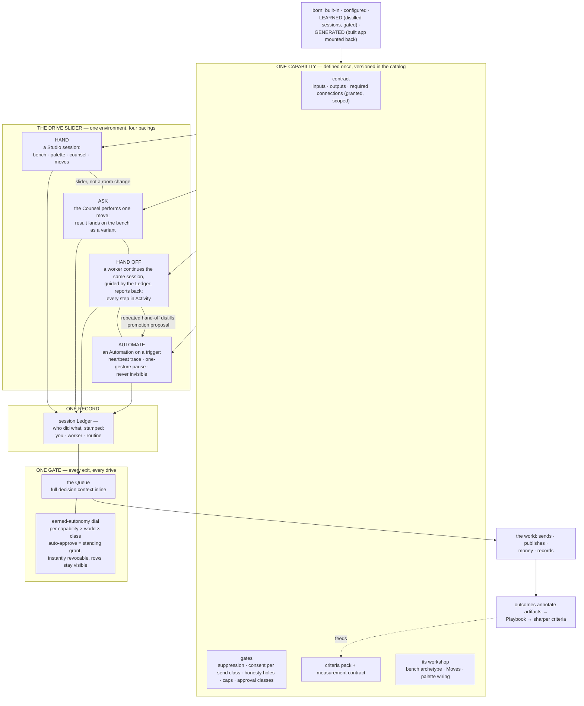

# 05 — Capabilities: Studios, Workers, and Automation

*Phase 3, document 05. The operating model's Decision 3 defines a Capability as one verb with
three drive modes; the constitution binds drive-mode continuity (§6), the one safety story
(§8, §15), and earned autonomy in the Queue (§8). This document is the full experience of that
decision: how verbs are met, driven, delegated, automated, trusted, and born — without a single
capability ever becoming a place, a catalog entry the user browses, or a second interface.
Diagram assignment: capability drive modes. Grounded in the operating model (Decisions 2, 3;
§2 Capability, Standing Order) and the principles (P1, P7, P8, P10, P14).*

**Reading rule.** "Capability," "drive mode," "Standing Order," and "the Catalog" are spec
words; none appears in the interface. The operator sees *verbs* ("draft", "compare", "place on
product", "chase the invoice"), *studios* (a verb being driven by hand), *workers* (a verb
handed off), and *Automations* (a verb on a trigger — "Routine" where the genome skins it).
Where UI text is quoted below, it is quoted in display language only.

---

## 1. One verb, three appearances

A capability is defined once — its contract, its gates, its criteria, its workshop — and the
operator meets it wearing whichever drive it is currently under:

| Drive | Paced by | Appears as | You meet it |
|---|---|---|---|
| **Human-driven** | your attention | a Studio session — the workshop's bench, palette, counsel, moves | inside a workshop-area, mid-craft |
| **AI-driven** | a hand-off or a mission's plan | a worker run with a report and a flight recorder ("Activity") | on the Desk when it returns; in the Queue where its exits wait |
| **Trigger-driven** | the clock or an event | an Automation with a heartbeat trace | wherever its output appears; in the Brief's digest; in the Queue when it needs you |

Three appearances, one definition — which yields the three properties everything in this
document elaborates:

1. **One environment.** Changing drive never changes rooms. The design studio you drove
   yesterday is the same session the worker continues tonight and the same surface you inspect
   when a routine runs it weekly. Manual → delegated → automated is a slider, not a move.
2. **One safety story.** Gates attach to the verb, not to the mode. No drive can reach an exit
   another drive gates (the operating model's gate test, §7.7). Shown concretely for sending
   email in §9.
3. **One record.** The session Ledger stamps who did what — you, the worker, the routine — in
   one continuous history, and every outbound exit lands in the same immutable ledger behind
   the Queue.

And one refusal, binding: **a capability is never a destination.** There is no capabilities
page, no tools menu, no directory of powers. Verbs appear where the work is (P7); how they are
found is §2.

---

## 2. Discovery — three doors, no catalog

The anti-goal is explicit (constitution §15): no capability visibility "just in case." A
directory of two hundred verbs teaches nothing, ranks nothing, and rots. Verbs are discovered
the way a new hire discovers an expert team's skills: by asking, by watching what the room
offers, and by being handed the right tool mid-task.

### 2.1 The Bar — say the verb you don't know you have

Every cataloged verb is reachable by meaning at the Bar; being reachable there is what being
cataloged *means*. "Make the postcard feel more like the last one that worked", "find the
emails for these twelve businesses", "chase Jane's invoice" — the interpretation chip shows the
resolved verb before commit (`→ Mom's Real Estate · stage postcard variants`), so every routed
utterance is also a small lesson in what the system can do. The `/` command strip is the same
catalog worn deterministically: typing `/` lists the verbs *invocable in the current scope*,
recents first — a palette summoned in place, never a page you go to. Parity is guaranteed both
ways (doc 02 §3.4): every command has a natural-language route, every routed verb a command
form, and nothing is invocable that the strip cannot show.

### 2.2 Moves — the craft's verbs, in the room where they matter

Inside a workshop, the relevant slice of the catalog *is* the Moves rail: vary, combine,
constrain, compare, score, simulate, place-on-product, test-responsive — the craft's verbs as
structured controls, scoped to the session (constitution §6). Moves are discovery by
apprenticeship: the apparel bench showing a "tournament" control teaches that tournaments
exist, at the exact moment ten variants make one useful. The rail shows the craft's working
set, not everything; the Counsel volunteers a move when the situation calls for one ("six
variants and no ranking yet — run them as a tournament?"), with the reason attached, because a
tool offered with its why is a mastery event and a tool listed without one is furniture (P1).

### 2.3 The Desk — staged suggestions that carry their verb

The Desk's staged moves are capability discovery under the anticipation doctrine: "Your
brother granted three new pieces — place-on-product is staged" introduces the
place-on-product verb by *offering the work pre-dressed*, evidence attached. Genome-staged
moves (class 5, doc 03 §3.2) are how a world teaches its operator what a competent operator of
this kind of undertaking would do — each one names its verb, its reason, and its Playbook
evidence. The operator who accepts three staged moves has learned three verbs without ever
seeing a list.

### 2.4 "What can you do here?" — the manifest on demand

Asked at the Bar or of any Counsel, the question gets an honest, *scoped* answer: the verbs
mounted in this world, grouped by area, each with one line of what it does and its current
drive ("chasing invoices — running as an Automation, last ran Tuesday"). This is the
capability twin of the context manifest (constitution §13): always answerable, generated from
the catalog's truth, never a marketing tour. It renders as an overlay, dismisses like one, and
is never a navigable place.

### 2.5 Why there is no catalog page

A catalog page would be a verb promoted to a place — the exact category error that produced
studios-as-destinations (operating model, Decision 2). Discovery is contextual because
*relevance* is contextual: the hundredth capability added to the platform appears only in the
worlds whose genomes mount it, only in the moves of the crafts it serves, and only in
utterances that mean it. The catalog exists — one registry, versioned, the Bar's whole reach —
but it is infrastructure the operator stands on, never a room they visit.

---

## 3. The drive slider — hand → ask → hand off → automate

### 3.1 Four positions, one definition

Any verb, in any workshop, sits at one of four pacings. The slider's display words:

| Position | What it means | The gesture |
|---|---|---|
| **Hand** | you perform the move yourself — arrange, edit, drag, choose | just work; the bench is yours |
| **Ask** | the Counsel performs the move once, while you watch it land on the bench | say it, or tap the move and choose "ask" — result appears as a variant, never a fait accompli |
| **Hand off** | a worker continues this work unattended — same session, guided by the Ledger — and reports back | "10 more like #3 overnight, per the ledger" — §6 |
| **Automate** | a trigger drives the verb on a recurring commitment — an Automation | the commit rail's "→ Automation", or a promotion proposal — §7 |

The slider is **per verb and per scope of work**, not a global mode: one session can hold
hand-arranged variants, one asked-for recolor, and a handed-off overnight batch — the Ledger
holds them all in order. The Bar's router reads drive from your words: "another round like
this" is *ask*; "…overnight" is *hand off*; "…every Monday" routes to an Automation proposal.
The interpretation chip shows the drive it read, correctable like every reading.

### 3.2 One environment, one Ledger

Binding (constitution §6): moving the slider never switches interfaces. The hand-off worker
continues the *same session* — same bench, same palette, same criteria — and the Ledger stamps
every entry with its driver:

> *you* — compared 6, committed #3, constraint added: "more heritage, same palette"
> *worker (overnight)* — produced 10 from #3 under your constraint · 4 scored above bar ·
> stopped at budget
> *routine "weekly content"* — drafted 3 posts from the March recipe · staged for approval

Returning after a hand-off lands on the Ledger's story — who did what since you left, first
(doc 02 §8). This is why delegation is resumable rather than fire-and-forget: the session
never stopped being yours; someone else was simply driving for a while. And it is a mastery
instrument: the Ledger is where the operator's taste becomes legible enough to follow — the
worker reads it the way a studio assistant reads the master's margin notes.

### 3.3 Drive is pacing; autonomy is approval — two dials, never confused

The slider decides **who does the work**. The earned-autonomy dial (§8) decides **who approves
the exits**. They are orthogonal by design: a handed-off worker at full trust still crosses
every gate — its sends simply auto-approve within their earned class. A hand-driven send by
the operator still stages at the Queue — the operator approves their own exit, with the full
decision context, because the gate is where honesty checks live (holes, consent, caps), not
merely where delegation is supervised. No position of either dial ever removes a gate; the
dials only change who answers it, and how fast.

### 3.4 Default drive is a property of the capability's kind

The genome sets where each mounted verb's slider *starts* (dressing, doc 03 §6.1.6); the
slider itself is always present (grammar). The defaults follow the kind of verb:

| Capability kind | Default drive | Because |
|---|---|---|
| creative craft (design, copy, brand, campaigns) | **Hand** | judgment is the product; the operator's taste must lead |
| assistive drafting (replies, follow-ups, proposals) | **Ask** | the system drafts, the operator's red pen decides |
| production runs (variants at volume, renders, batch research) | **Hand off** | volume work; attention belongs at the review, not the crank |
| background collection & upkeep (scraping, syncing, chasing, watching) | **Automate** | there is nothing to craft per-item; the craft is the recipe |

A default is a starting posture, never a wall: the operator can drive the scraper by hand for
one tricky case, and can automate a drafting verb once its class earns it.

---

## 4. Diagram — capability drive modes

---

## 5. Two capabilities, one engine — the design studio and the email scraper

The proof that one definition serves opposite temperaments. Take the two extremes: the visual
design capability in the clothing brand (S1) and the contact-scraping capability that feeds
the agency's prospect pipeline (S3) — a background verb that visits business sites and
extracts reachable contact details, unattended.

### 5.1 The design capability, driven by hand

Its workshop is the Collection studio: `gallery/variants` bench, moves for vary / constrain /
tournament / place-on-product, palette holding brand assets and the brother's granted artwork,
counsel in creative-director stance, criteria pack visible in every critique. Drive default:
**Hand** — with *ask* one utterance away and *hand off* riding the commit rail. This is the
capability at its most human: the interface is deep because the craft is deep, and no flattening
into a generic "generate" card is tolerated (anti-goal §15).

### 5.2 The scraper, driven by the clock — and its workshop is its inspection surface

The scraping capability's default drive is **Automate**: it exists to run while nobody
watches. But it still *has* a workshop, because every capability does — the workshop is simply
what its configuration and inspection surface is made of (constitution §6):

- **Bench** — `flow` + `table` composed: the recipe on the flow side (which sources, what
  counts as a reachable contact, what to skip, politeness rules), the catch on the table side
  (every extracted contact, provenance per row: which page, which run).
- **Palette** — the target lists, the suppression list, prior runs' results, the Playbook's
  evidence about which source kinds yield real addresses.
- **Counsel** — dispatcher stance: terse, exception-focused ("14 of 61 sites blocked
  automated reading — the recipe's fallback handled 9").
- **Moves** — test the recipe on one business (that's the scraper driven by *hand* — one case,
  watched); tighten a rule; re-run a failed batch; mark a source kind dead.
- **Ledger** — every run, every recipe change and why, who changed it.
- **Commit rail** — extracted contacts commit to the prospect table as records with
  provenance; recipe changes commit as versions.

No dashboard was invented, no settings page, no parallel admin surface: the *same six-part
anatomy* renders a background verb's controls. The difference between the design studio and
the scraper's workshop is bench archetype and stance — dressing — not structure.

The same composition reads the inbox. **Inbox extraction** — pulling structured entities
out of inbound mail (who wrote, what they ask for, amounts, contact details) — is not a
third anatomy; it is the scraper's bench re-dressed for messages: the recipe on the flow
side (which lanes it reads, which fields it pulls, what confidence commits), the catch on
the table side — one row per extracted record, provenance per row: *which email, which
run*. Rows commit as records to the view-area or dataset the recipe names (the support
inbox's extracted requests, the prospect table's inbound leads), alongside — not instead
of — the lane-routing classification of doc 16 §13.5. Correction is per-row and it teaches:
marking a row a misfire (wrong amount, wrong sender) is the red-pen gesture, feeding the
recipe the way a scored kill feeds a criteria pack (doc 17 §5.3), and a rising misfire rate
is a vital arguing the class back toward *propose* (§8.4).

### 5.3 Side by side

| | Design capability | Scraping capability |
|---|---|---|
| default drive | Hand | Automate |
| bench | gallery/variants | flow + table |
| session rhythm | diverge → critique → converge | configure → run → inspect exceptions |
| counsel stance | creative director | dispatcher |
| what "critique" means | scored against the brand's criteria | yield and error rates against the recipe's expectations |
| the Ledger records | variants, comparisons, taste decisions | runs, catches, recipe versions |
| its gate story | publish/place exits stage at the Queue | extraction honors suppression and politeness rules fail-closed; outbound use of a contact is a *different verb* with its own gate and send class (§9.1) |
| you visit it | daily, to work | rarely, to tune — its heartbeat comes to you |

One engine, two interfaces, zero interface *switches*: each capability has exactly one face,
worn in every drive mode it runs under.

---

## 6. Delegation — the hand-off in full

### 6.1 What you specify

A hand-off is one gesture from a session (the commit rail's "worker: …", or an utterance) and
it compiles into a **hand-off brief** the operator confirms at a glance — five fields, all
pre-filled from the session, all editable inline:

1. **The work** — verb, quantity, source material ("10 more like #3, from the committed
   direction").
2. **The constraints** — carried from the session's live constraints and the criteria pack in
   force ("more heritage, same palette; score ≥ 8 to keep").
3. **The budget** — spend cap, item cap, time window ("overnight; stop at $6 or 20 renders").
4. **The stopping rules** — what ends the run early ("stop if three consecutive score below
   6") and what the worker must *never* decide alone (anything crossing a gate — always true,
   restated here so the brief is honest about its own limits).
5. **The report time** — when and where the return lands (default: the Desk, by morning).

The brief is deliberately small because the *Ledger is the real brief*: the worker reads the
session's history — what was tried, what was killed and why, which constraint tightened after
which critique — and works in its grain. A hand-off into a rich Ledger produces work in the
operator's taste; a hand-off into an empty session produces the generic, which is why the
system stages hand-offs from sessions and never from thin air (§12.6's anti-generic invariant,
applied to delegation).

### 6.2 What the worker does

Continues the session under the brief: same bench, same palette, same criteria, scope-chipped
to the world (constitution §13 — scope chips everywhere the AI acts). It may use any move the
session could; it may read what the palette grants; it may not cross a gate — its sends,
publishes, and spends stage at the Queue like anyone's. When it hits a wall the brief doesn't
answer (a missing asset, an ambiguous constraint), it does not guess: it parks the item with a
named blocker, finishes what it can, and puts the question in its report.

### 6.3 What the worker reports

The return is a **report card on the Desk** (class 4, resuming the session), not a chat
message and not a pile:

> **Overnight: 10 hoodie variants from #3.** 4 above bar (8.1–8.9) — staged on the bench,
> tournament-ready. 5 killed (scores + why attached: "3 drifted athletic — your March
> constraint"). 1 parked: needs the flat-lay photo you haven't granted from the artist world.
> Spent $4.10 of $6. Nothing sent, nothing published.

Anatomy, binding: what it made (with scores against the visible criteria), what it killed and
why (the critique is the teaching artifact — P1), what it parked (named blockers), what it
spent, and what crossed or waits at a gate (here: nothing). Every claim links to its rows;
"4 above bar" opens the four, scored.

### 6.4 The flight recorder

Every AI-driven step — worker runs, mission steps, automation fires — carries **Activity**:
what it read, what it did, what it decided, in order, inspectable always (constitution §8).
Activity is one tap from the report card, from the Ledger entries the worker wrote, and from
any Queue item the run produced. It is the *inspect* layer of the three-layer use model
(constitution §14): most mornings the report card is enough; the morning something reads
wrong, the full trace is one tap deep, and it was recorded whether or not anyone ever looks.

### 6.5 Taking back the hand

A running hand-off shows on the Desk under running work with a live line ("worker: 6 of 10,
on budget"). One gesture pauses it; one gesture opens the session *while it runs* — the
operator can watch variants land. Taking the hand back mid-run is legal and ordinary: the
worker finishes its current item, writes its partial report, and the Ledger stamps the
change of driver. A failed hand-off (budget gone, blocker fatal) files a Queue item with its
Activity excerpt and a proposed remedy — failures are Queue citizens, never toasts (doc 02
§4.2).

---

## 7. From hand-off to Automation — promoting a pattern

### 7.1 The signals

Three roads into the same proposal:

1. **Repetition.** The second materially-identical hand-off registers the distillation
   signal (P14 at capability scale — the second time is when the pattern *exists*). The
   proposal it produces is delivered on the next return card that follows, so the operator
   meets it at the third occurrence — one quiet line, never an interruption: "Third Monday
   running you've handed this off — make it a routine?"
2. **The commit rail.** Any session can commit "→ Automation" directly ("weekly content from
   this recipe" — constitution §6).
3. **The Bar.** "…every Monday" / "keep doing this" routes straight to the proposal.

### 7.2 The promotion proposal

One card, everything editable inline, ceremony proportional to weight (P4 — this is recurring
cost, so it always asks once):

> **Routine: Monday content from the March recipe** · *world: Clothing brand*
> **Runs:** Mondays 7am · **Does:** drafts 3 posts from the committed recipe, scored against
> your criteria, keeps ≥ 8 · **Budget:** $2/run · **Asks you:** every post stages for
> approval before publishing (this is where it starts — trust is earned, §8) · **Stops
> loudly:** a missed run or a failed run surfaces to the Queue; pause is one gesture wherever
> its output appears.
> *Distilled from: 3 hand-offs, 11 sessions — open the Ledger it learned from.*

The provenance line is load-bearing: an Automation is never a black box that appeared — it is
the operator's own proven pattern, named, with its history attached.

### 7.3 Born cautious, never invisible

Every new Automation starts at the bottom of the autonomy ladder (**propose** — §8.1)
regardless of how trusted its parent hand-offs were, because cadence changes risk: a routine
runs when nobody is watching. From birth it has the full trust apparatus: the heartbeat trace
(last ran · next run · what it did · what it sent) one tap from every output, "went quiet"
filed automatically when it misses a window, digesting into the Brief, pausable from anywhere
its output appears (constitution §8 — recurring work must never become invisible). Its
workshop — the recipe it runs — remains its inspection surface forever, exactly as the
scraper's does (§5.2).

---

## 8. Earned autonomy — the dial per (capability × world × class)

### 8.1 The ladder

Autonomy is a dial on **(capability × world × action-class)** — never global, never
per-world-wholesale, never a personality setting:

| Position | What it means |
|---|---|
| **Propose** | every exit stages for approval, one by one. Birth state of everything. |
| **Batch** | exits accumulate and stage as a reviewed batch at a set rhythm — still every item approved, but paced to your attention (the Queue's batch-by-class, per item, no gate bypass) |
| **Auto within bounds** | a named class auto-approves inside explicit bounds ("follow-ups to already-replied prospects, standard template, ≤ 20/week"); everything outside the bounds still proposes |
| **Auto with digest** | proven routine; runs silent, digests in the Brief, every action a visible row under the Queue's *Auto-ran* filter |

Streaks accumulate where the work happens — **per world**; what may travel between sibling
worlds of the same setup is *evidence*, never trust itself. When siblings have earned a
class cleanly ("9 clean approvals of review requests across 6 clients"), the offer for the
matching class in another sibling may arrive on a shorter streak, citing that cross-world
evidence by name in its provenance. What never travels is the grant: acceptance and
revocation are always per (capability × world × class); a grouped offer across siblings
stages **one grant per world** (the Queue's bulk rule — staged per-item approvals, no
single dial spanning worlds); revoking in one world touches no other. The fiftieth sibling
therefore never restarts trust from zero — it inherits its siblings' *offer thresholds*,
never their standing grants.

### 8.2 Where the dial surfaces

Three places, no settings hunt:

1. **The Queue — where it is offered.** After a clean streak on a class, the class header
   grows the offer, citing its evidence: "12 clean approvals of invoice reminders for Mom's
   Real Estate — auto-approve this class? Instantly revocable." The offer may also be
   mirrored as a staged move (class 6, doc 03 §3.2) on that world's Desk — surfaced *from*
   the Queue, and accepting it in either place is the same Queue approval (doc 02 §4.2), so
   autonomy still widens only through the Queue's offer machinery. The Queue is the right
   birthplace because the streak *happened* there — the offer names rows the operator
   personally approved.
2. **The heartbeat trace — where it is read.** Every Automation's trace states its dial
   position per class in plain words ("sends: auto within bounds · money: proposes").
3. **The capability's workshop — where it is tuned.** The recipes bench shows the dial per
   class with its streak evidence; lowering it is always one gesture; raising it is only ever
   *offered*, never grabbed — the system may propose, the operator promotes.

This list is owned here and closed: the Queue offers (with its Desk mirror), the trace
reads, the workshop tunes. Other documents cite these surfaces; none re-enumerates them.

Across worlds, the "Running automations" Lens shows dial positions as a column — trust at a
glance, portfolio-wide, each row still gated by its own world (doc 02 §10.2).

### 8.3 What never auto-approves

Bounds are not vibes; some classes are structurally ineligible: first contact with a new
counterparty; money beyond the class's stated bound; anything on a capability whose last run
failed; any action whose template or recipe materially changed since the streak was earned —
a material recipe edit drops that class one notch and says so on the trace ("recipe changed
Tuesday — proposing again until 5 clean"). The streak measures a *specific behavior*; change
the behavior, re-earn the trust.

### 8.4 Revocation and the visible ledger

Auto-ran actions remain first-class Queue citizens under *Auto-ran* — full decision context
preserved, per-row revoke, forever (doc 02 §4.2). Revocation is one tap on any row and takes
the whole class back to **propose** immediately, with the reason logged. The operator's edits
never stop teaching: even at *auto with digest*, spot-editing one output re-opens the red-pen
loop, and a rising intervention rate is itself a vital that argues the dial back down (doc 03
§2.4, the inbox automation's vitals). Autonomy is the system graduating alongside the
operator — both directions, always evidenced.

---

## 9. One safety story — the gates travel with the verb

### 9.1 The gate set rides the definition

Gates are part of a capability's definition, so they exist identically in every drive mode —
there is no mode whose exits are softer. For **sending email**, the gate set is: one send
path only; suppression honored fail-closed universally (a suppressed, bounced, or opted-out
recipient cannot be sent to — in any send class, from any drive — and the refusal says why);
consent honored fail-closed *per send class* (below — "consent" is not one blanket rule);
unfinished text refuses to send (a draft with visible holes or placeholder text is
unsendable, not warn-and-send); volume caps and quiet windows; the approval carries the full
draft, recipient, send class, and prior thread inline; and the send lands in the immutable
ledger with its provenance.

**Send classes.** Consent attaches per channel and per relationship, and every draft names
its class in the approval:

- **Cold B2B outreach** — a first touch (and its rungs) to a business address gathered with
  provenance (the scraper's catch, §5.2). Sanctioned *without* prior recorded consent, under
  its own fail-closed set: the suppression check at composition and again at send; honest
  sender identity and a working opt-out in the template (a template missing either has a
  hole — unsendable); and a hard halt on bounce or complaint that writes the address to the
  suppression list. This is the class the prospect funnel's pitches run under (docs 10 §1.2,
  16 §13.2).
- **Recorded-consent classes** — where the channel or relationship demands it, an
  unconsented recipient is unsendable, fail-closed, the refusal stating why: SMS always
  requires recorded consent, no exceptions; and any send in a counterparty's identity to
  *that counterparty's* customers follows the consent contract of doc 06 §3.7.

Every other situation (a reply inside a live thread, a follow-up to a customer of record)
sits between these poles and is named in the capability's definition; what no class ever
escapes is suppression, caps, honesty holes, the approval's inline context, and the ledger.

### 9.2 Four drives, one gate — sending email, concretely

| Drive | The moment | What the gate does |
|---|---|---|
| **Hand** | you write Jane's follow-up yourself in the Outreach studio and hit send | the send stages at the Queue with the draft inline; suppression, send-class, and hole checks run on *your* draft too — the gate is an honesty instrument, not a leash on the AI; one approval, it goes, ledger row written |
| **Ask** | "answer Jane's question about the timeline" — the Counsel drafts while you watch | identical: the draft stages, you approve (or edit-then-approve — the edit recorded as a verdict that teaches the drafting loop) |
| **Hand off** | a worker drafts follow-ups for 12 replied prospects overnight | 12 drafts stage as a batch by class; you walk them `j/k`+`a`; two recipients turned out suppressed — the worker's report says so and those two were never drafted into sendable state at all (fail-closed happens at composition, not just at exit) |
| **Automate** | the follow-up routine wakes Thursday and drafts rung 2 for three quiet prospects | same gate; at *propose* they wait for you; at *auto within bounds* ("standard rung-2 template, already-contacted, ≤ 10/week") they send and appear under Auto-ran, in the heartbeat trace, and in the Brief's digest — three visible records for zero attention spent |

Same recipient rules, same caps, same refusals, same ledger — whether the finger on the send
was yours, asked-for, delegated, or scheduled. The only thing that varied was who answered
the gate, and that was set by an earned, revocable, evidenced dial.

### 9.3 Why per-mode gates are forbidden

A gate that existed only in one drive mode would make the slider a security boundary — and
the slider is meant to be *cheap*, flicked freely as pacing needs change (the same argument
as the posture dial, doc 03 §5.4). If automating a verb loosened its gate, every promotion
proposal would be a safety decision in disguise; if it tightened one, operators would hand
off to avoid friction. The gate test is therefore absolute: one definition, one exit story,
and the drive slider moves *pacing only*. This is also what makes the Queue trustworthy as
ONE queue: an approval row means the same thing regardless of what produced it.

---

## 10. Capabilities that are born — generated and learned

The catalog grows four ways: built-in (shipped with the platform), configured (a genome's
dressing of a built-in), **learned**, and **generated** (operating model, Decision 3). The
last two are the platform extending itself, and both arrive through proposals — never silent.

### 10.1 Generated — a built app mounted as a capability

A deep artifact built in the Builder (doc 07) can be **mounted back** into a world as a
room-backed capability. The mount is a proposal stating three things:

1. **The surface** — the app mounts as a view-area whose body is the artifact's own
   interface ("Open Houses" in Mom's world opens the scheduling app the operator built —
   the deep-artifact body of constitution §9, not a third body kind), wearing the standard
   area header — the Face above it, the Bar below it, no parallel chrome.
2. **The verbs** — what the app declares doable ("schedule an open house", "print the
   sign-in sheet"), which enter the catalog and therefore become Bar-reachable, stageable on
   the Desk, delegable, automatable — the full drive slider, immediately.
3. **The exits and grants** — anything the app would send, publish, or spend is declared and
   wired through the Queue like every exit in the platform; the connections it needs are
   explicit scoped grants (constitution §11). A mounted app that wants an ungated exit does
   not mount.

Mounting is the moment "creation extends the creator" becomes concrete: the thing you built
last month is now a verb your worlds can say, with a workshop (its own interface *is* its
bench), gates, a ledger, and a place on the drive slider. Across worlds, a mounted app
travels as a **catalog-versioned layer**, exactly like any learned piece of a setup
(constitution §11): the fifth agent world gets "Open Houses" as a proposal, provenance
attached, and accepting it mounts a *reference to the cataloged version* — never a grant
against the home world, never a copy, never a data path back to the world it was built in.
Each mounting world runs its own rows behind its own mount, and each world's exits gate
through *that world's* Queue — fifty mounts are fifty gated tenants of one versioned
definition, not fifty grants and not fifty forks. When the builder commits a new version —
gated by the home world's own deploy approval — the update fans out as one adopt-proposal
per mounted world through the same layering machinery, never silent mutation; a world that
declines keeps the version it accepted.

### 10.2 Learned — a repeated pattern distilled into a verb

When the Ledger shows the operator running the same sequence of moves the third time — same
constraint shape, same critique bar, same commit — the system proposes distilling it:
"You've run this exact sequence in 3 sessions — name it?" A learned capability is a recipe:
moves in order, the constraints and criteria that governed them, the palette wiring it
expects. Once through the gate (every learned thing passes the human gate — constitution
§12.5) it appears as **one move** on the relevant bench, is Bar-reachable by its name,
delegable, automatable — and carries its provenance forever ("distilled from 7 Farm sessions
· earned in Mom's Real Estate"). Promotion to genome level — so sibling worlds receive it —
rides the same proposal machinery, and the counterparty rule holds absolutely: the *pattern*
travels, the data it was learned on does not (P11).

### 10.3 Born capabilities are full citizens

Both kinds enter the same catalog, which means there is no second-class verb: a generated
capability's exits meet the same gates as sending email; a learned capability earns autonomy
class by class like everything else; both have workshops, Ledgers, heartbeat traces when
automated, and rows in the manifest answer to "what can you do here?" The growth path
built-in → configured → learned → generated is invisible in daily use — exactly as intended.
A verb is a verb.

---

## 11. Acceptance checks for this document

1. **The no-catalog test.** No surface anywhere lists capabilities outside a scope: every
   verb the operator can see is scoped to a world, a craft, or an utterance.
2. **The slider test.** From any workshop session, hand → ask → hand off → automate is
   reachable without changing rooms, and the Ledger stamps every driver change.
3. **The same-face test.** Every capability has exactly one interface — its workshop — worn
   in all drive modes; automating a verb changes its pacing and its trace, never its surface.
4. **The gate test** (inherited, operating model §7.7). For any capability, enumerate its
   exits in each drive mode: the gate sets are identical. Sending email proves it in §9.2.
5. **The report test.** Every hand-off returns a report whose every claim opens its rows,
   with kills-and-why included — a delegation that teaches nothing is a defect (P1).
6. **The promotion test.** The second identical hand-off registers the signal; the proposal
   is delivered on the next return card (met at the third occurrence); the resulting
   Automation is born at *propose*, heartbeat visible, pause one gesture from its outputs.
7. **The dial test.** Every autonomy position is per (capability × world × class), evidenced
   by a named streak, offered in the Queue, readable on the trace, revocable in one tap, and
   auto-ran rows stay visible forever. Sibling evidence may shorten the streak an offer
   requires; it never widens a grant beyond one world.
8. **The citizenship test.** A mounted app's verbs and a learned recipe are reachable at the
   Bar, stageable on the Desk, delegable, automatable, and gated — indistinguishable in
   rights from built-ins, distinguishable always by provenance.

---

*Cross-references: `_constitution.md` §6 (drive-mode continuity, workshop anatomy), §8 (the
Queue and earned autonomy); 01-experience-principles.md (P1, P7, P8, P10, P14);
02-global-shell.md (the Bar's registers, the Queue's offer cards and Auto-ran filter);
03-world-experience.md (Desk staging classes, the dressing contract, the inbox-automation
world); 06-work.md (Missions and Automations as work shapes; heartbeat mechanics; the
counterparty-identity consent contract, §3.7);
07-artifacts.md (deep artifacts and the Builder that generated capabilities mount from);
16-workshop-system.md (the full workshop grammar every capability's face is made of);
17-mastery-and-learning-loops.md (criteria packs, the red-pen loop, provenance of learned
patterns).*
