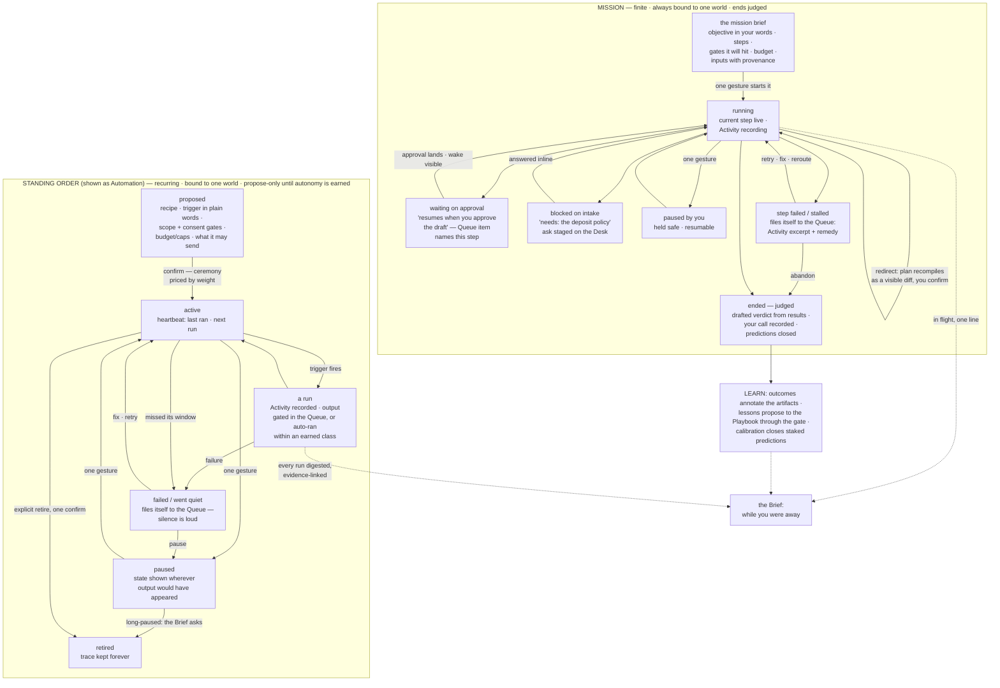

# 06 — Missions and Standing Orders: Work Moving Through Worlds

*Phase 3, document 06. Elaborates constitution §8 (Missions, Standing Orders, the Queue) and the
trust invariant it names; grounded in the operating model (Decision 4: work has exactly two
temporal shapes; Decision 3: drive modes; §2 Mission / Standing Order). Documents 02 (the Queue's
full mechanics), 03 (the Desk work flows through), 05 (drive modes), 16 (workshops) border this
one; the Run beat of the metabolism is owned here. Diagram assignment: mission & standing-order
lifecycle.*

*Reading rule. "Standing Order," "plan spine," "heartbeat trace," and "flight recorder" are spec
names and never appear on screen. The interface shows: **"Mission"** and its **plan**;
**"Automation"** (or "Routine" per world skin) and its run history; **"Activity"** for the flight
recorder. Approvals live in the **Queue**. No architectural word — and no genome, capability, or
spine vocabulary — is ever a label.*

---

## 0. What this document fixes — two shapes, zero destinations

Everything the system does over time is one of two shapes. A **Mission** is finite: an objective,
a plan, an end that is judged. A **Standing Order** is recurring: a trigger, a recipe, a scope, a
budget, a heartbeat. There is no third shape, and neither shape is ever a place (P7): there is no
Missions page and no Automations app. Work reaches the operator through five surfaces it already
lives on:

| Surface | What work renders there |
|---|---|
| **The Desk** | the world's running-work strip: each mission as one line of plan state, each automation as one line with its heartbeat chip; expandable in place (03 §3.1) |
| **The Queue** | every approval a mission is waiting on, every failure, every went-quiet, every blocked ask that ages — with full decision context inline (02 §4.2) |
| **The Brief** | "in flight" (one line per running mission) and "while you were away" (the automated-activity digest) — every sentence evidence-linked (02 §10.1) |
| **Lenses** | cross-world views: "everything running," the client-pipeline board's automation column — rows, never rooms (08) |
| **Search** | Missions and Automations are result groups; a dormant mission from last year is findable by meaning |

The mission's own deep surface is its **plan** — the plan spine, a surface *of its world*, opened
from any of the five. The automation's deep surfaces are its **run history** (the heartbeat
trace) and its **recipe workshop** (the flow bench where its rules live — a background
capability still has a workshop, constitution §6). You arrive at work by tapping where it
already shows; you never navigate to a work department.

One binding inheritance from the constitution, stated here because this document enforces it
everywhere: **recurring work must never become invisible.** §4 enumerates every mechanism that
makes the invariant structural rather than aspirational.

---

## 1. The lifecycle — one diagram, both shapes

Read left to right: a mission moves toward a judged end; a standing order orbits its heartbeat.
Both drain into the same two mouths — the Queue when they need you, the Brief when they don't —
and both feed the Learn beat, because work that ends without teaching anything wasted half its
value (P1, P2).

---

## 2. Missions

### 2.1 What a mission is on screen

A mission renders as **one line** wherever it is listed and as **its plan** when opened. The
line: name in the operator's words ("April launch"), world stamp when outside its world, state
("step 3 of 7 · waiting on your approval"), and next wake. The plan is the deep surface — §2.3.
A mission is always bound to exactly one world; its plan opens inside that world with the Face
above it and the Bar below, scope chip agreeing (03 §1). Missions never appear as tabs, cards in
a grid, or a global list — the Desk shows the world's running work, Lenses show everyone's, and
that is the entire inventory story (P3).

### 2.2 Where missions come from — four creation surfaces

All four produce the same thing before anything runs: the **mission brief** — one screen, not a
form. Objective restated in the operator's words; the compiled steps; every gate the plan will
hit ("will queue 2 emails and 1 publish for approval"); the budget when money or metered work is
involved; the inputs with provenance chips ("brief cites: the farm Playbook · 6 data points ·
March drop outcomes"). Everything on it is editable inline — remove a step, change a channel,
tighten the budget. **One gesture starts it.** Starting is deliberately cheap because the gates
live at the exits: nothing outbound, spent, or published happens except through the Queue, so
the ceremony ladder prices mission starts near zero (P4). Starting a mission with a stated
budget *is* the authorization of that budget; raising it mid-flight is an approval.

1. **The Bar.** "Launch the spring campaign" — the interpretation chip reads
   `→ Clothing Brand · new mission: launch the spring campaign`, Enter opens the brief. The
   plan compiles from the world's live state and Playbook, and says so: "sequenced the lookbook
   first — it was the long pole last drop."
2. **The workshop commit rail.** The rail's "→ Mission" hands a session's converged result to
   execution: "produce the collection" from the apparel bench mints a mission whose steps carry
   the session Ledger as provenance and whose craft steps reopen *the same session* when they
   need hands (drive-mode continuity, constitution §6). The criteria pack rides along: produced
   variants are scored against the same bar the session used — execution does not lower the
   craft standard (P1).
3. **The Desk.** Staged moves offer missions with reasons: "the service calendar wants the
   monthly report — start it?" (class 5, 03 §3.2). The Desk offers; it never starts its own
   suggestions (P5×P1).
4. **Promotion and charter.** The Proposal stages the first mission of a promoted world,
   compiled from the strongest branch of its map, provenance on every input (04 §10). Client
   worlds born from close-won arrive with their onboarding mission staged the same way.

Two more sources create *proposals*, never running missions: a genome's calendar stages
recurring finite work as offered missions (the monthly report), and an automation that detects
something needing multi-step remedy files a **staged mission proposal** to the Queue — machinery
may recommend a mission; only the operator starts one.

**Errands.** A single-step delegated run — "worker: 10 more like #3 overnight, per the ledger"
— is a mission in miniature: same states, same Activity, compact rendering (one line, no spine
ceremony), auto-judged ending (§2.7). Work is work; nothing runs off the books.

### 2.3 The plan — honest steps, visible wakes

The plan spine renders top to bottom: header, then steps in execution order.

**Header:** objective · started · progress as **steps, never percentages** ("4 of 7 done") ·
current state · **next wake** ("resumes when you approve the draft") · spend so far against
budget when a budget exists ("$4.20 of $15") · the pause control (§2.5). No progress bar exists
that is not literally the step count — invented motion is theater (P9).

**Step states** — each step shows exactly one:

| State | Rendered as | Tap opens |
|---|---|---|
| **done** | check · one line of what it produced ("landing page v4") | the artifact frame(s) it committed, provenance intact |
| **running** | live marker · current action in plain words ("drafting the follow-up — reading the March thread") | the Activity view, live (§2.4) |
| **waiting on approval** | "resumes when you approve the draft · waiting 2h" | the exact Queue item, inline, decidable right there |
| **blocked on intake** | "needs: the deposit policy" | the ask, answerable inline; also staged on the Desk as an open ask |
| **queued** | dim · ordered · shows what it depends on ("after step 4") | the step's spec: what it will do, what gates it will hit |
| **failed** | loud · one-line reason | the Queue item carrying the Activity excerpt and remedies (§2.6) |
| **skipped / replaced** | struck, kept in place, annotated ("replaced in redirect, Tue") | the plan version that changed it |

**Wake-on-approval is visible from both ends — binding.** The waiting step names its approval;
the Queue item names its mission and step ("Mission: April launch · step 3 of 7 — approving
resumes it"); approving anywhere shows a six-second transient ("April launch resumed") and the
spine lights the step the moment it wakes. Holding an approval with a wake condition ("after
Jane replies") writes that condition onto the step — the mission's stillness is always
explained. A mission may never be silently asleep: every non-running state names what it is
waiting for and where to supply it.

Steps that produce things commit **framed artifacts** (07): version rail, provenance to the
step and its Activity, publish state wired to the Queue. The mission's outputs are inspectable
as first-class things forever, not attachments to a log.

### 2.4 Activity — the flight recorder on every AI step

Every AI-driven step carries **Activity**: the honest record of what acting-on-your-behalf
actually meant. One tap from the step, from the Queue item it minted, or from any artifact it
produced. Five panes, plain language:

1. **What it read** — the context that grounded the step: the rows, artifacts, thread excerpts,
   Playbook lessons (each with provenance), and the world memory it consulted. This is the
   Counsel's context manifest applied to execution (constitution §13): "what did you know when
   you did this?" is always answerable.
2. **What it did** — the actions taken, as verbs a human would use ("searched for the March
   invoice · drafted 2 variants · scored them against your outreach criteria").
3. **What it decided, and why** — choices made and the stated reason ("led with the reopening
   date; your Playbook says urgency beat discounts here, 4 data points").
4. **What it spent** — time, metered work, money, against the step's slice of budget.
5. **What it produced** — the outputs, linked as frames.

Activity is the inspect layer of trust (constitution §14): the operator who never opens it
loses nothing; the operator who does finds a complete answer. It is also where mastery hides in
execution — the *why* pane teaches judgment on every read, because reasons cite criteria and
evidence, not vibes (P1). Hand-done and delegated steps record to the same place: the record
says **who** did each thing — you, a worker, or a routine — with no gaps between drive modes.

### 2.5 Intervening — pause, take over, redirect

A running mission is not a sealed machine; it is a colleague you can tap on the shoulder.

- **Pause — one gesture** on the plan header or the Desk line. The running step finishes its
  current safe unit and parks; nothing further executes; queued gates stay queued (they were
  already safe — gates hold whether paused or not). The paused state shows everywhere the
  mission renders, with who and when ("paused by you · Tue"). Resume is the same gesture. A
  mission paused past a week gets one quiet Brief mention — even stopped work must not slide
  out of mind (§4).
- **Take over a step.** "I'll do this one" on any step — done fully by hand, or opened as a
  workshop session with the step's material loaded (the draft on the bench, the palette carrying
  the step's inputs). The mission parks on the session and resumes on its commit. Manual →
  delegated → automated is a slider inside one environment, never an interface switch
  (constitution §6); the Ledger and Activity record who did what.
- **Redirect — speak to the plan.** "Skip the postcard, add an SMS instead" at the Bar (scoped
  to the mission) or on the plan itself. The plan **recompiles as a visible diff** — steps
  added, removed, resequenced, each with its reason — and one confirm applies it. Done steps
  stay done; replaced steps stay visible, struck and annotated; the previous plan remains a
  version. Redirection is a first-class edit with history, never a silent rewrite (P9, P12).
- **Abandon.** Ending a mission early is one confirm plus one honest line ("client postponed").
  Abandonment is an ended state, judged lite (§2.7) — its artifacts, Activity, and plan
  versions persist forever; there is no delete (P12).

### 2.6 Failure, stalls, and the Queue

Failures are Queue citizens, never toasts (02 §4.2). Four conditions file items automatically:

1. **A step fails** — the item carries the Activity excerpt (what it tried, where it broke), a
   proposed remedy, and actions: **Retry · Fix** (opens the exact surface — the connection, the
   draft, the missing input) **· Reroute** (recompile around it) **· Pause the mission**.
2. **A stall** — a mission past its expected wake with no movement files "stalled" with the
   blocking condition named ("waiting on intake: deposit policy — 6 days"). Stall detection is
   the system watching *itself*; the operator never has to notice stillness (P10's spirit
   applied to finite work).
3. **A blocked ask ages** — intake blocking a step starts on the Desk; past its class window it
   escalates into the Queue's needs-you.
4. **Budget exhausted** — a mission that hits its budget with steps remaining parks and files
   the decision: raise (an approval), trim the plan (a staged redirect), or end it now.

Repeated same-class failure pins to the top of its world's group in the Queue. Failure reaches
the phone only through the three push classes (02 §9) — a broken step is loud in the app, not
on your wrist at 3 a.m., unless a decaying approval or the clock itself is involved.

### 2.7 The ending — every mission is judged

A mission that merely stops is a defect; **ending is a Learn beat** (P2). When the last step
lands, the mission stages its ending as a Desk move — never a modal:

1. **The drafted verdict.** The system writes the honest outcome from rows: objective restated,
   what measurably happened ("mailed 412 · 11 valuations · 2 listings"), spend against budget,
   every claim evidence-linked. Where nothing was measurable it says so — "no signal on the
   flyer's effect" beats a decorated guess (P9).
2. **Your call.** The operator confirms, edits, or overrides in one line: met / partly / missed,
   plus why. The operator's judgment is recorded *as the verdict*, with the system's draft
   preserved beside it — disagreement between measured and felt is itself signal, kept. This
   costs twenty seconds and is the single most valuable sentence the system can learn from
   (P1). The ask stays staged until answered but never blocks anything.
3. **Predictions close.** Calls staked at start or in workshop sessions ("I think the postcard
   beats the letter") resolve against results; the world's calibration record updates and the
   Brief mentions notable closes (constitution §12.4).
4. **Outcomes ride the artifacts.** "This subject line: 3 replies" annotates the artifact
   itself, visible in every future Palette that surfaces it (constitution §12.3).
5. **Lessons propose to the Playbook — through the gate.** Nothing becomes steering truth
   without the operator's approval; adopted lessons carry the mission as provenance and are
   cited by every future plan compile ("sequenced Tuesday — Playbook, 6 data points").

Errands auto-judge (did the delegated thing meet the session's criteria bar — scored, recorded,
overridable). Abandoned missions take judgment lite: the one-line why, plus closure of any
staked predictions. Either way the record is complete: a year later, "how did the April launch
actually go?" is answerable from real rows, by anyone, from anywhere (the stranger test).

---

## 3. Standing Orders — shown as Automations

### 3.1 What one is on screen

An automation is **a row where it lives and a chip where it acts.** Like a mission, it is
bound to exactly one world — there is no world-less routine (§3.6). The row — on its world's
Desk running-work strip, and in the world's Automations area when the genome mounts one (a
view-area of heartbeat rows, 03 §7.1) — reads, in one line:

> **Invoice chase** · when an invoice passes 3 days overdue · last ran Tue 07:00 · next: Thu ·
> **drafts for your approval** · this month: 6 sent of 40 cap · ⏸

Name · trigger in plain words (schedule, event, or condition — "weekdays at 7am," "when a call
is missed," "when an invoice ages past 3 days") · heartbeat (last ran / next run) · autonomy
posture ("drafts for your approval" or "auto-runs: routine acknowledgments — revocable") ·
budget line · the pause control. In counterparty worlds the row carries the counterparty stamp.
Tapping the row opens the **run history**; a second tap on any run opens that run's Activity —
the same recorder missions use (§2.4), because a routine acting at 7am deserves exactly the
scrutiny a mission step gets at 2pm.

### 3.2 The heartbeat trace — one tap from anywhere output appears

The trace is the automation's honest pulse: **last ran · next run · what it did · what it
sent**, with the recent runs listed and each expandable to full Activity. The binding rule is
*where* it is reachable: **every output an automation produces carries a small heartbeat chip,
and the chip opens the trace.** Enumerated — this list is the contract, not examples:

- the **draft or message** it produced, in the Queue and in the thread after sending;
- the **artifact** it committed, on the frame's provenance trail;
- the **Brief sentence** that digests it ("the chase sent rung 2 to two late payers" — tap:
  the trace, those two runs lit);
- the **Desk line** and the **Automations-area row** in its world;
- the **Lens row** in any cross-world view that includes it;
- the **search result** when it or its outputs are found;
- the **counterparty chip**, when the automation acts under a counterparty's identity (§3.7).

From the trace: pause (one gesture, §3.5), open the recipe workshop ("how does this work? —
change it"), see budget standing, and revoke any earned autonomy class. The trace is an
overlay, never a page — you inspect from wherever you were and Esc returns you there (02 §1).

### 3.3 The Brief digests, evidence-linked

"While you were away" is the automation system's morning report (02 §10.1): grouped by world,
counted from rows, every clause a door into the trace. "Overnight: the hunt added 14 prospects;
3 follow-ups queued for your approval; Mom's chase sent rung 2 to two late payers; the support
inbox handled 9 — one refund request needs you." A quiet night says "three routines ran clean;
nothing needs you" — one line, and that honest quiet sentence is why the loud ones are believed
(P9). The digest absorbs; it never pushes (02 §9).

### 3.4 Silence is loud

An automation that stops is *more* visible, not less:

- **Missed window → "went quiet," filed automatically.** The clock knows every automation's
  expected cadence; a routine that fails to run when due files a Queue item without anyone
  noticing anything. Absence of output is itself an event.
- **A known expiry files ahead, not after.** Connection grants carry their expiry dates,
  listed with the grant on the world's Face; when a routine depends on a connection or grant
  about to lapse, a needs-you Queue item files days ahead of the date ("Priya's feed
  connection expires Friday — the listing sync depends on it"), and the Brief may cite it.
  A failure the system could see coming never has to happen to be seen.
- **A failed run** files a Queue item with the Activity excerpt, a proposed remedy, and
  actions: Retry · Fix (opens the broken thing — the connection grant, the recipe step) ·
  Pause. Repeated failure pins to the top of its world's Queue group.
- **A cap hit that blocks promised work** files the decision ("the chase hit its monthly send
  cap with 2 invoices outstanding — raise, wait, or chase by hand?"). Caps protect budgets;
  they are never allowed to become silent stoppage (§3.8).
- **The clock's own health is shell chrome.** The Pulse's fourth segment is heartbeat liveness;
  a stale clock ambers the Pulse and is the one alert allowed to cross quiet hours to the phone
  (02 §4.1, §9) — because every other promise in this section depends on it.
- **No compression, ever.** A failing, stalled, or dark automation cannot be compressed off any
  surface by attention ranking, in any posture — trust outranks quiet (P10 over P3; 03 §2.4's
  uncompressible heartbeat vital is this rule rendered on a Face).

### 3.5 Pause — one gesture, honest everywhere

Pause is available on the row, in the trace, on any output's heartbeat chip, from the Queue
item, and at the Bar ("pause the invoice chaser for mom" — the chip confirms the reading;
`/pause` for the deterministic register). No confirmation dialog — pausing is safe, instant,
and reversible, so friction would only punish caution. What pause *does* is honest:

- the row and every surface show **paused · by you · since Tue** — a paused automation renders
  wherever its output would have appeared, as the absence it is;
- nothing fires; queued-but-ungated drafts stay parked; nothing is lost (P12);
- the Brief notes material pauses ("the chase is paused with 2 invoices aging");
- a **long pause asks one quiet question** — after three weeks: "still paused — resume, or
  retire it?" Never nagging, never auto-resuming, never auto-retiring: stopped-on-purpose is a
  legitimate state, but it may not become a forgotten one (§4).

**Retire** is explicit, one confirm, and preserves everything: the trace, every run's Activity,
every output's provenance. A retired automation is findable forever; there is no delete.

### 3.6 Where automations come from

Every path lands on the same **automation proposal** — recipe in plain words, trigger, scope,
what it may send and to whom, consent gates it honors, budget/caps, autonomy posture (always
propose-only at birth) — and ceremony is priced by weight (P4): an inbound-only watch is one
confirm; anything that sends, spends, or touches a counterparty states its gates and needs its
connection grants; counterparty-identity automations add the isolation review.

1. **From a workshop recipe — the commit rail.** "Weekly content from this recipe": the
   session's converged process becomes the recipe; the Ledger is its provenance; the criteria
   pack travels with it, so every automated output is scored against the same bar the operator
   set by hand. Below-bar output does not ship — it queues for judgment with its score and why.
   Automation is the fourth position of the drive-mode slider (hand → ask → hand off →
   automate, 05 §3.1), not an exit from craft (constitution §6; P1).
2. **From delegated patterns — repetition noticed.** The system watches for the second and
   third hand-assembly of the same work (P14): "you've asked for this every Monday, three weeks
   running — make it a routine?" The proposal arrives pre-filled from the actual pattern,
   evidence-linked to the runs that prove it. Declining backs off until the streak doubles —
   the same grammar as every quiet offer.
3. **From the Proposal, at charter.** A world's creation screen lists every automation it wants
   to run, each with cadence and cost, each removable inline (constitution §11). No world ever
   starts running recurring work the operator didn't see named at charter.
4. **From the Bar.** "Every Friday afternoon, send me a pipeline summary" — chip:
   `→ The Agency · new routine: Friday pipeline summary`. Every routine binds to exactly one
   world: a portfolio-flavored ask like this one binds to the operator's own business world,
   whose Desk strip carries its row and whose stamp its digest sentence wears in the Brief.
   There is no world-less routine — every mechanism in §4 presumes a world to render on — so a
   request with no obvious home is a routing question ("which world should own this?"), settled
   on the chip before commit, never a scope the trust machinery cannot hold. Read-only routines
   confirm in one gesture; heavier ones open the proposal.

### 3.7 Per-client automations — counterparty scoping and consent

Automations in a counterparty world are the product's most delegated act — machinery speaking
under someone's name — and carry three extra locks:

- **Scoping.** The automation is bound to its client world; it reads that world's rows and no
  other's; its outputs carry the counterparty stamp; the Bar's scope chip and the Face agree
  whenever it is inspected (constitution §13). A Lens may list fifty clients' automations, but
  each row renders only its own world's data (P11).
- **Identity.** An automation that acts *as* the client — their sender identity, their number,
  their channels — must be named in the world's isolation contract, visible on the
  counterparty chip ("runs on Jane's behalf: follow-ups · review requests · missed-call
  text-back"). The counterparty chip is where "what runs under their name?" is always
  answerable.
- **Consent gates.** Contacting the counterparty's customers requires recorded consent per
  channel, and the automation fails closed without it. The gate is visible, not buried: the
  row states it ("SMS: consented contacts only"), and the trace counts its refusals honestly
  ("3 skipped: no consent · 1 suppressed: opted out") — refusal rows are trust made visible,
  not noise. Suppression is permanent and honored across every automation in the world.

Per-client automations report honest worth: the trace's counts (sent, answered, booked,
recovered) roll up into the client world's service vital and can be shown to the client as
real rows — never inflated, because the same numbers gate renewal conversations (P9).

### 3.8 Budgets and caps — visible, never silent

Every automation carries a budget line and shows it wherever the row renders: volume caps
("240 of 400 sends this month"), spend caps ("$12 of $30"), and rate limits in plain words
("at most 20 per day, spread out"). Rules:

1. Caps are set at the proposal, edited any time; **raising a cap is an approval** — spend
   grows only through the gate.
2. Approaching a cap is visible (the line warms at 80%); **hitting a cap that blocks promised
   work files a Queue decision** (§3.4) — a cap may stop work, never stop *telling*.
3. The trace attributes spend per run; the world's money vital includes automation spend;
   portfolio spend across worlds is a Lens roll-up, each row scoped.
4. Missions obey the same grammar: budget on the brief, spend on the spine header, per-step
   cost in Activity, exhaustion as a filed decision (§2.6).

### 3.9 Autonomy — earned per class, revocable per row

Every automation is born **propose-only**: it drafts, the Queue decides. Autonomy widens only
through the Queue's earned-autonomy offers — clean streaks per (class × world), the offer
citing its evidence, acceptance itself an approval, revocation one tap on any row, forever
(02 §4.2 owns the mechanics). What this document adds: the automation's row and trace always
state its current posture in words ("auto-runs: routine acknowledgments — 214 so far, all in
the Queue's Auto-ran view"), and every auto-ran action remains a first-class Queue citizen
under the Auto-ran filter. The falling intervention rate that justifies wider autonomy is
itself a visible vital (03 §2.4) — trust grows on evidence the operator can audit, or it
doesn't grow.

---

## 4. The trust invariant — every enforcing mechanism, enumerated

**Recurring work must never become invisible** (constitution §8). Not a preference — an
invariant, enforced by all of the following at once. Removing any one is a constitutional
violation, not a simplification:

1. **The heartbeat chip on every output, everywhere it appears** — draft, sent message,
   artifact provenance, Brief sentence, Desk line, Lens row, search result (§3.2). Output and
   its origin are never separable.
2. **The trace one tap from the chip** — last ran, next run, what it did, what it sent, each
   run's full Activity (§3.2).
3. **The Brief's digest** — all automated activity, grouped, counted from rows, every clause a
   door; a quiet night says so (§3.3).
4. **Went-quiet detection** — a missed window files itself to the Queue; absence of output is
   an event (§3.4).
5. **Failures as Queue citizens** — with Activity excerpts and remedies; repeated failure pins;
   never a toast, never a log you must remember to read (§3.4).
6. **The Pulse's clock-health segment and the stale-clock push** — the machine's own liveness
   is shell chrome, and its failure is the one alert that out-travels the app (02 §4.1, §9).
7. **The uncompressible rule** — no attention ranking, posture, or quiet band may hide a
   failing, stalled, paused-and-aging, or dark routine; trust outranks quiet (P10 over P3).
8. **The running-work strip on every Desk** — a world's recurring work is on its landing
   surface, not in settings (03 §3.1).
9. **The "everything running" Lens** — one cross-world view of all recurring work, states
   honest, rows scoped (§5).
10. **The Auto-ran ledger in the Queue** — every autonomous action remains a visible row with
    per-row revoke; autonomy never means off-the-books (§3.9).
11. **One-gesture pause wherever output appears** — control rides with visibility (§3.5).
12. **Budget/cap lines on every row, cap-hits filed as decisions** — spending and stopping are
    both loud (§3.8).
13. **Long-pause questions** — even deliberate stillness resurfaces after three weeks; paused
    may not decay into forgotten (§3.5).
14. **Charter-time naming** — no world begins recurring work that wasn't listed, with cadence
    and cost, on its Proposal (§3.6).
15. **Consent and refusal visibility** — gates are stated on the row; refusals are counted in
    the trace; fail-closed is shown, not silent (§3.7).
16. **Search coverage** — Automations are a result group; retired ones remain findable forever
    (02 §3.5; P12).
17. **Expiry foresight** — connections and grants carry known end dates; a routine that
    depends on one about to lapse files a needs-you item ahead of the expiry, so the Brief can
    warn before the miss instead of reporting after it (§3.4).

The test, from the principles (01 §P10-forbids): if an operator can be *surprised* by what ran
— ever, anywhere, at any scale — one of these seventeen failed. The mechanisms are redundant by
design: trust is expensive to build and cheap to destroy, so no single surface is its only
guardian.

---

## 5. Cross-world work — Lenses, never a control room

"What's running everywhere?" is a **Lens**, not a place (constitution §10): rows over worlds —
every running mission and active automation, world-stamped, states honest (running · waiting ·
blocked · went-quiet · paused), sortable by needs-you first. Built-in with the operating
genomes ("Running automations," the client pipeline's automation column); saveable with any
filter (per counterparty, per kind, failures-only).

Binding rules at portfolio scale:

- **A mission belongs to exactly one world.** Work that spans clients is per-world missions
  seen together through a Lens — an agency-world mission may coordinate via its `serves` edges,
  but any step that acts inside a client world stages *that world's* gated work. There is no
  über-mission that outranks a world's gates.
- **A Lens is a view with hands, never a bypass** — "nudge all ten stalled prospects" stages
  ten per-world approvals, batchable in the Queue but confirmed per item (02 §4.2).
- **Rows render only their own world's data** — fifty clients' automations in one view, no
  counterparty's numbers outside its row (P11).
- The hundredth world adds rows to this Lens and nothing else — no new queue, no new inbox, no
  control-room destination (the hundredth-world test).

---

## 6. Direct answers to the phase brief

### 6.1 Missions

| Question | Answer |
|---|---|
| Where are missions created? | Four surfaces — the Bar, the workshop commit rail, the Desk's staged offers, and the Proposal at promotion/charter — all landing on one editable mission brief; one gesture starts it (§2.2). |
| Is starting a mission gated? | No — starting is cheap by design because every dangerous exit (send, spend, publish) is gated in the Queue. A stated budget is authorized by starting; raising it is an approval (§2.2, §2.6). |
| What does a running mission look like? | One honest line everywhere it is listed; its plan when opened: steps with exact states, next wake named, spend against budget, no invented progress (§2.3). |
| How do I know why a mission is stopped? | Every non-running state names its condition and links to the remedy: the approval item, the intake ask, the failure's Activity excerpt. A mission is never silently asleep (§2.3). |
| How is wake-on-approval visible? | From both ends: the step names its approval; the Queue item names the mission and step and says approving resumes it; the wake renders as a transient and on the spine (§2.3). |
| What can I inspect about an AI step? | Activity: what it read (with provenance), did, decided and why, spent, and produced — one tap from the step, its Queue item, or its artifacts; live while running (§2.4). |
| How do I pause, take over, or redirect? | Pause is one gesture, safe-unit clean, honest everywhere. Any step can be taken over by hand or into a workshop session — same environment, recorded who-did-what. Redirects recompile the plan as a visible diff, one confirm, history kept (§2.5). |
| What happens on failure or stall? | Queue items, filed automatically — step failures with remedies (Retry/Fix/Reroute/Pause), stalls past expected wake, aging asks, exhausted budgets. Never toasts (§2.6). |
| How does a mission end? | Judged, always: a drafted verdict from real rows, the operator's one-line call recorded over it, predictions closed, outcomes annotating the artifacts, lessons proposed to the Playbook through the gate (§2.7). |
| Do small delegated jobs count? | Yes — errands are missions in miniature: same states and recorder, compact rendering, auto-judged against the session's criteria bar (§2.2, §2.7). |
| Can a mission span worlds? | No. One mission, one world; cross-world work is per-world missions seen through a Lens, gates intact per world (§5). |
| Is there a Missions page? | No. Missions render on their world's Desk, in the Queue, in the Brief, in Lenses, and in search — work is never a destination (§0). |

### 6.2 Standing Orders (Automations)

| Question | Answer |
|---|---|
| What is an automation on screen? | A row where it lives (Desk strip, Automations area) and a heartbeat chip on everything it produces; its deep surfaces are the run history and its recipe workshop (§3.1). |
| Where is the heartbeat trace reachable? | One tap from every output, everywhere output appears — the enumerated contract in §3.2: drafts, sent messages, artifact provenance, Brief sentences, Desk and Lens rows, search results, the counterparty chip. |
| How do I learn what ran overnight? | The Brief's while-you-were-away digest — grouped by world, counted from rows, every clause opening the trace; a quiet night says so in one line (§3.3). |
| What happens when a routine fails or goes quiet? | It files itself to the Queue — failures with Activity excerpts and remedies, missed windows as went-quiet items, cap-hits as decisions; repeated failure pins; the clock's own death pushes to the phone (§3.4). |
| How do I pause one? | One gesture, from the row, the trace, any output's chip, the Queue item, or the Bar. Paused state is shown everywhere; long pauses ask one quiet question; retire is explicit and preserves everything (§3.5). |
| How are automations created? | From workshop recipes via the commit rail (criteria pack attached), from noticed repetition (evidence-linked proposal), from the world Proposal at charter, and from the Bar — all through one proposal screen, ceremony priced by weight (§3.6). |
| How do per-client automations stay safe? | World-scoped reads and outputs; counterparty-identity work named in the isolation contract on the counterparty chip; per-channel consent gates that fail closed with refusals counted honestly; suppression permanent (§3.7). |
| How are budgets and caps shown? | On every row and trace, in plain words; raising a cap is an approval; hitting a cap that blocks promised work files a Queue decision — caps stop work, never stop telling (§3.8). |
| How does an automation earn autonomy? | Born propose-only; widened only by the Queue's evidence-citing offers per class × world; posture always stated on the row; every auto-ran action a visible, revocable ledger row (§3.9). |
| Is automated output held to the craft bar? | Yes — the recipe carries the workshop's criteria pack; automated output is scored, and below-bar work queues for judgment instead of shipping (§3.6; P1). |
| What enforces "recurring work never becomes invisible"? | Seventeen redundant mechanisms, enumerated as a contract in §4 — chips, trace, digest, went-quiet detection, Queue citizenship, clock chrome, the uncompressible rule, Desk strips, the running Lens, the Auto-ran ledger, ubiquitous pause, budget visibility, long-pause questions, charter naming, consent visibility, search coverage, expiry foresight. |
| Where do I see everything running, everywhere? | The "everything running" Lens — rows over worlds, honest states, per-row scoping, acting only through per-world gates. Never a control-room destination (§5). |

---

## 7. Acceptance checks for this document

1. **The stillness test**: any mission not running names what it waits for and links the remedy,
   from every surface it renders on.
2. **The wake test**: approving any mission-gated item visibly resumes the mission from both
   the Queue's side and the plan's side.
3. **The recorder test**: for any AI action — mission step or automation run — "what did you
   read, do, decide, and spend?" is answerable in one tap, in plain language.
4. **The surprise test**: no automation's action, failure, silence, pause, or spend can reach
   the operator as a surprise; some mechanism in §4 carried it first.
5. **The chip test**: pick any automated output anywhere in the product; its heartbeat trace is
   one tap away, with pause right there.
6. **The judged-ending test**: no mission reaches "ended" without a verdict — drafted from
   rows, settled by the operator — and its lessons offered through the gate.
7. **The scale test**: a hundred running missions and automations produce one Queue, one Brief,
   one Lens — and no new surface.

---

*Cross-references: `_constitution.md` §8 (the decisions elaborated here), §6 (commit rail,
drive-mode continuity), §12 (the learning loops mission endings feed); 01 (P1, P2, P9, P10,
P14 and the trust-beats-economy precedence); 02 (the Queue's item anatomy, batch, earned
autonomy, push classes, the Brief); 03 (the Desk's running-work strip, staging classes,
heartbeat vitals); 04 (the watch, promotion staging the first mission); 05 (drive modes and
the one catalog behind them); 07 (the artifact frames steps commit); 08 (Lenses at portfolio
scale); 16 (the workshop system recipes come from); 17 (mastery loops: calibration, Playbook,
outcome annotation).*
