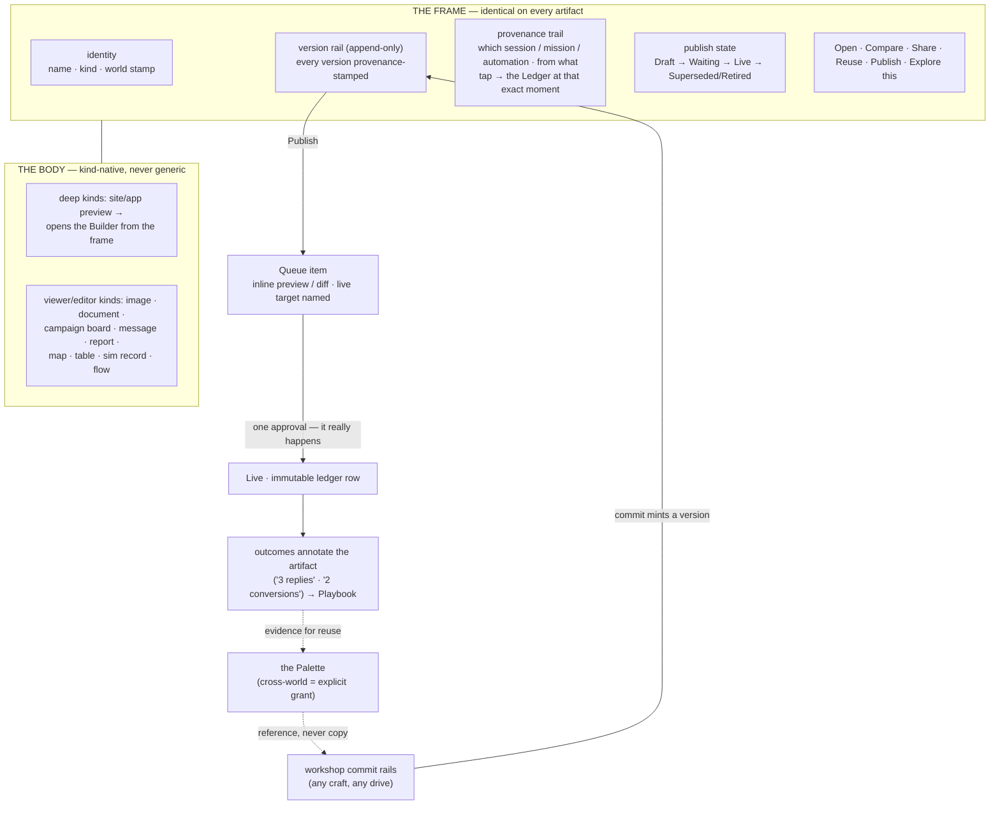
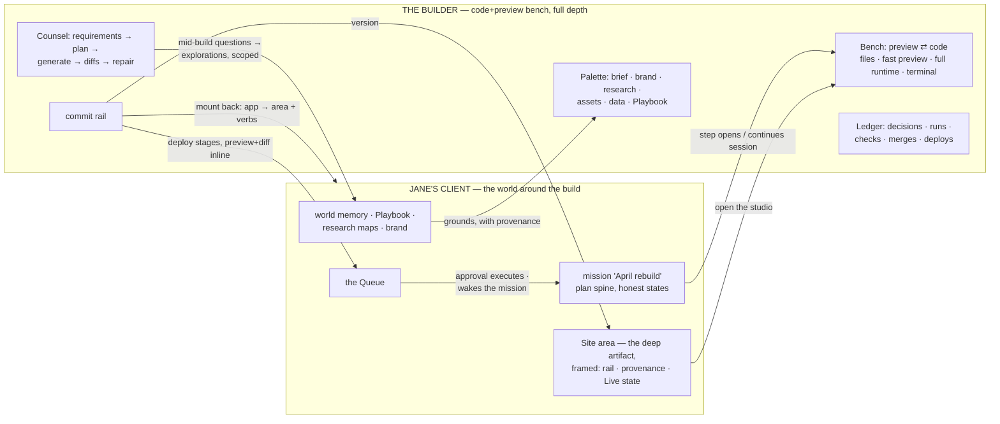

# 07 — Artifacts and Builders: One Frame, Many Bodies, One Deepest Room

*Phase 3, document 07. Elaborates constitution §9 (artifacts — one frame, many bodies), §6 (the
Builder as the deepest Workshop), §8 (the Queue), §12 (outcomes annotate artifacts), §13
(provenance and grants). Grounded in the operating model (§2 Artifact — "one class; kind is
data"; Decision 6 — a builder "project" is a deep Artifact; Decision 3 — generated capabilities)
and the principles (P1, P2, P8, P9, P11, P12, P13, P14). Documents 05 (drive modes), 06 (the
work that publishes), and 16 (the workshop grammar) supply machinery this document connects to;
this document owns what a made thing *is* on screen, and how the deepest making environment
keeps its depth inside the one grammar.*

**Reading rule.** "Artifact," "frame," "body," "deep artifact," and "the Builder" are spec
words. The interface shows none of them. The operator sees the thing by its kind and name —
"the postcard," "Jane's site," "the March report," "v7" — inside a consistent surface this
document calls the frame. The Builder presents as a Studio like every workshop ("Site Studio,"
"App Studio," skinnable per genome); "open the studio" is the door. Publish states show as
display words: **Draft · Waiting · Live · Superseded · Retired** (documents out for signature
additionally show **Awaiting signature · Signed · Declined** — §2.4). Where UI text is quoted,
it is quoted in display language only.

---

## 1. Why one frame

Everything made in the platform — a hoodie design, a client site, a follow-up email, a research
map, a simulation run — is one class whose kind is data (operating model §2). The experience
consequence is a single binding shape: **every artifact wears the same frame, and inside the
frame lives a body that is fully native to its kind.** The frame is how a hundred kinds of made
thing stay one product; the body is how none of them get flattened into a generic card
(anti-goal, constitution §15).

The frame answers the six questions an operator asks of anything made, identically for every
kind:

| Question | Frame element |
|---|---|
| What is this, and whose is it? | identity: name · kind glyph · world stamp |
| How did it get here? | provenance trail → tap through to the Ledger |
| What states has it been through? | the version rail |
| Is it out in the world? | publish state, wired to the Queue |
| What can I do with it? | universal actions: Open · Compare · Share · Reuse · Publish (+ Explore this, doc 04 §2.2) |
| Whose is it to use? | the rights mark, where third-party ownership exists (§2.6) |

And one refusal, inherited verbatim from the constitution: **no generic editor pretends to edit
everything.** The frame never edits; it identifies, situates, and routes. Editing happens in
the body when the kind is simple (a document's text) and in the kind's own craft environment
when it is deep (a site opens its Builder). A "universal editor" would be the flattening this
document exists to prevent.

### 1.1 Three renderings, one object

The frame renders at three sizes, and they are the *same object*, never three designs:

- **Chip** — one line: kind glyph, name, world stamp, publish state dot. Appears in Palettes,
  search results, Brief sentences, map nodes, Queue stamp rows.
- **Card** — chip + a body thumbnail + the top of the version rail + the last provenance line.
  Appears in view-areas, the Desk's recent artifacts, compare pickers, Lenses.
- **Full** — the open artifact: frame as header, body beneath, version rail along the top edge,
  actions on the rail's right. Opened from any chip or card, anywhere, without changing place —
  an artifact opens as a surface of its world (P7).

### 1.2 Diagram — the frame and the artifact's life

The loop in the diagram is the metabolism's Commit→Run→Learn arc rendered on one object: made
in a workshop, gated once, really live, honestly measured, and feeding the next session's
Palette (P2).

---

## 2. The frame, precisely

### 2.1 Identity

Name (operator's word, renameable, never asked for at birth — generated from intent like
everything else), kind, and the world stamp. The stamp is load-bearing: an artifact is never
free-floating (operating model — contents of a world, never global), and everywhere the
artifact travels — Queue, search, a sibling world's Palette via grant — the stamp travels with
it. In counterparty worlds the stamp carries the counterparty mark, and bulk surfaces render
the artifact only within its own row's scope (constitution §13).

### 2.2 The version rail

- **Append-only.** Versions are never overwritten and never deleted (P12). The rail reads left
  to right, newest last, Live version marked.
- **A version is minted by a commit** — from a session's commit rail, an accepted worker
  report, an automation's run, or an edit-then-approve in the Queue. Keystrokes and autosaves
  never mint versions; fine-grained history (per-file history in the Builder, edit history in a
  document) is *body depth*, kept inside the body so the rail stays a legible story.
- **Versions are named by intent**, auto-drawn from the Ledger ("tightened hero copy," "rung-2
  tone softened"), editable.
- **Every version carries a provenance stamp**: who/what drove it (you · worker · routine —
  the drive stamps of doc 05 §3.2), from which session, from what material.
- **Living kinds snapshot.** Kinds whose body accumulates continuously rather than being
  authored in sittings — research maps, automation-fed datasets — carry a rail of **named
  snapshots** minted at meaningful moments (a report cited it, the world promoted, the operator
  pinned one) instead of authored versions — for a research map, minted from the exploration's
  commit rail (§5's map note). Same rail, same compare, honest about its rhythm.

### 2.3 The provenance trail

One line under the identity: *made by* (session, mission step, or automation fire) · *from*
(the material it derived from, as chips with their own provenance). Tapping it opens **the
Ledger at the exact moment of making** — the constraints in force, the critique scores, the
variants it beat, the decision that committed it. This is the mastery loop made navigable
(P1): an artifact is never just its pixels; it is the judgment that produced it, one tap deep.
Derived material shows as edges, not copies: the hoodie design's trail reads "from: artwork
'Thicket' ← Theo's Studio (grant, revocable)" with the provenance chip every use carries (P11).

### 2.4 Publish state — the gate on the frame

Publish state is a property of outbound-capable kinds only; internal kinds (research maps,
simulations, datasets that never leave) simply have none — the frame shows no state chip
rather than a fake "draft."

The state machine, display words:

| State | Meaning | The chip is a door to |
|---|---|---|
| **Draft** | exists only inside its world | — |
| **Waiting** | a Queue item is staged; the gate has it | the exact Queue item, decision context inline |
| **Live** | it really happened; target named ("live at janesbakery.com" · "sent to Jane" · "posted ×2") | the ledger row + the live target |
| **Superseded** | a later version is Live; this one was | its ledger row |
| **Retired** | deliberately pulled back, through the gate | the retirement's ledger row |

(One naming note: constitution §9 writes the machine "draft → approved → live." On screen,
approval has no duration — the gate's one approval *executes* the exit (§4.1) — so the
approved moment renders as the transition itself, **Waiting** is the staged state before it,
and no "Approved" chip exists to go stale. The divergence is recorded in
`14-open-decisions.md`, per the constitution's own header rule.)

Rules, binding: publishing *any* version — including re-publishing an old one ("make v6 live
again") — stages through the Queue identically; rollback is cheap but never gateless. The state
chip never lies by omission: an artifact whose publish failed shows the failure state with the
Queue item holding the Activity excerpt (failures are Queue citizens, doc 02 §4.2).

**Signature states — documents that come back signed.** A signature request is a send like any
other: *request signature* stages a Queue item; one approval executes it; the ledger row is
written. But this Live has a shape of its own, shown in display words: **Awaiting signature**
while it sits with the signer, then **Signed** or **Declined** when the resolution lands —
each transition a ledger row, the chip a door to it. The signer acts on a signer-facing page
in the external `/shared` namespace (doc 11 §8.3), under the same revocable-token rules as
every review link; the signed rendition is minted as an immutable version on the rail. These
rows are the "e-sign states" the Paperwork area renders (doc 03 §7.2). Filling the contract
beforehand is ordinary body editing — the Document body's fill-holes verb (§5), reached from
the frame — with the template refusal rule (§6) making an unfilled slot unsendable; a
view-area never grows an editor of its own.

### 2.5 The universal actions

- **Open** — the body, full rendering. For deep kinds the body is the true preview, and the
  body's own edge carries "open the studio" (§8.1).
- **Compare** — any two versions, snapshots, or variants (§3).
- **Share** — give a real other side sight of it: a review link for Jane, a preview link for a
  prospect. Sharing to a counterparty is an outbound exit and stages through the Queue like any
  send; the link is revocable, and visits annotate the artifact ("Jane viewed the draft
  Tuesday" — evidence, not surveillance theater; every claim survives "which row is that?",
  P9). A Share can also carry a **selection ask**: share a variant set or a board of
  candidates with selection enabled, and the review page (doc 11 §8.3) lets the counterparty
  pick; the pick lands as an outcome row annotating the chosen artifact — the row that reads
  "the brewery picked concept #3" and evidences the stage change it triggers (doc 17 §5.1).
  Share never means cross-world reuse — that is Reuse-with-grant (§7.2).
- **Reuse** — send it to a bench: the artifact enters a chosen session's Palette by reference
  (§7).
- **Publish** — stage the exit (§4).
- **Explore this** — seed an exploration with this artifact as its first map node (doc 04
  §2.2).

Kind adds verbs; kind never removes these. A message's body adds "reply"; a site's body adds
"open the studio"; nothing anywhere lacks Compare.

### 2.6 The rights mark — whose it is to use

In crafts where third-party ownership exists, the frame carries one more element: a **rights
mark** — *own work* (the default, unrendered), *commissioned · owned by <counterparty>* (they
paid for the result; it is not the operator's to license), or membership in a named
**licensed set** ("print-licensed set · 12 pieces"). The mark is set where the truth is
known: at intake for commissioned work (the commission's charter names who owns what it pays
for — doc 03 §7.3) or at the commit rail; changing it later goes through the gate, with a
reason, as a row. Grant and licensing proposals consult it structurally: a licensing grant
can include only pieces whose mark allows it — which is how "grant the print-licensed set
(12 pieces)" computes its members (doc 10 §J4.1), and why the courthouse mural —
commissioned, owned by the client who paid for the wall — is ineligible by construction, the
refusal saying exactly that (doc 10 §J4.5). Kinds that never face third-party ownership show
no mark, exactly as internal kinds show no publish state (§2.4).

---

## 3. Compare — one gesture, every kind

Compare is universal (constitution §9): select any two — versions on a rail, variants on a
bench, snapshots of a map, two sibling artifacts, a draft against the live version — and
compare. The gesture is the same everywhere (two selections → Compare; `/compare a b` at the
Bar); the surface is an overlay, never a place.

**The kind supplies the comparator.** No generic diff pretends to compare everything:

| Kind family | Comparator |
|---|---|
| visual (designs, images) | side-by-side · overlay/onion-skin · zoom-locked pan |
| text (documents, messages) | unified diff, prose-aware (sentences, not lines) |
| sites & apps | side-by-side rendered previews at matched widths **plus** a changed-parts list (pages, sections, files) — surface diff and structural diff together |
| campaigns | board-vs-board: pieces added/removed/changed, schedule deltas |
| reports | figure-by-figure: each number's delta with both evidence rows |
| research maps | territory diff: nodes/edges/beacons gained between snapshots; hypothesis views side-by-side |
| datasets | schema + row diff between snapshots, provenance-aware |
| simulations | run-vs-run: parameters side-by-side, result curves overlaid |
| workflows | flow diff: steps/rules added, removed, retuned |

Two capacities ride every comparator:

1. **Score both.** Any compare can invoke critique against the craft's criteria pack — the
   scores with their why, rubric visible and editable (constitution §12). This is how a compare
   becomes a tournament round, and how approving a publish is also a rep of judgment.
2. **The story diff.** Between two versions of the same artifact, compare also shows the
   *Ledger delta* — the decisions, constraints, and critiques that happened between them. "What
   changed" is pixels and files; "why it changed" is the story diff. Both are one surface.

Compare renders inside Queue items (§4.2), on benches mid-session, from any two cards in a
view-area, and across worlds only through granted material — the comparator inherits scope
rules like every surface.

---

## 4. Publish — the commit beat, through the Queue

### 4.1 The path

Publishing is one path for every kind and every drive mode (doc 05 §9): the artifact's Publish
action (or a commit rail's exit, or an automation's output) stages a Queue item; the frame
flips to **Waiting**; one approval executes it for real; the ledger row is written; the frame
flips to **Live** with the target named. There is no second path, no kind-specific gate, no
genome-local approval flow (dressing contract, doc 03 §6.2.3).

### 4.2 The Queue item carries the whole decision

Inherited from doc 02 §4.2 and sharpened for artifacts — the inline decision context *is* a
compare:

- **First publish**: the full preview (the rendered site at device widths, the whole postcard,
  the complete draft with recipient and thread) — draft against nothing.
- **Re-publish / update**: **before/after compare preloaded** — the live version against the
  candidate, kind-native comparator, changed-parts list for deep kinds, story diff one tap
  deep.
- **The live target, named**: the domain, the recipient, the channel and account, the print
  run. An approval that doesn't name where "live" is, is malformed.
- **The cost, stated**: money, send volume, irreversibility class (undo exists for reversibles;
  a send is honest about not being one).
- **Criteria, visible**: creative output arrives with its critique scores and the rubric that
  produced them.
- **True renders only**: for deep kinds, the preview and before/after compare render from the
  **full runtime**, never the fast preview — approval is a claim, and "verified" is claimable
  only from the runtime (§8.5 row 2, P9). If a runtime render is unavailable, the item carries
  the fast preview's *approximate* label inline and claims nothing it cannot show.

### 4.3 Batches, campaigns, autonomy

A campaign's rollout stages **per-piece approvals batched by class** — walk them `j/k`+`a`;
bulk is a faster hand, never a bypassed gate. Earned autonomy applies per (capability × world ×
class) exactly as doc 05 §8 defines: after clean streaks, a class of publishes ("standard
rung-2 follow-ups," "weekly content posts") can auto-approve within bounds, every auto-ran row
visible forever. First publish of any artifact to a new counterparty is structurally ineligible
(doc 05 §8.3).

### 4.4 What comes back

Live artifacts report. Outcomes annotate the artifact on its own frame — "this subject line: 3
replies," "this design: 2 conversions," "the booking page: 14 bookings this month" — every
annotation a row, rolling up into the world's Playbook through the gate (constitution §12).
The Learn beat lands *on the thing that earned it*, which is why the Brief can say "the
Tuesday subject line drew 3 replies" and tapping opens this frame, this annotation, these rows.

---

## 5. The bodies — enumerated

Twelve kinds, each with a native body. The table is the contract; notes follow for the kinds
that need them. "Deep" marks kinds whose body opens a full craft environment from the frame.

| Kind | Body | Native verbs the body adds | Publish means | Deep? |
|---|---|---|---|---|
| **Website** | rendered live preview; page list; device widths | browse pages · open the studio | deploy to its domain | **yes → Builder** |
| **Application** | running preview; screens; data panel summary | try it · open the studio | deploy / release; optionally mount back as a room & verbs (doc 05 §10.1) | **yes → Builder** |
| **Design / image** | full-bleed viewer; variant strip when siblings exist; annotation pins | annotate · place-on-product | place, post, or send via its channel; or exit to a **production run** at a print vendor (notes below) | no — its craft lives in gallery-bench studios |
| **Document** | paged prose editor; sections; unfilled holes rendered loudly ("[YOU FILL]") | edit · fill holes · request signature | send, file, or post; e-sign flows ride the same gate | no |
| **Campaign** | board of member pieces (each a framed artifact chip with its own state) + schedule strip | stage rollout · reorder · swap a piece | per-piece staged rollout (§4.3) | no — the board *is* the craft surface |
| **Message** | the single outbound piece (email, SMS, post): recipient, draft, the thread it answers | reply · reschedule | send / post — the canonical one-gate exit | no |
| **Report** | narrative + figures; **every figure evidence-linked**; a report that cannot cite rows cannot render (P9) | drill any figure to rows | send to counterparty · file to the world | no |
| **Invoice** | line items · terms · counterparty · payment state (draft / sent / paid / partial / overdue) — every state a row | record a payment · stage a reminder | send via the Queue — the money exit; payments return as annotation rows (notes below) | no |
| **Research map** | a committed **snapshot** of an exploration's living map (doc 04 §3): nodes, edges, beacons, hypotheses as of its mint (notes below) | continue exploring (reopens the exploration) · compare snapshots | — (no publish state; knowledge leaves as reports or through the Playbook gate) | opens the Explore surface |
| **Dataset** | table: rows with per-row provenance (which run, which page); filters; column stats | filter · qualify rows · feed a routine | rare: export or feed beyond the world gates like any exit | no |
| **Simulation** | the lab record: parameters, runs, result visuals; replayable ("run again at these parameters") | re-run · sweep a parameter | — (internal; findings travel via reports/Playbook) | opens the sim/lab bench |
| **Workflow** | the flow: steps, rules, triggers of a recipe — the same recipe surface as its workshop (doc 05 §5.2) | test on one case · tune a rule | **arming**: mounting it as an Automation is its publish, through a proposal; a material edit to a live recipe drops its autonomy a notch and says so (doc 05 §8.3) | its workshop *is* the flow bench |

Notes that bind:

- **Messages are artifacts.** Their home view is the conversation (the Thread is the trace;
  the message is the made thing) — but framing them buys versioned drafts, universal compare
  (draft v2 against the sent rung-1), the one-gate send, and outcome annotations (opened,
  replied) on the exact piece that earned them. Sent messages are immutable versions.
- **Invoices are how money is a document.** The retainer's monthly invoice is minted by a
  billing automation — a Standing Order whose recipe is a workflow artifact (trigger: the 1st
  of the month, or a milestone), its drafts staging at the Queue like every send (doc 06).
  Payments arrive through the payment-collection connection — an explicit scoped grant like
  every connection (doc 09 §4.7) — and land as rows annotating the invoice: the rows the
  Money vital reads (doc 03 §2.4) and the Money lens rolls up as outstanding/overdue (doc 08
  §3.5). A "subscription" for a retainer client is exactly this pair — the standing order
  plus its invoice trail — never separate machinery.
- **Physical production is a publish path, not a separate machine.** A design — or a set of
  them — can exit to a print/production vendor. The Queue item names the vendor as the live
  target and carries the run inline: pieces, quantities, colorways, unit and total cost, the
  cost cited to its source row (the vendor's quote or rate card). The vendor is a
  **connection**: an explicit scoped grant exactly as integrations are in the Builder (§8.5
  row 6 — that rule is not Builder-only), listed on the world's Face (doc 09 §4.7's grammar).
  What returns — order confirmation, shipment, receipt — lands as rows annotating the
  produced artifacts (§4.4). The agency's postcard print run and the artist's
  print-on-demand drop ride this one grammar (doc 10 J2, J4).
- **Campaign members are real.** A campaign never flattens its pieces: the postcard inside the
  April campaign is a full artifact with its own rail, provenance, and state — the campaign
  board is a *view with structure*, not a container that swallows identity.
- **Research maps and simulations have no publish state** because nothing outbound can happen
  to them directly — and their Faces never pretend otherwise. Their route to the world is
  through reports, briefs, and gated Playbook lessons; their route to *work* is "take this
  into a workshop" (doc 04).
- **The map is three objects, reconciled.** The *exploration* is a session-like surface with
  its own address (doc 11 §6.2) — no frame, no rail, not an artifact. The curiosity world's
  *Map area* is a view-area listing and rolling up its explorations (doc 03 §7.6). The
  **research-map artifact** is neither: it is the committed snapshot minted from the
  exploration's commit rail at a meaningful moment (§2.2's living-kinds rule), and only the
  snapshot wears the frame, the rail, and Compare. One object per category; no object is
  ever two (P7).
- **The workflow kind closes a loop with doc 05**: an automation's recipe is an artifact, so
  recipes version, compare (flow diff), carry provenance ("distilled from 3 hand-offs, 11
  sessions"), and their arming/retuning is visible history — recurring work never becomes
  invisible, all the way down to its definition (P10).

---

## 6. Templates — recipe-flagged artifacts

A template is **not a separate class**. It is an artifact carrying a **recipe flag**: this
thing is a proven starting point, with named slots. Flagging adds exactly three things to the
frame:

1. **Slots** — typed holes (text, image, data feed, connection) with one line of guidance
   each, drawn from the Ledger of the sessions that proved the template ("headline: the
   evidence says name the neighborhood").
2. **The refusal rule** — an artifact derived from a template **cannot publish while a slot is
   unfilled**. Placeholder text reaching a real recipient is not a warning case; it is
   unsendable by construction (the send-gate doctrine generalized to every kind).
3. **Earned provenance** — where this template came from and what it has done: "postcard
   recipe · earned in Mom's Real Estate · used ×9 · best response 2.7%." A template without a
   track record says so honestly ("new — no results yet").

How templates arise: any frame offers "Save as template"; more importantly, the system
proposes the flag on the second near-identical reuse (P14 — the second assembly is a defect,
and the proposal is its remedy). Genome seed artifacts are templates with genome-level
provenance ("your proven client setup ×9"). Using a template creates a derived artifact with a
derivation edge — reference, never copy (P13 in miniature); the template's own rail is
untouched.

Improvement flows one way by default: improving a template meets its *next* use; it never
chases artifacts already derived. Propagation-as-proposal to sibling worlds is the heavier
machinery of genome layers and gated patterns (constitution §11, §12.5) — a template graduates
into that machinery only through the knowledge gate, wearing its evidence.

---

## 7. Reuse — the Palette is the door

### 7.1 In-world reuse

**Reuse** on any frame sends the artifact to a bench: a one-line destination picker (the
staged suggestion first — usually the session you just left; any workshop-area of the world
otherwise), and the artifact arrives in that session's **Palette** as a card with its
provenance chip. Reuse is by reference — the Palette never holds copies (P12: one thing, many
appearances). From the other side, every Palette can *pull*: its search reaches the world's
artifacts by meaning, and the Counsel volunteers relevant ones ("the March proposal priced
this exact scope — want it on the bench?" — anti-generic invariant, constitution §12.6).

### 7.2 Cross-world reuse — the grant

Crossing worlds is explicit, always: reusing Theo's artwork in the clothing brand requires a
**grant** from the artist world — one proposal, listed on both Faces, revocable from either
(constitution §13). Thereafter the artwork appears in clothing-brand Palettes with its
provenance chip on every use, and every derived artifact's trail cites it.

**Revocation is honest, not destructive.** Revoking a grant never deletes derived artifacts —
nothing is ever lost (P12) — but it stamps them ("uses revoked material") and **blocks further
publishes** of anything derived from the revoked material until it is re-granted or replaced.
The frame's publish action says exactly why it is refusing. Patterns travel, data doesn't, and
granted *material* travels only while the grant lives (P11).

Two sharpenings, binding. **Already-Live derivatives don't un-happen** — a storefront selling
a granted design stays Live at revocation (nothing is silently pulled) — but neither do they
drift: revocation files **one Queue decision per Live derivative** — *keep live* (the stamp
stays visible on the frame) or *retire* (through the gate, §2.4) — so a brand built on
granted art faces an explicit per-piece decision, never an indefinite default. And
**granularity is per-asset underneath**: a set grant ("the print-licensed set · 12 pieces,"
doc 10 §J4.1) is that many per-asset grants proposed and listed as one, revocable together or
individually — which is what doc 08 §5's "per-asset instances" means on the Face.

### 7.3 Reuse at portfolio scale

Lenses render artifacts across worlds (every client's live site and its vitals in one board —
doc 08), but reuse from a Lens row still routes through the owning world's grant when it
crosses; a Lens is a view with hands, never a bypass (doc 02 §10.2).

---

## 8. The Builder — the deepest workshop

### 8.0 What it is

Sites and applications are **deep artifacts**: made things with real internals — files, data
shapes, releases, running behavior. Their craft environment is **the Builder**: the
`code+preview` bench, the deepest of the nine archetypes (constitution §6). The Builder is a
workshop in exactly the grammar's sense — Bench, Palette, Counsel, Moves, Ledger, commit rail,
sessions — and it concedes nothing for it: every specialized power a dedicated app-building
product would have lives here at full depth. The grammar tells you *where things are and how
they leave*; it never tells the bench how shallow to be.

The historical failure this section retires: the builder as a parallel universe — its own
navigation, its own front door, its research evaporating into chat, its outputs orphaned from
the businesses they served (operating model, Decision 2's "builder-as-app" pathology). The
correction is not to shrink the builder into world furniture. It is to keep its entire depth
and *wire its edges into the world*: context in through the Palette, exits out through the
Queue, memory both ways, missions driving it. The builder is not brought down to the world;
the world is brought into the builder.

### 8.1 Entering

Five doors, all landing in the same session model:

1. **From the deep artifact's frame** — the primary door. The Site area of Jane's world holds
   the site as a framed artifact; Open shows the true preview body; **"open the studio"** on
   the body's edge enters the Builder with the current version on the bench. Frame first,
   studio from the frame — a deep artifact opens its environment *from* its frame, never as a
   place in the world's structure (doc 03 §4.2).
2. **From the Bar** — "change the hero on Jane's site to feature the spring menu" routes into
   a Builder session with the target section staged and the intent already on the Counsel's
   desk. Interpretation chip first, as always.
3. **From a mission** — a plan-spine step ("rebuild the booking flow") opens or continues the
   build session; the step and session reference each other (§8.6).
4. **From the Queue** — a failed check, deploy, or live error's **Fix** opens the Builder at
   the failing point with the Activity excerpt alongside (§8.5.7).
5. **From another workshop's commit rail** — "build this": a research map, campaign, or brief
   commits into a new build session, its material pre-loaded in the Palette (the
   exploration→build bridge generalized; promotion never copies, P13).

### 8.2 The grammar mapped — six parts, uncompromised

| Grammar part | In the Builder |
|---|---|
| **Bench** | `code+preview`, three arrangements — preview-forward, code-forward, split. Full file tree and a real code editor; **fast preview** always-on (instant, approximate, labeled as such); **full runtime** on demand (true compile, real behavior, a terminal) — the bench always says which one you are looking at, and "verified" is claimed only from the full runtime (P9). Device-width testing on the preview side. |
| **Palette** | the world flows in: the **brief** (pinned), brand assets and voice, research (map nodes and knowledge cards with provenance), source assets (copy, photos, granted artwork), prior versions, Playbook cards ("booking CTA above the fold — 2× conversion, earned across 4 sites"), and the app's data shapes. §8.6.1. |
| **Counsel** | the build conversation: elicits requirements, plans architecture, generates, edits by proposed diff, repairs errors — grounded in the world's memory and the craft's domain pack, critique-capable against the build criteria (§8.4). |
| **Moves** | the builder's verbs as structured controls: plan · generate · edit · run checks · test widths · branch · compare branches · merge · configure data · connect an integration · deploy · repair. The full set, not a curated shallow subset. |
| **Ledger** | the build's story: requirements decided and why, the architecture plan and its revisions, every generation run, every applied diff, check results, branch merges, deploys — resumable at thirty days like every session (constitution §6), and the worker's guide when the build is delegated. |
| **Commit rail** | → version on the artifact's rail · → **deploy** (publish, through the Queue) · → mission ("build out the member area" as planned finite work) · → template (recipe-flag this site as the client-site starting point) · → **mount back** (the app becomes an area body and cataloged verbs in its world — doc 05 §10.1). |

### 8.3 Diagram — the Builder inside its world

### 8.4 The craft loop, builder-shaped

The workshop loop — gather → diverge → develop → critique → converge → commit — is not
decoration here; it is what building already is, named:

- **Gather — conversational requirements.** The Counsel elicits what the thing must do,
  *starting from what the world already knows*: the client's business facts, the research
  map's findings, the brand voice, the Playbook's conversion evidence. It compiles a **brief**
  — a document-kind artifact, versioned, pinned in the Palette. A builder that opens already
  grounded and still asks "what's the business name?" has committed the anti-generic defect
  (constitution §12.6).
- **Plan — architecture as an inspectable thing.** The plan move produces the architecture on
  the bench — pages, flows, data shapes, integrations needed — as a structured, editable plan
  the operator can read and amend *before* generation. The plan and its revisions live in the
  Ledger; generation follows the plan and names its deviations.
- **Diverge — branches are the builder's variant set.** A branch is a full parallel version of
  the artifact, cheap to make. "Give me two design directions for the landing page" is two
  branches; the bench's variant grammar (doc 03, constitution §6) renders them as side-by-side
  rendered previews. Tournaments across branches are legal and ordinary.
- **Develop — generation and editing at full depth.** Generation runs in visible, real stages
  (progress tied to actual steps, never a fake bar — P9). Editing is by hand in the real
  editor, or by conversation: every AI edit arrives as a **proposed diff card** — reviewed,
  then applied; applied diffs are Ledger entries. The Counsel never writes a file it hasn't
  read — no blind writes, structurally.
- **Critique — checks and scores.** The critique verb here is twofold: **checks** (static
  quality, a true compile, behavior tests — honest states, one-tap repair) and **scored
  design critique** against the craft's criteria pack (accessibility, performance, brand
  fidelity, conversion patterns with their Playbook evidence). Scores come with why; the
  rubric is visible and editable (P1).
- **Converge — readiness-gated merge.** A branch merges only when the merged candidate proves
  green — checks pass on the *candidate*, so the main line never breaks. Converging is a
  Ledger decision with its reasons, like every converge in every workshop.
- **Commit — a version on the rail.** And from the rail, the exits (§8.2's commit rail).

### 8.5 What stays specialized, and why

The anti-flattening contract, enumerated. Each of these is a capability a generic "world
dashboard" could never honestly hold, each stays at full depth, and each names what the
grammar adds *around* it (never instead of it):

| Specialized depth | Why it cannot flatten | What the grammar adds |
|---|---|---|
| 1. **Real files and a real editor** | the artifact's internals are actual files; pretending otherwise caps the ceiling of what can be built | per-file history stays body-internal; the rail stays a story (§2.2) |
| 2. **Fast preview + full runtime + terminal** | truth about running software requires actually running it; the fast/true split is the craft's own honesty instrument | the bench labels which truth you're seeing; "verified" only from the full runtime (P9) |
| 3. **Checks: compile, tests, static quality** | software correctness is binary in ways prose is not; a vibe-check is not a check | checks render as critique with honest states; failures are repairable moves, and repeated failure classes reach the Queue |
| 4. **Branches and readiness-gated merges** | parallel directions and safe convergence are structural to the craft | branches wear the variant-set grammar: compare, tournament, converge-with-reasons |
| 5. **Database configuration** | the app's data shape is part of the artifact — schema, seed data, a console for the app's own backend | schema changes version with the artifact; **applying a change to a live backend is an exit → the Queue, migration shown as a diff**; provisioning backend infrastructure is a granted connection with proposal-weight ceremony (P4) |
| 6. **Integrations** | real apps need payments, mail, maps, calendars — each a credentialed connection | every integration is an **explicit scoped grant**, never silently inherited (constitution §11); the artifact's frame lists its connections the way a Face lists grants |
| 7. **Deployment: targets, domains, releases** | shipping is a real-world act with real infrastructure | deploy is publish (§4): Queue item with rendered before/after at device widths + changed-parts list + target and domain named; first deploy of a client site carries proposal-weight ceremony; any prior version can be made Live again through the same gate |
| 8. **Error repair, including live errors** | running software fails in production, not just on the bench | live failures (site down, form errors, failed checks) are **Queue citizens** with the trace and a proposed remedy; **Fix** opens the Builder at the failing point; the deployed artifact's frame carries live vitals (uptime, submissions) as outcome annotations |

The argument in one line: **depth is the point of a deep artifact.** The constitution's
anti-goal ("no flattening of deep tools into generic cards") is satisfied not by exempting the
Builder from the grammar but by the grammar being a coordinate system rather than a ceiling —
six named parts, each of which here contains more, not less, than its counterpart in the
apparel studio.

Two rows carry enough of the seventh journey to deserve their anatomy spelled out:

**Row 5, walkable — the data region.** The *configure data* move (§8.2) opens the bench's
**data region** — an arrangement alongside preview-forward, code-forward, and split: the
**schema view** (tables, fields, relations, edited as structured moves, each a Ledger entry),
the **seed table** (grid-authored rows, stamped *seed*, never mistakable for live data), and
the **console** — a real query surface against the app's own backend, running on the
full-runtime side and labeled with which truth it shows (P9). Schema changes version with the
artifact; committing one mints a version like any edit. Applying one to a **live** backend is
an exit, and its Queue item is a migration with fixed anatomy: the schema diff (§3's dataset
comparator, bound to this use) · affected-row counts computed against the real backend · the
rollback statement, or the honest declaration that a step is irreversible (a dropped column
does not come back) · the live target named (which backend, which environment). The
Application row's "data panel summary" (§5) is this region's read-only face on the artifact
body.

**Rows 5 and 7 — proposal weight, defined.** The "proposal-weight ceremony" of backend
provisioning and first client-site deploys is a concrete item shape, not a mood: the **target
and grant sentence** (which provider, which domain, what scope — the same grant grammar as
every connection), the **cost line** (setup and recurring), the **irreversibility class**,
and the **rollback path** (what undo means here, or that there is none). A first deploy or a
provisioning proposal missing any of the four is malformed, exactly as an approval that
doesn't name its live target is (§4.2).

### 8.6 The edges — how the Builder belongs to its world

#### 8.6.1 Context flows in: the Palette as the context strip

A build session opens already dressed in its parent world: the pinned brief; the client's
business facts; the research map's relevant nodes (as knowledge cards, each with provenance to
the exact exploration node — doc 04 §7); brand assets; granted cross-world material with its
chips; the Playbook's build-relevant evidence. The context header above the bench is the
world's own (Face › area › session — doc 02 §6), so the isolation signal never lapses: you
always know whose site you are shaping and whose data the Counsel may see. "What do you know
here?" yields the context manifest, scoped (constitution §13).

#### 8.6.2 Research persists both ways

A question asked mid-build ("what do the best booking flows do about no-shows?") routes to an
exploration **scoped to the world** (doc 04 §2.3). Its discoveries land in the world's memory
and return to the build session's Palette as knowledge cards with provenance. The
predecessor's sharpest knowledge loss — build research evaporating into a chat pane — is
structurally impossible: the research *is* map territory in the same world as the build, and
the build's own decisions (the Ledger) feed memory in return.

#### 8.6.3 Deploys exit through the world's gate

Every deploy, backend migration, domain change, and export stages at the Queue with the
world's stamp. There is no builder-local publish, ever — the one-gate rule is what makes a
client site trustworthy to operate: Jane's world's approval history contains every change that
ever reached her domain, with before/after compares attached.

#### 8.6.4 Missions drive builds

A mission step that is build work opens or continues a Builder session; the plan spine shows
the build's honest state ("step 3: booking flow — in session, 2 checks failing"); a deploy
approval **wakes the mission** (wake-on-approval, constitution §8). Big builds are missions
*made of* sessions; the mission holds sequence and blockers, the session holds craft. Neither
pretends to be the other.

#### 8.6.5 The drive slider, at building

The Builder rides the same slider as every capability (doc 05 §3): **hand** (you edit),
**ask** (the Counsel edits by proposed diff), **hand off** (an overnight build worker
continues the same session under a brief — checkpointed, budget-capped, reporting a morning
card: what it built, what passed, what it parked, what it spent; the Ledger stamps every
driver change), **automate** (watchdog routines: dependency and uptime checks, auto-staged
repair proposals). Autonomy is earned per class here like everywhere — "check-fix redeploys,
no content changes" is a class that can earn auto-approval after a clean streak; "first deploy
to a new domain" is structurally ineligible (doc 05 §8.3).

#### 8.6.6 What builds feed back

A finished app can **mount back** as an area body and cataloged verbs in its world (doc 05
§10.1) — creation extending the creator. A proven client-site build becomes a **template**
(§6), then — through the gate, with provenance — part of the client genome's seed, which is
how the agency's tenth client site starts from the earned best of the first nine while no
client's data ever travels (P11, P14). And at the funnel's seam: a prospect's demo site,
built in the agency world, rides the **spawn** into the newborn client world with its full
rail and provenance intact — the client world is born already containing the thing that won
it (operating model, Decision 6).

### 8.7 Mastery in the deepest room

The Builder is where the mastery loops run at their richest, because software is the craft
with the most measurable outcomes: criteria packs the operator can read and edit; critique
that teaches ("this hero fails contrast at mobile widths — here's the rule"); the story diff
between any two versions; live outcomes annotating the deployed artifact (bookings, form
submissions, conversion against the version that shipped); predictions capturable at deploy
("I think the shorter form converts better") and closed honestly by the numbers (constitution
§12.4). An operator who ships four client sites through the Builder is not just four sites
richer — they are visibly, evidencedly better at shipping software, and their Playbook can
prove exactly where each instinct was earned.

---

## 9. Acceptance checks for this document

1. **The frame test.** Every made thing, of every kind, in every rendering (chip, card, full)
   shows identity, provenance, version rail, publish state (when outbound-capable), the
   rights mark (where third-party ownership exists), and the universal actions. No kind
   lacks Compare.
2. **The no-generic-editor test.** Nothing anywhere offers to edit an artifact outside its
   kind-native body or craft environment; the frame identifies and routes, never edits.
3. **The provenance test.** From any artifact, the Ledger moment of its making — constraints,
   scores, the variants it beat — is one tap away; every derived use carries its chip; every
   cross-world use carries its grant.
4. **The one-gate test.** Every publish of every kind — first, update, rollback, batch,
   auto-approved — is a Queue row with kind-native preview/diff inline and the live target
   named. No builder-local, genome-local, or body-local publish exists.
5. **The template-refusal test.** No artifact derived from a recipe-flagged artifact can reach
   a counterparty with an unfilled slot — refusal, not warning.
6. **The reuse test.** Reuse is always by reference; revoking a grant stamps and blocks
   publishes of derived artifacts but destroys nothing.
7. **The depth test.** Every row of §8.5's table is present in the Builder at full depth;
   removing any one to "simplify" is a constitution §15 violation, not a cleanup.
8. **The edges test.** A build session can show, with rows: where its context came from
   (Palette provenance), where its research went (world memory), which mission drives it,
   and which approvals its deploys passed. A build disconnected on any edge is the
   parallel-universe defect reborn.
9. **The mount test.** A built app can become an area and verbs in its world through a
   proposal, with its exits gated and its connections granted — indistinguishable in rights
   from built-in capabilities, distinguishable always by provenance (doc 05 §11.8).

---

*Cross-references: `_constitution.md` §6 (workshop grammar, the Builder), §9 (the frame), §8
(the Queue), §12 (outcomes, criteria, Playbook), §13 (grants); 01-experience-principles.md
(P1, P2, P9, P11, P12, P13, P14); 02-global-shell.md §4.2 (Queue item anatomy), §6 (context
header); 03-world-experience.md §4.2 (what an area is not — the deep artifact rule), §6 (the
dressing contract); 04-explore-and-rabbit-hole.md §2.3, §7 (research into and out of builds);
05-capabilities-studios-and-automation.md §3 (the drive slider), §5.2 (recipes), §8 (earned
autonomy), §10.1 (mounting back); 06-work.md (missions and the plan spine that drive builds);
08-multi-world.md §3.5 (the Money lens), §5 (grant instances); 09-creation.md §4.7
(connection-grant grammar); 10-journeys.md (the journey beats these kinds serve);
11-information-architecture.md §6.2 (exploration addresses), §8.3 (the external `/shared`
namespace); 16-workshop-system.md (the full grammar the Builder instantiates);
17-mastery-and-learning-loops.md (criteria packs and calibration the Builder runs at full
depth).*
