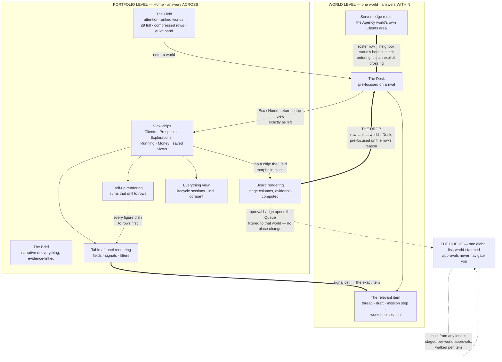

# 08 — Multi-World Management: The Portfolio at Any Scale

*Phase 3, document 08. Elaborates constitution §10 (Lenses), §4 (the Field), §13 (isolation on
bulk surfaces), and the operating model's §5 (coexistence at scale) and Decision 6 (typed edges).
Diagram assignment: portfolio vs world-level navigation. The shell that frames all of this is
doc 02; the inside of any single world is doc 03; the work that Lenses list is doc 06. This
document owns the layer between: how five, fifty, or five hundred worlds are seen, compared,
grouped, and acted on — without a single new place coming into existence.*

**Reading rule.** "Lens," "Situation," "genome," and edge names (`serves`, `informs`) are spec
words; none appear on screen. A lens shows only its own name ("Clients," "Money"); the save
affordance says "Save this view"; edges render as plain sentences ("serves ← Agency"). The
constitution's terminology table governs every label quoted below.

---

## 0. Two questions, two levels — across vs within

Everything in multi-world management descends from one distinction:

- **Portfolio level answers *across*.** How is the pipeline? What is running everywhere? Which
  clients need me? What does the book of business earn? Which prospects replied? What did I
  learn that travels? Its surfaces are Home's Brief, the Field, Lenses, and the one Queue.
- **World level answers *within*.** What now? How is it doing, really? Where does this work
  live? What happened here? Its surfaces are the Face, the Desk, Areas, Workshops.

The two levels never blur, and the seam between them is a single gesture — **the drop** (§2.5):
from any lens row into that world's Desk, pre-focused on the thing the row was telling you
about. Across is for seeing and choosing; within is for doing. A portfolio surface that lets
you *do* (nudge ten prospects) is really staging ten within-level actions through ten
within-level gates — the across level owns no gates of its own, ever.

What the portfolio level is **not**: a manager's dashboard over subordinate apps. There is one
operator, one grammar, one Situation. The portfolio surfaces render the same rows the world
surfaces render — compiled once, so the two levels can never disagree about a fact. If the
Clients lens says Jane's world has two approvals waiting, Jane's Desk says the same two,
because both read the same rows.

## 1. Diagram — portfolio vs world-level navigation

Read the arrows as the whole contract: chips morph the Field in place (views, not places); the
drop is the only downward seam and it is one tap; approvals go sideways to the Queue and never
move you; roll-ups refuse to be acted on until they become rows; return restores the view
untouched. There is no third level and no path that bypasses a world's gates.

## 2. The Lens system

### 2.1 Definition

A **Lens** is a saved view over worlds and their contents. It is entirely data — six declared
parts, no code, no place:

| Part | What it declares | Examples |
|---|---|---|
| **Row kind** | what one row is — exactly one of: worlds · work · records · artifacts · ledger lines · proposals (knowledge-gate items awaiting the operator: genome-layer adoptions, promotion offers — const. §11) | client worlds; standing orders; prospect records; pending adoptions across the client family |
| **Filter** | which rows qualify | genome family = client; lifecycle = operating; health ≠ quiet; edge `serves` ← Agency; "replied within 7 days"; stage = Pitched+ |
| **Grouping** | how rows band or column | by stage · genome · counterparty · lifecycle · health · edge-parent · dial position |
| **Rendering** | one of four bodies (§2.2) | board · table · field · roll-up |
| **Fields** | which signals each row shows | post-send signals, money standing, waiting-count, last ran / next run, open beacons |
| **Sort** | order within groups | needs-you first, then age; overdue first |

Two structural rules. **A lens holds no data** — it is a query over the Situation, rendered
fresh on every open; nothing in a lens can be stale relative to the world it describes, because
there is nothing *in* a lens. **A lens is never a place** — it renders where the Field renders,
morphing it in place; the Bar's scope chip stays Home; Esc restores the plain Field. You cannot
be "in" a lens any more than you can be "in" alphabetical order.

### 2.2 The four renderings

1. **Board.** Columns are the grouping's values — usually stages. Cards carry the row's Face
   chip (or record identity), its honest one-line state, and its declared signal fields.
   **Stages are computed from rows, not hand-sorted**: a prospect is "Pitched" because a sent
   pitch exists, "Demo built" because a deploy exists, "Replied" because an inbound reply
   exists. Dragging a card is legal only where the stage is a judgment ("At risk"), and the
   drag is recorded as an operator judgment with its date; dragging can never fake evidence a
   stage requires, and never performs work — moving a card to "Pitched" does not send a pitch,
   it offers to stage one, through that world's gate.
2. **Table / funnel.** Rows with sortable, filterable field columns; a funnel is a table whose
   grouping renders as stage bands with counts and conversion between bands. Every cell is
   tappable through to the rows that justify it — a "3 replies" cell opens the three threads'
   stamps, not a chart.
3. **Field.** The same attention-ranked renderer as Home's Field, filtered — "show me only
   explorations" is the Field wearing a filter. Ranking, compression, and the quiet band behave
   identically (§4).
4. **Roll-up.** Aggregates over rows: counts, sums, rates, ages — never composite scores. The
   Face's rule extends to the portfolio: there is no "Portfolio health: 82." Every figure
   drills to its rows in one tap, and **you act on rows, never on aggregates** — a roll-up has
   no bulk verbs at all until it has been drilled into a table.

### 2.3 Row anatomy and signal fields

Every lens row, in every rendering, carries: the identity chip (world Face chip,
counterparty-stamped when one exists; or the record's identity for record-rows), the honest
one-line state, the declared signal fields, and its badges (waiting approvals · running work ·
went-quiet · needs-you), each badge a real count from real rows. Signal fields are
genome-supplied definitions — the client genome ships post-send signals (delivered · opened ·
clicked · replied, each with age), money standing, site status, and **adoption state** (a
genome-layer improvement awaiting this world's approval — const. §11, 09 §10.2); the curiosity
genome ships map growth, open beacons, last visit. Custom fields are picked from the genome's field catalog,
never free-typed formulas — a field the genome cannot compute from rows cannot exist, which is
how lenses inherit honesty by construction.

**Isolation on every row** (constitution §13): a row renders only its own world's data. Fifty
clients in one board means fifty scopes side by side, none aggregated across the counterparty
boundary. Roll-ups may sum *the operator's own ledger lines* (what clients owe the operator,
what automations spend — the operator's money relationship is the operator's data); they may
never aggregate counterparty-side content (their contacts, their customers, their inbox) across
rows. That is the binding line between a money roll-up and a leakage channel.

### 2.4 Where lenses live, and how many

Chips across the Field's top: built-ins first (in genome-family order), then saved views by
recency of use; the tail folds behind "More." Chips never scroll the shell, never nest, and
never grow a sidebar — a hundred saved views cost one "More" tap, and the Bar reaches any of
them by name ("show the money view"). The Queue is not a lens and never appears as a chip: a
lens shows state; the Queue holds decisions. Where a lens badge says "3 waiting," tapping it
opens the Queue filtered — sideways, not down.

### 2.5 The drop — one tap from across to within

Every row is a door, and the door opens **pre-focused on the row's reason** — the anticipation
doctrine applied to the portfolio. What you tap determines where you land:

| Tapped | Lands |
|---|---|
| the row itself / its Face chip | that world's Desk, with the row's cited state visible and the staged next move answering it ("Jane replied 2h ago" → the reply thread is the first staged move) |
| a stage chip | the Desk with the stage's exit move staged ("what moves this forward"), evidence for the stage one tap away |
| a signal cell (e.g., "replied") | the Desk with that exact item open — the thread scrolled to the reply, the draft, the mission step |
| a waiting-approval badge | the Queue overlay, filtered to that world and class — **no place change**; approving never navigates (02 §4.2) |
| an automation state cell | the heartbeat trace overlay (06 §3.2) — pause is right there |
| a judgment signal ("4 variants awaiting critique") | that Workshop session resumed on its Bench, Ledger tail visible — portfolio surfaces resume craft, not just operations |

The drop is a real place change (portfolio → world): the scope chip updates, the Face appears,
the context header fills. Hover/focus prefetches so arrival is instant. **Return restores the
view exactly as left** — scroll position, filters, expanded groups — because leaving a lens to
handle one row and losing your place would make lenses cost attention instead of saving it.

## 3. Built-in lenses — shipped with genome families

Built-ins arrive with the genomes that make them meaningful, already wired to those genomes'
field definitions. They are genome layers like any other: improvements propagate as proposals
("your client pipeline gained a Review column — adopt?"), never silent mutation (const. §11).

1. **Clients** *(client pipeline — ships with the agency/client family)*. Row kind: client
   worlds (everything linked `serves` ← Agency, plus unlinked client-genome worlds). Rendering:
   board. Stages, evidence-computed: **Onboarding** (intake asks open) · **Build** (build
   mission running) · **Review** (site artifact awaiting approval or counterparty sign-off) ·
   **Live** (deployment exists, care automations running) · **Renewal** (term ends within 30
   days). Two of those stages carry their own evidence contracts. **Review's counterparty
   evidence is real, not implied**: the review link a Share issues (07 §2.5, 11 §8.3) carries
   an explicit sign-off action — approve or request changes — and its result lands as a row on
   the site artifact (sign-off · by whom · when). Sign-off-received is the row that moves the
   card to Live; a client's comments land as a thread in that client's world; a change request
   files as a staged move on that world's Desk — the counterparty's side of Review is rows,
   never a phone call the board can't see. **Renewal's term has a source**: the money terms
   agreed at charter — the signed proposal artifact (a month-to-month retainer carries a
   renewal review date instead of a term end). At T-30 the client genome's service calendar
   stages a renewal mission on that world's Desk, its brief seeded from the world's outcome
   rows and Money history; accepted new terms are themselves a proposal — updating the Face's
   presentation line, the invoice/subscription scaffolding, and every affected automation row
   through the gate, never a silent edit (09 owns the proposal shape). "At risk" is a judgment
   badge, draggable-on, dated. Cards carry post-send signals, money standing, waiting badges,
   and — when a genome layer has an improvement pending — the **adoption state** field, so
   batch-adopt at portfolio scale has a surface (§6.2, 09 §10.2). Default sort inside columns:
   needs-you first. One tap filters: **replied** · has-waiting · overdue.
2. **Prospects** *(prospect funnel — ships with the agency genome)*. Row kind: prospect
   records *inside the agency world* — prospects are contents, not worlds; they fail all four
   world tests until close-won. Rendering: funnel. Stages from the acquisition engine's own
   evidence: Found · Audited · Demo built · Pitched · Followed-up · **Replied** · Booked ·
   Closed-won. Every stage through Booked is an evidence stage with its named row — Found: the
   hunt's record row; Audited: the audit artifact; Demo built: a deploy; Pitched: a sent
   pitch; Followed-up: a sent follow-up; Replied: an inbound reply; Booked: a booking row.
   **Closed-won is the funnel's one judgment stage**: an operator judgment, dated and
   attributed, entered by drag or by the Bar ("Rosa said yes") — it stages the spawn proposal,
   and the charter is its confirming row. Post-send signals render on Pitched+ cards; the
   **replied filter** is the funnel's headline control because replies are the funnel's
   scarcest event. **Close-won is the graduation seam**: the record spawns a client world
   (operating model D6), leaves this funnel, and appears in the Clients board at Onboarding —
   pre-populated, nothing re-entered. The funnel also ends the other way: **Lost** is the
   terminal state, entered by evidence (hard bounce · explicit decline — each a row) or by a
   dated, attributed judgment, including aging out past the genome's default (no signal in 60
   days, offered as a staged sweep, never a silent purge). Lost records leave the stage
   columns but stay in the cohort every conversion band is computed over — the funnel's rates
   read honestly, not as survivorship — and they remain findable by meaning forever (P12): a
   lost prospect who writes back nine months later resumes with the record whole.
3. **Explorations** *(ships with the curiosity genome)*. Row kind: worlds with open
   explorations or beacons — **any genome**, not curiosity worlds alone. Rendering: table,
   grouped warm · cooling · dormant, with operating worlds in their own **operating** group.
   Promotion therefore never empties this lens: when a curiosity world promotes to a venture,
   its row moves to the operating group and stays as long as its exploration continues and its
   beacons remain open (10 §6.5) — leaving only when the last beacon closes. Fields: last
   visit, map growth, **open beacons** (parked gaps — doc 04), promotion signals ("returned 4
   times"). This lens is where the inquiry half of mastery is managed at scale: open beacons
   across all explorations are the operator's honest list of named unknowns — complete across
   promotions, by construction — and a promotion offer renders here as quietly as it does in
   the Brief.
4. **Running** *(everything running — ships with any operating genome)*. Row kind: work — all
   standing orders and running missions across all worlds (06 §5). Fields: honest state
   (running · waiting · blocked · went-quiet · paused), last ran / next run, **dial position**
   (earned-autonomy posture per class × world — doc 05), spend against budget, and **adoption
   state** where the automation's genome layer has an improvement awaiting that world's
   approval (09 §10.2). Pause is on every row. This lens is mechanism 9 of the sixteen that
   keep recurring work visible (06 §4).
5. **Money** *(ships with any money-bearing genome)*. Row kind: the operator's ledger lines,
   grouped by world. Roll-up rendering: recurring revenue by client, invoices outstanding and
   overdue with age, automation and campaign spend against caps. Every figure drills to lines;
   the isolation line from §2.3 governs what may sum. No projections, no invented run-rates —
   sums of real lines only.

## 4. The Field at scale

The Field's contract (02 §10.2) is a **constant screen budget**: at most nine worlds in full
presence, running-quiet worlds compressed to name-glyph rows, then one expandable quiet band,
dormant worlds absent. What changes with scale is not the Field — it is where the operator's
day runs:

- **At 5 worlds** the Field *is* the portfolio: everything fits in full presence, lens chips
  mostly restate what is visible, and the drop is barely distinguishable from just entering a
  world. Nothing about lenses must be learned to operate at this scale.
- **At 50 worlds** the attention set still shows ≤9; a dozen compress; the band reads "31
  quiet — all clean." The operating families (clients, prospects, running) are now worked
  through their lenses; the Field becomes the glance and the Brief the narrative. The Queue is
  unchanged — one list, world-stamped, batch-by-class keeping it humane.
- **At 100+ worlds** the screen is the same size, by construction. The day runs Brief → Queue →
  two or three lenses; the Field is confirmation, not directory. Nothing new appears at this
  scale because nothing was inventory-shaped to begin with.

Four mechanisms make this honest rather than merely tidy:

1. **Attention ranking** — the six classes (needs-you › broken › news › glowing ›
   running-quiet › dormant), ties broken counterparty-first, money-first, then age; identical
   machinery to the Brief's, computed from the Situation, so glow and narrative always agree.
   One override outranks quiet: **the uncompressible rule** — no ranking may hide a failing,
   stalled, or went-dark routine (06 §4.7).
2. **Compression** — a compressed row is name + one state glyph; the quiet band's count must
   survive "which rows are those?" (expand in place, every row honest). Compression is never
   deletion: one tap unfolds.
3. **Dormancy** — untouched worlds drift dormant on genome-defined decay. 04 §9.2 owns the
   curiosity numbers and its defaults are the contract: two quiet weeks to cooling, six to
   dormant. Client worlds go dormant only by explicit retirement — a churned client runs the
   retirement path (automations retired first), then sleeps. **A world with outbound,
   spending, or counterparty-touching clock work cannot go dormant** — those automations must
   be paused or retired first, or the uncompressible rule holds the world visible; dormancy is
   rest, never a place recurring work hides. One carve-out, stated here and mirrored in 04
   §9.3: an **inbound-only watch** — sends nothing, touches no counterparty, spends within its
   stated cap — sleeps with its world. Its arrivals accumulate silently for the return visit
   (04 §12), and the watch itself never disappears: it remains a row in the Running lens with
   its heartbeat trace and went-quiet mechanics intact (06 §4), and a watch *failure* invokes
   the uncompressible rule like any other broken routine. Dormant worlds cost zero attention
   and zero pixels, and lose nothing: memory, artifacts, Ledgers, and Playbooks remain whole,
   and a wake is one tap or one utterance away.
4. **The "everything" view and semantic retrieval** — inventory exists, as a choice (P3). The
   **Everything** chip renders all worlds in lifecycle sections: Operating (clock engaged) ·
   Active · Seeds & curiosities · Dormant · Archived — each row honest, each section counted.
   It is the one deliberate census, never the default. And nothing is ever found by location:
   the Bar and switcher retrieve **by meaning** across every world including dormant and
   archived — "the bee thing," "the client with the flooded bathroom photos," "where did I
   test pricing pages" — returning worlds *and* contents (artifacts, Ledger moments, threads),
   every result world-stamped. At scale, retrieval replaces browsing entirely; the operator
   who cannot remember a name still cannot lose a world.

## 5. Grouping and relationships — the portfolio graph

Worlds form a shallow typed graph, never a tree (operating model §5.5). The edges, and where
each renders:

- **`serves`** (Agency → client). The backbone of the agency business. Renders three ways: on
  each client's Face ("serves ← Agency"); as the filter behind the Clients lens; and as the
  **roster** — an Area *on the Agency world itself* (a view-area, board or table body) listing
  the served worlds with their honest states. The roster and the Clients lens render the same
  rows — one Situation — but they answer different questions: the lens is the operator
  overlooking everything (*across*); the roster is the Agency world running its book of
  business (*within*) — agency missions stage from it ("QBR emails for the five Live
  clients"), and any step that acts inside a client world stages *that world's* gated work
  (06 §5). A roster row's drop is an explicit crossing: scope chip changes, Face changes, and
  the crossing is visible before it happens.
- **`informs`** (research → product/venture). A consciousness research world informs a product
  world; a pricing exploration informs every client world. The edge renders on both Faces, and
  its *content* travels as Palette cards with provenance chips ("from: pricing exploration ·
  adopted May") — patterns travel, data doesn't (P11). An informs edge never grants data
  access; it routes lessons.
- **`supplies`** (maker → user of made things). The artist world supplies artwork to the
  clothing brand — always via an explicit, revocable grant listed on both Faces (const. §13).
  A supplies edge is the durable relationship; grants are its per-asset instances.
- **Lineage** (spawned / split / promoted-from). Every world born from another carries the
  edge ("spawned from: Agency · close-won March 12"), which is how the prospect-to-client
  graduation stays traceable forever (P12).

**Grouping follows the graph.** Lenses group by edge-parent ("by agency," when there are
several), by counterparty, by genome family, by lifecycle section, by health. The graph is
never rendered as a graph-navigation surface — no node-and-edge map to wander; edges are
sentences on Faces, filters in lenses, and provenance on traveling patterns. The portfolio is
managed through what edges *mean*, not through their topology.

**Mastery at portfolio scale** lives in this section deliberately: the pipeline's post-send
signals are the same outcome annotations that feed each world's Playbook (const. §12.3); the
lens shows the learning loop's raw material at a glance ("Tuesday sends: 3 replies across four
clients"), and a pattern promoted through the gate to the genome layer shows its provenance —
"earned across 9 clients" — wherever it is reused. Comparing your own craft across worlds is a
lens question ("which subject lines earned replies, per client row"); the answers stay in
their rows, and only the *lesson* crosses, through the gate.

## 6. Acting from lenses — hands through gates

A lens is a view with hands, never a bypass (const. §10). The complete rules:

1. **Single-row actions** act within that row's world scope, exactly as the same action would
   from inside the world: "draft a follow-up" from a prospect card stages the draft through
   the agency world's gate; pause on a Running row pauses that world's automation with the
   same one-gesture contract (06 §3.5).
2. **Bulk actions stage per-world approvals.** Select twelve stalled prospects, choose "nudge"
   → twelve world-stamped Queue items, batchable by class, walked with `j/k` + `a`, confirmed
   per item with hold-to-confirm (02 §4.2). Bulk is a faster hand, never a skipped gate. Mixed
   classes never batch; a selection spanning worlds with different consent states renders the
   difference before staging ("2 of 12 are suppressed — excluded"). **Batch-adopt is this rule
   applied to knowledge**: a lens rowed over pending genome adoptions (§2.1) lets the operator
   walk 49 per-world adoption approvals in one sitting (09 §10.2) — adoption is a gate like
   any other, and "adopt everywhere" stages, it never skips.
3. **No aggregate verbs.** Roll-up figures have no actions; drill to rows first (§2.2.4).
4. **No cross-scope composition.** A lens action can never feed one world's data into
   another's action — the bulk prompt that drafts twelve nudges runs twelve scoped drafts,
   each grounded only in its own world's memory. The lens is plural, the acts are singular.
5. **Earned autonomy applies per class × world, never per lens.** Clean streaks accumulate
   where the work happens; the Queue's autonomy offers cite per-world evidence. "Auto-approve
   everything in this lens" does not exist and cannot be built from the parts.

## 7. Worked example — ten website clients, one morning

The operator runs the Agency world, ten client worlds linked `serves`, ~30 prospects in the
funnel, two explorations, one product world. Tuesday, 8:40.

1. **Home.** The Brief: "Overnight: the hunt added 14 prospects; 2 prospects replied — Ferris
   Upholstery and Delgado Tax; 3 client follow-ups queued for approval; Kessler Plumbing's
   site build finished — ready for review; Mom's invoice chase sent rung 2 to one late payer.
   Quiet elsewhere." The Pulse reads 6. The Field shows four worlds in full presence (Kessler
   glowing news, Agency needs-you, Jane's Bakery amber, the pricing exploration warm); the
   band says "9 quiet — all clean."
2. **See the pipeline.** Tap **Clients**. The Field morphs into the board: 1 in Onboarding, 2
   in Build, **2 in Review**, 4 Live, 1 in Renewal. Which sites are ready is a glance: the
   Review column holds Kessler Plumbing (build finished 6:12, awaiting your approval) and
   Harbor Dental (awaiting counterparty sign-off, sent 3 days ago — aging badge).
3. **Which messages need approval.** Three cards wear waiting badges. Tap one — the Queue
   opens filtered, no place change. The class header "client follow-ups" offers batch review:
   three drafts walked with full inline context, two approved, one edited-then-approved. The
   header also carries an autonomy offer — "9 clean approvals of client follow-ups for Jane's
   Bakery — auto-approve this class?" — declined for now; the offer quiets.
4. **Which prospects replied.** Tap **Prospects**, tap **replied**. Two rows. The drop from
   Ferris Upholstery's replied cell lands inside the Agency world with the thread open,
   scrolled to the reply; the staged next move is a drafted response citing the demo site's
   two visits (post-send signals as evidence). Approve; Esc; the funnel is exactly as left.
5. **Which clients need attention.** Back on the Clients board, needs-you sorts first inside
   every column: Jane's Bakery is amber — her care automation went quiet Sunday (the
   uncompressible rule kept her prominent). Harbor Dental's Review card has aged 3 days — its
   staged move is a gentle counterparty nudge.
6. **Enter one client completely.** The drop from Kessler Plumbing's card: scope chip flips to
   Kessler, the Face reads "Client · Website + Automations · since June," and the Desk is
   pre-focused — first staged move "Review the finished site" opening the site artifact's
   compare (new build vs demo), second "schedule the go-live announcement," the build
   mission's spine one tap away. Approve the site; the mission wakes, visibly. Ten minutes,
   Home → pipeline → approvals → replies → one world's full depth — and every send, publish,
   and nudge passed through its own world's gate.

## 8. The hundredth-world test

Close-won fires an eleventh, then a fiftieth, then a hundredth time. World #100 adds **no
navigational weight**, for these exact reasons:

1. **No chrome grows.** The Bar, Pulse, and context header are fixed; there is no sidebar to
   lengthen, no menu to extend (02 §1).
2. **No nav item exists to add.** Worlds are never navigation entries; #100 is a row — in the
   Field's band, the switcher, and the lenses that match it (const. §10).
3. **The Field's budget is constant.** ≤9 in full presence plus bands, at any count; #100
   renders only if it *earns attention*, and compresses otherwise (§4).
4. **One Queue, still.** Its approvals join the same world-stamped list; batch-by-class and
   earned autonomy keep depth humane, and autonomy earned by the client genome's classes
   already applies to #100's offers (02 §4.2).
5. **One Brief, still.** The narrative is attention-ranked, not per-world; a quiet #100
   contributes zero sentences.
6. **Lenses absorb it silently.** It appears in Clients at Onboarding and in Money as new
   lines — no new view needed, because the built-ins were defined over the family, not the
   instances.
7. **The switcher scales by meaning.** Retrieval is semantic; finding #100 costs the same
   keystrokes as finding #3 (02 §7).
8. **Nothing to learn.** #100 wears the same grammar — same Desk, same Face, same gestures;
   the operator's hands already know it (03 §0).
9. **Nothing was assembled.** It was spawned pre-populated from the funnel record and the
   proven client genome — no setup session competed for attention (P14, const. §11).
10. **It arrives smarter, not heavier.** It inherits the pricing playbook and the ×99-refined
    genome with provenance; the platform gained memory and lost nothing (operating model
    acceptance test 4).

What *does* grow, and where it goes: rows (lenses, switcher index, Queue when it asks),
memory (its scoped graph), and ledger lines (Money). All three are attention-ranked or
retrieval-reached — none is walked linearly, so none has a length the operator ever feels.

## 9. Direct answers to the phase brief

| Question | Answer |
|---|---|
| What is a Lens? | A saved view over worlds and their contents: row kind + filter + grouping + rendering (board/table/field/roll-up) + fields + sort — pure data over the Situation, holding nothing, never a place (§2.1). |
| Where do lenses appear? | As named chips atop Home's Field; tapping morphs the Field in place; Esc restores it; the Bar reaches any view by name. Never a sidebar, never a destination (§2.4). |
| Which lenses ship built-in? | Clients (pipeline board, evidence-computed stages, post-send signals, replied filter), Prospects (funnel over agency-world records), Explorations (beacons, promotion signals), Running (all recurring work, dial positions), Money (roll-up that drills to lines) (§3). |
| Can users make their own? | Yes — adjust any lens and "Save this view," or ask the Bar ("clients who haven't replied in a week") and save the result. Saved views and pinning are the only user curation (§2.4, 02 §12). |
| Can a lens act? | Only through per-world gates. Single actions act in the row's scope; bulk stages per-world approvals walked per item; roll-ups have no verbs; no cross-scope composition; no lens-level autonomy (§6). |
| How do I go from a lens to a world? | The drop: one tap from any row into that world's Desk, pre-focused on the row's reason; signal cells land on the exact item; approval badges open the Queue instead (no navigation for approvals); return restores the view exactly (§2.5). |
| Portfolio vs world level? | Across vs within. Portfolio surfaces (Brief, Field, lenses, Queue) see and choose; world surfaces (Face, Desk, Areas, Workshops) do. The across level owns no gates and no data of its own (§0). |
| How does the Field behave at 100 worlds? | Identically to 5: ≤9 full presence, compressed rows, one quiet band, dormant absent — with the uncompressible rule overriding quiet for anything failing (§4). |
| How is anything found at scale? | By meaning, not location: semantic retrieval across all worlds including dormant and archived, returning worlds and contents, every result stamped. The Everything view is the one deliberate census, grouped by lifecycle (§4). |
| How do worlds relate? | Typed edges: serves (roster on the Agency world), informs (lessons travel as provenance-stamped cards), supplies (via revocable grants), lineage (spawn/split, kept forever). Edges are sentences and filters, never a graph to wander (§5). |
| Roster vs Clients lens? | Same rows, one Situation, two questions: the lens is the operator across everything; the roster is the Agency world running its book — staging agency missions whose client-side steps use each client's own gates (§5). |
| Is counterparty data safe in bulk views? | Each row renders only its own world's data; roll-ups sum only the operator's own ledger lines; bulk drafting grounds each item in its own world's memory alone (§2.3, §6.4). |
| Why does world #100 add no weight? | Ten enumerated reasons — fixed chrome, rows-not-nav, constant Field budget, one Queue, one Brief, absorbing lenses, semantic switcher, one grammar, spawn-not-assembly, smarter-not-heavier (§8). |

## 10. Acceptance checks for this document

1. **The morph test**: opening and closing any lens changes what is seen, never where you are —
   scope chip and context header are untouched throughout.
2. **The evidence-stage test**: every board column placement can answer "which rows put this
   card here?"; judgment badges show who judged and when.
3. **The drop test**: from any lens row, one tap lands inside that world pre-focused on the
   row's reason; Esc returns to the view exactly as left.
4. **The bypass test**: no sequence of lens gestures can make anything outbound happen with
   fewer per-item approvals than doing it from inside each world.
5. **The leakage test**: no cell, sum, or bulk draft carries one counterparty's data outside
   its own row's scope.
6. **The census test**: the Everything view accounts for every world ever created, in exactly
   one lifecycle section each, dormant and archived included.
7. **The hundredth-world test**: creating a world changes no chrome, adds no nav, grows no
   screen, and appears only as rows in existing surfaces.
8. **The two-question test**: any portfolio question ("how's the pipeline?") and any world
   question ("what now, here?") each have exactly one obvious surface, and the seam between
   them is one tap in either direction.

---

*Cross-references: `_constitution.md` §4, §10, §13 (the decisions elaborated here); 01 (P3
attention over inventory, P7 few places, P11 patterns travel, P12 nothing lost, P14 no second
assembly); 02 (the Field's budget, the switcher, the Queue's batch and autonomy mechanics);
03 (the Desk the drop lands on; the Face's edges and grants); 04 (beacons and promotion signals
the Explorations lens surfaces; §9.2 owns the dormancy decay defaults; §9.3 the watch
carve-out); 05 (dial positions the Running lens shows); 06 (work states, the sixteen
visibility mechanisms, cross-world work through lenses); 07 (artifact rows in lenses and
search; §2.5 the review link whose sign-off contract the Clients lens's Review stage reads);
09 (the spawn seam at close-won; §10.2 batch-adopt of genome improvements); 17 (outcome
annotations the pipeline's signals share with the Playbook).*
