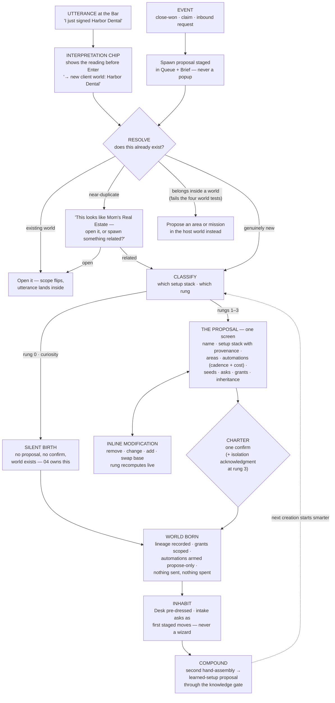

# 09 — Creation and Genesis: How Worlds Come to Exist

*Phase 3 · Experience Architecture. Elaborates constitution §11 (the Proposal, the Charter, the
ceremony ladder), §5–§6 (what a newborn world is made of), and §12–§13 (what may travel into
it). Grounded in the operating model §4 (the intent pipeline) and §1 D5–D6 (lazy birth,
identity-preserving evolution). Sibling contracts: 02 §3 (the Bar and the interpretation chip),
04 §10 (promotion reuses this ceremony), 06 §3.6 (automation proposals at charter), 08 §6
(the spawn seam at close-won). This document owns the creation flow itself — from the first
word to the first morning.*

---

## 0. The creation doctrine

Five commitments govern everything below. They are restatements of the constitution, placed
here because every screen in this document is a consequence of them:

1. **Intent is the only creation verb.** Nobody assembles a workspace, browses a template
   gallery, or fills a setup form. You say what you're trying to do — or an event says it for
   you — and the system proposes the environment. (Operating model, prime mover.)
2. **Ceremony is proportional to weight.** A rabbit hole costs nothing to start. A venture
   costs one confirm. Client money costs a proposal with explicit connection grants. A
   counterparty acting under their own identity adds an isolation review. Never more, never
   less. (Constitution §11.)
3. **One screen, never a wizard.** Everything the operator must see before birth fits on the
   Proposal — a single scrollable screen, editable inline. There is no step 2 of 6. Questions
   that don't change the assembly are not asked at birth; they arrive later as the Desk's
   first staged moves.
4. **Infer everything inferable; ask only what changes the assembly.** The system reads
   memory, sibling worlds, and the triggering record before it asks the operator anything.
   An asked question whose answer the system already held is a defect.
5. **The second assembly is a defect.** If the operator ever builds the same environment
   twice by hand, a setup failed to exist or failed to be learned — and the system's job is
   to notice and propose the learned setup, through the knowledge gate. (P14; operating
   model acceptance test 2.)

One vocabulary note, binding throughout: in everything user-facing, the word is **"setup"**
("based on Mom's setup", "your proven client setup ×9"). "Genome" is spec vocabulary and
never appears in the interface (constitution §2, §15).

## 1. The pipeline, end to end

Seven stages. The first three take seconds and are usually invisible; the Proposal is the one
deliberate moment; the Charter is one gesture; inhabiting begins immediately. The loop closes
at Compound: every creation makes the next one smarter.

## 2. Utterance — and the chip that shows the birth before it happens

Creation begins wherever intent does: the Bar, at Home or inside any world. There is no "New
World" button as the primary path — the primary path is saying what you want. (A `/new <kind>`
command exists for the mechanically minded, per 02 §3.4 parity; it opens the same pipeline at
the classify stage.)

The **interpretation chip** (02 §3.2) is the creation flow's first honesty instrument. While
the operator types, it renders what Enter will do, and creation readings are visually distinct
— a `new` glyph and the weight of what's coming:

> `→ new curiosity · "why do bee hives work?"` — *born silently on Enter*
> `→ new venture · "Stoke" — will propose the setup first` — *one screen follows*
> `→ new client world · Harbor Dental — will propose setup + connection grants` — *nothing
> exists until you charter*

Rules, binding:

1. **The chip states the rung.** A reading that will birth silently says so; a reading that
   will open a Proposal says so; a reading that needs grants names that. The operator never
   discovers the ceremony after committing to it.
2. **Nothing heavier than a curiosity is ever created by Enter alone.** Enter on a rung-1+
   reading opens the Proposal; the world does not exist yet.
3. **Tab cycles alternate readings** — "new venture" vs "mission inside the Agency world" vs
   "note to memory" — because the difference between starting a world and starting work is
   exactly the kind of routing that must never be a mystery.
4. **The chip is correctable, not confirmatory.** High-confidence curiosity readings route on
   Enter with no extra step; the chip existed so the operator could have objected.

## 3. Resolve — existing-world detection and near-duplicate surfacing

Before anything is proposed, the system answers one question: **does this already have a
home?** Resolution is semantic — over world names, counterparty names, contacts, domains,
addresses, and meaning — not string matching. "the dental place", "Harbor", "Dr. Okafor's
office" all resolve to Harbor Dental.

Four outcomes, in priority order:

1. **It exists.** The chip flips from a creation reading to a routing reading
   (`→ Harbor Dental · …`) and Enter lands inside the existing world. This is the common case
   and it is silent — most utterances that sound like creation are actually returns.
2. **It nearly exists.** Something close but not identical — same counterparty different
   engagement, same topic different angle, a sibling's name. The chip becomes a one-row
   question with exactly three answers:

   > *"This looks like **Mom's Real Estate** — open it, or spawn something related?"*
   > `[Open it]` `[Spawn related]` `[No — genuinely new]`

   **Spawn related** proceeds to a Proposal that carries a typed edge to the near-match
   (lineage or `informs`, per 08 §5) and inherits with provenance from it. **Genuinely new**
   proceeds clean, and the system remembers the operator's answer — the same near-match is
   not re-litigated next week.
3. **It belongs inside a world.** The operating model's four tests (pronoun, counterparty,
   memory, lifecycle — D6) run silently. An intent that fails all four is not a world:
   "redesign Jane's menu page" proposes a **mission** in Jane's world; "start doing social
   for Mom" proposes an **area** in Mom's world. The chip says which and why in one clause
   ("→ Mom's Real Estate · new area: Social — this lives inside Mom's world"). The operator
   can overrule ("no, its own world") and the system yields — the cost of a wrong container
   is deliberately low because split and merge exist.
4. **It is genuinely new.** Proceed to classify.

**Never a picker.** Resolution never presents a list of all worlds to choose from. It presents
its best reading, up to two alternates on Tab, and the three-answer near-duplicate row. A
system with a hundred worlds must resolve like a colleague who knows them, not like a file
dialog.

## 4. The Proposal — one screen, the world-to-be

The Proposal is the pipeline's one deliberate screen: **the world as it will be born, stated
completely, editable inline.** It reads top to bottom as an answer to "what am I agreeing
to?" — never as a form. Nothing on it is a field to fill; everything on it is a decision
already drafted, waiting to be corrected.

Its regions, in fixed order:

### 4.1 Name and presentation

The name the operator will actually say ("Harbor Dental"), inferred from the utterance or the
triggering record, editable in place. Beneath it, the presentation line the Face will carry
("Client · Website + Automations · $500/mo") — the same line the operator will see every day,
shown now so the world's identity is agreed before birth.

### 4.2 The setup stack — with provenance

One plain-language sentence stating what kind of world this is and where that kind came from:

> **"Client + Website + Automations — based on your proven client setup, used ×9, refined 4
> times."**

Tapping the sentence unfolds the stack as layers, each a set of plain sentences ("mounts
Outreach, Site, Invoices · runs the invoice chase weekly · asks for brand assets at intake"),
each carrying provenance: *built-in* ("ships with the platform"), *learned* ("distilled from
Jane + Kessler + 7 others, May"), or *sibling reference* ("based on Mom's setup" — see §10).
The stack is inspectable because trust in the ×9 claim requires being able to see the nine.
It is **not** a settings tree: layers are swapped or removed whole (§5), never tuned
checkbox-by-checkbox at birth.

### 4.3 Areas it will mount

The 3–7 areas the world opens with (constitution §5), each one line: name, what it opens as
(view or studio), and why it's here — annotated with its seed when one exists ("**Site** —
opens the rebuilt site from the funnel record" / "**Reviews** — from the setup; empty until
connected"). Each row removable; removal is a local override, recorded (§10).

### 4.4 Automations it wants to run — cadence and cost, named at birth

Every piece of recurring work the world would start, one row each, in the exact grammar of
06 §3.6: **recipe in plain words · trigger/cadence · what it may send and to whom · budget
line · autonomy posture.**

> *Invoice chase — monthly, 3-rung ladder · emails late payers only · ~$0 sends, cap 20/mo ·
> proposes drafts, never auto-sends*
> *Review requests — after each completed appointment · SMS, consented contacts only ·
> cap 40/mo · proposes drafts*

Rules: every automation is born **propose-only** — autonomy is earned later through the Queue
(constitution §8), never granted at charter. Each row is removable inline. **No world ever
starts recurring work that wasn't listed, with cadence and cost, on its Proposal** (06 §14).
Costs are honest and specific; "~" marks estimates and the cap is the commitment.

### 4.5 Seed artifacts

What the world is born already containing — listed, tappable to preview, each with
provenance: from the triggering record ("demo site · built during the pitch"), from the setup
("proposal template · your standard"), from an exploration's map at promotion (04 §10). Seeds
are real artifacts with version rails from day one, not stationery.

### 4.6 Intake — what it will ask, and when

Two short lists, explicitly separated:

- **Asked now, on this screen** — only questions whose answers change the assembly (§9).
  Usually zero to two. Rendered as inline choices inside the Proposal, because answering them
  redraws it ("Retainer or one-off build?" — choosing one-off removes the subscription line
  and the monthly-report automation before the operator's eyes).
- **Asked later, on the Desk** — everything else the world wants to know ("deposit policy?",
  "brand assets?"), shown here as a preview so the operator knows what's coming, deferred
  because none of it blocks birth. These become the first staged moves (§7).

Anything the funnel, the exploration, or memory already answered appears in neither list —
re-asking a known answer is a defect (promotion-without-loss applied to questions, 04 §10).

### 4.7 Connections — explicit, scoped grants, never silently inherited

The Proposal names every external connection the world needs, each as a **grant sentence**:

> *"Send email as **hello@harbordental.com** — needs: their sending domain verified. Scope:
> this world only."*
> *"Read their Google Business reviews — uses: your Google connection. Scope: read-only,
> this world only."*

Rules, binding (constitution §11, §13): a grant names the connection, the direction
(read/send/spend), and the scope, in words. **Nothing is inherited silently** — not the
operator's own accounts, not a sibling world's credentials, nothing; every connection the
world will touch is a row here, granted by charter or added later through the same explicit
path. Grants not yet fulfillable (the client hasn't verified their domain) don't block
charter — they become intake asks with the affected automation shown as waiting on them.
Every grant is visible and revocable on the world's Face afterward.

### 4.8 What it inherits — playbook items with provenance

Patterns arriving from siblings, each a card with its earn-line: *"Pricing playbook — from
your last 4 clients"*, *"Tuesday-send timing — earned in Jane's Bakery, 9 sends"*,
*"Objection-handling notes — from the Agency playbook."* Each declinable inline. Inheritance
is **patterns only**: structure, criteria, timing, recipes — never another counterparty's
rows (P11; constitution §12.5). A declined inheritance is remembered, not re-offered weekly.

### 4.9 First moves

The bottom of the screen previews the first day: the staged next moves the Desk will open
with, and — when the intent implies one — the first mission, compiled and editable ("Onboard
Harbor Dental: confirm scope → collect assets → site live by the 15th"). The operator charters
a world *and can already see its tomorrow.*

### What the Proposal never contains

No capability list ("what this world can do" is everything the platform can do — constitution
§15's no-visibility-just-in-case). No blank-canvas option. No settings tree. No plan-tier
upsell. No second page.

## 5. Inline modification — correcting the draft, not configuring a product

Every region above is editable in place: remove an area, change a cadence, lower a cap,
decline an inheritance, rename, swap the base setup ("use the *premium* client setup
instead"). Additions go through the Proposal's own input line — the Bar, scoped to the
world-to-be: *"also handle her Google reviews"* adds the Reviews area, its automation row,
and its grant row in one motion, because additions are intent too.

Three mechanics, binding:

1. **The rung recomputes live** (§6). Strip the automations and grants from a client proposal
   and the ceremony visibly lightens; add "and text her customers" to a venture and the grant
   rows and isolation section appear. Weight is computed from the proposal's *contents*,
   never from the words that started it.
2. **Edits are local overrides, recorded.** Every inline change is a diff against the setup
   stack (§10), which is how repeated edits become learnable: remove the Reviews area from
   three client proposals running and the system proposes updating the learned setup itself
   — through the gate.
3. **A Proposal is parkable and worthless to abandon.** It persists as a draft (findable,
   resumable from Continue), and abandoning it costs nothing and creates nothing. No orphan
   worlds from half-finished creation.

## 6. Charter — one confirm, and the ceremony ladder

The Charter is a single action at the foot of the Proposal: **"Create this world."** One
gesture births it. What the confirm does: creates the world with its lineage recorded, scopes
the granted connections, mounts areas and seeds, stages the intake asks and first moves, and
arms the listed automations **propose-only**. What it never does: send anything, spend
anything, or contact anyone. Birth is inert by construction — the first outbound act still
passes the Queue like every outbound act.

Ceremony is priced by the heaviest thing on the Proposal. The ladder, with a worked example
at every rung:

**Rung 0 — curiosity: silent, free.** *"Why do bee hives work?"* Enter. No Proposal, no
confirm, no name asked. The chip said `→ new curiosity` and that was the whole ceremony; the
world exists so discoveries have somewhere to live, and 04 owns its life from here. A rabbit
hole must cost nothing to start — this rung is the anti-goal test for the entire ladder: any
process creep here is a constitutional violation.

**Rung 1 — venture: one confirm.** *"I want to launch a clothing brand."* The chip reads
`→ new venture — will propose the setup first`. The Proposal opens: name ("Thread & Stone" —
suggested, edited), setup stack ("Venture + Brand + Commerce — built-in, informed by your
Stoke launch"), five areas, **zero automations** (ventures start quiet), two seed artifacts
(positioning one-pager template, launch checklist from the playbook), one assembly question
("physical goods or print-on-demand?" — it changes which areas mount), no grants (nothing
sends yet). Thirty seconds of reading, one removal (no Wholesale area yet), one confirm.
The Desk opens with three staged moves. Total ceremony: one screen, one gesture.

**Rung 2 — client money: proposal + connection grants.** *"I just signed Harbor Dental —
$500/mo, website plus automations."* The Proposal arrives fully drafted from the prospect
record (§8): presentation line with the money on it, the ×9 client setup, six areas, four
automation rows with cadence and cost, the demo site and audit as seeds, three grant
sentences (send-as domain · review reads · payment link), the pricing playbook inherited ×4.
The operator changes the invoice cadence to net-15, removes the social automation, and
charters. The grants were the added weight: money moving and messages sending under the
operator's name require every connection named and scoped before birth.

**Rung 3 — counterparty with isolation: + isolation review.** Same Harbor Dental, but the
engagement includes acting *as* the practice: their sender identity, their phone number,
missed-call text-back to their patients. The Proposal grows one further section — the
**isolation review**, still on the same screen, never a second step:

> **Their side of the line.** *Runs under Harbor Dental's name: appointment reminders ·
> missed-call text-back · review requests. Their data stays here: patient contacts, message
> history, review content never leave this world — patterns travel, data doesn't. Consent:
> SMS to consented contacts only; automations fail closed without it. Their connections:
> their number, their sending domain — theirs, revocable, listed on the Face.*

The isolation review carries its own acknowledgment line adjacent to the charter action —
one screen, two deliberate marks, because "I understand what runs under their name" is a
distinct agreement from "create this world." This is the heaviest ceremony the platform has,
and it is still under a minute of reading.

**The ladder is monotone and honest.** No rung ever borrows a lighter rung's ceremony by
phrasing ("just a little project for Harbor Dental" still computes rung 2 the moment money
or their identity is on the Proposal), and no rung adds theater ("are you sure?" dialogs do
not exist — the Proposal *was* the sure-making).

## 7. Intake as next moves — never a form wizard

After charter, the world's unanswered questions arrive as **the Desk's first staged moves**
— the same three-slot staged-move grammar every world uses (03), not a special onboarding
surface:

> *"Ask Harbor Dental for brand assets"* — one tap drafts the email, through the Queue.
> *"What's their deposit policy?"* — answer inline in a sentence; forwarding their policy
> doc answers it too.
> *"Connect their sending domain"* — opens the grant flow scoped to this world.

Rules, binding:

1. **Never modal, never sequential, never required-to-proceed.** The world is fully alive
   with every ask open; asks compete for attention through the normal staged-move ranking,
   blocking asks first (a mission waiting on the deposit policy raises that ask's rank and
   says so — 06 §2).
2. **Every answer visibly unlocks something.** The ask names what it feeds ("needed by: the
   invoice automation"), and answering it updates that thing in view. Intake that feeds
   nothing is not asked.
3. **Answers land in memory once.** An answered ask never returns, in this world or any
   future proposal that can read it.
4. **Asks age gracefully.** Unanswered asks compress like any quiet row; a blocking ask past
   its window escalates through the Queue like any blocked work (06 §2.3). There is no
   "complete your profile" nag — there is only work that is or isn't blocked.

A form wizard asks everything upfront because it cannot rank; the Desk asks the next thing
that matters because it can. That difference is the whole design.

## 8. Event-born worlds

Worlds are also born from what happens, not only from what is said (operating model §4). The
three seams, each following the same propose→charter path at the same rung it would earn by
content:

### 8.1 Close-won spawns a client world

When the acquisition funnel closes a deal, the prospect record — which by then contains
months of real work — **spawns** a client-world proposal (08 §6's graduation seam). Nothing
is created silently: the spawn proposal is staged in the Queue and narrated in the Brief
("Harbor Dental signed — their client world is drafted, waiting on you"), never a popup.
The Proposal opens pre-populated. What arrives, exhaustively:

| From the funnel record | Lands as |
|---|---|
| the business scrape and audit | seed artifacts, version history intact |
| the demo site and the rebuilt site | site artifacts; the build's deployment state carries over (07 §"deep artifacts ride the spawn") |
| the entire outreach thread history | the world's first conversations, in memory |
| contact records and their stamps | the counterparty's contacts, per-world relationship stamps |
| post-send signals and analytics | evidence rows behind the Face's first vitals |
| the pitched automation list | the Proposal's automation rows, cadence and cost pre-filled from the pitch |
| the agreed money terms | the presentation line and invoice/subscription scaffolding |
| consent and suppression state | the world's consent gates, honored from birth |
| the `serves` edge and lineage | typed edges: Agency `serves` →, "spawned from: Agency · close-won" — kept forever |

Nothing is copied out of the agency world — the records **re-scope** to the newborn world
(identity-preserving evolution, operating model D6), and what must remain visible to the
funnel's lenses remains so through the edge. The operator's charter is still the birth
moment: rung 2 always, rung 3 when the engagement includes the client's own identity. The
whole point of the seam: **the operator signs a client and reviews a world that already knows
everything the courtship learned** — zero re-entry, zero assembly (08 §8.9).

### 8.2 A claim proposes

A prospect claiming their demo site is an event with a voice but not a signature: it **can
propose** a client world (constitution §11) — the drafted Proposal appears in the Queue,
pre-populated from the record like close-won's ("Ferris Upholstery claimed their site — their
client world is drafted; charter when the deal is real"). A claim never *births* a world:
the proposal waits at the seam, the staged next move is the human follow-up, and the record
keeps advancing normally if the operator lets the proposal sit.

### 8.3 An inbound automation request seeds

An existing client asks for something new ("can it text patients when we miss a call?"). The
request lands as an ask on that world's Desk with a drafted automation proposal attached
(06 §3.6 grammar) — and when the request comes from someone with *no* world, it seeds a
prospect record in the agency world, not a world of its own: events obey the same four tests
utterances do.

## 9. How much the AI infers vs asks

The dividing line is a single question: **does the answer change the assembly?**

| Class | Rule | Examples |
|---|---|---|
| **Inferable** | never asked — read from the utterance, the record, memory, siblings | name, presentation, money terms already agreed, timezone, which areas the ×9 setup mounts, cadences that match the operator's pattern |
| **Assembly-changing** | asked on the Proposal itself, inline, redrawing it live — usually 0–2 questions | "retainer or one-off?" (mounts different areas + automations) · "acting under their name, or yours?" (rung 2 vs 3) · "which of her two locations?" (isolation boundary) |
| **Operating detail** | deferred to Desk asks after charter | deposit policy, brand assets, preferred send window, the client's review-page link |
| **Preference** | defaulted from the playbook and siblings, never asked, always editable later | tone of follow-ups, invoice ladder wording, report format |

Bindings: the Proposal asks its 0–2 questions *as part of the one screen* — a question that
would need its own screen is by definition being asked too early. When the system is
genuinely unsure between two assemblies, it drafts its best one and marks the fork visibly
("assumed retainer — switch to one-off") rather than stopping to interrogate. **Wrong
inferences must be cheap**: every inference is inline-correctable on the Proposal, and the
correction is a recorded override that teaches the setup (§10). The system earns the right
to ask nothing by being visibly easy to correct.

## 10. Setup layering and inheritance

A world's setup is a **stack**: `base` (built-in or learned, versioned in the catalog) `+
learned pattern` (the operator's proven refinements, gate-approved) `+ local overrides` (this
world's diffs, recorded automatically as the operator edits). The stack resolves top-down:
local beats learned beats base. Three consequences carry the whole inheritance design:

1. **Customization never forks.** Editing a world writes local diffs; the shared layers
   beneath stay shared. There is no "detached from template" state, ever.
2. **Improvements propagate as adopt-proposals — never silent mutation.** When a shared
   layer improves, every derived world receives a proposal: *"Your client setup improved:
   adopt the new booking flow?"* — with the diff shown, and **adopt / adapt / decline** as
   the three answers. Adopting applies it; adapting applies it as a local variant; declining
   is remembered. A world with a conflicting local override sees the conflict rendered as a
   diff against *its own* version, not silently overwritten. At portfolio scale, a Lens rows
   the pending adoptions and batch-adopt stages per-world approvals — no gate bypass
   (constitution §8, 08 §4).
3. **Improvements propagate upward through the gate too.** A local override that proves out
   ("make this standard") — or repeats across worlds — is proposed *to the shared layer*,
   through the knowledge gate, with its evidence. Approval there is what fans it out as
   adopt-proposals everywhere else.

### The walkthrough: "add another agent based on Mom's setup"

**n=2.** Mom's Real Estate is a hand-built world — areas arranged over months, an invoice
chase tuned, a listing workflow proven. The operator says *"set up Dana with the same thing
as Mom."* No learned setup exists yet, so the Proposal's stack line reads **"based on Mom's
setup"** — a *sibling reference*: structure, areas, automations with Mom's tuned cadences,
criteria, and playbook patterns, drafted from Mom's world with provenance on every row. What
does **not** come across, structurally: Mom's data (her contacts, her listings, her threads —
patterns travel, data doesn't) and Mom's connections (Dana's MLS login, Dana's sending
identity are fresh grant rows — never inherited, constitution §11). The operator renames,
removes one automation, charters. Rung 2 (money moves). **And then the compound step fires:**
this was the second hand-assembly of the same shape, so the system proposes, through the
knowledge gate:

> *"You've now set up the same real-estate-agent environment twice. Save it as a setup?
> Contains: 5 areas, 3 automations (cadences from Mom's proven values), the listing
> checklist, the intake asks. From: Mom's Real Estate + Dana."*

Approving mints the learned setup — versioned in the catalog, provenance to both worlds.
Both existing worlds are offered a **re-parent** onto it: shown as a no-op diff ("nothing
changes today; future improvements will reach you as proposals"), one confirm each. Declining
the whole thing backs off until the third assembly.

**n=50.** A year later the operator runs a brokerage's worth of agents. Agent #50's proposal
reads **"based on your real-estate agent setup — adopted ×49, refined 6 times"**, and the
Proposal takes ten seconds because everything but the name and the grants is proven. The
differences from n=2, precisely:

- **The base is the learned setup**, not a sibling — Mom's world is now just its most senior
  adopter, with the same standing as every other.
- **Improvement flows are routine.** The operator improves the booking flow inside world #12;
  it's a local override there; "make this standard" (or the pattern repeating in #17 and #31)
  raises the gate proposal; approval fans out 49 adopt-proposals; the Running/Clients lens
  shows adoption state as a column; batch-adopt walks per-world approvals in one sitting.
  Every world that adapted rather than adopted keeps its variant, visibly.
- **Nothing degrades with count.** #50 charters exactly like #2 did — same screen, same rung,
  same grants ceremony (grants never batch: each world's connections are its own) — and
  arrives smarter: ×49 of refinement, the brokerage playbook, honest provenance on every
  inherited row. The hundredth-world test, applied to creation (08 §8).

## 11. Templates, and how setups are learned

**Template influence is a layer, never a destination.** Built-in setups ship in the catalog
(client, venture, curiosity, product, agent…), and the *system* chooses among them at
classify — creation is intent-first, so there is no template gallery to browse before
starting. Where templates surface: on the Proposal, as the stack's base layer, swappable
inline ("use the premium client setup instead"), always with provenance. A template is a
starting layer the operator can see through, not a product aisle.

**Learned setups are the platform's compounding asset**, and they are earned exactly one
way: **repetition noticed, proposal made, gate passed.** The triggers, in order of strength:
the second hand-assembly of the same shape (§10's n=2 — the canonical trigger, P14); the same
local override repeating across ≥3 sibling worlds (propose promoting the override into the
shared layer); a hand-arranged pattern inside one world stabilizing over weeks (propose it as
that world's contribution to its setup). Every learned-setup proposal shows its evidence —
the worlds it was distilled from, row by row — and passes the knowledge gate like every
lesson, because a setup is steering-grade knowledge. What a learned setup may contain:
structure, automations-with-cadences, criteria packs, intake questions, seed templates,
workshop configurations (constitution §6's learned workshops ride inside setups). What it
may never contain: counterparty data, contacts, credentials, or any row from a specific
world. Patterns travel; data doesn't — enforced at the object level, not by review
diligence.

Declined proposals back off on the standard rhythm (next trigger at double the evidence),
and a setup the operator never wanted can be retired from the catalog without touching the
worlds that used it — they keep their layers; the catalog just stops offering it.

## 12. Duplication prevention — at birth and after

Duplicates are fought at three moments, none of them with a warning dialog:

1. **At the chip** (§3): resolve-first means the common duplicate — creating what exists —
   usually dies before Enter, converted into a return.
2. **At the near-match row** (§3.2): the three-answer question ("open / spawn related /
   genuinely new") makes the borderline case a one-second decision, and remembers it.
3. **After the fact, by merge.** When two worlds turn out to be one — overlapping memory,
   the same counterparty, cross-referencing artifacts — the system proposes a **merge**
   (operating model D6) with a preview: what re-scopes, which edges persist, what the merged
   Face reads. Merge is a proposal like any other; nothing is lost because nothing is ever
   deleted (P12).

Name collisions are presentation problems, not identity problems: two "Jane"s disambiguate
by counterparty and presentation line everywhere they render; the system never blocks a name.

**And the symmetric repair:** a chartered world that was a mistake costs one gesture to
archive — ghosts doctrine, reachable forever, resurrectable by meaning. Creation can afford
to be this fast *because* every wrong outcome (duplicate, wrong container, regret) has a
cheap, lossless repair. Speed and safety are the same design.

## 13. Acceptance checks for this document

1. A curiosity world is born in one Enter with zero screens (rung 0).
2. No world heavier than curiosity exists before an explicit charter.
3. Every Proposal fits one screen; no creation path contains a second sequential step.
4. Every automation a world starts life with appeared on its Proposal with cadence and cost.
5. No connection is ever inherited silently; every grant is a scoped sentence, revocable,
   listed on the Face.
6. Counterparty identity work never charters without the isolation acknowledgment.
7. Nothing known is re-asked — not from the funnel record, not from an exploration, not from
   memory.
8. Intake after charter is staged moves on the Desk; no modal, no wizard, no completion nag.
9. Close-won produces a chartered client world with zero re-entry of anything the funnel
   learned.
10. The second hand-assembly of any shape produces a learned-setup proposal through the
    knowledge gate.
11. Shared-layer improvements reach derived worlds only as adopt/adapt/decline proposals —
    never silent mutation; upward promotion also passes the gate.
12. No learned setup contains counterparty data, contacts, or credentials.
13. Creating world #100 uses the same screen, rung, and gestures as world #2, and arrives
    with more provenance, not more process.

## 14. Direct answers to the phase brief

| Question | Answer |
|---|---|
| How is a world created? | By intent — an utterance at the Bar or a qualifying event — resolved against existing worlds, classified into a setup stack and ceremony rung, drafted as a one-screen Proposal, chartered in one confirm. Nobody assembles (§1). |
| How does the system avoid duplicate worlds? | Resolve-first semantics at the chip, the three-answer near-match row ("open / spawn related / genuinely new") with remembered answers, and post-hoc merge proposals with preview (§3, §12). |
| What is on the Proposal? | Name/presentation, the setup stack with provenance, areas, automations with cadence and cost, seed artifacts, the 0–2 assembly questions plus a preview of deferred asks, connection grants as scoped sentences, inherited playbook items, and the first staged moves — all inline-editable, on one screen (§4). |
| What does the Charter do? | One confirm: births the world inert — lineage recorded, grants scoped, automations armed propose-only, nothing sent or spent. Rung 3 adds one isolation acknowledgment on the same screen (§6). |
| How much ceremony? | Priced by the Proposal's contents, recomputed live: silent (curiosity) · one confirm (venture) · + connection grants (client/money) · + isolation review (counterparty identity). Worked examples at every rung (§6). |
| How does intake work? | As the Desk's first staged moves after charter — ranked, inline-answerable, each naming what it unlocks, never a wizard, never modal, never re-asking anything known (§7). |
| What arrives in an event-born world? | For close-won: scrape, audit, demo and rebuilt sites with deploy state, thread history, contacts and stamps, signals/analytics, pitched automations pre-filled, money terms, consent state, and the serves/lineage edges — re-scoped, never copied (§8.1). |
| What does the AI ask vs infer? | It infers everything memory, siblings, and the record can answer; it asks only assembly-changing questions (usually 0–2), inline on the Proposal; operating details defer to Desk asks; preferences default from the playbook (§9). |
| How does inheritance work? | Setup = base + learned pattern + local overrides. Locals win; improvements move only as adopt/adapt/decline proposals downward and gate-approved promotions upward. Demonstrated at n=2 and n=50 (§10). |
| Where do learned setups come from? | Repetition noticed (second assembly, repeated overrides, stabilized patterns) → evidence-linked proposal → knowledge gate. Structure and criteria travel; data never does (§11). |
| What if creation goes wrong? | Wrong container: overrule at the chip, or split/merge later. Regret: one-gesture archive, lossless, resurrectable. Cheap repair is what makes fast creation safe (§3, §12). |

---

*Cross-references: 02 §3 (the Bar, chip, and scope mechanics this flow rides on); 03 (the Face,
Desk, and staged-move grammar the newborn world opens into); 04 §10 (promotion as this ceremony
applied to a living exploration); 05 (the automation and grant grammars the Proposal quotes);
06 §3.6 (automation proposals; charter-time naming); 07 (seed artifacts and deep-artifact
spawn); 08 §5–§6 (edges, lineage, the close-won seam at portfolio scale); 13 (acceptance tests
derived from §13); 17 (the learning loops that make setups compound).*
