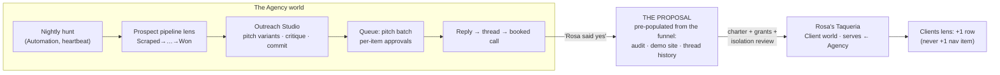

# 10 — Key User Journeys: The Seven Scenarios, End to End

*Phase 3, document 10. Every prior document specified a mechanism; this one runs the film. Each
journey below walks one of the seven required scenarios from first utterance (or first event) to
day 30, through at least one Workshop session and at least one mastery loop, through a realistic
failure, and through its lifecycle transitions. Everything here is an application of the
constitution — the shell (doc 02), the world grammar (doc 03), Explore (doc 04), capabilities
and drive modes (doc 05), Missions and Automations (doc 06), artifacts and the Builder (doc 07),
and Lenses (doc 08). Where a journey needed a call the earlier documents did not make, the call
is made here, decisively, inside the constitution's bounds.*

**Reading rule.** Spec words (genome, capability, Standing Order, the Line, the Spine, the
Situation) appear in prose only. Every quoted piece of interface text uses display language from
the constitution's terminology table: worlds present as what they are ("Client," "Business,"
"Exploration," "Build"); Standing Orders present as "Automations"; the Situation renders as Home;
the approval surface is "the Queue"; the flight recorder is "Activity." Interpretation-chip
quotes use the Bar's chip syntax from doc 02 (`→ scope · reading`).

**The cast, held constant across all seven journeys** (one operator, one portfolio — the
journeys interleave in real life and the document keeps them interleavable):

| # | Journey | Worlds involved | Named exception exercised | Mastery loop exercised |
|---|---|---|---|---|
| 1 | The agency at ten clients | the Agency; Rosa's Taqueria + 9 sibling client worlds | **bounced sends** | outcome-annotated outreach → Playbook; critique on pitches |
| 2 | Real-estate agents at n=2, 10, 50 | Mom's Real Estate; Dave Kowalski; 48 more | **isolation near-miss** | criteria-in-critique (fair housing); pattern promotion with provenance |
| 3 | The mural business | Marco's Murals | **wrong-genome guess** | outcome-annotated proposals → Playbook; criteria edited to the artist |
| 4 | The clothing brand | Inkfall; grant from Marco's Murals | **isolation near-miss** (grant boundary) | scored critique with rubric transfer; post-launch outcome annotation |
| 5 | Inbox outreach automation | Podcast Outreach | automation silence (**silence is loud**) | variant outcomes → Playbook; predicted-vs-actual reply rate |
| 6 | Rabbit hole → "make this real" | Coffee-cart curiosity → Cart Kit | **blocked mission** (intake) | calibration: predictions closed, hit-rate shown |
| 7 | The builder | Cart Kit's Build Studio | **blocked mission** (grant + failing check) | product criteria in critique; conversion prediction closed |

All four exceptions named by the phase brief — bounced sends, a blocked mission, a wrong-genome
guess, an isolation near-miss — are exercised above, each in the journey where it would really
happen.

---

## Journey 1 — The Website + Automation Agency, Ten Clients Deep

*Scenario: an agency operator with 10+ active clients. Required beats: the full prospect→client
conversion, and the pipeline / attention / approval views that make ten clients feel like one
practice, not ten jobs.*

### 1.1 The standing situation

The Agency is a Business-kind world and the portfolio's gravity well. Its areas: **Prospects**
(view: records — the funnel), **Outreach** (a Workshop: Outreach Studio, table + document
benches), **Clients** (view: the roster of `serves` edges — each row a neighbor world's honest
state), **Money** (view: ledger lines that drill to rows). Its Automations, each with a
heartbeat trace one tap away: the nightly prospect hunt (scrape → audit → demo site staged),
follow-up sequences, invoice chasing. Its Face reads service health and money: "Agency · 10
clients · $4,850/mo · 2 need you."

At Home, three lens chips do the portfolio's work: **Prospect pipeline** (board: Scraped →
Audited → Demo built → Pitched → Replied → Booked → Won — columns computed from evidence, never
hand-dragged), **Clients** (table: health, money, last delivered, approvals waiting), and
**Running** (every Automation everywhere, heartbeat column first). The Field itself stays a
handful of orbs: seven healthy clients compress to a quiet band; the two that need attention
render full; the pipeline is a chip, not a place.

### 1.2 The conversion beat — prospect to client, end to end

**Day −9.** The nightly hunt stages 14 new prospects. The Brief's morning line: "The hunt found
14 candidates in the 78704 strip; 11 have no mobile site. Demo drafts are staged for the best 6."
Tap → the rows.

**Day −8.** The operator opens the Outreach Studio from the Agency's Outreach area. The bench is
the prospect table; the Palette holds the pitch templates (recipe-flagged artifacts), the
Playbook ("Tuesday 10am sends replied best — 9-client evidence"), and the audit docs. A
divergence pass produces two pitch variants for the restaurant segment; critique scores them
against the outreach criteria (specific, honest, no manufactured urgency; a placeholder token is
a hard fail, not a deduction). Commit → 6 pitches staged as approvals.

**Day −8, the Queue.** The Pulse shows 6. The Queue batches by class — "6 prospect pitches" —
and walks them per item, full draft inline, audit evidence attached. Approve, approve, edit one
subject line, approve. Sends go out through the one gate everything outbound uses.

**Day −6.** The Pulse: a reply. Rosa of Rosa's Taqueria — "how much, and can it text people back
when we miss calls?" The thread lives in the Agency world; the booking Automation offers her a
slot; the call happens off-platform.

**Day −5, the event.** The operator, at the Bar: *"Rosa said yes — $500 a month, website plus
missed-call textback."* The chip, before Enter:

> `→ the Agency · close-won: Rosa's Taqueria — spawn a Client world?`

Close-won is an event that proposes a world (constitution §11). Enter opens the Proposal.

### 1.3 The Proposal

One screen, everything editable inline:

- **Name & presentation:** "Rosa's Taqueria — Client · Website + Missed-call textback ·
  $500/mo · since July."
- **Setup:** "your proven client setup ×9" — base client shape + the learned layer earned across
  nine charters. (The word "genome" appears nowhere.)
- **Areas it will mount:** Site · Automations · Content · Money · Reports.
- **Automations it wants to run**, each with cadence and cost: missed-call textback (on event;
  per-message cost shown), review request (weekly), monthly report (monthly), invoice (1st).
- **Seed artifacts:** the audit doc, the demo site — mounted as *draft v1 of her real site*, not
  a copy — and the entire outreach thread history. Nothing the funnel produced is re-created.
- **Intake asks:** hours and menu, photo access, phone-forwarding confirmation, domain choice.
- **Connections it needs — explicit, scoped grants:** her business profile, her phone number,
  payment collection. Each scoped to this world only, listed on the Face, revocable. Never
  silently inherited from the Agency.
- **Inherited from siblings, with provenance:** "pricing playbook (last 4 clients)," "Tuesday
  10am send timing (×9)," "review-request wording (earned: Jane's Bakery)."
- **Isolation review** — the ceremony ladder's heaviest rung, because a counterparty with money
  is involved: her sender identity, her data scoped to her world, what the Agency may see of her
  (roll-up health only).

### 1.4 Decisions and charter

The operator removes the Reports area ("fold it into the monthly email"), drops review requests
to biweekly, approves two grants now and defers payment collection until the first invoice.
One confirmation. Rosa's world is born already containing its own history; its Desk stages the
intake asks as the first next moves — never a form wizard. The Clients lens gains a row. The
shell gains nothing.

### 1.5 The workshop beat — launching her site

Two days later, photos in, the operator opens Rosa's **Site Studio**. Gather: her photos, the
audit's findings, and the local-business site criteria from the domain pack (menu above the
fold; tap-to-call; honest hours; no stock-photo food) sit in the Palette. Diverge: two homepage
directions on the bench, side by side as running previews. Critique scores both, with why
("Direction A buries the phone number below the menu — fails tap-to-call priority"). Converge on
B; commit → publish. The publish is an outbound exit: it stages in the Queue with the compare
(draft vs live) inline, and goes live on approval. The Ledger keeps the whole session — including
the criterion that decided it.

### 1.6 Ongoing use

**Day 2.** The Brief: "Rosa's textback answered 3 missed calls last night; 2 booked. Her site
draft waits on the menu photos — asked again this morning." Every sentence taps through to rows.
The heartbeat trace on the textback Automation shows last ran / what it sent, one tap from the
Desk.

**Day 30.** Ten clients produce one Queue, not ten inboxes. Batch-by-class handles the weekly
review requests across six clients in ninety seconds — staged per-item, no gate bypassed. Then
the Queue itself offers the dial: "9 clean approvals of review requests across 6 clients —
auto-approve this class? Instantly revocable." The operator turns it. Auto-approved sends keep
appearing in the ledger view; the Brief digests them ("review requests went to 6 clients; 2 new
reviews"). Attention now spends itself only where the Field says it should: Jane's invoice is 12
days overdue — her orb warns; Rosa glows quietly green.

### 1.7 Transitions

Prospect→client is the spawn this journey exists to prove: the world was born *from the funnel's
own rows*, pre-populated, linked `serves ← Agency`, with the Agency's roster and roll-ups
updating because an edge exists — not because anyone filed anything. The tenth client repeated
none of the first client's setup; the eleventh will repeat none of the tenth's. When a client
churns, the world goes dormant, never deleted; the lens row moves to the lifecycle section of
the "everything" view; the Playbook keeps what was learned.

### 1.8 When it goes wrong — bounced sends

Tuesday's follow-up batch to 25 aging prospects bounces 9. The sending Automation's own
threshold trips: the run **halts its class** (it does not keep spraying), stamps its heartbeat
trace "sent 16 · bounced 9 — halted above threshold," and surfaces one Queue item carrying the
evidence rows inline. The Pulse ticks up by exactly one — a real row, no theater. The Brief next
morning says it plainly: "Tuesday's prospect follow-ups halted — 36% bounced (list older than 60
days)." The Counsel in the Outreach Studio proposes the repair as a move: verify addresses on
the bench's table (an asked-for move, watched, not a silent scrub), drop the dead rows, resume
the class. The operator runs it, resumes, and approves the Playbook lesson the session distilled:
"verify prospect emails older than 60 days before sequencing" — human-gated, evidence attached,
consulted by every future hunt.

### 1.9 The mastery loop

Every sent pitch is an artifact whose outcomes annotate it: "this subject line: 3 replies."
Annotations roll into the Agency's Playbook, and the next Outreach Studio session opens with
that evidence in the Palette — the Counsel recommends *from it*, cited, not from vibes. The
critique rubric is visible and editable; over ten clients the operator has stopped writing
pitches that fail the specificity criterion, because the rubric taught the judgment, not just
fixed the drafts. That is the difference between an automated agency and a better operator.

---

## Journey 2 — Real-Estate Agents: The Second, the Tenth, the Fiftieth

*Scenario: serving real-estate agents. Required beats: adding agent n without repeating agent
n−1's setup, and inherited-improvement adoption.*

### 2.1 The second agent

Mom's Real Estate has run for four months — a Client-kind world dressed real-estate: **Listings**
(view over her feed), **Leads** (view + follow-up Automations), **Marketing** (a Workshop:
Postcard Studio, gallery bench), **Money**. At a barbecue, Dave Kowalski asks for the same.

At the Bar: *"set Dave Kowalski up like Mom."* The chip:

> `→ new Client · based on: Mom's setup`

The Proposal arrives **pre-answered by the learned layer**: presentation ("Dave Kowalski —
Client · Real-estate agent · $300/mo"); areas Listings · Leads · Marketing · Money; Automations
(new-listing announcement on his feed's events, open-house follow-up, monthly market update);
seed artifacts — the postcard recipes and the market-update template, each carrying its
provenance chip ("earned: Mom's Real Estate"). The intake asks are only what is genuinely
Dave's: his listing-feed (MLS) credentials as a grant scoped to his world, his sender identity,
his farm-area zips.

**The binding line this journey proves: patterns travel, data doesn't.** Mom's contacts, her
sold prices, her thread history — none of it appears in the Proposal, because none of it may
cross. What crosses is the distilled shape of what worked, stamped with where it was earned.

Ninety seconds of review, grants approved, charter. Dave's Desk stages his three intake asks.
Nothing was assembled by hand — the no-second-assembly test, passed at n=2.

### 2.2 The workshop beat — the postcard session

In Mom's Postcard Studio, the quarterly farm mailing: gather (her recent solds, the
neighborhood's palette, and the real-estate domain pack — whose criteria include fair-housing
language rules); diverge into eight variants on the gallery bench; critique scores each with
why. Variant 5 comes back 4/10: "implies neighborhood exclusivity — fails the fair-housing
criterion." The operator opens the rubric, reads the criterion and its citation, and understands
*why* — a mastery event the score alone would not have produced. Converge on two; commit →
Mission: "print and mail Q3 farm postcards" — the print-vendor exit stages in the Queue with the
final artwork and the recipient count inline.

### 2.3 The tenth and the fiftieth

The tenth agent's Proposal takes under a minute: everything is pre-answered except the grants
and the isolation review, which can never be skipped — counterparty rungs of the ceremony ladder
do not compress below one explicit review, at any n. The fiftieth agent arrives by event: the
referral form on the operator's site proposes the world; the Proposal waits in the Queue.

Fifty agents produce **zero new navigation**. They produce one **Agents lens**: table rendering,
grouped by farm area — health, listings live, sends this week, money — every signal cell a drop
into that agent's Desk pre-focused on the row's reason. The Field still renders a handful of
orbs: the two agents who need the operator, the quiet band, and the count. The Brief speaks at
portfolio grain: "48 agents quiet. Dave's open-house follow-ups doubled replies again. Priya's
feed connection expires Friday."

### 2.4 Inherited-improvement adoption

Six weeks in, the operator improves the open-house follow-up *inside Dave's world*: an
Outreach-Studio session turns the single next-day email into a same-evening text + next-morning
email pair. Outcomes prove it (2.1× replies across six weeks); the Playbook lesson passes the
gate; then the system proposes promotion: "This pattern outperformed the shared version — offer
it to your other agent setups?" On approval, the pattern enters the shared learned layer — and
**every derived world receives a proposal, never a mutation**: "Your agent setup improved: adopt
the two-step open-house follow-up? (earned: Dave Kowalski, 6-week evidence)." The Queue stages
them batch-by-class; the operator adopts for 41, skips 7 whose counterparties dislike texting —
each skip recorded as a local diff that future proposals respect. Mom's world adopts it too:
improvement flows *back up* the lineage as easily as down.

### 2.5 Ongoing use

**Day 2 (Dave).** His first new-listing announcement waits in the Queue, full draft inline,
listing row attached. **Day 30.** Follow-up classes have earned autonomy in the worlds with
clean streaks — per world, per class, each dial revocable in one gesture from the row it
governs. The monthly market updates digest into one Brief line with 48 taps of evidence behind
it.

### 2.6 When it goes wrong — the isolation near-miss

Composing Dave's market update, the operator says: *"use the sold-price case study from Mom's
spring mailing."* The chip renders the crossing treatment — this reading reaches into another
counterparty's world — and the Counsel answers before anything moves: "That case study is built
on Mom's client data — I can't use her numbers in Dave's world. The case-study *format* is in
the shared playbook. Want it filled with Dave's own solds?" The near-miss dies at the reference:
nothing crossed, the refusal is logged in the session Ledger, and both Faces continue to show
zero grants between the two agent worlds — which is the honest state of the relationship. The
operator takes the format; Dave's numbers fill it.

### 2.7 The mastery loop

Postcard outcomes annotate their variants ("this one: 3 calls, 1 listing appointment") and roll
into each world's Playbook; promotion with provenance moves only the pattern. The fair-housing
criterion in every critique is the domain pack teaching where it matters — in use, on real
drafts, never as courseware. By the fiftieth agent the operator is measurably better at this
business — and so is the setup itself, which is the point of running fifty on one grammar.

---

## Journey 3 — The Artist / Mural Business

*Scenario: an artist (Marco, the operator's brother) whose mural-and-prints business gets a
tailored feel — without becoming a separate app.*

### 3.1 Entry and the wrong guess

At the Bar: *"help me run my brother's mural business — commissions, plus he sells prints."*
The chip:

> `→ new Client · mural business · counterparty: Marco`

The router hears "brother's business you serve" and guesses the client shape — a counterparty,
an isolation contract, invoicing. The Proposal says so plainly ("Client · serving Marco ·
isolation review"). The operator, moving fast, accepts. The guess is wrong, and the system will
pay for it honestly in §3.5 — the cost of a wrong guess is deliberately low, which is why the
charter didn't interrogate.

### 3.2 What exists now — the tailored feel

Marco's Murals opens feeling like a mural-business app, and is not one. The dressing does all of
it: areas named **Commissions** · **Walls** (the portfolio of finished work) · **Prints** ·
**Outreach**; the Face's health defined as commission pipeline + print sales + gallery momentum
("2 proposals out · Drop 3 sold 41 prints"); the Counsel's stance is artist-manager (protective
of the work, commercial about the calendar); the Desk stages what a mural business needs staged
("two commission inquiries need proposals — site photos attached"); the terminology skin says
"Commission," never "Deal," and "Drop," never "Campaign." Underneath, the skeleton is untouched:
the same Bar, the same Queue, the same posture dial, the same artifact frames. Tailored feel is
the dressing being *total* while the grammar changes nothing — that is how it stays learnable
alongside the Agency and never becomes a disconnected mini-product (anti-goal, §15).

### 3.3 The workshop beat — the commission proposal

The Riverside Cafe wants a wall. The **Commission Studio** composes document + gallery benches:
gather (the cafe's site photos, wall dimensions, Marco's style references, the mural domain
pack — criteria: sightlines from the street, palette against the building, weather durability,
honest scope-and-price); diverge (three concept boards over the wall photo); critique with why
("Concept 2's detail band sits below sightline from the crosswalk — invisible to foot
traffic"); converge; commit → the proposal document, versioned, provenance to the session; send
stages in the Queue with the full document inline. Marco reviews the concepts on a phone —
compare-two-variants is a mobile-supported state — and the operator approves the send.

### 3.4 Ongoing use

**Day 2.** The Brief: "Riverside opened the proposal twice; no reply yet. Prints: Tuesday's drop
Automation staged 3 posts — waiting on you." Heartbeat traces on the drop Automation are one tap
away wherever its posts appear. **Day 30.** The weekly print drop has earned autonomy for the
posting class; commission proposals never will, by the operator's own dial — some classes should
stay gated forever, and the dial belongs to the operator, not the streak.

### 3.5 When it goes wrong — the wrong-genome guess, corrected

Week 3: the Desk stages "invoice Marco for March — $180." The operator, at the Bar: *"stop
invoicing my brother — we run this together."* The chip:

> `→ Marco's Murals · change setup: Client → family business`

The re-genome proposal shows exactly what changes and what cannot: Money re-dresses from
invoice-the-counterparty to shared income and costs; the isolation contract is dissolved **by
explicit review** — each formerly counterparty-scoped item (his contact list, the commission
records) is shown and re-scoped to the world deliberately, not silently; the areas, artifacts,
Ledger, Playbook, and thread history do not move, because nothing ever moves. One confirmation.
Same world, same identity, same memory — different kind. The wrong guess cost one staged move
and a sentence, which is the designed price (evolution is identity-preserving; correction is
cheap by construction).

### 3.6 Transitions

The Prints area is quietly outgrowing its home — its own audience, its own money rhythm. When it
passes the lifecycle test, the system will propose a split into a linked world with lineage.
Not yet; the proposal will wait until the evidence is real, because pushing a split early is
theater.

### 3.7 The mastery loop

Proposal outcomes annotate the artifacts: proposals with site photos and a street-view sightline
mock win 2× — a Playbook lesson Marco's Counsel now cites in every gather phase. The critique
criteria were edited to Marco's own convictions early on (he added "never paint over brick
detail without saying so in the proposal") — the rubric is his taste made explicit, which is
what makes the critique feel like *his* studio and not a generic scorer. The operator, who is
not an artist, has learned to read a wall — the domain pack in use.

---

## Journey 4 — The Clothing Brand from the Brother's Artwork

*Scenario: a clothing brand (Inkfall) built on Marco's art. Required beats: the authorization
grant from the artist world, the apparel workshop session beat-by-beat, and the coexistence of
creative and operational work.*

### 4.1 Entry, and the grant

At the Bar: *"I want to start a clothing brand around Marco's artwork — call it Inkfall."* The
chip:

> `→ new Business · clothing brand · needs: artwork from Marco's Murals`

Venture rung of the ceremony ladder: a light Proposal, one confirmation. Areas: **Design**
(Workshop: Design Studio, gallery bench) · **Collection** · **Story** · **Shop** (dormant until
the brand actually sells). No clock work yet. The one heavy element is the connections block:
**"Authorization: Marco's artwork — the print-licensed set (12 pieces) — from Marco's Murals."**

The grant is executed from the *artist world's side*: a Queue item scoped to Marco's Murals —
"Inkfall requests use of the print-licensed collection (12 pieces) — grant?" — with the pieces
listed. Approved, the grant appears on **both Faces** ("grants → Inkfall: 12 pieces" / "granted
← Marco's Murals"), revocable from either, and every use of every piece anywhere in Inkfall
carries its provenance chip. Cross-world material moves through grants or it does not move.

### 4.2 The apparel session, beat by beat

The first Design Studio session, on the gallery bench — the six-part grammar doing exactly what
it exists for:

1. **Gather.** The Palette arrives loaded: the 12 granted pieces (each chip: "Marco's Murals ·
   granted May 12"), the brand-values note from the charter, the apparel domain pack (criteria:
   print integrity at garment scale, colorway safety, placement conventions, read-at-distance),
   and the Playbook — empty on day one, the pack standing in until lessons are earned. The
   Counsel opens already knowing Marco's linework from the granted set; a generic first
   suggestion here would be a defect, not a shrug (anti-generic invariant).
2. **Diverge.** "Twelve tee graphics from these three pieces." A variant set fills the bench.
   Constraint move: *"more negative space — keep the ink texture."* The set re-diverges under
   the constraint; the Ledger records the constraint and its wording.
3. **Develop.** Place-on-product: the survivors render on tee, hoodie, long-sleeve mockups; the
   colorway move crosses four graphics with three garment colors. All of it is variants on the
   bench — nothing is precious yet, which is what makes divergence honest.
4. **Critique.** Scored against the criteria, every score with its why: "#7 — 6/10: linework
   density falls below print resolution at chest scale; enlarge or simplify." The operator opens
   the rubric, adds a criterion of their own — "must read at 10 feet" — and rescores. The rubric
   is now partly theirs; judgment is transferring, not just output improving.
5. **Converge.** Tournament: twelve to four, side-by-side eliminations, each elimination
   reasoned in the Ledger.
6. **Commit.** Three exits off the rail: → the **Collection board** artifact ("Drop 01 — 4
   designs × 3 colorways," versioned, provenance to this session); → a delegation — *"ten more
   explorations of #3's direction overnight, per the ledger"*; and, held for later, → the
   Mission "produce Drop 01."

Next morning, the worker's ten variants sit in the *same session*, Ledger-stamped "worker ·
overnight · guided by: converge decision + edited criteria." Three score above the bar. The
drive slider moved from hand to handed-off and back without the room ever changing — that is
drive-mode continuity, felt.

### 4.3 Coexistence — creative and operational in one world

When Drop 01 goes on sale, the operating layer mounts through its own proposal (money rung:
storefront and payment connections, explicitly granted, scoped to Inkfall). Now the same world
holds both kinds of work, and the posture dial is how they share the room: **Create** stages the
Design Studio's open session and the next drop's critique queue; **Execute** stages orders,
fulfillment exceptions, and the restock Automation's heartbeat; **Observe** stages sell-through
by design. Same Desk, differently lit. The operator flips between making and running without
leaving the world, and neither mode buries the other — the Face reads both: "Drop 01: 38
orders · Drop 02: 4 designs in critique."

### 4.4 Ongoing use

**Day 2.** Brief: "Drop 01 mockups approved; the print vendor exit waits in the Queue (cost
inline)." **Day 30.** The restock Automation runs quietly with its trace one tap away; Drop 02's
session resumes from the Continue rail exactly where the tournament left off; Marco — from his
own world — has granted three new pieces, which arrive in Inkfall's Palette with fresh
provenance chips and a staged Desk move: "three new granted pieces — place-on-product?"

### 4.5 When it goes wrong — the isolation near-miss at the Palette

Mid-session, the operator searches the Palette for "the courthouse mural study" — a Marco piece
that is **not** in the grant, because it was commissioned work owned by the client who paid for
the wall. The Palette shows it as a reference listing only: greyed, unplaceable, chip reading
"not granted — commissioned work (Riverside Cafe)." It cannot land on the bench at all — the
boundary is mechanical, not advisory. And the advisory layer speaks too: the Counsel, which
knows the provenance from Marco's world's records it is *allowed* to know (grant metadata, not
content), adds: "that one isn't Marco's to license — recommend not requesting it." The
near-miss is over before it began; the Ledger records the refusal; the grant on both Faces
remains exactly 15 pieces. If the operator disagrees, the path is explicit: an extension request
into Marco's Murals' Queue — where it would be declined for the stated reason.

### 4.6 The mastery loop

By session three the operator predicts scores before the critique lands — the rubric has done
its real job. After launch, outcomes annotate the designs themselves: "#3 black: 21 of 38
orders." The gated Playbook lesson — "hand-inked texture outsells flattened fills 3:1" — is
cited by the Counsel in Drop 02's gather phase, with the sales rows behind the claim. Marco's
art is the brand's soul; the Playbook is becoming its commercial judgment; the operator now
owns both.

---

## Journey 5 — The Inbox Outreach Automation

*Scenario: a recurring outreach chore that matures from hand-work into a Standing Order — with
no workflow-builder ever forced on the operator.*

### 5.1 The chore, done by hand — weeks one and two

The operator pitches themselves for podcast guest spots. Week one, at the Bar: *"draft intro
emails to these eight podcast hosts"* (a list pasted in). The chip:

> `→ new Business? · podcast outreach — or keep it in a session?`

The router is honest about the ambiguity; Tab resolves it to a light world — "Podcast Outreach,"
an Automation-kind-to-be that starts as barely more than a container. The **Outreach Studio**
opens (table + document benches composed): hosts on the table, message variants on the document
side. Critique runs the outreach criteria — specific to the show, honest, and the hard gate: a
placeholder token can never pass to a send. Eight drafts commit → eight approvals in the Queue →
sent. A finite batch; a small mission; done.

Week two: *"same thing — new rows."* Same session resumed from Continue, same beats, faster.

### 5.2 The proposal — week three, and no workflow-builder

On the third Monday, the system proposes — as a staged Desk move, not a popup: "Third Monday
running. Make this a weekly Automation? Recipe: your last three sessions' ledger." The proposal
shows the recipe **as prose plus the Ledger**, because the Ledger already *is* the workflow:

- **Trigger:** "Mondays 9am, from new rows in the list."
- **Steps, in plain language:** draft per host from the winning variant family · skip anyone
  previously emailed · queue for approval · one follow-up after 5 days if no reply.
- **Gates:** first-touch always walks the Queue; follow-ups start gated too.
- **Budget:** max 12 sends/week, cost shown.
- **The promise:** a heartbeat trace, always one tap away; silence will be loud.

One confirmation. A Standing Order exists; the interface calls it "Automation: Monday podcast
outreach." **At no point did a node-graph editor appear.** The recipe was earned from the
ledger and edited by talking (*"skip hosts I've emailed before"* was a sentence, and became a
step). The flow bench exists — opening the Automation's own workshop shows the recipe on it,
inspectable and hand-editable — but it is the third layer (inspect), reached only by those who
want it, never a prerequisite for automating. Maturation is a slider, not a builder.

### 5.3 Ongoing use

**Day 2 of automation.** Monday 9:04, the Pulse: "6 outreach drafts waiting." Approvals inline,
ninety seconds. **Day 30.** The follow-up class has five clean weeks; the Queue offers the dial;
the operator auto-approves follow-ups and deliberately keeps first-touch gated — their name is
on these emails. Every auto-approved follow-up remains in the ledger view; the Brief digests
Mondays in one line.

### 5.4 When it goes wrong — silence is loud

Week seven, the list source's connection expires. Monday 9:00 passes; nothing fires. The Clock
notices the missed heartbeat within the hour: the Pulse ticks, the Queue carries "Monday
outreach didn't run — list connection expired," and the Brief says it in words the next
morning. The failure mode recurring work must never have — quietly not happening — is
structurally impossible: the Automation's absence is itself an event. Reconnect is inline from
the Queue item; the run fires late, reports what it did, and the heartbeat trace shows the gap
honestly rather than papering over it.

### 5.5 Transitions and the mastery loop

The world stays small on purpose — not everything grows. If guest spots start driving real
business, the promotion offer will come (intent language and artifact creation are the
signals); until then, an Automation-kind world with one routine and one studio is a complete,
respectable citizen. The mastery loop runs regardless: reply outcomes annotate the variants
("mentioning a specific episode: 3× replies" — gated into the Playbook and cited by the Counsel
in week nine's drafts), and the studio shows predicted vs. actual reply rate each month — a
small calibration honesty that keeps the operator's instincts, not just the templates,
improving.

---

## Journey 6 — The Rabbit Hole That Becomes Real

*Scenario: free exploration promoted to a venture. Required beat: "make this real," felt
beat-by-beat.*

### 6.1 The free fall

Tuesday night, at the Bar: *"why do all the good coffee carts around here vanish within a
year?"* The chip:

> `→ new curiosity · "why do coffee carts vanish?"`

Enter. No form, no name, no dialog — the ceremony ladder's free rung. An Exploration exists
because the first exchange does. The surface is conversation-forward with the live map growing
in the margin: nodes for permit churn, commissary costs, the winter revenue cliff, the used-cart
resale market. *"Hold that thought — who ends up owning the carts when they fold?"* parks a
beacon: a named gap with the held guess, listed, aging, revisitable. Two hypotheses become
first-class map objects — H1: permits churn them out; H2: winter cash gap kills them — claims
with evidence edges, comparable side by side.

### 6.2 The workshop beat — the theory bench

*"Take this into a workshop."* The theory workshop opens on the map/graph bench, the
exploration's map riding along in the Palette. Hypotheses become rows with assumptions,
evidence, and **predictions** — "if H2, failures cluster January–March" is captured as a
calibration row with a date it can be judged on. The critique here is epistemic, and it teaches:
one node comes back flagged "this is a guess wearing a citation — the source says permits
*renewed*, not *lapsed*." The operator fixes the edge and doesn't make that mistake again.

### 6.3 Decay, return, and the signals

Weeks pass. The exploration compresses, then goes dormant — a rendering decision, not a storage
event. A return visit three weeks later wakes it exactly as left. A second return builds a cost
model (table bench; committed as an artifact). A third produces the sentence: *"someone should
sell a permit-ready cart package. Honestly — I could."* Return visits, artifact creation, intent
language: all three promotion signals have fired. The system offers quietly — a staged move on
the exploration's Desk, not a popup: "This has the shape of a venture. Make it real? Nothing
about the map would move."

### 6.4 "Make this real" — beat by beat

The operator says it at the Bar. What follows is the promotion doctrine, *felt*:

1. **The Proposal renders around the live map** — the map stays fully visible, because the
   point is that it isn't going anywhere. Over it: the name ("Cart Kit"), what mounts (Offer ·
   Customers · Money, dormant), what it asks (one intake: which city first), what it costs (one
   Automation: a weekly permit-listing watch, cost in cents shown), and what carries — the map
   as the world's knowledge core, the two open beacons becoming the first mission's questions,
   the calibration rows continuing to run toward their judgment dates.
2. **One confirmation.** Venture rung. No connection grants yet because nothing outbound exists
   yet.
3. **The world grows around the map.** No cut, no export, no new empty thing: the same map is
   now the world's knowledge graph; the Face appears above it ("Cart Kit — Business · exploring
   → validating"); the Desk stages mission one ("validate demand: ten conversations with cart
   operators — two are named in your map already"). The Continue rail still resumes the original
   exploration session — which is now simply this world's exploration, unbroken.
4. **Nothing is re-asked.** The intake asks exactly one thing the map doesn't already answer.
   Re-asking an answered question after promotion is a defect, testably.

### 6.5 Ongoing use

**Day 2.** Brief: "Cart Kit: 2 of 10 conversations booked. The permit watch found 3 new
listings — on the map." Discoveries keep landing as map nodes; operating work and exploration
share the world, because the posture dial — not a wall — separates them. **Day 30.** The Offer
area holds a one-pager in critique; the winter-cliff hypothesis is two months from its judgment
date; the world's health reads in venture terms now (open questions closing + conversations
converting), because the dressing changed when the kind did.

### 6.6 When it goes wrong — the blocked mission

Mission "validate demand," step 3: pull the permit-holder list. The step blocks — the city
portal requires an account the operator never connected. The plan spine says it with complete
honesty: "blocked on: city permit portal — resumes when connected." The Queue carries the block;
the operator snoozes it a week; the mission stalls loudly but politely — one Brief line, no
escalating theater, because manufactured urgency is banned even for the system's own blocked
work. When the operator finally connects the portal (an explicit, scoped grant), wake-on-approval
resumes the plan mid-step. Nothing was lost by the wait, and nothing pretended to be fine.

### 6.7 The mastery loop

March closes the calibration row: "your Jan–Mar failure-cluster prediction: hit — 7 of 9 tracked
carts went dark in the window." The hit-rate is shown honestly, including the misses (the permit
hypothesis scored 1 for 4). The operator's next venture will be built on hypotheses they know
how to weigh — the theory workshop's criteria did for their reasoning what the apparel rubric
did for their eye.

---

## Journey 7 — The Builder: A Deep Build Session Inside Its World

*Scenario: the deepest workshop — a real build, connected to its parent world, never a parallel
universe.*

### 7.1 Entry — the brief the operator doesn't write

Inside Cart Kit, at the Bar: *"build the booking app — vendors book the cart by the week."* The
chip:

> `→ Cart Kit · Build Studio: vendor booking app`

The Builder opens as a workshop *of this world* — code+preview bench, uncompromised depth, same
six-part grammar. The Palette arrives loaded from the world's memory: the exploration's pricing
nodes, the cost-model artifact, the Playbook, the brand-tone note. The Counsel compiles a
five-line brief *from what the world already knows* and asks for confirmation, not composition.
The operator edits one line. A builder that opened blank here — with a map, a cost model, and
ten interviews sitting in memory — would be the anti-generic invariant's canonical defect.

### 7.2 The session — the craft loop at full depth

**Gather** (done — the brief). **Diverge:** three structural directions for the booking flow,
built as *running previews side by side* — variants are real and comparable, not sketches.
**Develop**, with the drive slider doing its work in one room: the operator hand-edits the
pricing copy (hand), asks for the availability calendar (ask — it lands as a change they watch),
and hands off the responsive pass (handed off — the worker continues the same session, guided by
the Ledger). **Critique**, against the product criteria pack: honest empty states, one-thumb
mobile booking, no dark patterns, every price the true price — scored, each score with its why.
**Converge** on direction B. **Commit:** → the deep artifact "Booking app v0.3" (version rail,
provenance to this session, opens back into this bench from its frame); → Mission "ship v1"
(steps: content pass · payments connect · deploy — deploys are outbound exits and stage in the
Queue like any other crossing).

Overnight: *"worker — finish the empty states and the confirmation emails, per the ledger."*
Morning Ledger: "worker · overnight · 9 changes · guided by: critique items 3, 5, 6." Two
changes score below the bar; the operator reverts them from the version rail in the artifact
frame and does those two by hand. Who did what is never in doubt.

### 7.3 Connected to the parent world — every seam

The build is not a parallel universe, and the connections are concrete: the mission renders on
Cart Kit's Desk as running work; the Brief digests overnight worker progress ("Booking app: 9
changes landed, 2 rolled back"); every AI step carries its Activity trail (what it read, did,
decided — inspectable always); the deploy exit is stamped with the world's scope in the Queue.
And after launch, the loop closes *into the world*: the first five bookings annotate v1
("weekly-rate framing converted; daily-rate didn't"), the lesson gates into Cart Kit's
Playbook, and the app **mounts back** — a "Bookings" area appears in Cart Kit, a view over the
app's real rows. The thing the world built became part of the world's own surface: creation
extends the creator.

### 7.4 Ongoing use

**Day 2.** Continue resumes the bench mid-critique. **Day 30.** v1 is live; the "ship v1.1"
mission runs on the app's own outcome annotations; the Build Studio is just another area — the
deepest one — sitting beside Offer and Customers in the same 3–7 row.

### 7.5 When it goes wrong — the blocked build

The "ship v1" mission parks at payments connect: the operator's payment account exists but is
scoped to Inkfall, and **connections are scoped even when both worlds are yours**. The plan
spine: "blocked on: payment connection for Cart Kit — your account exists but isn't granted
here. Grant it?" One explicit, scoped grant from the Queue; the mission wakes. Then the deploy
step itself blocks: the pre-flight check fails — the booking form loses its state on
back-navigation. The Queue item carries the failing check with the Activity trail's reproduction
inline; the operator drops from the Queue item straight into the session at the failing state,
fixes it on the bench, and the deploy re-stages. Two blocks, two honest states, zero mystery —
the flight recorder means "why is this stuck?" is never a research project.

### 7.6 The mastery loop

The product criteria pack taught the operator to design empty states before happy paths — by
scoring their absence, with reasons, on their own work. The conversion prediction made at
converge ("25% of visitors book") closes against reality (19%), and the gap itself is annotated
and kept. If the booking app someday deserves to be its own product — its own audience, its own
lifecycle — the four tests will say so, and it will *spawn* as a linked world with lineage,
never be cut out of this one.

---

## 8. What the seven journeys prove together

Read as one portfolio, the journeys close the loops the constitution demands:

1. **One grammar, seven feels.** Rosa's client world, Dave's agent world, Marco's studio,
   Inkfall, a podcast routine, a coffee-cart venture, and a build session share one skeleton and
   never once feel interchangeable — consistency via the grammar, variation via dressing,
   exactly as bound (§5, §15).
2. **Workshops are load-bearing everywhere.** Every journey passed through a bench: outreach
   (table+document), site (preview), postcard (gallery), commission (document+gallery), apparel
   (gallery at full depth), theory (map/graph), and the Builder (code+preview). No journey
   completed on forms and lists alone — because the crafts are where the value is made.
3. **Every journey taught the operator something with evidence attached.** Criteria in critique,
   outcomes on artifacts, gated Playbooks, calibration closed honestly, patterns promoted with
   provenance. Mastery was never a separate feature in any journey; it was the texture of use.
4. **The four failure classes are handled where they live:** bounced sends halt their class and
   surface with evidence (J1); a blocked mission states its blocker and wakes itself (J6, J7); a
   wrong-genome guess is corrected by one sentence, identity preserved (J3); an isolation
   near-miss dies at the reference or the Palette, mechanically, with the refusal on the record
   (J2, J4).
5. **Scale never added chrome.** Ten clients, fifty agents, a hundred worlds: rows in lenses,
   orbs in an attention-ranked Field, one Queue, one Brief. The hundredth-world test holds in
   every journey that grows.
6. **Nothing was assembled twice, and nothing was lost by growing.** Rosa's world was born from
   the funnel's own rows; Dave's from Mom's learned layer; Cart Kit grew around its map. The
   no-second-assembly and promotion-without-loss tests are not aspirations in these journeys —
   they are the plot.

*Cross-references: 02 (shell mechanics every journey stands on) · 03 (the world grammar all
seven dress) · 04 (journey 6's mechanisms in full) · 05 (drive modes, journeys 4, 5, 7) · 06
(mission/automation behavior, journeys 1, 5, 6, 7) · 07 (artifact frames and the Builder,
journey 7) · 08 (the lenses of journeys 1 and 2) · 13 (acceptance tests these journeys should be
replayed against).*
