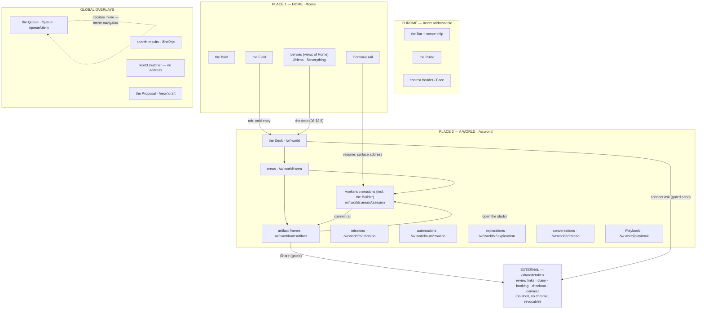

# 11 — Information Architecture: The Map That Emerges

*Phase 3, document 11 — written after 01–10, 13, 16, and 17, deliberately. Those documents each
specified surfaces; this one specifies the space they all live in: the concrete navigation
model, the hierarchy and its depth budget, the complete inventory of surfaces, the address
(URL/route) grammar with resume semantics, the switcher, deep-linking and shareability, and the
mobile posture of everything. Nothing here invents a surface — every entry below cites the
document that forced it, and §10 names the places where two prior documents pulled toward
different IA and resolves each explicitly. Grounded in constitution §3 (two levels of place),
§7, §13, §14, and the operating model's Decision 2 (places, things, work, and verbs never mix).*

**Reading rule.** "World," "Area," "Lens," "the Line," "Situation," and "genome" are spec words;
the interface shows only display language (constitution §2). Route paths quoted below are
addresses, not labels — nothing in a path ever renders as UI text, and no architectural word
(genome, capability, spine, situation, line) appears in any path or any label.

---

## 0. Method — why this document could only come last

The IA was not designed; it precipitated. Documents 01–10, 13, 16, 17 each obeyed the same three
constraints — two levels of place (const. §3), the category rule (verbs and work are never
places — operating model D2), and the hundredth-world test (08 §8) — and what remains when you
overlay all of them is a small, closed map: **two places, one chrome set, four overlay families,
one view family, and a bounded set of world-local surfaces.** This document writes that map down
and gives every point on it an address. The test it must pass is doc 13's AT-02: world #100 adds
rows to this map and changes not one line of it.

## 1. The navigation model — two places, four kinds of thing

The ontology is inherited whole from 02 §1 and made address-precise here:

| Kind | Definition (02 §1) | Addressability rule (new, binding) |
|---|---|---|
| **Place** | somewhere you *are*: owns the screen, sets the Bar's scope, fills the context header. Exactly two levels: Home, inside-a-World | always addressable; a place address is the canonical cold entry |
| **Surface** | a working environment mounted inside a place (Desk, session, frame, plan spine) | addressable; a surface address encodes *ownership* (which world owns it), never the path you took to it |
| **View** | a way of rendering things that live in places (a Lens, search results, an area's records) | addressable as a *state of its place* — opening a view never changes place, scope chip, or context header |
| **Overlay** | a temporary layer (the Queue, the switcher, compare, Activity, traces) | addressable **only when evidence or a push must reach it** (Queue items, find); otherwise deliberately address-less. Dismissal returns to the place beneath, untouched |

Chrome — the Bar, the Pulse, the context header, the Face — is never addressable. You cannot
link to the Bar; you can only link to what it routes to (P7: few places, many verbs).

Two binding corollaries:

1. **Path = identity, query = view state.** The path segment of an address names *what* (a
   world, a session, an artifact); query parameters carry *how it is currently being looked at*
   (a filter, a compare selection, a search scope). Filters never mint new paths; the hundredth
   saved filter is a query, not a place (08 §2.1).
2. **Posture is never in the address.** Think · Create · Execute · Observe is facing, not
   location (03 §5); it is remembered per world (03 §5.5) and re-lights the same address. Two
   operators following one link land on one surface, each facing it their own way.

## 2. Diagram — the whole map



## 3. Hierarchy — the depth budget

The structural hierarchy is exactly four ranks deep, and the fourth is the floor:

```
Home  →  World  →  Area  →  Surface (session · artifact · mission · exploration · thread)
```

- **Home** holds no structure of its own — the Brief, Field, and Continue are generated, ranked,
  and traceable (02 §10), never a folder tree. Lenses are its only named states (08 §2.4).
- **Worlds never nest** (operating model, Area): structure deeper than a world is a linked world
  with typed edges (08 §5), which is a *sibling* in this hierarchy, not a child. The world graph
  is shallow and is never rendered as navigable topology — edges are sentences on Faces and
  filters in Lenses (08 §5).
- **Areas are the only structural slot inside a world** — 3–7 visible, "More" for the tail
  (03 §4.4). An area never contains another area.
- **Surfaces are leaves.** A session, artifact, mission, exploration, or thread is the deepest
  addressable thing. What happens *inside* one — a variant inside a comparison, a file inside
  the Builder's tree, a node inside a map — is the surface's own business, exactly as the
  context header rule already decided ("never more than three segments," 02 §6). The URL
  mirrors the header: nothing inside a leaf mints a path.

This budget is what keeps "where am I?" a one-breath answer at any scale (02 §13.1) and what
makes the hundredth world structurally free: new worlds add siblings at rank two, never depth.

## 4. Contextual navigation inside a world

Inside a world, navigation is a hub-and-spokes pattern with the Desk as hub — plus four lateral
moves that never pass through the hub. All of it is inherited; this section only names it as IA:

1. **The Desk is the hub** — the default landing of every *world-level* arrival (03 §3.1), and
   every staged move on it opens its exact working surface pre-dressed, one gesture (03 §3.3).
   Arrival at a deeper address (a session, a frame) skips the hub without losing orientation,
   because the Face and context header render above every surface (03 §2.5.4) — depth without
   navigation (02 §2).
2. **The context header is the return trail**: Face chip → Desk; area segment → area top;
   session segment → session (02 §6). Three segments, never more. Esc walks overlays only and
   never ejects from the world (02 §3.7); browser Back walks surfaces. The two are deliberately
   parallel: Esc closes what floats, Back retraces what you opened.
3. **Areas cross-link by craft, not by menu.** A view-area record's "work on this in the
   studio" opens the right workshop with the record in the Palette (03 §4.3); a workshop's
   commit rail mints artifacts back into view-areas (16 §4.6); a frame's "open the studio"
   enters the Builder (07 §8.1). These are the lateral moves — object-to-object doors, never a
   sibling-tab bar.
4. **Work is content, not navigation** (06 §0): missions and automations render on the Desk's
   running strip and open from there; there is no per-world "Missions" tab. The world-scoped
   slice of the Queue renders on the Desk ("waiting on you," 03 §3.1) and decides inline.
5. **The Bar is always the shortcut across all of it** — "the postcard session," "pause the
   chase," "show the playbook" — routing by meaning with the chip confirming (02 §3). Every
   surface in this section is reachable by saying it; addresses exist so evidence, pushes, and
   returns can *point*, not because pointing is the primary way anyone moves.

## 5. The surface inventory — global vs local

The complete census. Anything not in this table is a rendering *inside* one of these rows, and
any proposed sixteenth kind of surface must argue against operating model acceptance test 1.

| Surface | Global / local | Reached how |
|---|---|---|
| The Bar (+ interpretation chip, disambiguation line, `/` command strip) | global chrome | always present; focus by typing or `Cmd/Ctrl+K` (02 §3) |
| The Pulse | global chrome | always present, top-right; segments open the Queue filtered (02 §4.1) |
| Context header / the Face | global chrome / world chrome | always present; empty at Home; the Face on every world surface (02 §6, 03 §2) |
| The Brief | global (Home) | landing at `/home`; re-renders on material change (02 §10.1) |
| The Field | global (Home) | `/home`, below the Brief; morphs under lens chips (02 §10.2) |
| Continue rail | global (Home) | `/home`, above the Bar; rows are surface addresses (02 §8) |
| Lenses, built-in + saved | global view of Home | lens chips atop the Field; the Bar by name; `/l/:lens` (08 §2.4) |
| Everything (census) | global view of Home | the Everything chip; `/l/everything` (08 §4) |
| The Queue | global overlay | the Pulse, `Cmd+.`, `/queue`, Brief sentences, waiting badges everywhere (02 §4.2) |
| Search results | global overlay | `/find` or a noun-like utterance; scope toggle this-world/everywhere (02 §3.5) |
| World switcher | global overlay | `Cmd+O`; the Bar's scope chip; not addressable (§7) |
| The Proposal (world-to-be) | global surface | a rung-1+ creation reading at the Bar; event-born drafts from Queue/Brief; `/new/:draft` (09 §4) |
| Capability manifest ("what can you do here?") | scoped overlay | asked at the Bar or of any Counsel; never a page (05 §2.4) |
| Context manifest ("what do you know here?") | scoped overlay | asked of any Counsel (17 §3.2) |
| The Desk | world-local | `/w/:world`; every world-level entry (03 §3) |
| View-area | world-local | area list on the Desk; `/w/:world/:area` (03 §4.3) |
| Workshop-area shelf (+ cross-session Ledger) | world-local | same address as its area; shelf renders parked sessions and committed artifacts (16 §6) |
| Workshop session — incl. Builder, recipe, theory, lab sessions | world-local | shelf, Bar, Continue, staged moves, mission steps, craft entry points; `/w/:world/:area/s/:session` (16 §6) |
| Session Ledger (stream + story) | world-local | inside its session; entries addressable as anchors for provenance (16 §4.5) |
| Artifact frame (chip / card / full) | world-local | from any chip or card anywhere; `/w/:world/art/:artifact` (07 §1.1) |
| Compare | overlay | two selections anywhere; `/compare` at the Bar; `?compare=a,b` on the surface beneath (07 §3) |
| Mission brief + plan spine | world-local | Desk running strip, Queue items, Lenses, search; `/w/:world/m/:mission` (06 §2) |
| Activity (flight recorder) | overlay | one tap from any AI step, run, report card, or Queue item (06 §2.4) |
| Automation row + run history | world-local | Desk strip, Automations area; `/w/:world/auto/:routine` (06 §3.1) |
| Heartbeat trace | overlay | the chip on every output, everywhere it appears (06 §3.2) |
| Explore surface (conversation + live map, beacon rail) | world-local | open questions at the Bar, "Explore this" on any object, Think posture; `/w/:world/x/:exploration` (04 §2–3) |
| Thread / conversation | world-local | Conversations areas, Brief sentences, Queue items; `/w/:world/t/:thread` (02 §8) |
| Playbook (+ calibration view) | world-local view | Observe/Think staging, the Bar ("show the playbook"); `/w/:world/playbook` (17 §6, §4.4) |
| Staged moves, intake asks, report cards, ending verdicts | world-local Desk items | on the Desk; each opens its working surface inline (03 §3.1, 05 §6.3, 06 §2.7, 09 §7) |
| Share/review links, claim, booking, checkout, connect pages | **external** | minted only through the Queue; `/shared/:token`; no shell, no chrome (07 §2.5; 09 §7; §8 below) |

Note what has **no row**: a capabilities directory (05 §2.5), a Missions page (06 §0), a Memory
room (P7), an automations app (P7), a builder front door (07 §8.0), a template gallery (09 §11).
Their absence is the IA — each was refused by a prior document, and this table is where the
refusals become checkable.

## 6. Addresses — the route grammar

### 6.1 Principles

1. **Identity permanence → link permanence.** A world's identity is permanent (P13); its handle
   is minted once and never changes — not at rename, not at promotion, not at re-dressing. The
   bee-hive exploration's address *is* the venture's address a year later (04 §10 beat 4: "the
   context header, the scope chip, the world's name in every old thread: unchanged").
2. **No dead links, ever.** Nothing is deleted (P12), so no address ever 404s. A dormant
   world's address renders it honestly dormant; an archived world renders archived; a retired
   automation renders its trace. The ghosts doctrine, applied to URLs.
3. **Handles, not names.** Every `:token` below is a short stable handle; a readable slug may
   follow a hyphen and is cosmetic (ignored on resolution), so renames never break links and
   two "Jane" worlds never collide. Finding-by-meaning at the Bar remains the primary retrieval
   (08 §4); addresses are for *pointing*, not for remembering.
4. **Reserved words.** Area handles are system-generated and exclude the reserved segment set
   (`art`, `s`, `m`, `x`, `t`, `auto`, `playbook`, `new`, `queue`, `find`, `l`, `shared`), so
   `/w/:world/:area` can stay bare and readable without ambiguity.

### 6.2 The route table

| Address | Renders | Forced by |
|---|---|---|
| `/` → `/home` | the Brief · the Field · Continue · the Bar | const. §4 |
| `/l/:lens` | Home with the Field morphed into the named view; scope stays Home | 08 §2.1, §2.4 |
| `/l/everything` | the lifecycle census | 08 §4 |
| `/queue` | the Queue overlay, over the current place (cold: over Home) | 02 §4.2; §6.4 below |
| `/queue/:item` | the Queue open at one item, whole decision inline | 02 §9 (push deep links) |
| `/find?q=&scope=` | search results overlay, grouped and stamped | 02 §3.5 |
| `/new/:draft` | a parked Proposal, resumable; abandoning costs nothing | 09 §5.3 |
| `/w/:world` | the Desk — the world's now, pre-dressed | 03 §3.1 |
| `/w/:world/:area` | the area: view body, or workshop shelf + parked sessions | 03 §4.3 |
| `/w/:world/:area/s/:session` | the workshop session — including Builder, recipe, theory, and lab sessions | 16 §6; 07 §8 |
| `/w/:world/art/:artifact` | the artifact frame, latest state; `?v=:n` pins a version; `?compare=a,b` opens compare | 07 §1–3 |
| `/w/:world/m/:mission` | the plan spine at its current step | 06 §2.3 |
| `/w/:world/x/:exploration` | the exploration, map-forward on the re-entry story | 04 §3.4, §12 |
| `/w/:world/t/:thread` | the conversation at its last exchange | 02 §8 |
| `/w/:world/auto/:routine` | the automation's run history; each run expands to Activity; recipe opens its workshop session | 06 §3.1 |
| `/w/:world/playbook` | the world's Playbook; lessons anchor as `#l:id`; the calibration view anchors as `#calibration` | 17 §6, §4.4 |
| `/shared/:token` | an external, revocable, shell-less page: review link, claim, booking, checkout, connect | 07 §2.5; 09 §7; §8 below |

**There is no `/builder` root.** Builder sessions are session addresses under the Site/App
area, and the deep artifact's frame is the door (07 §8.1). Giving the deepest workshop its own
namespace is precisely how the parallel universe was born last time (operating model D2); the
address grammar makes the recurrence impossible, not just discouraged.

**There is no `/w/:world/queue`.** The world's waiting items render on its Desk and the one
Queue filters by world (`/queue?world=`); a second queue address would be the fragmenting of
attention that 02 §4.2 forbids.

### 6.3 Resume semantics — what each address promises on arrival

The dual-entry rule (02 §7.2) becomes address semantics: **a world address always lands the
now; a surface address always resumes the work.**

| Address kind | Arrival behavior |
|---|---|
| `/w/:world` | the Desk, staged and pre-dressed — never "where you left off." Zero decisions to start (P5). Dormant worlds render dormant with "wake it?"; the visit itself counts as a return signal (04 §9.3) |
| session | the Ledger's story first — what you did, what was decided, who drove what since — then the bench exactly as left, one gesture below (16 §6). Thirty days later, identical |
| exploration | map-forward on the re-entry story: beacons held, strongest theory, what touched it while away (04 §12) |
| mission | the spine at its current step, blockers lit, next wake named (06 §2.3) |
| artifact | the frame at its live/latest state; `?v=` pins for citation; provenance opens the Ledger at the moment of making (07 §2.3) |
| thread | last exchange + a one-line *since then* when machinery acted (02 §8) |
| `/queue/:item` | the item with full inline context. If already decided: the honest ledger row ("approved Tuesday, by you — the send") — a stale link tells the truth instead of erroring |
| `/new/:draft` | the Proposal exactly as parked; nothing was created by parking (09 §5.3) |

Continue-rail rows, switcher recents, Brief clauses, search results, and lens drops all point
at these addresses — one resume contract everywhere, prefetched on hover so arrival is instant
(02 §8).

### 6.4 Overlay addresses and the place-beneath rule

The Queue and search are overlays with addresses — the one reconciliation this grammar has to
make (flagged in §10.1). The rule: **an overlay address opens the overlay over the place you
are in; followed cold (from a push, another device, a fresh start), it opens over Home.**
Deciding a Queue item never navigates the place beneath (02 §4.2); Esc and Back both close the
overlay and land you exactly where you were. Overlays push history entries so the browser's
Back always does the least surprising thing.

### 6.5 Deliberately address-less

The switcher (ephemeral by design, §7) · the Bar and its states (the Line is a router, not a
place — P8; utterance history is the Bar's `↑`, never a page) · the Pulse · posture · bench
arrangement, scroll positions, map viewports (session state, restored by resume, not by URL) ·
heartbeat traces and Activity (overlays reached from their outputs — their *rows* are
addressable via their owning run and session anchors, which is what evidence links use).

## 7. The switcher

One overlay, summoned from anywhere: `Cmd+O` on desktop; **tapping the Bar's scope chip** on
any device (the scope chip *is* the "where am I / where else" affordance — a deliberate
amendment of 02 §3.3's chip-as-scope-picker, reconciled in §10.9). Contents, in order (02
§7.1): row zero Home; recents with resume — Face chip, honest one-line state,
where-you-left-off, Enter resumes that exact surface address; pinned (≤7); semantic search
over everything including dormant and archived ("the bee thing" finds it, 08 §4). Every row
offers dual entry — resume (surface address) or Desk (world address) — with the default
following 02 §7.2: recents default to resume, cold finds default to Desk. And every row
offers a third, scope-only action: **"address, don't go"** (hover reveal on desktop,
long-press on touch) sets the Bar's standing scope to that world and dismisses the switcher
without navigating — 02 §3.3's explicit standing override, preserved inside the switcher
rather than lost with the old chip behavior. Scope set this way changes the scope chip and
nothing else: no place change, no history entry.

The switcher is not addressable and holds no state: it is a retrieval gesture over the same
Situation every other surface renders, which is why it can never disagree with the Field or
the Brief (08 §0).

## 8. Deep-linking and shareability

### 8.1 Internal links — the evidence economy

Every claim in the product survives "which rows are those?" (P9, AT-11) — and this grammar is
what the tap-throughs resolve to. The citable atoms and their addresses: a Queue item
(`/queue/:item`), a run's Activity (its automation's run history + run anchor), a Ledger
moment (session address + `#e:entry`), an outcome annotation (artifact address + `#o:row`), a
Playbook lesson (`/w/:world/playbook#l:id`), a version (`?v=`), a grant (the Face's grant list,
anchored). Brief sentences, Face vitals, lens cells, report-card claims, and search results are
all links *into* this set. Deep-linking is therefore not a sharing feature — it is the honesty
architecture's plumbing.

Pushes deep-link too, per 02 §9: a decaying approval opens `/queue/:item` with the whole
decision inline (actionable from the lock screen); a counterparty reply opens its thread; the
stale-clock alert opens the Pulse's evidence. Nothing else ever pushes.

### 8.2 Operator addresses are never sharing

Every `/home`, `/w/`, `/l/`, `/queue/` address is operator-private — scoped to the account,
useless to anyone else. Copying an app URL to a counterparty must fail closed and does: it
resolves to a sign-in for the owner and to nothing for anyone who is not. This is constitution
§13 applied to links: a URL that leaked a world would be cross-world leakage with extra steps.

### 8.3 The external namespace — `/shared/:token`

Giving a real other side sight of something is the **Share** action on a frame — an outbound
exit that stages through the Queue like any send (07 §2.5). What it mints is a separate,
revocable token address with no shell, no chrome, no Bar: the artifact's body rendered for
review, a claim page, a booking flow, a checkout, a **connect page** — the counterparty-facing
pages the platform has always kept outside the OS (system reconstruction 01: counterparties
"interact with published artifacts, never with the OS itself"). Binding rules: a token shows
exactly what the gated Share named, and nothing else; visits annotate the artifact as evidence
(07 §2.5); revocation kills the token, not the artifact; and **the Ledger never travels** —
critique, scores, kills, and deliberation are world-internal, always (16 §11). Patterns
travel, data doesn't — and neither does deliberation.

**The connect page** is the one `/shared` kind that flows *inward*: it exists because some
grants only the counterparty can supply — the agent's listing-feed (MLS) credentials, his
sending-domain verification (10 §2.1) — and grants never batch; each world's connections are
its own (09 §10). It closes the loop 09 §7 stages: a counterparty-owned grant becomes an
intake ask on the Desk → the operator sends the connect link (a gated send, staged through the
Queue like any Share) → the counterparty supplies the credential or completes the verification
on the shell-less page → the grant flips fulfilled on the Face's grant list, and any
automation waiting on it wakes (06 §2.3). Binding rules, same spine as Share: the page states
exactly the one grant sentence it was minted for and collects nothing else; the credential
lands in that world's grant — scoped, listed, revocable on its Face (const. §13) — never in
any shared store; revocation kills the token, while the grant itself lives and dies on the
Face; and the counterparty sees no shell, no chrome, and nothing of the world beyond the
sentence asking. At n=50 this is fifty tokens, fifty grants, one page kind — rows, never map.

### 8.4 Link permanence through evolution

Every evolution operation (operating model D6) preserves the address contract:

| Operation | The address |
|---|---|
| rename | unchanged (handles, not names) |
| promote / re-dress | unchanged — the world grew; the link matured with it (P13) |
| spawn (close-won) | the new client world mints a new handle; the funnel record's old addresses resolve inside the agency world with the lineage edge shown (09 §8.1) |
| split | re-scoped surfaces redirect to their new world, lineage stated; counterparty-bound evidence stays home behind its grant stubs (04 §11) |
| merge | the absorbed world's addresses redirect to the survivor with provenance ("merged May 12") |
| sleep / archive / retire | unchanged; rendering says so honestly |

## 9. Mobile — operate-mode first

Constitution §14 fixes the posture: the phone is for **operating** — Brief, Queue, Bar,
Continue — and for **judging** — review, critique, approve. Craft is desktop's. One address
space serves both: the same URL renders the surface's mobile posture; there are no mobile-only
routes and no feature that exists only on a phone (voice included — 04 §13).

### 9.1 The mobile shell

The Bar (voice-friendly, with a send affordance — 02 §3.1) and the Pulse persist; the scope
chip opens the switcher (§7); the Field compresses to the lens-chip row plus the attention set
as a list (02 §11). The three push classes are the only things that light the phone (02 §9).

### 9.2 The inventory, by posture

| Surface | On the phone |
|---|---|
| the Brief, Continue, the Pulse | **full** — the morning is a first-class phone act (02 §11) |
| the Queue | **full** — every item decides inline with complete context: draft + thread, before/after compare, scores with their rubric; `j/k`-walk becomes swipe-walk; hold-to-confirm for batch (02 §4.2) |
| the Bar, search, switcher | **full** — routing, finding, and switching are speech-and-glance work |
| the Proposal / Charter (all rungs, incl. isolation review) | **full** — one scrollable screen by design (09 §4); signing a client from the road works |
| world Desks | **read-mostly** — staged moves open their review states; approvals decide inline (02 §11) |
| artifact frames | **full for judgment** — open, compare (two-up), annotate, share, publish-to-Queue; editing bodies is desktop's |
| mission spines, Activity | **full for inspection** — states, wakes, pause, retry/fix decisions |
| automation rows, heartbeat traces, misfire ledgers | **full** — pause is one gesture from any output, on any device (06 §3.5) |
| threads | **full** — reply drafts stage through the Queue as ever |
| Explore | **conversation-forward, map as a tab** (04 §3.1); voice walks build territory; beacon review and theory comparison work well; map gardening is desktop work (04 §13) |
| workshop sessions | **review/critique/approve state** (§9.3) — never a pretend bench |
| the Builder | preview at device widths (natively at home on a phone), checks and deploy approvals; code and file work desktop-first (07 §8) |
| Lenses | boards and funnels render as grouped lists; every cell still taps to rows; the drop still lands pre-focused (08 §2.5) |
| Playbook, calibration | **full** — reading lessons, gating candidates, closing predictions are judgment reps, and judgment is the phone's job (17 §4) |

### 9.3 The session's review state — critique on a phone, precisely

A session address opened on a phone lands on the **Ledger's story** (identical to desktop
resume), then offers the judgment work the session currently holds, as cards: variants to
score (blind-review's "score first" works excellently on a phone — 17 §4.3), a tournament
round to pick, a comparison to call, a report card to accept, commits waiting on the rail.
What it does not offer is the bench: no drag-arranging, no constraint gardening, no map
surgery — the phone never pretends to be drivable where it isn't (const. §14: "compare two
variants on a phone: yes; run the apparel bench: no"). Everything judged on the phone lands in
the same Ledger with the same driver stamps; the desktop bench opens later exactly where the
phone's judgments left it.

## 10. Reconciliations — where prior documents pulled apart

Each conflict is stated, then resolved. None required overruling the constitution; the first
eight required only choosing one reading of a prior document. The ninth amends one outright,
and is flagged in `14-open-decisions.md` per the constitution's preamble rule.

1. **The Queue: "never a place" (02 §1, §4.2) vs push deep links to "the exact Queue item"
   (02 §9).** An address usually implies a destination. Resolution: **overlay addresses**
   (§6.4) — `/queue` and `/queue/:item` open the overlay over the current place, over Home
   when cold, and deciding never navigates. The Queue got an address without becoming a place;
   the place-beneath rule is the mechanism.
2. **Lenses: "you cannot be *in* a lens" (08 §2.1) vs Bar-reachable, bookmarkable named views
   (08 §2.4).** Resolution: a lens address is a **state of Home** (`/l/:lens`): scope chip
   stays Home, context header stays empty, Esc/Back restore `/home`. Bookmarkable, never
   inhabitable.
3. **The Desk as "the default landing of every arrival" (03 §3.1) vs Continue/switcher landing
   directly on sessions (02 §2, §8).** Resolution: arrival *kinds* — world addresses land the
   Desk; surface addresses land the surface. 03's rule governs world-level entries; 02's
   depth-without-navigation governs resumes. The Face above every surface keeps both honest.
4. **The Builder's full depth (07 §8.5) vs the two-level place model.** The gravitational pull
   is toward a builder root — the old system fell in (operating model D2). Resolution: the
   Builder has **no namespace**; its sessions are ordinary session addresses under the Site/App
   area, entered from the artifact's frame. Depth lives inside the leaf, not in the path.
5. **The Playbook as "a first-class surface of every world" (17 §6.2) vs "no substrate becomes
   a room" (P7) and areas as the only structure (03 §4).** Resolution: the Playbook is a
   **reserved world view** — addressable (`/w/:world/playbook`), reached by verb and by
   Observe/Think staging, never listed among areas, never a nav item. First-class and
   room-less at once; the calibration view rides inside it as an anchor.
6. **Sessions owned by areas (16 §6) vs sessions opened from everywhere (Desk, Bar, missions,
   explorations).** Resolution: the address encodes **ownership, not journey** —
   `/w/:world/:area/s/:session` regardless of which door opened it. The context header shows
   the same three segments however you arrived.
7. **Silent world birth (04 §2.1) vs addresses implying ceremony.** An Enter on a curiosity
   reading navigates from `/home` to a brand-new `/w/:world/x/:session` with zero dialogs —
   the URL changing *is* the only visible trace of birth, and Back simply returns Home while
   the world persists (P12). Stated here so nobody adds a confirmation to protect the URL bar.
8. **Search scope: results default to the Bar's current scope (02 §3.5) vs one global `/find`
   route.** Resolution: scope is view state — `/find?q=&scope=` — defaulting from the place
   beneath, toggleable on the overlay. One route, honest scoping, no leakage (rows render only
   within their own world's scope either way).
9. **The scope chip: a stay-put scope picker (02 §3.3, rule 3: "click the chip and pick") vs
   the switcher's summons (§7 here; 12 W1 ships it).** Two contradictory bindings on one
   gesture. Resolution: the chip opens the switcher — one gesture answers "where am I / where
   else" on every device, including phones where `Cmd+O` doesn't exist (§9.1) — and the
   switcher's per-row **"address, don't go"** action (§7) preserves the one thing 02's picker
   uniquely offered: an explicit standing-scope override with no navigation. 02 §3.3's deeper
   rule is untouched — nothing but an explicit act (this action, or switching place) ever
   changes standing scope; no inference, no drift. Unlike items 1–8, this is an amendment of a
   prior document, not a reading of it: 02 §3.3 rule 3 must be rewritten to match, and until
   02 lands that change the conflict stays open in `14-open-decisions.md`.

## 11. Acceptance checks for this document

1. **The census check.** Every surface named anywhere in 01–10, 13, 16, 17 appears in §5's
   table exactly once, as global chrome, a place, a surface, a view, an overlay, or external.
2. **The two-breath check, with URLs.** From any address in §6.2, "where am I?" and "what will
   the Bar do?" are answerable from chrome alone; no address renders without its place's chrome
   (except `/shared`, which renders with none by design).
3. **The permanence check.** Take any address ever minted; rename, promote, dormant, archive,
   merge the object; the address still resolves to something honest. Zero 404s.
4. **The no-second-place check.** No route exists for capabilities, missions-in-general,
   automations-in-general, memory, or the builder. Attempting to add one fails §5's table.
5. **The resume check.** Every row of §6.3 behaves as promised from a cold start on a new
   device — the surface, not the location; the story, not a blank canvas.
6. **The leakage check.** No operator address is resolvable by a non-owner; no `/shared` token
   renders anything beyond what its gated mint named (a Share, or a connect ask's one grant
   sentence); no Ledger content ever appears under `/shared`.
7. **The mobile-parity check.** Every address renders on a phone in the posture §9.2 assigns;
   nothing exists at a mobile-only address; every approval and critique rep listed as "full"
   completes end-to-end on the phone with the same records as desktop.
8. **The hundredth-world check.** Creating a world changes §5's table not at all and adds one
   handle under `/w/` — rows, never map.

---

*Cross-references: `_constitution.md` §3, §7, §13, §14 (the geometry, Explore, isolation, and
mobile rules this map makes concrete); 01 (P5, P7, P8, P9, P12, P13 — cited throughout);
02 (the shell whose chrome and overlays this document addresses); 03 (the world grammar §4
navigates); 04 (exploration surfaces and their permanence); 05 (why no capability is a
destination); 06 (why no work is a destination); 07 (frames, Share, the Builder's door);
08 (lenses, the drop, edges, scale); 09 (the Proposal's address and event-born drafts);
16 (sessions and the Ledger anchors provenance resolves to); 17 (the Playbook view and the
judgment work mobile carries); 13 (AT-02, AT-03, AT-09, AT-11 — the tests this IA must pass).*
