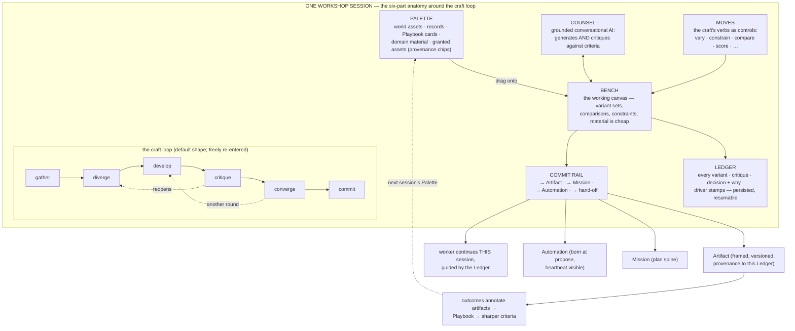
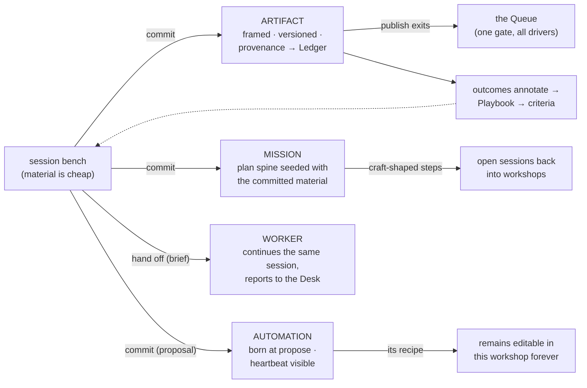

# 16 — The Workshop System

*Phase 3, document 16 — the foundational document of this phase. The constitution (§6) defines
the Workshop in one page; this document defines it completely: the craft loop, the six-part
anatomy, the nine bench archetypes, sessions, ideation as structure, critique and criteria,
drive continuity, outputs, history, and the composition of new workshops — then walks five
exemplar workshops end to end and sketches six more. Everything here elaborates constitution
§6, §12 (mastery), §8 (work and the Queue), and §9 (artifacts); the operating model's
Decision 3 (one capability, three drive modes) supplies the machinery underneath. Documents
03 (§4.3 workshop-areas), 05 (the drive slider, delegation, promotion), and 07 (the Builder
as the deepest workshop) are elaborated, never contradicted.*

**Reading rule.** "Workshop," "bench archetype," "Capability," "Standing Order," and "the
Ledger" are spec words. The operator sees "**\<Craft\> Studio**" ("Design Studio", "Outreach
Studio") or "Workshop" per the genome's skin; sees verbs, not "capabilities"; sees
"Automation" (or "Routine"), not "Standing Order." Where interface text is quoted below, it
is quoted in display language only.

---

## 1. What a Workshop is

A Workshop is a **session-based craft environment** that a workshop-area opens into. It is
the place where the operator — and the AI, as a peer worker under the operator's taste —
*makes things well*: not a page that displays, not a form that collects, not a chat panel
that answers, not a tool list that waits. It is the room where the metabolism's DEVELOP beat
happens (constitution §1), and it is the primary instrument of the north star's second
clause: entering a Workshop feels like gaining the tools, context, feedback, and creative
leverage of an expert team.

Three commitments define it, and everything in this document is their elaboration:

1. **It is structured around the craft loop.** Every session moves through
   **gather → diverge → develop → critique → converge → commit** — not as a wizard with
   steps, but as the natural grain of the room. The loop is a shape, not a script: sessions
   loop within it (a critique reopens divergence), enter it mid-way (resuming lands wherever
   the Ledger left off), and exit it early (a gather-only session that commits nothing is
   legal and common). But the *default* shape — the one the room's staging, the Counsel's
   suggestions, and the Moves rail all lean toward — is divergence before convergence, and
   critique before commit. A workshop that lets first drafts ship unexamined has failed its
   craft.

2. **It opens already grounded.** The anti-generic invariant (constitution §12.6) is
   load-bearing here: a Workshop session opens with the world's memory, the area's criteria,
   the Playbook's evidence, and the genome's domain material already in the Palette. If the
   system holds relevant context and the session's first output is generic, that is a defect
   — not a prompt-quality issue, a *structural* defect. The gather beat is mostly done *for*
   you before you arrive; your gather is curation, not excavation.

3. **It remembers everything, including why.** The Ledger persists every variant, every
   comparison, every critique with its scores, every decision with its reason, and every
   change of driver. Sessions are resumable across days and months; the area accumulates the
   committed artifacts and the cross-session Ledger; decisions become memory events. A
   Workshop is therefore also the world's *taste record* — the thing a worker reads before
   continuing your work, and the thing you read when you ask "why is the logo blue?"

**The craft loop, beat by beat:**

| Beat | What happens | The room's posture |
|---|---|---|
| **gather** | material assembles: sources, prior artifacts, records, granted assets, Playbook evidence, constraints in force | the Palette fills; the Counsel states what it knows; the bench may pre-stage a starting point |
| **diverge** | many candidates, cheaply: variants, forks, angles, hypotheses — quantity with named differences, not noise | the bench widens; kills are expected; nothing is precious |
| **develop** | selected directions deepen: constraints applied, details worked, compositions refined | the bench narrows to working sets; constraints ribbon fills |
| **critique** | candidates scored against explicit criteria, with *why* per score; weak work killed with reasons | the criteria pack renders beside the work; scores are conversation, not verdicts |
| **converge** | a direction is chosen — by comparison, by tournament, by judgment — and the choice is recorded with its reason | the Ledger writes a decision event |
| **commit** | the chosen work leaves the bench through the commit rail: artifact, mission, Automation, or hand-off | the frame appears; provenance attaches; gates apply |

---

## 2. When a Workshop exists — and when a plain view-area is right

Every area is exactly one of two bodies (doc 03 §4.3): a **view-area** (records and
artifacts, rendered as board / table / gallery) or a **workshop-area** (a craft). The
decision is the area's **center of gravity**, and it is testable. An area deserves a
Workshop when all four hold:

1. **The judgment test.** The work's quality depends on taste and criteria, not on
   completeness. Invoices are complete or not; a collection is *good* or not. Judgment work
   gets a workshop.
2. **The iteration test.** The work improves through rounds — variants, critique, revision.
   If the second attempt is not meaningfully informed by the first, it's data entry, not
   craft.
3. **The divergence test.** Doing it well means considering alternatives. If there is one
   correct output (a record lookup, a status change), no bench is needed.
4. **The accumulating-taste test.** Decisions made here should steer future work — a
   Playbook slice, a criteria pack, a Ledger worth re-reading. If nothing learned here
   changes the next round, a view suffices.

Failing any test, the area is a **view-area** — and the view is not a lesser thing: it is
the correct body for records. Views stay honest by *never growing editing tools of their
own*; instead every record offers a **craft entry point** ("work on this in the studio"),
which opens the right workshop with that record loaded in the Palette. The Listings view
never becomes a half-workshop; the listing's marketing gets crafted in the Farm studio with
the listing riding along.

Two consequences, binding:

- **Areas mature across the boundary through proposals, never silently** (doc 03 §4.3).
  When the artist keeps re-sequencing the Portfolio view session after session, the system
  proposes chartering it as a curation workshop, evidence attached. The old view body's
  record is preserved.
- **Every capability has a workshop, even background ones** (constitution §6). The email
  scraper's workshop is its configuration and inspection surface (doc 05 §5.2). The
  question "workshop or view?" applies to *areas*; capabilities always have a workshop face
  — the only variable is how often a human sits at it.

---

## 3. What a Workshop is not — the discriminating table

| It is not… | Because that thing… | While a Workshop… |
|---|---|---|
| **an Area** | is the persistent *place* — it holds the shelf (committed artifacts + cross-session Ledger) and survives every session | is the *craft environment* the area opens into; sessions start and park, the area remains. The area is the room's address; the workshop is what working in it is like |
| **a Capability** | is a *verb* — one definition with three drive modes, versioned in the catalog, never a place | is where a craft's verbs are *held and driven*: its Moves rail is a scoped slice of the catalog. One workshop typically hosts several verbs; one verb (a background one) may be met almost entirely through its workshop's inspection face |
| **an Artifact** | is an inert *made thing* — framed, versioned, provenance-carrying, committed | is where artifacts come *from*. Bench material is pre-artifact: cheap, killable, unversioned. Only the commit rail mints artifacts. An artifact opens in its frame; a deep artifact opens its builder from the frame — it never becomes a room in the world's structure |
| **a Thread** | is a conversational trace — the Counsel's transcript | is the whole room around that conversation. The thread is *part of the Ledger*, not the workshop itself: the transcript is one entry stream among variants, moves, critiques, and decisions. A workshop reduced to its thread would lose the bench, the criteria, and the record of why |
| **the Builder** | — | is *also* the Builder: the Builder is the deepest workshop (`code+preview` bench, doc 07 §8), same six-part grammar, uncompromised depth. It is listed here because the historical failure ran the other way — the builder as a parallel universe with its own conventions. There is exactly one grammar, and the Builder wears it |

And the inherited refusals: a workshop is never a *destination* in global navigation (no
workshop exists outside a world), never a *dashboard* (nothing on the bench is decorative),
never a *wizard* (the loop is a grain, not a gate sequence), and never a *chat skin*
(conversation routes and advises; the bench is where work lives — P8).

---

## 4. The six-part anatomy, exhaustively

The grammar is fixed (constitution §5: genomes dress, never rearrange). Every workshop —
apparel to automation to the Builder — is these six parts. Genomes and crafts choose the
bench archetype, the Moves set, the criteria pack, the Counsel's stance, and the Palette's
wiring; they never add a seventh part or remove one.

### 4.1 The Bench — the working canvas

**What it holds.** The material being worked, in the craft's native form (the archetype, §5
— images on a wall, a living document, a node map, a flow diagram, files with a live
preview). Bench material is **cheap by design**: unversioned, killable without ceremony,
never auto-published. The bench is the one place in the platform where quantity is a virtue
and deletion needs no apology — because nothing on it is yet an artifact.

**Structures the bench natively supports, on every archetype:**

- **Variant sets** — named groupings of alternatives ("Direction A: heritage", "Direction
  B: athletic"). A set carries its generating constraint, its member count, and its critique
  state (unscored / scored / converged). Sets are the unit of divergence.
- **The working set** — the currently focused material. Focus one item (full-size, full
  attention), pin several (they persist across scrolling and moves), or select a set. Moves
  act on the selection; the Counsel's "this" resolves to it.
- **Comparison** — any two or more items side by side, in the archetype's native comparison
  mode (§5). Comparison is a bench *state*, not a separate screen; you work while comparing.
- **The constraints ribbon** — the constraints currently in force ("more luxury, same
  palette", "score ≥ 8 to keep", "≤ 120 words"), each removable and each stamped into the
  Ledger when added, changed, or dropped. Constraints govern moves and workers alike.
- **Kill with why** — removing material asks for nothing but *accepts* a reason (one line or
  one tap on a criterion: "drifted athletic"). Reasoned kills are the highest-value Ledger
  entries: they are what workers read to work in your taste.

**Interactions.** Direct manipulation always works: drag to arrange, drag from Palette to
ground a move in a reference, drag between variant sets to regroup. Arrangement is
meaningful and persisted — the bench's spatial state is part of the session. Nothing on the
bench ever moves or vanishes because an automation ran; workers *append* (new material
arrives visibly marked with its driver) and *propose kills* (marked, reasoned, yours to
confirm — except under an explicit hand-off brief that authorized killing below the bar).

### 4.2 The Palette — references and materials at hand

**What it holds**, in four standing groups, each collapsible, each populated at session-open
by the gather beat:

1. **This world** — brand assets, prior committed artifacts (with their outcome annotations
   visible: "this postcard: 6 calls"), relevant records (the prospect, the listing, the
   client's audit), the area's shelf.
2. **Knowledge** — the Playbook cards relevant to this craft ("Tuesday sends performed best
   — 3 replies", tap-through to evidence), domain-pack concept cards and exemplary examples
   (constitution §12.1 — courseware never; concepts *in use*), and the criteria pack itself
   (which also renders inside critique).
3. **Granted** — cross-world material admitted through explicit grants, every item wearing
   its provenance chip ("artwork · granted from Marco's Murals · revocable"). Nothing
   crosses worlds into a Palette without a grant (constitution §13); the chip travels onto
   the bench and into every artifact that uses the material. One bounded rule governs
   *findability*, and it moves awareness only, never material: something the operator owns
   in a sibling world may appear in Palette search as a **reference listing** — metadata
   only (name, kind, owning world), greyed, unplaceable on the bench, its single action
   "request a grant" (the request routes through the owning world's gate; approval admits
   it to this group with its chip). Material bound to a counterparty — commissioned work,
   client deliverables, records of the relationship — never lists across worlds: for it,
   search in another world simply misses, and the Counsel may only say where to ask.
4. **This session** — sources gathered here: research results, uploads, clippings from an
   exploration map that rode along ("take this into a workshop", doc 04), material committed
   earlier in the session.

**Behaviors.** The Palette is *curated by relevance, honest about why*: every card answers
"why is this here?" in one line ("last drop's best seller", "matches your constraint
'heritage'"). It is not a file browser — the world's full contents remain findable by
meaning at the Bar; the Palette is the *staged* subset. Dragging a Palette item onto the
bench grounds the next move in it ("like this reference"); dragging onto the Counsel cites
it into conversation. The operator can pin items the gather missed and dismiss items it
shouldn't have staged — both acts teach the gather (Ledger-recorded, feeding the next
session's staging).

### 4.3 The Counsel — the contextual AI

**What it is.** The workshop's resident expert voice: conversational, **grounded in the
world's memory, the area's Ledger, and the genome's domain pack**, wearing the stance the
genome dresses it in (creative director in the design studio; service-minded strategist in
a client world; socratic in a research world; terse dispatcher in an automation's recipe
workshop). Its scope chip is always visible — which world, which counterparty — and "what
do you know here?" always produces its honest context manifest (constitution §13).

**Its three duties, in priority order:**

1. **Know the situation.** Its first contribution to a session situates: what it knows,
   what changed since last session, what the Playbook says bears on this work. Generic
   openings are the defect the anti-generic invariant names.
2. **Critique against explicit criteria** — not only generate. Asked "what do you think?"
   it scores against the visible pack, with a why per criterion, and it volunteers critique
   at the loop's natural seams ("six variants and no ranking yet — score them?"). Its
   critiques are labeled as its own and sit beside — never in place of — the operator's.
3. **Drive moves on request.** Any move at *ask* is the Counsel performing it while you
   watch it land on the bench as new, marked material — a variant, never a fait accompli,
   never a mutation of your work.

**Behaviors.** The transcript is part of the Ledger (a thread, scoped to the session). The
Counsel proposes moves *with reasons* (a tool offered with its why is a mastery event —
doc 05 §2.2), surfaces Palette cards when they become relevant mid-work, and flags
constraint conflicts ("this recolor violates 'same palette' — drop the constraint or the
variant?"). It never blocks: it advises, scores, and stages; the operator disposes.

### 4.4 Moves — the craft's verbs as structured controls

**What they are.** The session-scoped slice of the catalog, rendered as a rail of
structured controls: vary, combine, constrain, compare, score, simulate, place-on-product,
test-responsive, tournament, enrich, dry-run… Each move is a capability invocation wearing
craft clothing — which is why every move inherits the full apparatus: the drive slider,
gates on its exits, Activity on its AI runs.

**Anatomy of a move**, uniform across archetypes:

- **Input** — the current selection (item, set, or bench), plus the constraints in force.
- **Parameters** — the move's own dials, always few, always in craft language ("how many?",
  "vs which reference?", "which criteria?").
- **Output — appends to the bench.** Moves are non-destructive by construction: results
  arrive as new material (a new variant set, a new draft fork, a new run overlay) marked
  with the move and driver that made them. The bench's history is thereby real.
- **Driver** — hand, ask, hand off, or automate (§9); the control itself carries the
  choice ("do it" / "ask" / "overnight…").

**The rail shows the working set, not everything.** A craft's native moves (§5) are always
present; situational moves surface when the situation calls (place-on-product appears when
granted artwork enters the session); learned moves (§12) appear once distilled and gated.
The Counsel volunteers a move when the bench state argues for it, with the reason attached.
There is no "all moves" browser — the `/` strip at the Bar lists what is invocable in
scope, which inside a session is exactly the rail plus the world's verbs (doc 05 §2.1).

### 4.5 The Ledger — the session's memory, and the world's taste record

**What it records**, as typed entries in one chronological, filterable stream:

| Entry kind | Example |
|---|---|
| material | "12 variants added (vary ×3 on set A) — *worker (overnight)*" |
| move | "constrained: 'more heritage, same palette' — *you*" |
| critique | "6 scored vs pack v3: #3 8.6 ('print integrity: strongest'), #5 5.1 ('drifted athletic') — *counsel*" |
| decision | "converged on #3 — 'the collar reads heritage without costume' — *you*" |
| driver change | "hand → hand off: brief attached, budget $6 — *you*" |
| constraint / criteria change | "criteria edited: added 'production feasibility ≥ 7' — *you*, reason: March sampling failures" |
| commit | "committed: 'Fall direction v1' → Artifact · provenance: this session" |
| park / resume | "parked at critique · resumed 32 days later" |

**Behaviors.** Every entry stamps its driver — you, the Counsel, a named worker run, a
routine — which is what makes drive-mode continuity honest (§9). Decisions and reasoned
kills become **memory events**: they are searchable by meaning across the world ("why did
we drop the athletic direction?") and they feed the Playbook when outcomes later bear on
them. The Ledger renders two ways: the stream (inspection) and **the story** — a generated
narrative summary that resume lands on ("You converged on the heritage direction; the
worker produced 10 overnight, 4 above bar; one blocked on the ungranted flat-lay"). The
story is evidence-linked like every generated narrative in the platform (constitution §4).

The Ledger is not private to a session: the **area's cross-session Ledger** is the
concatenation, and it is the area's real history — the shelf's other half. It is also the
delegation instrument: a hand-off brief is deliberately small *because the Ledger is the
real brief* (doc 05 §6.1).

### 4.6 The Commit rail — how work leaves the bench

**The four exits**, always present, always in this order:

1. **→ Artifact.** The default exit. Commit mints a versioned artifact in the universal
   frame (doc 07): identity, kind, version rail, provenance trail pointing back to this
   session's Ledger, publish state if outbound-capable. Committing a revision of an
   existing artifact mints a version on its rail, never a duplicate.
2. **→ Mission.** The work becomes finite work: "produce the collection", "rebuild the
   site from this brief". The commit compiles a mission proposal (objective, plan spine,
   the committed material as its seed) — resolve-or-create applies: if a matching mission
   already runs, the commit stages into *its* plan instead of spawning a twin.
3. **→ Automation.** The session's recipe becomes recurring: "weekly content from this
   recipe". Always a proposal card (cadence, budget, what it asks, what stops it loudly),
   born at *propose* on the autonomy ladder, heartbeat visible from birth (doc 05 §7).
4. **→ Hand-off.** A worker continues *this session* under a brief (doc 05 §6): "10 more
   like #3 overnight, per the ledger."

**The ceremony.** Committing is deliberately the loop's one small ceremony: select the
material → the frame preview appears (name proposed from the session's intent, kind,
provenance, and — for outbound-capable kinds — the gate it will meet) → one confirmation.
Proportionality holds (P4): committing a draft artifact is two gestures; anything that
*exits the world* (send, publish, spend) stages at the Queue with full decision context,
no exceptions, no drive-mode softening (doc 05 §9).

**Nothing leaves without provenance.** Every committed object carries the session pointer;
tapping provenance on any artifact, mission, or Automation opens the Ledger at the moment
of commit. This is the metabolism's arrow made cheap: LEARN can always find its way back
to DEVELOP.

---

## 5. The nine bench archetypes

Nine archetypes cover all crafts; a craft picks one or composes two (a **primary** owns
the center; a **secondary** docks as a flank — the scraper's flow+table, the theory
workshop's map+table). Composition never exceeds two, and the cap binds **per session
kind**: most workshops declare exactly one session kind, and a craft that seems to need
three benches in one session is two crafts, and should be two workshop-areas. One
sanctioned exception to the one-session-kind norm exists: a workshop built around a
**deep artifact** (a site or app — the Builder's home, doc 07 §8) may declare two named
session kinds — strategy and build — each composing at most two archetypes, sharing one
shelf and one cross-session Ledger (§13.3 exercises this). No workshop declares a third
session kind, and no session ever composes a third bench.

For each archetype: what it renders, its native Moves, its comparison mode, and two
example crafts.

### 5.1 `gallery/variants` — visual work

- **Renders:** a wall of visual material in variant sets — images, mockups, frames,
  boards; focus mode blows one up; sets carry their generating constraints.
- **Native moves:** vary · restyle/recolor · constrain · combine (merge two directions) ·
  place-on-product (mockup onto garment, ad slot, storefront) · upscale/finalize ·
  tournament · score.
- **Comparison mode:** side-by-side lightbox (2–4 up, synchronized zoom) and **tournament
  brackets** — head-to-head rounds with per-round criteria scoring, the bracket itself a
  Ledger object.
- **place-on-product, specified.** Product templates come from three sources, all visible
  in the Palette with provenance: the genome's domain pack ships the base sets (the
  apparel pack: garment mockups — tee, hoodie, long-sleeve, flat-lay — each with named
  print placements, dimensions, and colorway slots; the ads pack: slot and storefront
  frames); supplier catalogs extend them through connection grants; operator uploads join
  as world assets. The move renders selected material onto a template non-destructively —
  a new mockup variant, template provenance attached. When placed work commits, the rail's
  **→ Artifact** exit offers the **production-ready export**: per-placement print files at
  the template's stated dimensions, the placement spec, and colorway separations — carried
  in the artifact's frame as its production body, provenance to this session.
- **Example crafts:** apparel/collection design (§13.1); ad creative.

### 5.2 `document` — language work

- **Renders:** one living document at center with margin apparatus: inline alternatives
  ("three ways to say this" fold out in place), tracked passes, comments, and the rubric
  dock. Forks render as parallel drafts.
- **Native moves:** rewrite-in-voice · tighten/expand · restructure · fork-passage ·
  red-line (the Counsel's editorial pass, marked) · score-against-rubric · merge-forks.
- **Comparison mode:** two drafts in parallel columns with difference shading; passage-
  level pick-and-merge ("take the opening from A, the close from B").
- **Example crafts:** proposals (§14 — proposal); outreach sequences and copy (§13.2).

### 5.3 `board` — arrangement work

- **Renders:** cards in columns or free clusters — a campaign's pieces, a collection's
  lineup, a content slate. Cards are references to bench material or artifacts, so the
  board composes work made elsewhere.
- **Native moves:** group · sequence · promote/demote · balance (coverage check against a
  target mix: "two of five pillars unrepresented") · gap-scan · swap-in-alternative.
- **Comparison mode:** two board *states* side by side ("lineup A vs lineup B") with
  per-slot difference highlighting; the chosen state converges as the plan.
- **Example crafts:** campaign planning (§14 — campaign); content slate / collection lineup.

### 5.4 `map/graph` — structure-of-ideas work

- **Renders:** nodes and typed edges — claims, questions, hypotheses, evidence, sources —
  with the exploration map (doc 04) as its close relative; subgraphs collapse and expand.
- **Native moves:** branch · connect (typed edge) · weigh-evidence · contrast-hypotheses ·
  predict (a claim with confidence, registered for calibration) · summarize-subgraph ·
  park-beacon (name the gap, hold the guess).
- **Comparison mode:** hypotheses side by side as **evidence columns** — each claim's
  supporting and opposing evidence aligned row-by-row, weights visible.
- **Example crafts:** research/theory (§13.4); market positioning.

### 5.5 `flow` — process work

- **Renders:** steps, triggers, branches, and rules as a diagram, with a **test lane**
  beside it: a single case (or a replayed batch) traced step by step through the current
  recipe, every decision the flow made visible.
- **Native moves:** add-step · branch-rule · tighten-rule · test-on-one (the automated
  verb driven by hand, one watched case) · dry-run (replay history through the candidate
  recipe, no exits fired) · exception-review · arm (the publish of this bench — always a
  proposal, doc 07).
- **Comparison mode:** recipe **version diff** (rules added/removed/changed) and
  before/after dry-run traces over the same historical batch — "v3 caught 11 of 12; v4
  catches 12, one new false positive, here."
- **Example crafts:** inbox automation (§13.5); client onboarding workflow.

### 5.6 `table/dataset` — rows-at-scale work

- **Renders:** rows with provenance per cell-group (which run, which source), segments as
  saved row-sets, and a detail flank for the focused row.
- **Native moves:** enrich · dedupe · segment · score-rows (against criteria: fit, intent,
  freshness) · sample-check (hand-inspect a random n — the honesty move) · export-to-craft
  (send a segment into a sibling workshop's Palette).
- **Comparison mode:** two segments side by side with distribution summaries ("replied vs
  quiet: what differs?"); two scoring passes compared per row.
- **Example crafts:** lead/prospect lists (§13.2's flank); pricing or listing analysis.

### 5.7 `code+preview` — the Builder, the deepest bench

- **Renders:** the artifact's internals (files, branches) beside a **live preview**; the
  full treatment is doc 07 §8 — this archetype is uncompromised in depth and identical in
  grammar.
- **Native moves:** generate · edit · branch · diff · test-responsive · run-checks ·
  deploy (gated — publish exits stage at the Queue).
- **Comparison mode:** branch previews side by side, device-frame matrix for responsive
  comparison; diffs for the internals.
- **Example crafts:** client website (§13.3); a product app.

### 5.8 `timeline/planner` — time work

- **Renders:** lanes across time — sends, drops, posts, milestones — with load and cadence
  visible; each placed item references its material.
- **Native moves:** schedule · sequence · shift · load-balance ("three sends in one week —
  spread?") · simulate-cadence (project the plan's rhythm against Playbook evidence:
  "Tuesday sends performed best") · lock-milestone.
- **Comparison mode:** two calendar candidates **overlaid** with conflict and cadence
  deltas highlighted; the chosen calendar converges as the plan.
- **Example crafts:** launch planning; the Farm's mailing cadence (doc 03's real-estate
  world).

### 5.9 `sim/lab` — experiment work

- **Renders:** the experiment's definition (variables, ranges, assumptions) beside its
  **runs** — each run a record with parameters, outputs, and charts; the Lab Bench exists
  (constitution §6).
- **Native moves:** define-variables · run · sweep (a parameter range as a batch) ·
  compare-runs · record-outcome · predict (register expected result before running —
  calibration's raw material) · promote-finding (a result becomes a claim on a map bench
  or a Playbook candidate).
- **Comparison mode:** run **overlays** — outputs charted together, parameter diffs
  listed; prediction vs outcome shown side by side, honestly.
- **Example crafts:** the bee-hive/consciousness simulations (§14 — simulation); pricing what-if.

---

## 6. Sessions — mechanics

**Named by intent.** A session's name is what it is *for*: "Fall drop direction",
"Rung-2 for the quiet roofers", "Why does anesthesia work?" — proposed from the opening
utterance or staged move, renameable inline, never "Session #12". The name is the resume
rail's label, the hand-off brief's title, and the Ledger's headline.

**Opening.** Sessions open from: the workshop-area (its shelf shows parked sessions first,
"new session" second); the Bar ("work on the fall drop" resolves to the parked session,
not a new one — resolve-or-create applies to sessions too); a view-area record's craft
entry point (the record arrives in the Palette); an exploration ("take this into a
workshop" — the map context rides along); a mission step that is craft-shaped; or a staged
move on the Desk. Every opening lands **grounded** — gather pre-run, Palette staged,
Counsel situating — with zero decisions required to start (P5).

**Parking, not closing.** Sessions never demand an ending ceremony. Leaving parks the
session exactly as it stands — bench arrangement, constraints, comparison state, all of
it. Parked sessions appear on the area's shelf and in Continue (constitution §3) with
their intent-name and a one-line state ("at critique · 6 scored").

**Resuming.** Resume lands on **the Ledger's story**, not the raw bench: what you were
doing, what was decided, what happened while parked (worker returns, outcome annotations
that arrived, Palette cards that went stale). One gesture drops from the story onto the
bench as you left it. Thirty days later, the story is why the room is re-enterable at all.

**The area accumulates.** Sessions are working state; the **area** owns the durable
residue: the shelf (committed artifacts, wearing their outcome annotations) and the
cross-session Ledger. The shelf is visible without opening any session — a workshop-area
reads as a place with history, never a door to a black box (doc 03 §4.3). Sessions may be
archived once fully committed; their Ledger entries remain in the area's record forever
(P12 — nothing is ever lost).

**Concurrency.** Multiple parked sessions per workshop are normal (two directions explored
in parallel are two sessions). A worker continuing a handed-off session and the operator
opening it read-along are the same session — the bench shows material landing live, and
taking the hand back is one gesture (doc 05 §6.5).

---

## 7. Ideation as structure — divergence before convergence

Ideation support is not a feature of some benches; it is the *shape of the room*:

1. **Variant sets are the unit of divergence.** Every generative move defaults to
   producing a *set*, not a single answer — three angles, five recolors, two sitemaps. A
   single-output response to a divergence-beat request is a Counsel defect. Sets carry
   named differences ("A: heritage / B: athletic / C: utility"), because unnamed variety
   is noise.
2. **Comparison is a bench state, not a report.** Side-by-side is one gesture from any two
   items; the archetype supplies the native mode (§5). You work *while* comparing —
   constrain one side, re-score, swap.
3. **Tournaments structure large convergence.** When a set outgrows side-by-side (≳6
   candidates), the tournament move runs head-to-head rounds under the criteria pack;
   each round's winner and why is a Ledger entry; the bracket is inspectable afterward.
   Tournaments accept mixed judges — operator picks, Counsel scores, or both, disagreement
   visible (a disagreement between your pick and the rubric's is a criteria-editing
   moment, §8).
4. **Constraints steer without restarting.** "More luxury, same palette" applied to a set
   produces its constrained successors alongside the originals; the ribbon holds the
   active constraints; every worker and routine inherits them.
5. **Scored critique gates convergence.** The default session shape scores before
   choosing and chooses before committing. The bar is explicit and visible (the anti-slop
   rubric generalized: keep-threshold shown on the ribbon, e.g. "score ≥ 8 to keep");
   material below the bar can still be kept — by a human, with a reason ("off-rubric but
   right; editing the rubric").
6. **Divergence is cheap by budget, not by magic.** Volume moves show their cost before
   running; overnight scale is what hand-off is for. The bench never punishes generating
   ten to keep one — that ratio *is* craft.

---

## 8. Critique and criteria

**The criteria pack.** Every workshop carries one: 4–8 named criteria with one-line
meanings and a keep-bar. Packs are seeded by the genome's domain pack (expert judgment
arriving as defaults), sharpened by the Playbook (outcome evidence promotes or demotes
criteria), and **owned by the operator**: the pack is visible in every critique, editable
in place, and versioned — a score always names the pack version it used.

**Score-with-why, always.** A critique is per-criterion scores *with a reason each* —
"print integrity 9: line weights survive at production scale; brand fit 6: the collar
reads costume." Naked numbers are forbidden; the why is the mastery payload (constitution
§12.2 — judgment transfers to the operator, not just the output).

**Critique is symmetric.** The Counsel scores your work; you score its; a worker's
overnight batch arrives pre-scored with kills-and-why attached (doc 05 §6.3). Operator
overrides are first-class: overruling a score records *your* reason, and repeated
overrules on one criterion trigger a quiet proposal to edit the pack — the rubric bends
toward your taste through evidence, never silently.

**Criteria learn from outcomes.** When outcomes annotate artifacts ("this design: 2
conversions"), the annotation flows to the sessions that made them; a criterion that keeps
predicting winners gains standing ("'one clear ask' has agreed with results 7 of 8
times"); one that doesn't is flagged for review. The pack is thereby a living instrument
of the LEARN beat — and its edits ride the same gate as every lesson.

**Calibration where claims are cheap.** Map and lab benches register predictions with
confidence; outcomes close them; the hit-rate renders honestly in the workshop
(constitution §12.4). A research workshop that never says "I expected X, got Y" is not
doing research.

---

## 9. Drive-mode continuity within a session

The full mechanics live in doc 05 (§3, §6); what is binding *here* is the in-session
experience:

- **Four drivers, one room.** Any move: **hand** (you do it), **ask** (the Counsel does
  it once, landing on the bench as marked material), **hand off** (a worker continues
  this session under a brief, guided by the Ledger), **automate** (the recipe becomes an
  Automation via the commit rail). Changing driver never changes rooms, benches,
  criteria, or gates.
- **The Ledger stamps every driver.** Who made each variant, who scored, who killed, who
  committed — *you · counsel · worker (run) · routine (name)* — in one stream. A session
  is legible as collaboration because the stamps make it so.
- **Mixed drive is the normal case.** One session ordinarily holds hand-arranged sets, an
  asked-for recolor, and an overnight batch. The slider is per-move-per-scope, not a
  session mode.
- **Equal citizens, stated flat:** manual craft and AI delegation have identical standing.
  Nothing about the workshop is "AI-first" — the bench is fully operable by hand, forever,
  and hand-made material carries no lesser provenance. Nothing is "manual-first" either —
  a hand-off is one gesture, and a session driven end-to-end by a worker under a good
  brief is a legitimate session. The workshop optimizes for the *mixture*, because the
  mixture is where taste transfers: the Ledger is how the worker learns yours, and the
  scored critique is how you audit its.
- **Gates never vary by driver** (doc 05 §9): the operator's own send stages at the Queue
  exactly as the routine's does. The slider moves pacing only.

---

## 10. Outputs — into Artifacts, Missions, Automations, and delegation

- **→ Artifact** is the canonical exit; the frame (doc 07) takes over: versions, compare,
  publish states, outcome annotations. The session pointer in provenance is permanent.
- **→ Mission** seeds finite work with the session's converged material as its brief;
  craft-shaped mission steps open sessions *back* into workshops — work breathes between
  the plan spine and the bench without copies.
- **→ Automation** is always a proposal, always born cautious, and its recipe remains
  this workshop's material forever: tuning a live routine happens *here*, on its bench,
  and a material recipe edit drops its autonomy a notch and says so (doc 05 §8.3).
- **→ Hand-off** returns as a report card on the Desk whose every claim opens rows, and
  whose kills carry reasons (doc 05 §6.3).
- **Outcomes ride back.** Annotations land on the shelf's artifacts and in the Palette's
  cards, so the next session opens already knowing what worked. The loop's LEARN→WONDER
  arrow costs one glance.

---

## 11. Workshop history and decision persistence

The Workshop system is the platform's answer to "why is it like this?" — for any artifact,
any recipe, any standing decision:

- **Decisions are memory events.** Every converge, kill-with-why, criteria edit, and
  commit is written to the world's memory, searchable by meaning. "Why did we drop the
  athletic direction?" is answerable from the Bar, with the Ledger entry and its date as
  evidence — from anywhere, months later.
- **Provenance is bidirectional.** Artifact → session (the frame's provenance trail opens
  the Ledger at the commit); session → outcomes (annotations flow back to the entries
  that made the annotated thing). The chain never breaks because nothing is copied.
- **The area's Ledger is the craft's institutional memory.** New collaborators — human or
  worker — read the story, not the pile. The cross-session story generalizes the resume
  story: "how we work in here, and why" as a generated, evidence-linked narrative.
- **Nothing is lost** (P12). Killed variants, losing tournament entries, superseded
  recipes, and abandoned sessions remain reachable — compressed, dormant, never deleted.
  The ghosts doctrine applies inside the workshop as everywhere.
- **Counterparty boundary, stated:** Ledgers never travel with shared artifacts. Sharing
  or publishing an artifact shares its frame and body; the session Ledger — the operator's
  candid critique, scores, and kills — remains world-internal, always. Patterns travel,
  data doesn't; and *deliberation* doesn't either.

---

## 12. Composing a new workshop

"Open a workshop for X" must work for crafts no genome anticipated — jewelry, grant
writing, podcast production. The composition path:

1. **The proposal.** The system composes from the grammar and presents one card, ceremony
   proportional to weight (one confirm — this creates an area):
   - **Bench archetype** — chosen from the nine (or a primary+secondary pair), with the
     reason stated ("jewelry is visual variant work → gallery/variants").
   - **Capabilities** — the verbs it will mount as Moves, drawn from the catalog by craft
     affinity (vary, place-on-product, score…), each listed.
   - **Starter criteria** — a first pack, drawn from the nearest domain pack plus honest
     generic craft criteria, *labeled as starter* ("edit these early — they are the
     room's taste").
   - **Palette wiring** — what gathers here: which of the world's assets, which Playbook
     slices, which record kinds, what it would like granted.
   Everything editable inline before the confirm; the new workshop-area appears in the
   world (subject to the 3–7 visibility band).
2. **Refinement through use.** The composed workshop is deliberately provisional and says
   so. Early sessions refine it through the standard channels: dismissed Palette cards
   re-wire the gather; overruled scores reshape the criteria pack; repeated move
   sequences distill into learned moves (doc 05 §10.2); an unused mounted verb quietly
   retreats from the rail. No settings page — the workshop is tuned by working in it.
3. **Distillation through the gate.** When the composed workshop stabilizes — criteria
   settled, moves proven, palette wiring earning its keep — the system proposes distilling
   it as a **learned workshop**: a named definition (bench, moves, criteria pack, palette
   wiring, counsel stance) entering the Catalog/genome layer *through the human gate*,
   provenance attached ("distilled from 9 sessions in the Jewelry world"). Sibling and
   future worlds then receive it as genome dressing — a proposal, never a silent mutation
   (constitution §11). The second assembly never happens (P14).

---

## 13. Five exemplar workshops, end to end

Each exemplar narrates one session beat-by-beat through the craft loop, with drive changes
and commits. Display names are the genome's; the grammar underneath is identical.

### 13.1 Apparel / product design — the Collection Studio

*World:* the clothing brand. *Area:* Collection (workshop). *Bench:* `gallery/variants`.
*Counsel stance:* creative director. *Session:* **"Fall drop direction."**

**Gather.** The operator says "start on the fall drop" at the Bar; the interpretation chip
reads `→ Clothing brand · Collection Studio · new session`. The room opens grounded: the
Palette holds the brand kit (palette, type, print rules), the spring drop's four artifacts
wearing their outcome annotations ("heavyweight hoodie: 61% of revenue"), Marco's granted
artwork with provenance chips, and two Playbook cards ("earth tones outsold brights 3:1 —
evidence"). The Counsel situates: "Spring's heritage pieces outperformed. Marco granted
three new works in June — unused. Constraint from March still in force: no all-over
prints." The criteria pack (v3: brand fit · print integrity · production feasibility ·
distinctiveness · keep ≥ 8) sits on the ribbon.

**Diverge.** "Give me three directions off the spring winners." The vary move (*ask*)
lands three variant sets of four — *A: heritage*, *B: athletic*, *C: utility* — each
named by its difference. The operator drags one of Marco's pieces onto set A: "and a
version of these carrying this." Four more land, provenance chips riding.

**Develop.** Set B looks wrong immediately; the operator kills it — "we tried athletic in
spring, it died" — kill-with-why written. Constraint added to the ribbon: "more heritage,
same palette." Recolor (*ask*) on set A's strongest two produces constrained successors
beside the originals.

**Critique.** "Score what's left." Ten pieces scored against pack v3, per-criterion whys:
"#3 — 8.6: print integrity 9, line weights survive production scale; brand fit 8."
"#7 — 5.1: distinctiveness 3, this is last fall with new colors." The operator disagrees
once — keeps #9 at 6.9 with a reason ("off-rubric, but the collar is the story") — the
override recorded; the Counsel notes it against the distinctiveness criterion.

**Converge.** Six candidates remain — tournament. Three rounds, operator picks with the
rubric's scores visible; the bracket writes each round's why. #3 wins; decision entry:
"converged on #3 — the collar reads heritage without costume."

**Commit ×3.** (1) **→ Artifact:** "Fall direction v1" — the converged piece plus the
mood set, framed, provenance to this session. (2) **→ Hand-off:** "10 more like #3
overnight, per the ledger" — the brief pre-fills (constraints from the ribbon, keep ≥ 8,
budget $6, report by morning); confirmed in one glance. (3) The session parks.

**Morning.** The Desk carries the report card: "10 variants from #3. 4 above bar (8.1–8.9),
staged tournament-ready. 5 killed — whys attached ('3 drifted athletic — your March
constraint'). 1 parked: needs the flat-lay photo not yet granted from Marco's world.
Spent $4.10 of $6. Nothing sent, nothing published." Resume lands on the story; the
operator runs the final tournament, place-on-product across the apparel pack's garment
templates (tee, hoodie, long-sleeve — §5.1), and commits
**→ Mission: "produce the fall drop"** — seeded with the eight winners and their
production-ready exports (per-placement print files, dimensions, colorway separations). The mission's
plan spine includes a sampling step that will, weeks later, annotate these artifacts with
production outcomes — which is how pack v4 will learn that "production feasibility"
deserved its place.

### 13.2 Outreach — the Outreach Studio

*World:* the agency. *Area:* Outreach (workshop). *Bench:* `document` primary +
`table/dataset` flank. *Counsel stance:* direct-response strategist, honesty-forward.
*Session:* **"Rung-2 for the 14 quiet roofers."**

**Gather.** Opened from a staged Desk move ("14 roofing prospects quiet 8 days — draft
rung 2?"). The table flank loads the 14 rows with provenance per row (scrape run, site
audit, rung-1 send and its non-reply). The Palette stages the rung-1 sequence artifact
(annotation: "2 replies of 40"), three Playbook cards ("Tuesday sends performed best — 3
replies", "specific site-flaw mention doubled reply rate", "subject ≤ 6 words"), and the
suppression list's standing card. The Counsel situates: "Two of the 14 are on the
suppression list — they're excluded and shown struck-through. Rung-1's specific-flaw
opener outperformed the generic one."

**Diverge.** "Four angles for rung 2." Four document forks land: *A: new-evidence*
("since I wrote, your competitor's site added online booking"), *B: soft-close*, *C:
value-first* (a free audit finding), *D: direct ask*. Each fork is whole — subject, body,
merge fields marked as holes until filled.

**Critique.** Scored against the outreach pack (specificity to the business · one clear
ask · honesty: no invented claims · brevity · keep ≥ 8): "*C* — 8.8: the audit finding is
real per each row's audit artifact; specificity 9." "*A* — 4.2: honesty 2 — we have no
evidence about competitors' sites; this would be invented." The honesty criterion kills A
structurally, not stylistically. B and D score mid; killed with whys.

**Develop.** Fork C tightens by hand — the operator rewrites the ask, red-line (*ask*)
trims to 90 words. Then the merge: "fill C for each of the 12 from their audit rows" —
per-row merge at *ask*, drawing each business's actual audit finding from the table flank.
**Sample-check** (the honesty move): three drafts inspected by hand; one merge pulled a
stale finding — fixed, and the fix noted in the Ledger.

**Converge.** Decision entry: "rung 2 = C, audit-specific, Tuesday send per Playbook."
The timeline placement rides the Playbook card's evidence.

**Commit.** **→ 12 drafts stage at the Queue as a batch** (send is an exit; the gate is
the gate). The operator walks them `j/k`+`a`; every draft carries recipient, thread
history, and audit source inline. The two suppressed rows were never drafted into sendable
state at all — fail-closed at composition. **Three weeks later**, after the third
materially-identical session, the return card carries the quiet line: "Third rung-2 batch
from this recipe — make it a routine?" The promotion proposal (doc 05 §7.2) shows cadence,
budget, born-at-propose, provenance to these sessions. The operator accepts; the recipe
remains editable on this bench forever.

### 13.3 Website strategy + creation — the Site Studio

*World:* a client world ("Harbor Dental"). *Area:* Site (a workshop-area — the
deep-artifact exception, §5: its shelf leads with the framed site artifact beside the
committed strategy work, and parked sessions of both kinds; opening the builder from
that frame lands in a build session owned by this area — session addresses hang under
it, never under a builder root — doc 03 §4.3, doc 11 §6.2). *Benches:* two named session
kinds, each within the two-archetype cap — strategy sessions on `document` + `board`;
build sessions in the Builder (`code+preview`) — one workshop, one shelf, one
cross-session Ledger. *Counsel stance:* service-minded conversion strategist.
*Session:* **"Site strategy: what should this site do?"**

**Gather.** The world was spawned close-won, so the Palette is already rich: the scrape,
the audit artifact ("no online booking; 11 broken links"), the demo site that won the
deal (annotation: "client loved the tone"), the intake answers ("goal: fewer phone
bookings"), and the client-genome's domain cards ("local service sites convert on
proof + booking friction"). The Counsel situates with the counterparty chip visible:
"Everything here is scoped to Harbor Dental."

**Diverge.** Board flank: "two sitemaps." *Sitemap A:* five pages, classic. *Sitemap B:*
one long page + booking. Document center: three positioning angles as forks ("gentle
dentistry" / "same-day" / "family practice"), each with a hero headline and proof plan.

**Critique.** Scored against the site pack (books-an-appointment · honest claims only ·
client's voice · maintenance weight): "Sitemap B — 8.9: every path ends at booking;
maintenance 9 (one page)." "Angle 'same-day' — 5: the intake says they can't promise
same-day; honesty gate." The client's own constraint enters the ribbon from intake: "no
stock photos of fake dentists."

**Converge.** Decision: "B + 'family practice', proof-forward, booking above the fold."
The board state and the brief document converge together.

**Commit → the Builder.** "Build this." The commit compiles a build mission whose seed is
the converged brief; the brief and the audit ride into the Builder session's Palette —
same workshop, deepest bench (doc 07 §8). In the build session: generate lands the first
pass in preview; **branch** two hero variants; **test-responsive** across the device
matrix side-by-side; the Counsel critiques against the same pack ("variant 2: booking
button below the fold on mobile — books-an-appointment 5"). Variant 1 converges.
**Deploy stages at the Queue** — publish is an exit; the approval carries the preview
inline. One approval; live. **Week two:** the outcome annotation arrives on the site
artifact — "9 online bookings, calls down 40%" — flows to the Playbook, and the
client-genome's learned layer proposes the booking-forward pattern to the operator's
other dental client. The pattern travels; Harbor Dental's data does not.

### 13.4 Research / theory — the Theories Studio

*World:* the consciousness rabbit hole (curiosity genome). *Area:* Theories. *Bench:*
`map/graph` primary + `table/dataset` flank (the evidence table). *Counsel stance:*
socratic — it asks before it answers. *Session:* **"Does IIT explain anesthesia?"**

**Gather.** Opened from Explore: "take this into a workshop" on a branch of the
exploration map; the subgraph rides into the Palette with its sources and two parked
beacons ("gap: propofol vs ketamine differ — why?"). The Counsel situates by asking:
"Your map holds three candidate explanations. Which prediction would distinguish them?"

**Diverge.** Three hypotheses as first-class map objects: *H1: integration collapse*,
*H2: connectivity intact, signal changed*, *H3: measurement artifact*. Each gets an
evidence column; the flank table will hold sources with citation provenance.

**Develop.** "Find what's published on ketamine and integration measures" — the research
verb at *ask*; results land in the table as cited rows, each linked to the map node it
bears on (a research result that lands only in chat is a defect — operating model §3).
Weigh-evidence assigns weights the operator can drag; every re-weight records a why.
**Predict** (the calibration move): "If H1 holds, ketamine should show reduced Φ-proxy
despite EEG complexity — confidence 60%." Registered.

**Critique.** The evidence-quality rubric renders (source quality · directness · recency
· independence): H2's best support scores 4 on independence — three citations trace to
one lab. The score-with-why is itself a research lesson; the operator adds a pack
criterion: "replication exists."

**Converge.** Contrast-hypotheses renders the evidence columns aligned: H1 leads, H3
unkilled but starved. Decision entry: "H1 primary, H3 parked as beacon — 'artifact
concern: unresolved.'"

**Commit.** (1) **→ Artifact:** "Anesthesia & integration — theory brief v1" — the
subgraph summarized, citations attached. (2) **→ Hand-off:** "overnight: sweep the 2024–25
literature for the H1 prediction, table the results, no conclusions" — the worker's
morning report adds nine rows, three flagged "contradicts, read closely." (3) The
prediction stays open; months later an outcome closes it, and the workshop shows the
hit-rate honestly. When the operator later says "this could be a product for anesthesia
monitoring," promotion machinery (doc 04) grows the world around this map — the theory
workshop and its Ledger remain the knowledge core, nothing exported.

### 13.5 Automation — the Recipes Studio

*World:* the inbox automation. *Area:* Recipes (workshop — this *is* the background
capability's workshop; default drive: automate). *Bench:* `flow` primary +
`table/dataset` flank. *Counsel stance:* dispatcher — terse, exception-focused.
*Session:* **"Stop missing supplier invoices."**

**Where v1 came from.** A born-automated capability has no hand sessions to distill from,
so Automation-kind genomes ship a **starter recipe**: a versioned workflow artifact,
stated in prose on the charter Proposal ("it will file invoices, receipts, and
newsletters; hold anything ambiguous for review") and labeled honestly on the bench and
the heartbeat trace — "v1 — genome starter, not yet yours." From day one it is tunable by
sentence at the Bar ("hold anything from a new sender") and by exception-review on the
table flank; the flow bench is the inspect layer, never an obligation — no one is made to
build a workflow to have one (doc 05 §5.2). Versions v2 and v3 were exactly such tunings;
the session below is what a deeper edit looks like.

**Gather.** Opened from a Queue item ("routine flagged: 3 supplier invoices filed as
newsletters this month"). The flow bench shows recipe v3 as it runs today; the table
flank loads the three missed cases plus the last 30 days of classifications with per-row
provenance (which rule fired). The Counsel situates: "All three misses share a pattern:
PDF attached, sender domain new, subject lacks 'invoice.'"

**Diverge.** Two candidate rules: *R-a:* "PDF + amount-like string → invoice lane";
*R-b:* "new sender + PDF → hold for review lane." Both render as branches on the flow,
clearly marked *candidate* — the live recipe is untouched.

**Develop / test.** **Test-on-one:** the automated verb driven by *hand* — one missed
invoice walked through R-a step by step in the test lane, every decision visible. Then
**dry-run:** both candidates replayed over the 30-day history, no exits fired.

**Critique.** The comparison mode does its work: "v3: caught 41 of 44 invoices. v3+R-a:
44 of 44, but 2 newsletters misfiled as invoices — here. v3+R-b: 44 of 44, 0 misfiles,
6 items would have waited in review ≤ 1 day." Scored against the recipe pack (precision ·
recall · operator-attention cost): R-b wins on the pack; the whys are the traces
themselves.

**Converge.** Decision entry: "adopt R-b; review lane acceptable at ≤ 6/month."

**Commit → arming.** The recipe's publish is a proposal: "Recipe v4 — what changes, what
it will hold for review, dry-run evidence attached." One approval arms it. Because the
edit is material, the routine's affected class drops a notch on the autonomy ladder and
the heartbeat trace says so: "recipe changed Tuesday — proposing again until 5 clean"
(doc 05 §8.3). The heartbeat trace, the Brief's digest, and one-gesture pause all attach
from birth; the workshop remains the place this routine is understood and tuned for as
long as it runs. Total operator time: eleven minutes, most of it reading honest diffs.

---

## 14. Six more workshops, sketched

**Brand development** — *document + gallery*. The brand book as a living document (voice,
claims, palette, type) beside a gallery of everything the brand has shipped. Native moves:
codify (turn a repeated choice into a rule), audit (score recent artifacts against the
book), extend (propose rules for an unruled situation). Comparison: candidate voice
passages read side-by-side against real past copy. Its criteria pack is unusual: it *is*
partly the product — the book's rules become other workshops' Palette cards and criteria.
Commits: the brand book artifact (versioned), audit reports, and rule proposals to sibling
crafts.

**Campaign** — *board + timeline*. Cards for every piece (from sibling studios' commits)
arranged into a sequenced whole; balance and gap-scan check the mix; simulate-cadence
projects the schedule against Playbook evidence. Comparison: two campaign states
side-by-side. Commits: **→ Mission** ("run the launch") with the board as its plan seed;
each send/publish still gates individually. The campaign workshop composes; it never
bypasses the gates of the pieces it composes.

**Social** — *board + gallery*. The content slate: pillars as lanes, candidate posts as
cards with their visuals. Moves: vary-per-platform, batch-caption, score (anti-slop bar,
keep ≥ 8), schedule. Comparison: this week's slate vs last week's, with outcome
annotations riding ("carousel: 3× saves"). The commit rail's "→ Automation" is its
signature exit — "weekly content from this recipe" — born at propose, every post staged
until the class earns bounds.

**Proposal** — *document*. The offer for a named counterparty: scope, price, terms. The
Palette stages the pricing Playbook ("your last 4 clients: evidence"), the prospect's
audit, and past won/lost proposals with outcomes. Moves: assemble-from-blocks, price
(evidence-linked — no invented numbers survive the honesty pass), red-line,
score-against-rubric (clarity · specificity · one decision asked). Send and e-sign exits
gate at the Queue; the signed outcome annotates the proposal artifact and feeds the win
pattern.

**Opportunity discovery** — *table + map*. The hunt's catch as scored rows (fit · effort ·
evidence), a map flank clustering them into patterns ("four hits share the same missing
capability"). Moves: enrich, score-rows, cluster, sample-check, promote (an opportunity
becomes a mission proposal or spawns a prospect record). Comparison: two scoring passes
compared row-by-row. Its automated drive is the hunt itself; the workshop is where a
human judges the catch — the honesty rule: an opportunity's score always opens its
evidence rows.

**Simulation** — *sim/lab*. Variables and assumptions declared on one side, runs
accumulating on the other; sweep for ranges; overlay for comparison; predict-then-run as
the default rhythm, hit-rate rendered honestly. Findings promote to claims on a sibling
map bench or to Playbook candidates — through the gate. Two example crafts: the hive
model in a curiosity world; pricing what-if in an operating one. The Lab Bench never
reports a simulated result as a real-world claim: its artifacts are stamped *simulated*
in the frame, and the honesty machinery keeps them so.

---

## 15. Acceptance checks for this document

1. **The grounded-open test.** Any workshop, any world: the session opens with Palette
   staged, Counsel situating from real context, criteria visible. A generic first
   response where context existed is a defect.
2. **The loop-shape test.** The default session path passes through divergence and scored
   critique before commit; single-answer generation at the diverge beat is a Counsel
   defect.
3. **The six-part test.** Every workshop — including composed ones, including background
   capabilities' workshops, including the Builder — renders exactly Bench, Palette,
   Counsel, Moves, Ledger, commit rail. No seventh element; none missing.
4. **The archetype test.** Every session kind maps to one primary archetype (plus at
   most one flank) from the nine; a session kind needing three is two crafts. Only a
   deep-artifact workshop (§5) declares a second session kind; none declares a third.
5. **The cheap-material test.** Nothing on a bench is versioned, published, or
   outbound-capable until committed; kills need no ceremony; commits always mint frames
   with provenance to the Ledger.
6. **The driver-stamp test.** Every Ledger entry names its driver; hand → ask → hand off
   → automate is reachable without leaving the session; gates are identical across
   drivers.
7. **The resume test.** Any session parked for thirty days resumes onto an
   evidence-linked story, then the bench exactly as left.
8. **The why test.** For any committed artifact, "why is it like this?" is answerable
   from its frame in two taps: provenance → the decision entries, with reasons.
9. **The criteria test.** Every score shown anywhere names its criteria pack version;
   every criterion is editable; every edit is recorded with a reason.
10. **The composition test.** "Open a workshop for X" produces a working, provisional
    workshop in one confirm; its distillation into a reusable definition passes the human
    gate and carries provenance.
11. **The equal-citizen test.** Every bench operation is performable by hand; every bench
    operation is delegable; neither path is second-class in provenance, gates, or record.

---

*Cross-references: `_constitution.md` §6 (the binding summary this document expands), §12
(mastery), §13 (scope and grants), §14 (mobile: review/critique/approve states);
01-experience-principles.md (P1, P4, P5, P8, P12, P14); 03-world-experience.md §4
(view-areas vs workshop-areas, the shelf, maturation); 04-explore-and-rabbit-hole.md
("take this into a workshop"; beacons); 05-capabilities-studios-and-automation.md (the
drive slider, hand-off briefs, report cards, promotion, earned autonomy, gates);
06-missions-and-standing-orders.md (the work shapes the commit rail feeds);
07-artifacts-and-builders.md (the frame, deep artifacts, the Builder as this grammar's
deepest instance); 17-mastery-and-learning-loops.md (criteria packs, Playbook mechanics,
calibration — the learning half of everything above).*
