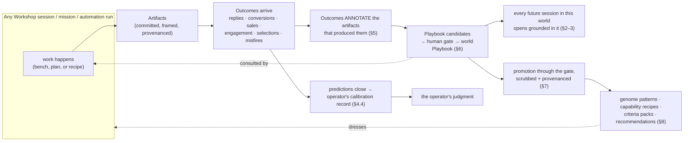
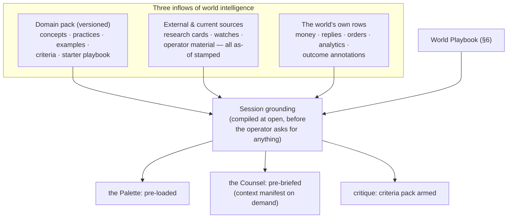
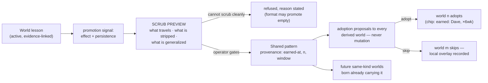

# 17 — Mastery and the Learning Loops

*Phase 3, document 17 — foundational. This document specifies how the platform produces
**mastery, not merely automation**: how a world becomes domain-intelligent, how the interface
refuses to be generic, how the operator's own judgment is trained, how outcomes find their way
back to the artifacts and decisions that produced them, and how what is learned compounds —
into the current world, into every future session, and (through the gate, wearing provenance)
into the reusable layers the next fifty worlds are born from. It elaborates constitution §1
(the metabolism's LEARN beat), §12 (mastery), and §13 (isolation and provenance), and
principles P1 (Mastery Over Automation), P9 (Every Surface Wears Its Evidence), P11 (Patterns
Travel, Data Doesn't), and P14 (The Second Assembly Is a Defect). Spec words — genome,
capability, Standing Order, the Spine — appear in prose only; every quoted piece of interface
text uses the constitution's display language.*

---

## 1. The contract: three students, one loop

Automation relieves the operator of labor. Mastery makes the operator better at the
undertaking. This platform is built for the second and treats the first as a byproduct: the
operating model routes every outcome *through* the human gate rather than around it, so the
interface's job — specified here — is to make that passage instructive rather than
bureaucratic.

Every pass through the metabolism (Wonder → Develop → Commit → Run → Learn) teaches **three
students at once**:

1. **The operator** — judgment, calibrated instincts, internalized criteria. Measured honestly:
   prediction hit-rates, critique agreement over time, edited rubrics.
2. **The world** — its Playbook: earned, evidence-linked, human-gated lessons that every
   session in that world consults.
3. **The shared layers** — learned patterns in genomes, tuned capability recipes, sharpened
   criteria packs: the reusable intelligence future worlds are born with, promoted through the
   gate and stamped with where each piece was earned.

The rule that binds all three: **no learning is silent.** A lesson the operator never saw
cannot steer behavior; a pattern with no provenance cannot be reused; a score with no *why*
teaches nothing and is a defect. The loop is visible end to end, and the operator stands at
every gate on it.

---

## 2. How a world acquires domain intelligence

A world is never smart by accident. Its intelligence has exactly three inflows, each with its
own UX, freshness contract, and provenance.

### 2.1 The domain pack — what the world's kind ships with

Every genome carries a **domain pack**: the distilled expertise of the undertaking's craft,
structured in five strata, each surfacing *in use* — never as courseware, never as a docs tab
(P1 forbids it):

| Stratum | What it is | Where it surfaces |
|---|---|---|
| **Concepts** | the craft's load-bearing ideas ("farm area," "colorway," "sightline," "speed-to-lead") | concept cards in the Palette, appearing when the session's material makes them relevant; tappable for the two-paragraph explanation and its source |
| **Best practices** | the field's known-good moves ("menu above the fold," "same-evening + next-morning follow-up") | staged Desk moves and Counsel proposals, always phrased as recommendations with their reason attached |
| **Examples** | named, annotated exemplars of excellent work in the craft | Palette reference cards; invokable in critique ("compare against the exemplar") |
| **Expert criteria** | the craft's evaluation standards, as an explicit, editable **criteria pack** ("fair-housing language," "print integrity at garment scale," "no dark patterns") | inside every critique, visible and tappable to the criterion's full text and citation (§4.1) |
| **Starter playbook** | provisional lessons that stand in until the world earns its own ("Tuesday-morning sends perform for local business — industry baseline") | Playbook cards marked **"baseline — not yet yours"**; displaced the moment world-earned evidence arrives |

Domain packs are versioned in the Catalog like everything else in a genome. When a pack
updates — fair-housing guidance changes, a platform's ad policy shifts — derived worlds receive
a **proposal, never a mutation** (constitution §11): "Your real-estate setup's criteria
updated: revised fair-housing language rules. Review the diff?" The diff is shown; adoption is
per-world; a declined update is recorded as a local overlay the next proposal respects.

### 2.2 How external and current sources enter

Packs age; the world's undertaking lives in the present. Current intelligence enters through
three doors, all provenanced:

- **Research in session.** The research verb runs from any bench or Explore surface; its
  results land as **source cards** — claim, source, retrieved-date — in the world's memory and
  the session's Palette. A research result that lands only in chat is a defect by definition
  (operating model §3); everything persists.
- **Standing watches.** A world can run watch Automations ("weekly permit-listing watch,"
  "competitor drop watch") whose findings arrive as map nodes and Palette cards with heartbeat
  traces like any other recurring work — current sources on a schedule, never silently.
- **The operator's own material.** Pasted links, uploaded docs, forwarded threads — ingested
  where dropped, scoped to the world, stamped with when and how they arrived.

Every source card carries an **as-of stamp**, and the Counsel is honest about staleness: "The
pricing survey in memory is from March — want a fresh pass before we quote?" A source may
*inform* immediately; it may only *steer behavior* (change a recipe, become a lesson) through
the gate, like everything else.

### 2.3 Business and performance data grounds every session

The third inflow is the world's own operating reality — and it is the one that makes the
difference between an assistant that knows the craft and one that knows *this business*. The
world's live rows — money, sends and replies, bookings, orders, analytics, outcome annotations
(§5) — are compiled into every session's grounding by the same machinery that writes the Brief:

- The **Site Studio** for Rosa's Taqueria opens knowing her textback answered 3 missed calls
  last night and her demo site's most-tapped element was the menu — because those rows are in
  her world.
- The **Outreach Studio** opens with last batch's reply rows on the bench's table, not a
  summary of them.
- The **Design Studio** for Inkfall's Drop 02 opens with Drop 01's sell-through *by design* as
  a Palette card, every number tapping to order rows.

Numbers in the Palette are live-linked, as-of-stamped, and pass the No-Theater rule: every
figure survives "which row is that?" A session grounded in stale or unavailable data says so
plainly ("analytics connection expired Tuesday — numbers are as of then").

---

## 3. The anti-generic invariant, enforced in the interface

**The invariant (constitution §12.6):** a Workshop must open already grounded — world data,
Playbook, domain pack in the Palette. If the system holds relevant context and produces generic
output anyway, that is a **defect**, with the same standing as a broken gate. The Counsel's
first duty is to know the situation.

This section specifies the UX that makes the invariant enforceable rather than aspirational.

### 3.1 The Palette opens loaded — the pre-load contract

At session open, before the operator does anything, the Palette must already hold, in ranked
order: (1) the session's brief or intent; (2) the world's material relevant to that intent
(artifacts, source cards, granted assets with provenance chips); (3) the Playbook cards whose
scope matches the craft; (4) the domain pack's relevant concept and criteria cards; (5) live
performance cards (§2.3). An empty Palette in a world with memory is the invariant's most
visible failure and is treated as one. (A genuinely new world's first session says so honestly:
"Day one — the apparel criteria are standing in until this brand earns its own lessons.")

### 3.2 The Counsel's context manifest

"What do you know here?" — typed or spoken to any Counsel, anywhere — always produces the
**context manifest** (constitution §13): an honest, scoped statement of grounding, in five
short sections:

> **This world:** 4 months of memory · 61 artifacts · Drop 01 outcomes through yesterday.
> **Your Playbook:** 7 lessons in scope for this session (3 cited below).
> **The craft:** apparel criteria pack v3 · 12 concepts · 4 exemplars.
> **Granted material:** 15 pieces ← Marco's Murals (chips on each).
> **What I don't know:** no print-vendor cost data; Shop analytics not connected.

The manifest is not a diagnostic buried in a menu; the Counsel's opening line in every session
is a one-sentence compression of it ("Working from Drop 01's sell-through and your seven
lessons — the hand-inked pieces are the evidence-leaders"), so grounding is *demonstrated*
before it is trusted. The "what I don't know" section is load-bearing: each gap is one tap from
becoming an intake ask or a research pass, which is how the system's ignorance becomes work
instead of silent degradation.

### 3.3 The defect path — when generic happens anyway

When output ignores available context — a pitch that could have been written for any
restaurant, a design brief that forgets the brand values in memory — the operator flags it
where it stands: **"this ignored what you know"** is a first-class action on any AI output. The
flag writes a defect event with the session's manifest attached (what *was* available), drops
the output from any streak it would have counted toward (§4.6 — a generic output can never
advance an autonomy dial), and re-runs grounded. Repeated flags on one capability surface in
that capability's measurement view. The acceptance test is doc 13's blind test: shown two
drafts, a judge must be able to identify which system knew the world. Generic-despite-context
is not a quality shortfall to tolerate; it is a regression to file.

---

## 4. Developing the operator's skill and judgment

The system must never become the only thing that got smarter. These are the five mechanisms
that transfer judgment to the operator — all of them in the flow of real work, none of them
courseware.

### 4.1 Critique against visible, editable criteria

Critique is a first-class verb in every Workshop (constitution §6, §12.2). Its rubric — the
criteria pack — is always visible in the session, always tappable to each criterion's full text
and citation, and always **editable**: the operator can add a criterion ("must read at 10
feet"), reweight one, or retire one, and the edit is recorded with their name on it. Edited
criteria are the operator's taste made explicit — Marco's "never paint over brick detail
without saying so" makes the Commission Studio *his* studio — and they ride the same provenance
rules as everything else: a criterion always shows whether it came from the pack, the Playbook,
or the operator's own hand.

### 4.2 Every score carries its why

A score without a reason is forbidden (P1). "#7 — 6/10: linework density falls below print
resolution at chest scale; enlarge or simplify" is the required shape: score, criterion, the
specific observation, the actionable direction. Whys are interrogable — "why does chest scale
matter?" opens the concept card — so a critique is always one question away from a lesson in
the craft. The same rule binds recommendations everywhere: any "you should" from the Counsel
carries its because, and the because taps through to evidence.

### 4.3 Blind-review practice — judgment reps on demand

Reading critiques teaches slowly; making them teaches fast. Every critique surface offers
**"score first"**: the criteria pack is shown, the AI's scores are withheld, the operator
scores the set, then the two columns render side by side with deltas highlighted and each
disagreement expandable to both reasonings. The deltas are kept: the operator's **agreement
trend** per craft is part of their calibration record (§4.4), shown honestly ("your apparel
scores now land within 1 point of critique on 8 of 10 — early sessions: 4 of 10").
Blind-review is offered, never forced (P5 — zero decisions to start is preserved; the default
critique remains one tap), but the Desk stages it as a rep when the moment is right: "Three
worker variants overnight — score them blind before reading the critique?" By Inkfall's third
session the operator predicts scores before they land; this is where that was trained.

### 4.4 Prediction and calibration

Theory workshops capture **predictions** as first-class rows — "if the winter-cash-gap
hypothesis holds, failures cluster January–March" — each with a judgment date it can be closed
on. But calibration is not confined to research: the converge step of any session can stake a
claim ("25% of visitors will book"; "variant B doubles replies"), and outcome capture (§5)
closes it. Closures surface where the operator actually is: a Brief line ("your
January–March failure-cluster prediction: hit — 7 of 9 tracked carts went dark in the
window"), an annotation on the artifact, and a row in the world's **Calibration view**
(Observe posture stages it). The record is honest in both directions — the coffee-cart
operator's permit hypothesis shows 1 for 4 next to the winter-cliff hit — and the running
hit-rate is shown wherever predictions are staked, so the operator learns the *weight* of
their own instincts, which is the part of judgment no rubric can teach.

### 4.5 The Desk stages judgment reps

The anticipation doctrine (zero decisions to start) applies to learning too: the Desk's staged
moves include **judgment work**, not only production and approvals. Legitimate staged reps:
"close this prediction — the data's in" · "score the overnight variants blind" · "two Playbook
candidates await your gate" · "Drop 01's outcomes are complete — review what they say about
the criteria?" These staging classes are genome-dressed like all Desk moves and obey the
3-slot discipline — mastery is woven into the world's *now*, never a separate practice area
(which would be courseware by another door).

### 4.6 The red-pen loop — edits that teach the system, and the dial that moves both ways

Every operator edit to AI output is signal: the diff is kept in the Ledger, patterns in the
edits ("always tightens subject lines," "always removes exclamation marks") are distilled into
Playbook candidates — through the gate, like every lesson. The reverse flow is autonomy: clean
streaks earn the dial (constitution §8), and a rising intervention rate argues it back down,
visibly, on the automation's own vitals. Spot-editing even one auto-approved output re-opens
the red-pen loop. The system and the operator graduate *together*, and both graduations are
evidenced.

---

## 5. Outcome capture — results find the artifacts that produced them

### 5.1 The annotation

Every outcome the platform can observe — a reply, a conversion, a sale, a booking, an
engagement count, a selection (which variant the operator or a counterparty chose) — is
attributed to the artifact that produced it and rendered **on that artifact's frame** as an
outcome ribbon: "this subject line: 3 replies · 1 booked" · "#3 black: 21 of 38 orders" ·
"this post: 4,200 views · 61 saves." Ribbons are evidence-linked (tap → the rows), as-of
stamped, and version-aware: outcomes attach to the version that was live when they happened, so
a compare across versions is also a compare across results. The annotation is the atom of the
entire learning system — everything in §6–§8 is built from these.

### 5.2 Attribution honesty

Outcome capture inherits the honesty architecture whole: no invented lift, no
correlation-dressed-as-causation, no theater. An annotation states what is known and its
window ("3 replies within 14 days of send") and says "no signal yet" plainly when that is the
truth. Where attribution is genuinely ambiguous (two campaigns ran the same week), the ribbon
says so and shows both candidates rather than crediting one. A claim that cannot survive
"which row is that?" cannot be an annotation.

### 5.3 False-positive tracking for automations

Automations produce a second kind of outcome: **their own mistakes.** Every automated rule
carries a misfire ledger alongside its heartbeat trace — every operator override, every
revocation, every "that shouldn't have fired" is recorded against the rule that fired:

- Rosa's missed-call textback texts a wrongly-classified answered call → the operator marks
  the row "false positive" from the trace; the rule's vitals now read "142 fired · 3 false
  positives · last: Tuesday."
- The nightly prospect hunt keeps scoring a permanently-closed business as a hot lead → each
  dismissal annotates the scoring rule, and three dismissals of one cause stage a recipe
  revision proposal ("add closed-business check to the audit step — 3 misfires cited").

False-positive rates are first-class vitals on every Automation's face, feed the autonomy dial
directly (a rising rate drops the class a notch, visibly, with the rows cited), and feed the
capability's measurement contract (§8.4). An automation that is never wrong in its own ledger
because nobody can record its wrongness would be theater; the misfire ledger is how automated
work stays honest about itself.

### 5.4 Critique-led improvement, tracked

The loop from critique to outcome is itself captured: when a critique's why drives a revision
("enlarge or simplify" → v4) and the revision's outcomes beat the original's, the Ledger links
all three — criticism, change, result. This is what lets §8.6 sharpen the criteria themselves:
criteria whose whys keep producing outcome-improving revisions are earning their weight;
criteria that never move an outcome are candidates for the operator to question. Improvement
is traceable to the judgment that caused it, which is the difference between a system that
critiques and a system that *learns which critiques matter*.

---

## 6. The Playbook — the world's earned judgment

### 6.1 What a lesson is

A Playbook lesson is a five-part object, and every part renders on its card:

1. **The claim**, in plain language: "mentioning a specific episode: 3× replies."
2. **The evidence**, linked: the annotation rows behind it, with n and window ("18 sends over
   6 weeks").
3. **The scope**: which craft, which context the claim held in ("podcast outreach ·
   first-touch emails").
4. **The provenance**: where and when it was earned, and by whose gate it passed.
5. **The status**: candidate · active · aging · challenged · retired.

### 6.2 Visible, editable, human-gated

The Playbook is a first-class surface of every world (Memory's approved stratum, rendered) —
never a hidden model. Lessons **propose**; they never self-approve: candidates distilled from
outcomes, session Ledgers, or red-pen patterns stage as a Queue class ("2 Playbook candidates —
Inkfall"), each carrying its evidence inline so the gate is judgment, not paperwork. The
operator can edit a lesson's claim or scope at the gate (edits recorded), merge duplicates,
or decline — and a declined candidate records *why*, so the system does not re-propose the
same lesson on the same evidence. Every lesson remains editable and retirable after approval.
Nothing steers behavior without having passed a human, ever.

### 6.3 Consulted by every session

An approved lesson is not a trophy; it is working context. The pre-load contract (§3.1) puts
in-scope Playbook cards in every session's Palette; the Counsel **cites lessons by name** when
recommending ("going hand-inked-first on the Drop 02 spread — your 3:1 sell-through lesson,
rows attached"); recipes carry the lessons they encode; mission plans consult the Playbook at
compile. A recommendation that contradicts an active lesson must say so and say why — the
Playbook can be overridden by fresh judgment, never ignored by omission.

### 6.4 Lessons age and are challenged

Evidence keeps arriving after approval, and the Playbook must not fossilize. When new outcomes
contradict an active lesson (Tuesday sends stop outperforming), the lesson flips to
**challenged** — visibly, with the conflicting rows attached — and the Desk stages the review.
Lessons untested for a long horizon age to **aging** status and say so when cited ("earned 14
months ago — evidence predates the platform's algorithm change"). Retirement is one gesture
and reversible; a retired lesson keeps its history (nothing is ever lost, P12). The Playbook's
credibility *is* the mastery system's credibility, and it is maintained the same way it was
built: evidence, visibly, through the operator.

---

## 7. Pattern promotion — from one world's lesson to shared intelligence

### 7.1 The promotion path

A lesson that proves out beyond its home becomes a **pattern** — a genome-level piece of the
shared learned layer that future and sibling worlds are born with. Promotion is never
automatic: the system *proposes* when a lesson shows effect plus persistence ("this
outperformed the shared version for 6 weeks — offer it to your other agent setups?"); the
operator gates it; and every derived world then receives an **adoption proposal, never a
mutation** (constitution §11): "Your agent setup improved: adopt the two-step open-house
follow-up? (earned: Dave Kowalski, 6-week evidence)." Skips are recorded as local overlays
future proposals respect. Improvement flows up the lineage as easily as down — Mom's world
adopts what Dave's world earned.

### 7.2 The scrubbing contract — patterns travel, data doesn't

Promotion crosses a world boundary, so it passes the strictest contract in the platform
(P11). What a pattern may carry and what it must shed, precisely:

| Travels (the pattern) | Never travels (the data) |
|---|---|
| the structural shape: step sequences, cadences, formats, area layouts, recipe logic | counterparty names, contacts, threads, content of their communications |
| criteria and their reasoning | the counterparty's numbers (prices, revenue, sold prices, analytics rows) |
| thresholds and timings, **generalized**: single-world-derived figures present as ranges or defaults-to-confirm, never as another counterparty's fact | credentials, connections, grants, sender identities |
| the evidence *summary*: effect size, n, window — enough to judge the pattern | the evidence *rows* themselves (they remain in the home world; the summary links to them for the operator only) |
| provenance: where earned, when, at what n | anything a reader in the destination world could reverse into a specific counterparty's private state |

The gate enforces this mechanically, not advisorily: the promotion screen shows the **scrub
preview** — the pattern exactly as it will exist in the shared layer, with every stripped
element listed ("removed: Dave's contact segments, his reply rows, his farm-area zips;
generalized: send window") — and a pattern that cannot be cleanly scrubbed (its value *is* the
counterparty's data, like Mom's sold-price case study) is refused promotion with the reason
stated. The refusal has its own honest path: the *format* may promote empty, to be filled with
each world's own data — which is exactly how the case-study near-miss resolves in Journey 2.

### 7.3 Provenance always shown

Every promoted pattern wears its origin everywhere it is used, forever: in the Proposal that
offers it to a new world ("review-request wording — earned: Jane's Bakery"), in the Palette
card, in the recipe step it became, in the criteria pack line it sharpened. "Why is the system
recommending this?" is always answerable in one tap, terminating at real rows in the world
that earned it (visible to the operator, who owns both worlds' gates — never surfaced to any
counterparty). Provenance-free reuse of anything is forbidden.

---

## 8. Where the learning lands — seven destinations, one loop

The same annotated outcome improves the system at seven altitudes. One subsection each, with
the concrete case from the scenario where it is proven.

### 8.1 The current world

Outcomes make the world it happened in immediately smarter, in that world's own vocabulary.
**Which outreach got replies:** the agency's pitch annotations ("this subject line: 3
replies") roll into the Agency's Playbook; the very next Outreach Studio session opens with
those cards in the Palette and the Counsel recommending *from them*, cited. The podcast
world's "mentioning a specific episode: 3× replies" is gated in week six and cited in week
nine's drafts. The loop's shortest circuit: outcome → lesson → next batch, inside one world,
inside one month.

### 8.2 Future sessions

Sessions inherit not just lessons but *working state*: the Ledger's decisions, the edited
criteria, the constraint wordings that worked. **Which designs converted:** Rosa's site
critique decided direction B on the tap-to-call criterion; after launch, her booking
conversions annotate the live version. When her seasonal refresh session opens months later,
the Palette holds the conversion-annotated version rail and the Ledger's original reasoning —
the session begins where the last one's *judgment* ended, not where its files ended.
"Return after thirty days lands on the Ledger's story, not a blank canvas" is this,
made specific: future sessions are grounded in what worked, with the rows attached.

### 8.3 Reusable genomes

Patterns promoted through §7 harden into the learned layer of the world-kind itself — "your
proven client setup ×9" is a genome sentence made of exactly these. **Which campaigns
generated leads:** the two-step open-house follow-up earned in Dave's world (2.1× replies,
six weeks) promotes into the shared agent setup; forty-one worlds adopt by proposal; the
*next* agent's Proposal arrives with it pre-answered, chip attached. The no-second-assembly
principle (P14) is powered entirely by this destination: the setup is not a template someone
wrote — it is the residue of what measurably worked, gated and provenanced.

### 8.4 Capabilities

Every capability carries a measurement contract; outcome and misfire data flow back against
the *verb itself*, tuning how it works in every drive mode at once. **Which automation rules
false-positived:** the prospect hunt's misfire ledger (§5.3) accumulates three dismissals for
scored-but-closed businesses; the system stages a recipe revision — "add a closed-business
check to the audit step (3 misfires cited)" — through the gate, because self-tuning proposals
are approval-gated lessons, never silent mutations. Once adopted, the sharper audit step
serves the studio, the worker, and the automation identically — one definition, one
improvement, three drive modes.

### 8.5 Recommendations

Everything the system proposes — staged Desk moves, Counsel suggestions, the Brief's
"opportunities appeared" lines — must draw on the evidence base and cite it. **Which posts
performed:** Marco's print-drop posts carry engagement annotations; when the Counsel stages
Thursday's drop it says why ("carrying the process-video format — your last three
process posts outperformed finished-work shots 4:1, rows attached"), and the operator can
interrogate or overrule the reasoning. A recommendation with no citable basis must present
itself as a hypothesis, not advice — the anti-generic invariant applied to the system's own
suggestions.

### 8.6 Evaluation standards

The criteria themselves learn. §5.4's critique-to-outcome links reveal which criteria's whys
actually move results; calibration closures (§4.4) reveal which predictions the current
standards support. **Which critiques improved final work / which predictions proved right:**
the sightline criterion in Marco's pack keeps producing revisions that win commissions — its
weight and its exemplar set strengthen, visibly, through the gate. The booking app's
converge-time prediction (25% → actual 19%) closes with the gap annotated; the product
criteria pack gains a proposed criterion on funnel honesty ("price surfaced before form
start"), staged from the shortfall analysis. Standards sharpen the same way everything else
does: evidence, proposal, gate — never a rubric silently rewriting itself.

### 8.7 Future same-kind worlds

The compounding destination: the next world of a kind is born already carrying everything its
predecessors earned — and nothing they were told in confidence. **Which apparel sold:**
Inkfall's gated lesson — "hand-inked texture outsells flattened fills 3:1" — is cited in Drop
02's gather phase; when it holds across two more drops, promotion stages it into the apparel
setup's learned layer, scrubbed (the pattern: texture-forward selection criteria; stripped:
Inkfall's order rows, its customer data). A second apparel brand chartered next year opens its
first Design Studio session with that criterion already in the pack, chip reading "earned:
Inkfall · 3 drops." The fiftieth agent's ninety-second Proposal is this destination at scale:
forty-nine worlds' worth of gated, scrubbed, provenanced patterns — and an isolation review
that never compresses away, at any n.

---

## 9. Isolation, consent, and provenance — the loop's boundaries

The learning system is the highest-pressure point on the isolation contract, because learning
*wants* to generalize. The boundaries, restated as they bind this document's mechanisms:

1. **Lessons are world-scoped by default.** A Playbook belongs to its world. Nothing in it
   *grounds* another world except as a §7 pattern, through the gate, past the scrub preview.
   There is no global "insights" pool that quietly reads every world — cross-world
   intelligence that steers work is exactly the set of promoted patterns and nothing else
   (anti-goal: no cross-world leakage through global intelligence). One carve-out is named
   and bounded: **adjacency pointers.** The portfolio-level index that already powers the
   switcher's semantic search (constitution §3) may point the operator — and only the
   operator — at their own material across their own worlds ("your pricing work in the
   agency world landed two lessons adjacent to this theory" — the re-entry and Desk moves
   of 04 §12 and 03 §7.6). A pointer is a signpost, never a payload: it is
   provenance-stamped; it opens in its home world; it renders no counterparty-derived
   evidence rows outside that world; it never appears on any counterparty-visible surface;
   and it never enters another world's session grounding, Palette, or Counsel context.
   Acting on a pointer still goes through the front doors — explicit mention + grant (§13)
   for material, §7 promotion for lessons. Pointers surface; only patterns travel.
2. **Counterparty outcomes stay home.** Outcome annotations built on a counterparty's data
   (Rosa's call rows, Dave's reply rows, a client's analytics) are that world's material.
   They may power that world's lessons in full fidelity; only the scrubbed pattern may
   leave — an adjacency pointer (§9.1) may *reference* such a lesson, never carry its rows.
   Bulk surfaces and Lenses render each row's counterparty data within that row's scope only.
3. **Consent is explicit at the measurement seam.** What a world observes about a
   counterparty is declared in the Proposal's connections block ("call log — for missed-call
   textback and its accuracy tracking") and governed by the same scoped, revocable grants as
   every connection. Revoking a grant stops the measurement and says so on the affected
   vitals ("accuracy tracking ended May 3 — grant revoked"); it never silently degrades.
4. **Provenance is universal and terminates in rows.** Every lesson, pattern, criterion,
   recommendation, and annotation answers "where did this come from?" in one tap. Granted
   material keeps its chip through every derivative (a Drop 02 design derived from Marco's
   piece #9 carries the grant chip on the design, its mockups, and its posts). Revoking a
   grant flags every derivative that stands on it.
5. **The operator's calibration record is the operator's.** Hit-rates, agreement trends, and
   blind-review deltas are personal instruments, rendered to the operator only — never on any
   counterparty-visible artifact, never in any shared pattern's provenance beyond "operator-
   gated." The system measures the operator so the operator improves — not so anyone else can
   read them.

---

## 10. Acceptance — how to verify mastery is happening

Testable statements, in the style of doc 13 (which formalizes them):

1. **The grounded-open test.** Open any Workshop in a world with ≥30 days of memory: the
   Palette is pre-loaded per §3.1, and the Counsel's first line demonstrates situation
   knowledge. Fail: any blank palette or could-be-anyone opening line.
2. **The blind test.** Two drafts of the same task — one grounded, one generic — must be
   distinguishable by a judge at a glance. The grounded system loses only if the interface
   failed §2–§3.
3. **The rubric test.** In any critique: every score has a why; the criteria pack is visible,
   tappable, and editable; an operator edit persists and is provenanced to them.
4. **The rep test.** After ten sessions in one craft, the operator has: a visible calibration
   record with at least one closed prediction, at least one blind-review delta, and at least
   one criterion of their own in the pack. If not, §4's staging failed — mastery did not
   happen by accident, because it never does.
5. **The annotation test.** Pick any outcome the platform observed: it renders on the artifact
   that produced it, evidence-linked, window-stated. Pick any automation: its false-positive
   ledger is reachable in two taps from anywhere its output appears.
6. **The gate test.** No lesson steers behavior without having passed the operator; no
   pattern exists in a shared layer without a scrub preview having been shown and gated; no
   derived world was ever mutated without a proposal.
7. **The scrub test.** Inspect any promoted pattern: its provenance resolves; nothing in it
   identifies or quantifies a counterparty; the refused-promotion path fires on a pattern
   whose value is counterparty data. Follow any adjacency pointer (§9.1): it is provenance-
   stamped, it lands in its home world, and no counterparty-derived row renders outside it.
8. **The no-silent-steering test.** For any recommendation, "why this?" terminates in cited
   lessons, pack entries, or rows — or the recommendation presents itself as a hypothesis.

The one-sentence summary this document exists to enforce: **every outcome is caught, every
catch is shown, every lesson passes a human, every reuse wears its origin, and every hour in
the product leaves the operator — not just the platform — better at the undertaking.**

---

*Cross-references: `_constitution.md` §1 (the metabolism), §6 (Workshops, critique, the
Ledger), §11 (inheritance by proposal), §12 (mastery — elaborated here), §13 (isolation and
provenance); 01-experience-principles.md (P1, P9, P11, P12, P14); 03-world-experience.md
(the Desk's staging classes and the Observe posture; the §7.6 adjacency Desk move — bounded
by §9.1's pointer carve-out); 04-explore-and-rabbit-hole.md (predictions and the calibration
record's origin in theory work; the §12 re-entry adjacency — same bounds); 05-capabilities-studios-
and-automation.md (measurement contracts, the red-pen loop, earned autonomy);
06-missions-and-standing-orders.md (judged outcomes, heartbeat and misfire traces);
07-artifacts-and-builders.md (the artifact frame the outcome ribbon lives on);
09-creation-and-genesis.md (the learned layer in the Proposal); 10-key-user-journeys.md
(every mastery loop cited here, in situ); 13-acceptance-tests.md (formalization of §10);
16-workshop-system.md (the session grammar the loops run inside).*
